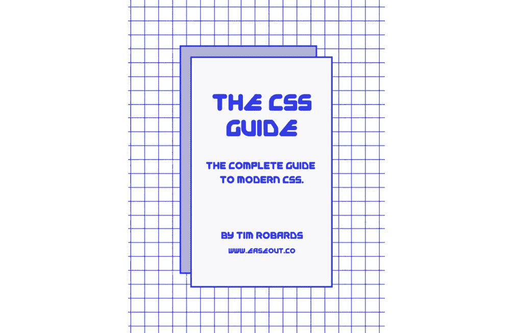

# 帕格简介

> 原文：<https://medium.com/hackernoon/an-introduction-to-pug-1dbe7cfcacd8>


Pug(原名 Jade)是一个预处理器，它简化了编写 HTML 的任务。它还增加了大量的功能，如 [Javascript](https://hackernoon.com/tagged/javascript) 对象、条件、循环、混合和模板。这种语法可以说是更加清晰易读，而且在处理大量 HTML(尤其是 Bootstrap、Foundation 等框架)时，可以真正节省时间。

🤓*想了解最新的 web 开发吗？*
🚀*想要将最新消息直接发送到您的收件箱吗？
🎉加入一个不断壮大的设计师&开发者社区！*

**在这里订阅我的简讯→**[**https://ease out . EO . page**](https://easeout.eo.page/)

让我们看一看一些 Pug 语法，并将其与常规 HTML 进行比较..

```
// index.pugdoctype html  
html(lang='en')  
 head
   title Pug demo
 body
   h1 Welcome to Pug Life
   div.container
     p I'm a p that needs to be contained!
```

注意，根据我们的需要，使用缩进来嵌套我们的 HTML。以及缺少结束标签！

这是标准的 HTML 输出:

```
// index.html<!DOCTYPE html>  
<html lang="en">  
 <head>
   <title>Pug demo</title>
 </head>
 <body>
   <h1>Welcome to Pug Life</h1>
   <div class="container">
     <p>I'm a p that needs to be contained!</p>
   </div>
 </body>
</html>
```

相比之下，我们的 pug 代码要简洁得多。此外，如果我们的代码中有任何错误，编译器将抛出错误——这有利于防止错误。

所以让我们开始吧！

# 如何安装 Pug

注意:您需要安装 NodeJS！如果您还没有安装,请继续安装[。](https://nodejs.org/en/download/)

要安装 pug，请从您的终端运行以下命令:

```
npm install -g pug-cli
```

我们用`-g`进行全局安装，因为我们需要从终端访问 Pug 命令。

现在在我们的根目录下，创建一个名为`index.pug`的文件。

让我们来测试一下！将以下文本添加到我们的文件中，如下所示:

```
// file: index.pugdoctype html
```

让我们用下面的命令将它编译成 HTML:

```
pug index.pug
```

我们现在应该看到我们的`index.html`在根目录中生成。它当然会转换成 HTML，如下所示:

```
// file: index.html<!DOCTYPE html>
```

在处理较大的项目时，您可能希望使用更具体的编译命令，例如:

```
pug -w ./ -o ./html -P
```

`-w`标志将监视我们的 pug 文件的变化，并在每次保存时自动重新编译。`./`将观看当前目录中的所有内容。- `o ./html`将输出文件夹设置为 html。将会使我们的 HTML 源代码漂亮的打印出来，带有缩进，换行符等等。

注意:一旦您执行了这个命令，保持您的终端运行以继续自动编译！

# **基础知识**

让我们从一个基本的 HTML 结构开始。在你的`index.pug`中输入以下内容。

```
doctype html
html
  head
  body
    h1#title Lets get pugging!
    p I'm a paragraph
    p.
      I'm a multi-line paragraph!
      And this is the second line.
    p.para. 
      This paragraph has class!
    .firstDiv A div with a class.
    #secondDiv A div with an id.
```

注意缩进的使用！确保您的子元素是制表符。

当你保存并打开`index.html.`时，你会看到如下生成的完整的 HTML..

```
<!DOCTYPE html>
<html>
  <head></head>
  <body>
    <h1 id="title">Lets get pugging!</h1>
    <p>I'm a paragraph</p>
    <p>
      I'm a multi-line paragraph!
      And this is the second line.
    </p>
    <p class="para">This paragraph has class!</p>
    <div class="firstDiv">A div with a class.</div>       
    <div id="secondDiv">A div with an id.</div>
  </body>
</html>
```

# 属性

让我们看看在 pug 中设置属性的一些语法。

```
doctype html
html
  head
    //- Invisible comment.
    //Visible comment.        script(src="script.js")
    link(rel='stylesheet', href='css/main.css') body
    a(href="https://google.com") google.com img(src="https://google.com/logo.png" alt="google logo") input(type="password" name ="inputpass")
    input(type='checkbox' checked)
    input(type='checkbox' checked=true)
    input(type='checkbox' checked=false) //Inline styles
    a(href="your-link", style={color: "Red", "font-size": "24px"}) I'm a link!
```

我们的 HTML 将如下生成:

```
<!DOCTYPE html>
<html>
  <head>
    <!--Visible comment.-->
    <script src="script.js"></script>
    <link rel="stylesheet" href="css/main.css">
  </head> <body>
    <a href="https://google.com">google.com</a>
    

    <input type="password" name="inputpass">
    <input type="checkbox" checked>
    <input type="checkbox" checked>
    <input type="checkbox"> <!--Inline styles-->
    <a href="your-link" style="color:Red;font-size:24px;">I'm a  link!</a>
  </body>
</html>
```

# 添加 JavaScript

Pug 最强大的特性之一，是使用内联 JavaScript 轻松实现 HTML 动态化的能力。让我们看几个例子:

## 变量

```
- let name = 'Timothy'
- let city = 'Montreal'
- let transport = { type: 'Bike' }
- let food = ['Tacos', 'Pizza', 'Cheetos']// Incrementation for numeric variables
age++// Assigning variables to elements
p= name
span.age= age
```

## 插入文字

```
- let size ="medium"
  img(src=`https://google.com/logo-${size}.png` alt="logo")---------------------
// output:
```

## 环

```
ul
  *each* city in ['Sydney', 'Montreal', 'New York']
    li= cityul
  *each* city, index in ['Sydney', 'Montreal', 'New York']
    li= 'Number ' + index + ': ' + city-------------------------------------------------
// output:<ul>
  <li>Sydney</li>
  <li>Montreal</li>
  <li>New York</li>
</ul><ul>
  <li>Number 0: Sydney</li>
  <li>Number 1: Montreal</li>
  <li>Number 2: New York</li>
</ul>
```

## 条件式

```
if user
  h2 Welcome back #{user}!
else if admin
  h2 Hey #{admin}!
else
  h2 Sign up!
```

## 混合蛋白

```
// Declaration
*mixin* list
  ul
    li Sydney
    li Montreal
    li New York// Use
*+*list
*+*list------------------
// output:<ul>
  <li>Sydney</li>
  <li>Montreal</li>
  <li>New York</li>
</ul><ul>
  <li>Sydney</li>
  <li>Montreal</li>
  <li>New York</li>
</ul>
```

Mixins 编译成函数，因此可以接受参数！

```
mixin city(name)
  li.city= name
ul
  +city('Sydney')
  +city('Montreal')
  +city('New York')--------------------
// output:<ul>
  <li class="city">Sydney</li> 
  <li class="city">Montreal</li>
  <li class="city">New York</li>
</ul>
```

我们在这里看到的特性只是冰山一角！如需完整规格，请查看[PugJS.org—开始使用](https://pugjs.org/api/getting-started.html)。

# 构建您的 Pug 文件

组织良好的模板系统是任何开发过程的关键部分。接下来看看我们如何使用`includes`和`extends`来组织我们的项目。

## 包含

Includes 允许您将一个 Pug 文件的内容插入到另一个文件中。您所需要做的就是在您的主 pug 文件中添加一个`include`指令，如下所示:

```
doctype html
html
  ***include* additions.pug**
  body
    h1 My Heading
    p Here goes the text.
```

现在让我们创建`additions.pug`文件并添加以下内容:

```
head
  title My Site
  script(src='/js/jquery.js')
  script(src='/js/app.js')
```

我们的文件会编译合并成`index.html`这样:

```
<!DOCTYPE html>
<html>
  <head>
  <title>My Site</title>
  <script src="/js/jquery.js"></script>
  <script src="/js/app.js"></script>
  </head>
  <body>
    <h1>My Heading</h1>
    <p>Here goes the text.</p>
  </body>
</html>
```

## 延伸

关键字`extends`允许模板扩展布局或父模板。然后，它可以使用`block`命令覆盖某些预定义的内容块。

我们希望让我们的项目尽可能有条理！一个逻辑模板系统将定义一个基础模板，然后所有其他模板都从它扩展。例如:

```
*// file: index.pug****extends*** layout.pug***block*** content
  h1 hello world!
```

在这里，我们将`index.pug`文件设置为基础模板。通过扩展调用`layout.pug`文件。

注意`block`命令的使用。这就是我们如何指导模板的一部分被扩展。

```
*// file: layout.pug*doctype html
html(lang="en")
  head
    meta(charset='utf-8')
  body
    ***block*** content
    h2 hello again world!
```

下面是我们 layout.pug 的内容，我们用的是同名的`block`命令(你爱怎么叫都行！)，所以 pug 引擎知道代码块放在哪里。

这段代码将按如下方式编译:

```
<!DOCTYPE html>
<html lang="en">
  <head>
    <meta charset="utf-8">
  </head>
  <body>
    <h1>hello world!</h1>
    <h2>hello again world!</h2>
  </body>
</html>
```

当然，您可以使用任意多的块，并创建任意多的 pug 文件。重点是在我们的项目中建立一个逻辑结构&保持我们的代码整洁有序！

***你准备好让你的 CSS 技能更上一层楼了吗？*** *现在就开始用我的新电子书:*[*《CSS 指南:现代 CSS 完全指南*](https://gum.co/the-css-guide) *。获取从 Flexbox & Grid 等核心概念到动画、架构等更高级主题的最新信息！！*



*Available now! 👉* [gum.co/the-css-guide](https://gum.co/the-css-guide)

# 结论

就是这样！我们已经设置了一个 Pug 开发环境，并介绍了基本原理。我们已经看到了添加 JavaScript 提供的许多特性，比如变量、插值、循环、条件和混合。我们还研究了如何使用包含和扩展指令的模板来构造 Pug 文件。

我希望这篇文章对你有用！你可以在 Medium 上[关注我](/@timothyrobards)。我也上了 [Twitter](https://twitter.com/easeoutco) 。欢迎在下面的评论中留下任何问题。我很乐意帮忙！

# 关于我的一点点..

嘿，我是提姆！👋我是一名开发人员、技术作家和作家。如果你想看我所有的教程，可以在我的个人博客上找到。

我目前正在构建我的[自由职业者完整指南](http://www.easeout.co/freelance)。坏消息是它还不可用！但是如果是你感兴趣的东西，你可以[注册，当它可用时会通知](https://easeout.eo.page/news)👍

感谢阅读🎉