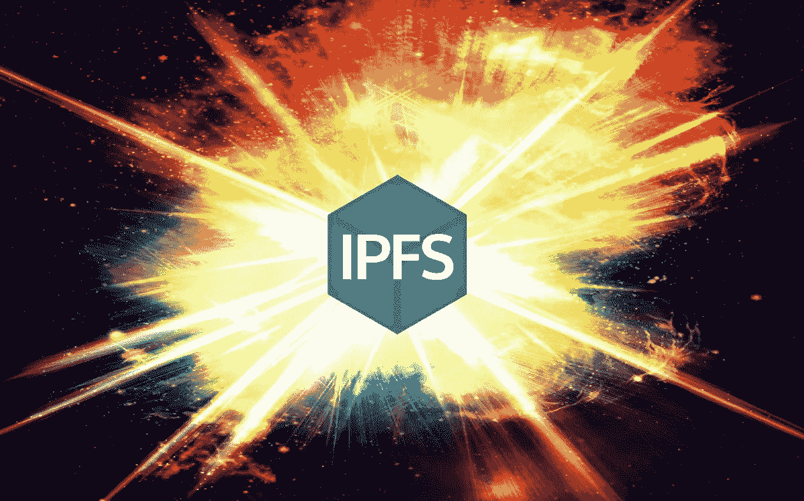

# IPFS 应用程序演示

> 原文：<https://medium.com/hackernoon/an-ipfs-application-demo-49a1255ffd0>

随着像 IPFS 这样的分布式协议变得越来越普遍，我们将开始看到许多新的应用程序在分布式 web 上开发，主要集中在`offline first`、`privacy`和`reduced bandwidth`。

tldr 文章底部的 GitHub 项目↓

本文介绍了 IPFS 上一个 AWS Lambda 复制 cat 应用程序。我们将使用 Golang，Docker，IPFS 和 Python。需要注意的一点是，这…