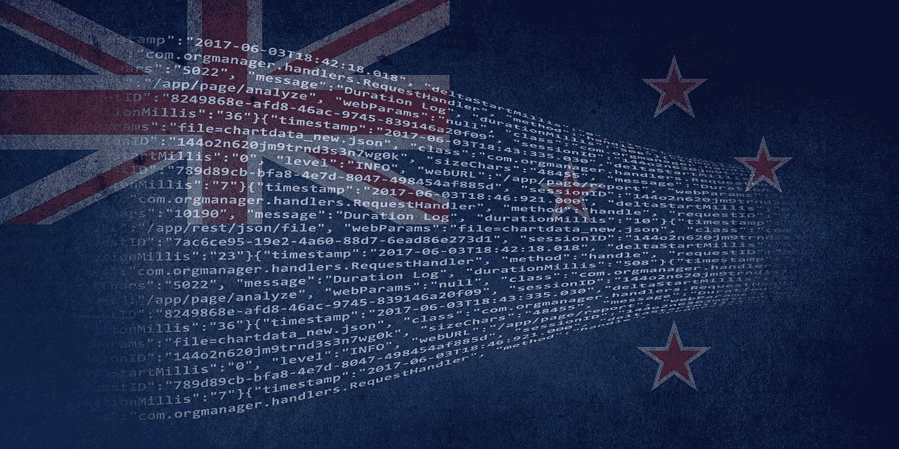

# 局外人对新西兰加密货币和区块链景观的看法

> 原文：<https://medium.com/hackernoon/an-outsiders-view-on-the-cryptocurrency-and-blockchain-landscapes-in-new-zealand-7880150962c7>

分布式账本技术(DLT)是计算机科学的新发展。它通过不变性和可见性实现了透明和信任，因为记录的数据可以在线检索。此外，它可以消除对第三方的需求，并有可能改变当前人、企业和政府之间的关系。在新西兰，机会很多。加密货币和[区块链](https://hackernoon.com/tagged/blockchain) [技术](https://hackernoon.com/tagged/technology)在主权岛国普遍受欢迎。

在本文中，我们将探讨新西兰加密货币和区块链技术的总体前景。

# 新西兰政府和当局的支持

来自新西兰创新机构[卡拉汉创新](https://www.callaghaninnovation.govt.nz/)的[报告](https://www.callaghaninnovation.govt.nz/sites/all/files/distributed-ledgers-and-blockchains-report-december-2018.pdf)显示了新西兰政府的巨大支持。他们认识到区块链和分布式账本技术对希望保持行业领先地位的企业的潜在好处。尽管新兴技术带来了明显的挑战，但令人鼓舞的是，企业获得了政府的支持，以探索创新机会。

# 对黑客的反应

最近几个月，总部位于新西兰的加密交易所 Cryptopia 吸引了很多关注。数字资产交易所透露，在一月份发生的一次黑客攻击中，它遭受了重大损失。Cointelegraph 发表的一份分析表明，在这次黑客攻击中，1600 万美元的密码被盗。政府机构和当局提供的支持非常令人鼓舞。新西兰警察和高科技犯罪部门将其列为重大犯罪，并展开了正式调查。来自政府的这种支持可以表明他们对加密货币和区块链技术有多乐观。

该公司一发现重大黑客攻击就暂停了交易。然而，根据 [Cointelegraph](https://cointelegraph.com/news/cryptopia-crypto-exchange-resumes-trading-on-40-crypto-pairs) 和 Cryptopia 的 [tweet](https://twitter.com/Cryptopia_NZ/status/1107811759941779456) 的消息，加密交易所已经在今天早些时候恢复了 40 个交易对的交易。

# 新西兰加密法规

新西兰金融市场管理局(FMA)表示，提供加密货币相关金融服务的公司需要遵守[金融市场行为法案 2013](http://www.legislation.govt.nz/act/public/2013/0069/latest/DLM4090578.html) 中的“公平交易”要求。这些条款禁止您从事误导性行为或做出欺骗性或未经证实的陈述。更多信息请参考他们的[官方页面](https://www.fma.govt.nz/compliance/cryptocurrencies/cryptocurrency-services/)。

BitPrime 的一篇文章[指出了新西兰加密监管的现状。虽然没有专门针对加密的监管法规，但存在可以识别加密的现有法律。税务局(新西兰国税局的版本)认为加密货币是财产，应该相应征税。](https://www.bitprime.co.nz/blog/nz-crypto-regulation-recommendations/)

## 文章还对新西兰的加密法规提出了 10 条建议:

1.  新西兰政府应继续允许加密货币在新西兰境内外交易和用于支付商品和服务
2.  内政部(DIA)和金融市场管理局(FMA)应鼓励基于新西兰的加密货币交易所，并就其《反洗钱和打击资助恐怖主义法》(AML/CFT)义务提供明确的指导。也就是说，以澳大利亚为榜样
3.  FMA、DIA 和其他组织应该向消费者提供更多关于加密货币的建议和保护
4.  符合反洗钱/CFT 和其他要求的加密货币交易所必须能够访问新西兰银行的账户
5.  商户必须能够接受低于 100 新西兰元的个人或组织的加密货币支付，或通过符合反洗钱/CFT 要求的新西兰交易所(或海外交易所)进行的支付，而不会丢失其银行账户
6.  商品及服务税从用于支付商品和服务的加密货币中移除
7.  税务局(IRD)澄清了围绕加密货币使用的其他税收规则。
8.  IRD 应该接受加密货币支付税款。
9.  新西兰储备银行(RBNZ)应尝试创建和发行新西兰中央银行发行的数字货币(CBDC)
10.  尽管这一点不仅仅局限于加密货币。新西兰应该效仿英国和澳大利亚等国家，建立一个监管沙箱，并确保监管机构与金融科技公司合作

# 新西兰采用区块链和加密的例子

*   [下一张网](https://thenextweb.com/hardfork/2018/11/01/blockchain-new-zealand-bank-meat/)报道称，一家新西兰银行已经利用区块链向南韩发送肉类。[澳大利亚联邦银行的子公司 ASB](https://www.asb.co.nz/) 声称这是新西兰出口史上的第一笔。新西兰肉类出口商 Greenlea Premier Meats 与一家大型韩国进口商进行肉类贸易。该银行还计划在未来通过空运使用区块链进行贸易。
*   新西兰先驱报[报道](https://www.nzherald.co.nz/business/news/article.cfm?c_id=3&objectid=11827017)新西兰邮报和价值数十亿美元的乳制品集团[恒天然](https://www.fonterra.com/nz/en.html)与中国电子商务巨头阿里巴巴达成战略合作。他们计划利用区块链技术来防止假冒食品进入大规模供应链。
*   Callaghan Innovation [向位于新西兰的加密货币储蓄和交易平台](http://www.scoop.co.nz/stories/BU1810/S00864/government-funds-nz-crypto-platform.htm) [Vimba](https://vimba.co/) 授予了 31.5 万美元的赠款。这显示了政府对加密货币和区块链技术的真正信任。研发项目资助是研发项目的一种联合资助形式。卡拉汉创新公司的一名发言人告诉 Cointelegraph ,这笔赠款为一个项目提供了高达 40%的资金，在上一个财政年度批准了 355 笔此类赠款。
*   AsureQuality、新西兰邮政和 NZTE 制定了“AsureQuality 食品信任框架”参与的品牌所有者应提交其产品，以接受涵盖其品牌故事所有方面的详尽全面的审查和验证。该框架将利用区块链技术在打击假冒产品方面的优势。
*   Cryptopia 是一家比较知名的加密交易所，有超过 150 万用户使用它的平台，它位于新西兰。[老板们在 2017 年辞职](https://www.stuff.co.nz/business/100421588/from-a-twoman-operation-a-year-ago-cryptopia-surges-on-bitcoin)，全职专注于平台。根据这个[的新闻稿](https://www.newsroom.co.nz/2018/11/07/311413/nz-crypto-coins-to-be-re-released-early-2019)，Cryptopia 已经获得了一个新的，较小的银行，将提供支持新西兰元令牌(NZDT)。当 ASB 在 2018 年关闭了他们与 NZDT 相关的账户时，这是一个受欢迎的消息。因此，新西兰人现在可以用美元支持的代币来应对波动。

# 新西兰人在哪里可以买到加密货币？

1.  BitPrime 是一家提供全方位服务的加密货币零售商。他们还提供加密和区块链的入门课程。
2.  EasyCrypto 是一家注册的金融服务提供商，他们让新西兰人很容易进入加密市场。
3.  Vimba 是一种真正的新西兰购买密码的方式——它只适用于在新西兰拥有新西兰银行账户的人。
4.  [Bittybot](http://bittybot.co/nz/) 不直接买卖比特币，但它会跟踪新西兰和澳大利亚各网站上购买比特币的最佳价格。

*免责声明:我与这些公司无关。在做出任何投资决定或购买之前，请做好自己的尽职调查。*

# 关于我:

**伊利亚·扎基是美国一家名为** [**STO 咨询公司**](https://moonwhale.io/) **的公司的业务开发主管兼营销官。**

在我们的各种社交媒体平台上关注我们—

[推特](https://twitter.com/MoonwhaleBV) | [LinkedIn](https://www.linkedin.com/company/moonwhalebv) | [脸书](https://www.facebook.com/MoonwhaleBV/) | [电报](https://t.me/moonwhaler)