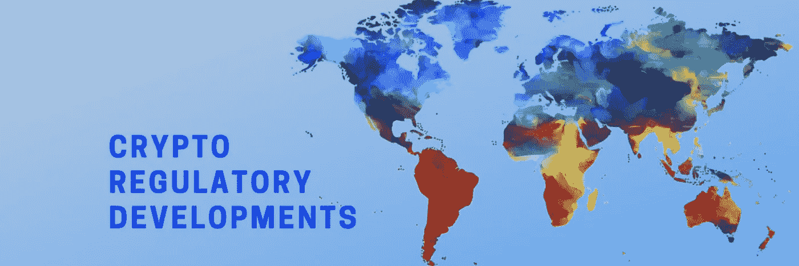
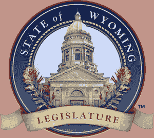
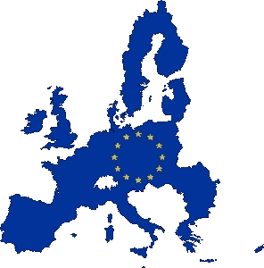

# 全球密码法规发展的最新情况

> 原文：<https://medium.com/hackernoon/an-update-on-recent-crypto-regulatory-developments-around-the-world-fa474c7da763>

Courtesy of Blockchainflashnews.com

今年年初，美国、英国和欧盟发布了一些重要的 crypto 监管消息。

**美国**

在加密友好和充满活力的美国怀俄明州，2 项新的立法法案已于 1 月提交。[第一项](https://wyoleg.gov/Legislation/2019/SF0125)旨在将数字资产归类为适用的统一商业法典中的“无形个人财产”,并为银行提供数字资产财产保管服务引入一个选择加入框架。

第二个[法案](https://www.wyoleg.gov/Legislation/2019/HB0185)提议允许怀俄明州的公司发行“证书代币”,并实质上承认“证书代币”等同于普通股票。当然，这些都不是已经颁布的法律，在这些法案成为法律之前，我们将会看到这个过程是如何发展的。

**英国**

在欧洲，英国 FCA 发布了一份关于其加密资产建议指南的咨询文件，我最近在这里[对此进行了评论](https://blockchainflashnews.com/fca-crypto-assets%ef%bb%bf/)。

**意大利/卢森堡**

继[意大利参议院提议承认智能合约和 DLT 时间戳的法律可执行性](https://blockchainflashnews.com/italy-dlts-and-smart-contracts/)之后，卢森堡也提出了将区块链和 DLT 用于持有和转让金融工具合法化的提案。[第 7363 号法律提案](https://chd.lu/wps/portal/public/Accueil/TravailALaChambre/Recherche/RoleDesAffaires?action=doDocpaDetails&backto=/wps/portal/public/Accueil/Actualite/ALaUne/&id=7363)旨在引入一个[新的第 18 条之二](https://chd.lu/wps/portal/public/Accueil/TravailALaChambre/Recherche/RoleDesAffaires/!ut/p/z1/ldBdb4JQDAbg3-IFl6O1R1F3d_w6AY1GCMh6Y0AZkDAwiCP--xld4mYMc71r87RpXmDwgfPgM42DKi3yIDv3b2xsCKeeNyUlbZcIpep6jm0aAmdtWF8A_iqJQ5uGAlEtCfj_-z8vPbffALj5_Br4QsY09myzQ9gfDQ)以明确承认通过直接衍生工具进行的金融工具流通。这与 2013 年采用的程序相同，当时对 2001 年的同一部法律进行了修订，以考虑到非物质化股票的流通，这些股票随后得到了法律认可。

卢森堡的举措似乎比上述意大利参议院对 DLTs 时间戳效果的认可更进了一步。

然而，这两项立法举措似乎都没有全面解决这一问题:一方面，卢森堡承认利用直接相关交易转移金融工具，但没有明确赋予嵌入 DLT(时间戳)的数据法律效力。另一方面，意大利承认直接交易时间戳的法律效力，但没有明确承认通过直接交易时间戳的金融工具流通。两者似乎都没有达到目标。这是在智库分析法律比较方面的更多材料。

**德——STO**

在资产令牌化方面，[德国联邦金融监管局](https://www.bafin.de/EN/Homepage/homepage_node.html)已经批准了第一份[招股说明书](https://www.bitbondsto.com/files/bitbond-sto-prospectus.pdf)，由总部位于德国的 Bitbond GmbH 发行[安全令牌。该代币代表一种债务工具，每年支付 4%的利息，外加相当于 Bitbond GmbH 在其业务活动中实现的利润的 60%的可变利息额。值得注意的两个要点是:a)代币持有者以恒星流明(XLM)获得本金和利息的回报，从而总是承担与欧元或其他可接受的密码如 BTC 或 ETH 的汇率风险；b) Bitbond Finance 将在 10 年后到期时以€1 的原价回购代币。与此同时，我们与智库](https://hackernoon.com/the-first-sto-milestone-is-german-bitbond-issues-the-first-bafin-approved-security-token-bond-70925e61f2d)[的德国同事一起研究了这份计划书](http://thinkblocktank.org/)[，以下是我对这个有趣话题的看法](https://hackernoon.com/the-first-sto-milestone-is-german-bitbond-issues-the-first-bafin-approved-security-token-bond-70925e61f2d)。

**欧盟监管机构**

在欧盟监管方面，ESMA 和 EBA 发布了两份期待已久的关于 ico 和加密资产的报告。

[EBA 报告](https://eba.europa.eu/documents/10180/2545547/EBA+Report+on+crypto+assets.pdf)与 ESMA 报告保持一致，但根据支付服务和电子货币指令(PSD2 和 EMD2)专门分析了加密资产。结果可以总结如下:

(I)加密资产只有在下列情况下才被视为"电子货币":

-以电子方式储存；

-具有货币价值；

-代表对发行人的主张；

-在收到资金时发行；

-是为了进行支付交易而发行的；

-被发行人以外的人接受。

在所有这些情况下，除非根据该指令第 9 条适用有限的网络豁免，否则需要作为电子货币机构获得授权才能开展涉及电子货币的活动。

PSD2 将仅适用于符合上文㈠项所述电子货币资格的加密资产。

㈢关于二级市场服务——即加密资产交易平台和托管钱包提供商——EBA 再次对洗钱风险和消费者风险表示关切。

(四)最后，EBA 同意 ESMA 的结论，即欧盟委员会需要在整个欧盟创造一个公平的监管环境。

[ESMA 报告](https://www.esma.europa.eu/sites/default/files/library/esma50-157-1391_crypto_advice.pdf)基于 28 个欧洲 NCA(国家主管当局)对 2017-2018 年完成的 6 种不同 ico 进行的[调查](https://www.esma.europa.eu/sites/default/files/library/esma50-157-1384_annex.pdf)，这些代币具有不同的特征，从投资型、公用事业型到混合型和支付型。纯支付类型的代币没有被故意包括在样本集中，因为它们不太可能符合金融工具的资格。

这项调查的结果可以总结如下:

(I)加密资产部门的规模仍然不大，ESMA 不认为它目前会引起金融稳定问题。然而，ESMA 担心它给投资者保护和市场完整性带来的风险。

(ii)调查结果强调了 NCA 多数人的观点，即一些加密资产，例如那些附有收益权的加密资产，可能有资格作为可转让证券或其他类型的 MiFID 金融工具。

(iii)然而，由于在国家一级实施 MiFID 的差异，各成员国对“金融工具”的定义有所不同。这导致了玩家的混淆和管辖权仲裁。

(iv)如果“金融工具”测试结果为阳性，则整套欧盟金融规则将适用，如 MiFID II、新的招股章程规定、MAR 等。

(v)如果“金融工具”测试结果为阴性，则此类规则不适用。然而，在这种情况下，ESMA 建议所有经营者都应遵守反洗钱法规。

㈥ESMA 担心，某些成员国单独管制加密资产的战略没有在整个欧盟提供一个公平的竞争环境，因此建议欧盟委员会介入协调一个 EU-范围的方法。

有趣的是，如果你仔细看看 NCA 调查的附件，在不同的欧盟管辖范围内，NCA 作为金融工具和证券的差异是非常明显的。以 CRPT 令牌为例:对 15 个 NCAs 来说它是安全的，对 10 个 NCAs 来说它不是安全的，还有 3 个甚至不知道答案。

毫无疑问，欧盟层面需要一些一致性。

******************************************************************

本文由 [Blockchainflashnews](https://blockchainflashnews.com/crypto-regulatory-developments/) 于 2019 年 2 月 28 日首次发布

# tokens # bianconiandrea #区块链# crypto # thinkblocktank #欧盟委员会#法规#怀俄明州#sto #