# 如何用系统的多空投资策略交易加密泡沫

> 原文：<https://medium.com/hackernoon/analysis-of-a-systematic-long-short-crypto-investment-strategy-e2060d5398c>

## 行动纲要

本研究论文分析了一个经过回溯测试的[系统性长/短加密投资策略](https://www.blueskycapitalmanagement.com/systematic-crypto/)的表现，该策略应用于一篮子交易量最高的 14 种加密货币。特别是，与被动购买并持有[比特币](https://hackernoon.com/tagged/bitcoin)或一篮子加密货币相比，这种策略在风险和回报方面都表现出色，相反，这种投资会经历大规模和长期的提款。它还强调，投资加密篮子基金是不明智的，因为它们的表现非常类似于比特币的被动投资。

这项研究的结构如下。第一部分从投资角度概述了加密货币的特点。第二和第三部分分别分析了被动投资比特币和加密篮子的表现。第四部分比较了假设的系统性长/短加密交易策略与被动投资比特币和加密篮子的表现。第五部分以关键要点结束。

## 目录

[1。加密货币的一般特征](#cb83)
[2。业绩买入并持有比特币投资策略](#f65c)
[3。一篮子加密货币的业绩买入持有投资策略](#6bde)
[4。业绩系统化多空加密投资策略](#5602)
[5。结论](#8cb0)

# 1.加密货币的一般特征

在这项研究中，我们分析了表 1 中按交易名义值列出的前 14 种加密货币。该交易所每天的名义交易总额约为 2 亿美元。

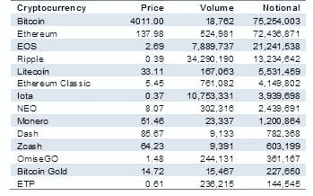

Table 1 Top 14 cryptocurrencies by traded notional

图 1 显示了截至 2018 年 12 月[加密货币](https://hackernoon.com/tagged/cryptocurrency)的名义交易百分比。从中可以看出，比特币和以太坊构成了交易名义的绝大部分，合计 73.28%。这主要是由于比特币是第一种引入的加密货币，因此具有先发优势，以及 ICO 中使用的 ERC-20 令牌是基于以太坊的。

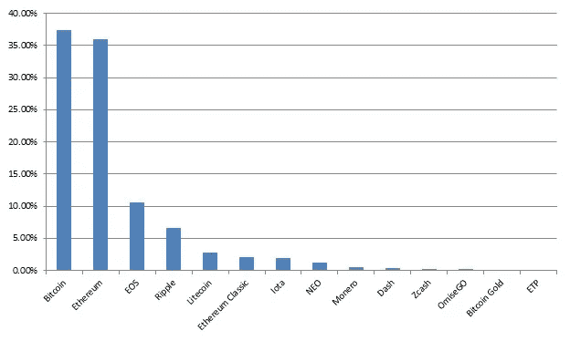

Figure 1 Distribution traded notional top 14 cryptocurrencies

图 2 显示了这些加密货币从 2013 年 3 月到 2018 年 12 月的收盘价。从中可以看出，加密货币经历了两次大危机，一次是 2013 年至 2015 年，另一次是 2018 年初至今。它还表明加密货币高度相关，表现出相似的价格行为。

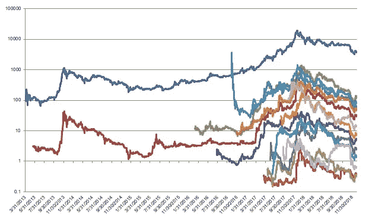

Figure 2 Closing price top 14 cryptocurrencies (log scale)

图 3 显示了所考虑的加密货币在对数尺度上的交易量。从中可以看出，2017 年交易量总体呈上升趋势，与加密篮子价格的高增长相一致，随后从 2018 年 1 月开始，价格和交易量均有所下降。

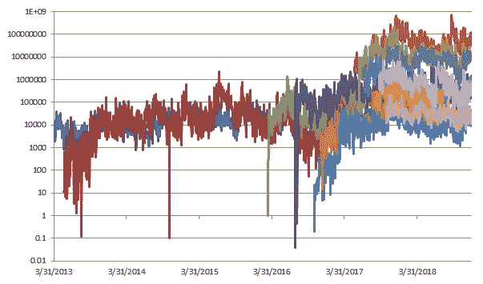

Figure 3 Traded volume top 14 cryptocurrencies (log scale)

图 4 显示了随着时间的推移，对数标度的交易名义值的类似结果。

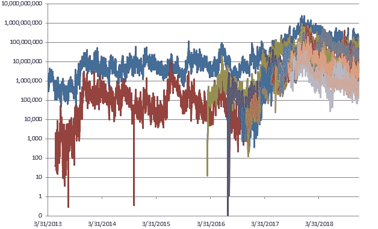

Figure 4 Traded notional top 14 cryptocurrencies (log scale)

图 5 显示了一段时间内对总名义交易的贡献。从中可以看出，虽然比特币仍然是交易量最大的加密货币，但在过去 5 年中，它失去了大部分主导市场份额，从名义上交易的加密货币的近 100%下降到今天的 37%左右。

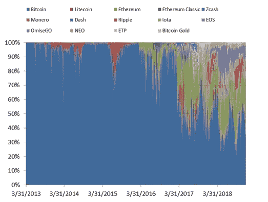

Figure 5 Distribution traded notional top 14 cryptocurrencies over time

图 6 报告了比特币和加密篮子的滚动 60 天波动性。

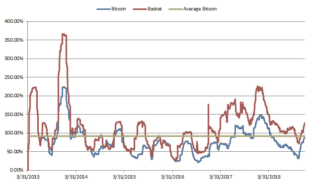

Figure 6 Rolling volatility Bitcoin and crypto basket

从中可以看出，crypto 是一个波动性非常大的资产类别，比特币的平均波动率为 91.73%，crypto 篮子的平均波动率为 114.13%。与股票和固定收益等传统资产类别相比，这要高得多，并突出了 3 点:

*   **从加密货币的波动中获利的潜力:**使用系统多头/空头等策略的积极投资者可能从加密货币的波动中获利。
*   **需要一种主动的波动率目标方法:**大多数希望在这一资产类别中投入大量资本的投资者无法容忍其资本的一大部分的平均年化波动率达到 91.73%。
*   **机构投资者尚未投资加密货币的额外证据:**加密货币的大部分交易是由散户投资者推动的，而不是机构投资者，因为该资产类别存在许多风险，其中由于该资产类别中存在的异常波动性水平而导致的市场风险过高，这对大多数希望部署大量资本的机构投资者来说都太大了。

# 2.比特币的绩效买入并持有投资策略

图 7 以对数刻度显示了 2013 年 3 月至 2018 年 12 月的比特币价格。

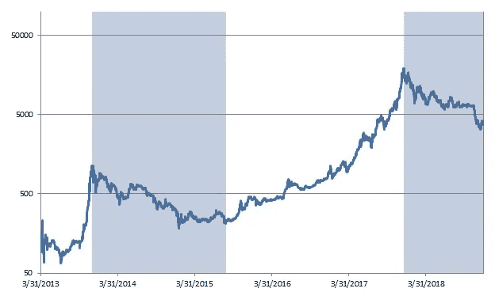

Figure 7 Performance passive buy-and-hold Bitcoin investment

从图 1 和表 2 中可以看出，在所考虑的时期内，比特币经历了两次重大危机。第一次危机从 2013 年 11 月 30 日到 2015 年 8 月 26 日，总时长 1.74 年，第二次危机从 2017 年 12 月 17 日到现在，时长 1.03 年。

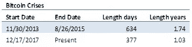

Table 2 Stats Bitcoin crises

图 8 显示了比特币买入并持有策略的提款，而表 3 显示了其提款统计数据。

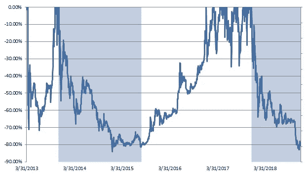

Figure 8 Drawdown buy-and-hold Bitcoin investment

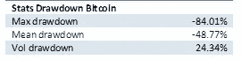

Table 3 Stats drawdown Bitcoin

从它们可以看出，一个买入并持有的比特币投资经历了显著的提款，最高提款 84.01%，平均提款 50%。这意味着长期投资者如果在比特币价格见顶时(如 2018 年 1 月)进入，就会损失大部分投资，因为比特币在那段时间的广泛宣传，许多投资者实际上都是这样做的。

图 9 显示了比特币每日回报的分布。

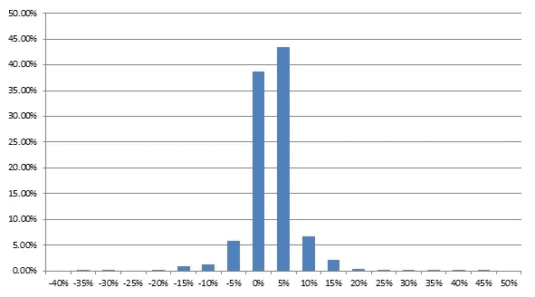

Figure 9 Distribution daily returns Bitcoin

表 4 显示了在所考虑的时期内购买并持有比特币投资的性能统计。

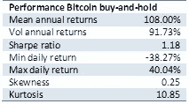

Table 4 Performance stats buy-and-hold Bitcoin investment

从中可以看出，比特币潜在提供高收益，平均年收益 108%，但同样非常高的风险下，实际上平均年化波动率为 91.73%，日收益可以从-38.27%到 40.04%。10.85 的高峰值也证明了这一点，凸显了这一资产的肥尾行为。夏普比率(Sharpe ratio)是 1.18，它显示了每单位风险的回报率。与股票等传统资产类别相比，这一数字相当不错，传统资产类别的夏普比率历来在 0.4 左右。

之前的比特币买入并持有投资业绩数据突显了拥有积极投资策略的重要性，这种策略能够在市场低迷时期减轻损失，或者通过做空来从中获利。这种策略将在第 4 节中深入分析。

# 3.一篮子加密货币中的绩效买入并持有投资策略

图 10 显示了从 2013 年 3 月到 2018 年 12 月按交易量平均投资于前 14 种加密货币的加密篮子的表现。

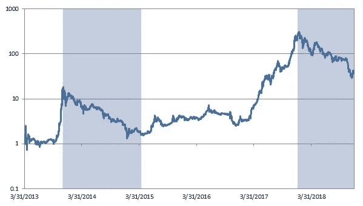

Figure 10 Performance buy-and-hold crypto basket top 14 cryptocurrencies

从它和表 5 中可以看出，加密篮子在考虑期间经历了两次重大危机，与比特币类似。第一次危机从 2013 年 11 月 30 日到 2015 年 4 月 14 日，总时长 1.37 年，第二次危机从 2018 年 1 月 4 日到现在，时长 1 年左右。

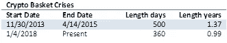

Table 5 Stats crises crypto basket

图 11 显示了加密篮子的缩减，而表 6 显示了其缩减统计。

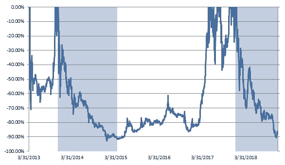

Figure 11 Drawdown crypto basket

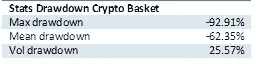

Table 6 Stats drawdown crypto basket

从它们可以看出，在加密篮子中购买并持有的投资经历了比比特币更糟糕的提款，最大提款为 92.91%，平均提款为 62.35%。这意味着，长期投资者如果在加密篮子价格见顶时(如 2018 年 1 月)进入，就会损失大部分投资，因为比特币在那个时期的广泛宣传，许多投资者实际上都是这样做的。

图 12 显示了加密篮子中每日回报的分布。

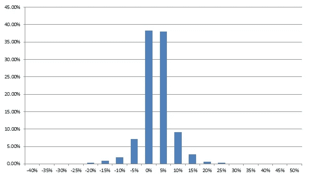

Figure 12 Distribution daily returns crypto basket

表 7 显示了在所考虑的时期内购买并持有比特币投资的性能统计。

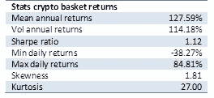

Table 7 Performance stats crypto basket

从中可以看出，与比特币类似，加密篮子可能提供高回报，平均年回报率为 127.59%，但风险同样非常高，实际上平均年化波动率为 114.18%，日回报率可以从-38.27%到 84.81%。27 的异常高的峰度也证明了这一点，这突出了该资产的厚尾行为。夏普比率(Sharpe ratio)是 1.12，略低于被动的比特币长期投资。夏普比率显示了每单位风险的回报率。与股票等传统资产类别相比，这一数字相当不错，传统资产类别的夏普比率历来在 0.4 左右。

之前的数据显示，对加密篮子的被动买入并持有投资与对比特币的纯买入并持有投资几乎相同。它还强调，向过去一年变得重要的许多篮子加密基金之一支付管理费和绩效费(通常为 2-20 英镑)是完全没有用的，这些基金反而向提供贝塔的阿尔法收取费用。事实上从前面的数据中可以看出，加密篮子的性能与被动的比特币投资几乎相同，甚至在考虑交易成本后最差。

有趣的是，为什么加密篮子的性能和比特币非常相似。图 13 显示了加密篮子中前 14 种加密货币的平均相关性。从中可以看出，被分析的加密货币之间的平均相关度为 0.56，大部分时间都在 0.7 以上。根据投资组合理论，如果投资组合中的资产具有低相关性或负相关性，投资者可以从投资组合多样化中获益。从数据中可以看出，加密货币并非如此，这使得加密篮子的表现非常类似于比特币的被动投资。

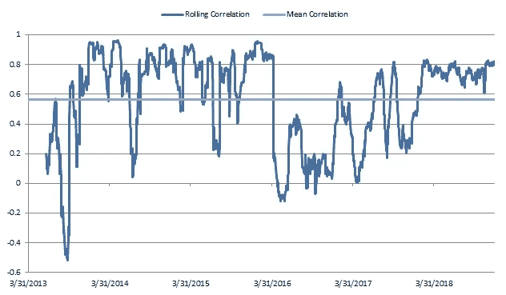

Figure 13 Average correlation top 14 cryptocurrencies in the crypto basket

除了对比特币的被动买入并持有投资的结果之外，这一数据还突显了拥有积极投资策略的重要性，这种策略能够在市场低迷时期减轻损失，或者通过做空来从中获利。这样的策略将在下一章深入分析。

# 4.绩效系统长/短加密投资策略

图 14 显示了应用于交易量排名前 14 位的加密货币的[系统性多空交易策略](https://www.blueskycapitalmanagement.com/systematic-crypto/)的交易成本后验表现净值。这种策略被比作对比特币的被动买入并持有投资，以及加密篮子的表现。策略波动性被设置为与加密篮子具有相同的波动性，以便于比较。从图中可以看出，与比特币和密码相比，该策略的表现更好，在牛市和熊市中表现一致。

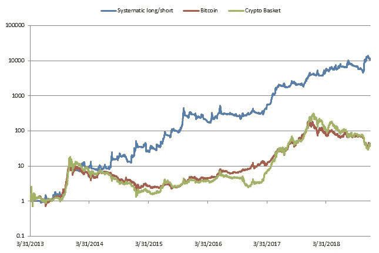

Figure 14 Performance systematic long/short crypto investment strategy vs Bitcoin and crypto basket

图 15 显示了与比特币和加密篮子相比，系统多空交易策略的缩减。

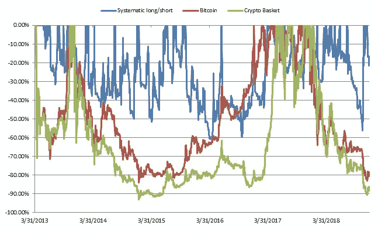

Figure 15 Drawdown long/short crypto investment strategy vs Bitcoin and crypto basket

表 8 显示了 3 个投资组合的提款统计数据。从它和图 15 中可以看出，投资组合可以更快更低地收回提款。事实上，最高提取比例约为 62%，相比之下，比特币的最高提取比例为 84%，加密篮子的最高提取比例为 93%。相反，投资组合的平均支出为 24%，约为比特币的一半，比投资组合少 60%。

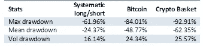

Table 8 Drawdown stats long/short crypto investment strategy vs Bitcoin and crypto basket

表 9 显示了 3 种策略的性能指标。如上表所示，系统性多头/空头的表现大大优于被动的比特币投资和加密篮子。在回报方面，它实现了 224%的年平均回报率，几乎是比特币和加密篮子的两倍。在风险方面，它的每个结构的加密篮子的波动性大致相同，比比特币的波动性略高。由于在风险大致相同的情况下获得了更好的回报，该策略的夏普比率达到了 1.96，远高于比特币的 1.18 和加密篮子的 1.12。如前所述，最大压降也更小，恢复速度更快。

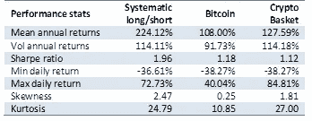

Table 9 Performance stats systematic long/short crypto investment strategy vs Bitcoin and crypto basket

表 10 显示了系统性多空策略的绩效归因统计。从结果中可以看出，该策略提供了真正的 alpha，在两个基准测试中均为正值 0.01。该策略不提供测试版，与比特币和加密篮子都不相关。这是对冲基金应该预期的结果，对冲基金是积极的投资者，无论基准和市场状况如何，它们都应该实现以阿尔法衡量的业绩，以贝塔衡量。相反，大多数加密基金对贝塔收取阿尔法。事实上，尽管他们是被动投资者，提供简单廉价的加密篮子，对比特币有很高的贝塔系数，但他们收取的费用与对冲基金根据广泛研究提供阿尔法所需的费用相同。

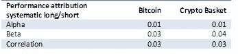

Table 10 Performance attribution long/short crypto investment strategy vs Bitcoin and crypto basket

总之，根据之前的结果，即使扣除交易成本，系统性多空投资策略也比被动长期投资比特币或一篮子加密货币更具优势。

# 5.结论

之前的结果强调了以下要点:

*   **Crypto 是一种高波动性的资产类别:**比特币的平均波动率在 91.73%左右。这既带来了巨大的风险，也为积极的专业投资者提供了采取正确投资策略的良机。
*   **被动买入并持有比特币的投资会带来长期的巨额提款:**被动长期持有比特币会带来长期的巨额提款。事实上，最大提取率为 84%，而最长提取时间为 1.74 年。这凸显了对积极加密投资策略的需求，这种策略可以通过做多和做空在牛市和熊市中获利。
*   **一篮子加密货币与被动投资比特币的表现非常相似:**投资一篮子加密货币毫无用处，因为它们的表现与被动购买并持有比特币的投资类似。这是由于加密货币之间的高度相关性(平均值为 0.6)，这在投资组合多样化方面几乎没有任何好处
*   [**系统性多头/空头加密投资策略**](https://www.blueskycapitalmanagement.com/systematic-crypto/) **在牛市和熊市条件下提供不相关的表现:**如业绩统计所示，系统性多头/空头加密投资组合在相同风险下提供的回报几乎是比特币和加密篮子的两倍。事实上，在此期间，它实现了约 224%的平均年回报率，而比特币的平均年回报率为 108%，波动性几乎相同，导致夏普比率几乎翻了一番。提款的规模和持续时间也较小，最高提款率为 62%，而比特币的最高提款率为 49%。

总之，加密是一种非常不稳定的资产类别。这带来了巨大的风险，但也为正确的战略带来了巨大的机遇。通过配置积极的多头/空头投资策略，投资者有很好的机会获得这一资产类别提供的潜在收益。

[订阅我们的简讯](https://www.blueskycapitalmanagement.com/subscribe/)获取我们在量化投资管理方面的最新见解。有关我们投资产品的更多信息，请发送电子邮件至[info@blueskycapitalmanagement.com](mailto:info@blueskycapitalmanagement.com)或填写我们的[信息请求](https://www.blueskycapitalmanagement.com/invest/)表格。

*最初发表于* [*蓝天资本*](https://www.blueskycapitalmanagement.com/analysis-of-a-systematic-long-short-crypto-investment-strategy/) *。*

# 放弃

本文旨在学术和教育目的，而不是投资建议。我们提供的或来自我们网站的信息不应替代投资专业人士的建议。本文讨论的假设模型并不反映测试期间存在的任何实际产品或策略的投资业绩，也不能保证如果存在这种产品或策略，它会表现出类似的业绩特征。投资任何产品或策略的决定不应基于本文包含的信息或结论。这既不是出售要约，也不是购买证券权益的邀约。