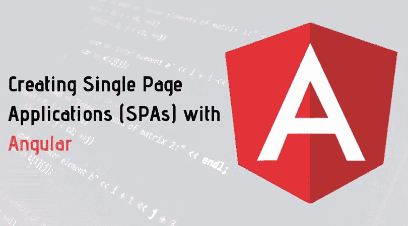
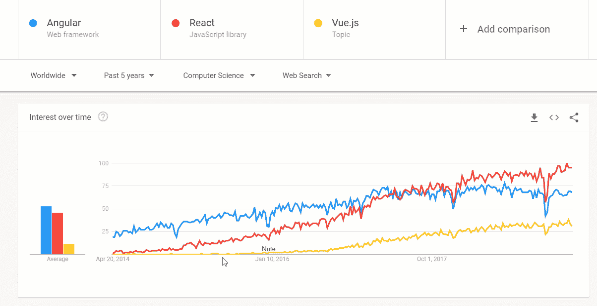
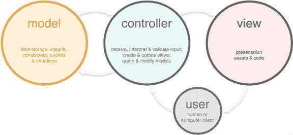
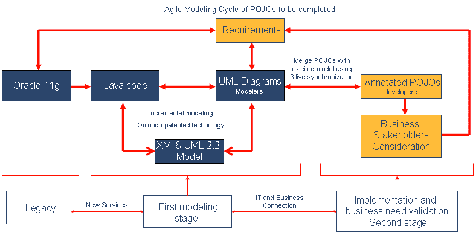
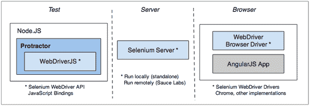

# 让我们了解使用 Angular 建造水疗中心的关键方面

> 原文：<https://medium.com/hackernoon/analysis-of-key-aspects-for-building-spas-using-angularjs-a812a666a7b7>



作为一名 IT 软件顾问，我一直在寻找新的框架和工具，最近我一直在寻找开发单页业务应用程序(SPAs)的最佳框架。我得到了这个:



有各种平台可用于单页面应用程序开发，我的选择并不总是很明确。根据统计，软件开发人员中最常用和最流行的 JavaScript 库、框架和工具是由 Nodejs 开发人员、AngularJS 开发人员、ReactJS 和 Vue 开发的。JS，。NET Core、TensorFlow、Xamarin 和 Cordova。

对于单页应用程序开发，我只需要一个可靠和高效的工具。我最关心的是，我应该使用哪个 JavaScript 框架来确保我的应用程序开发项目是最成功的？

根据市场趋势和报告，Angular 是创建单页应用程序的最佳平台。此外，请继续阅读，了解为什么您应该雇用 angular 开发人员作为单页面应用程序开发的首选，当然，是使用 Angular。

Angular 是一个结构化的 JavaScript 框架，非常适合为您的企业构建动态单页面应用程序。它还支持多种平台，该框架的所有命令和功能都是用 HTML 脚本编写的。

谷歌的 Angular 在 GitHub 上有大约 59，520 ⭐️(Star。它是 angular 开发人员开发 web 应用程序的合适平台，具有声明性模板和最有用的 CLI 工具，可以轻松开始您的项目。

# **Angular 对于构建单页面应用的关键方面**

# **1。MVC 框架和 POJO 模型**

Angular 不依赖于下划线. js 和 jQuery。它基于模型视图控制器(MVC)框架，这是一种用于开发 SPA 和 web 应用程序的设计模式。



The MVC Framework

模型负责维护数据存储、完整性、一致性、查询和突变。它是最简单的脚本形式，不需要使用任何形式的排序器和 getter 方法。

控制器负责接收、验证、交互和响应数据模型对象中的用户输入。简而言之，它控制了模型和视图之间的整个交互。

视图负责呈现用户为应用程序开发输入的资产和代码。在 Angular MVC 中，整个模式是用 HTML 和 JavaScript 编写的。例如，视图是用 HTML 实现的，模型和控制器是用 JavaScript 实现的。

## **使用 HTML 编码创建的 Angular 应用程序中的视图**

```
<!DOCTYPE html><html><head><title>Hack Hands Angular — Demos</title><meta charset=”utf-8" /></head><body><div id=”messageTitle”></div><div id=”message”>Hello World</div></body></html>
```

## **向角度应用添加控制器**

```
var indexController = hackApp.controller(“indexController”, function ($scope) {// controller logic goes here});
```

## **向模型添加信息**

```
var indexController = hackApp.controller(“indexController”, function ($scope) {// controller logic goes here$scope.message = “Hello Hacking World”});
```

在 Angular MVC 上构建单页面应用程序是如此容易。因此，建议使用 angular 进行应用程序开发，因为 Angular 开发人员无需编写任何冗长的代码就可以完成这项工作。Angular MVC 支持双向数据绑定，并允许您根据自己的喜好查看数据。

在数据绑定方面，Angular 使用 POJO (Plain Old JavaScript)对象，不需要额外的元素来将 AngularJS 与其他数据源绑定。这也是 angular developer 将其用于 SPA(单页应用程序)开发项目的主要原因之一。



Agile Modeling Cycle of POJOs

# **2。网页之间的路由**

在单页应用程序中，网页之间的导航是应用程序开发过程的关键方面。每次当我的网站用户点击菜单或子菜单时，我都不想把他们重定向到一个新的页面。单页 web 应用程序都是关于内容加载到同一个页面上，只需输入网站的 URL。

与使用其他 javascript 框架构建的网页相比，使用 Angular 管理网页之间的导航非常简单。AngularJS 的组件是轻量级的，因此它是开发单页面 web 应用程序的 JavaScript 框架的首选形式之一。

# **3。Google 上的社区支持**

当你开始一个应用程序开发项目时，你总是会寻找好的社区支持。Angular 受到 Google 社区的支持，可以在 GitHub 上下载。大多数浏览器都支持它，包括 IE 第 9 版及以上版本。

因此，在任何维护问题的情况下，有不同的[谷歌论坛](https://groups.google.com/forum/#!forum/angular)，在那里你可以提出你的疑问，并由 [**Angular 开发者**](https://www.valuecoders.com/hire-developers/hire-angularjs-developers) 解决它们。

# **4。在硒和量角器上测试**和

****

**您可以使用量角器或 Selenium 对 Angular 应用程序执行自动化测试。这两个是测试角度应用的绝佳工具。对于 web 应用程序的测试，最优选的选择是 Selenium。尽管我使用 selenium 测试应用程序，但我建议您使用量角器在应用程序开发过程中应用新的测试策略，这些策略包括:**

*   **By.textarea**
*   **旁中继器**
*   **按型号**
*   **WebElement.evaluate**
*   **等待角**
*   **通过绑定**
*   **WebElement.all**

# ****5。构建 spa 的敏捷平台****

**一个典型的 Angular 应用程序开发项目从一个愿景开始，为目标受众收集有用的静态信息。Angular 支持敏捷性，这意味着当企业开始在新的工作环境中工作时，它可以帮助企业在新的要求之间建立平衡。角度控制器可以很容易地在 MVC 架构中实现来完成这些要求。此外，angular 中有一组不同的[模块](https://docs.angularjs.org/api/ng/function/angular.module)可供 Angular 开发者用于 [Web 应用开发](https://www.valuecoders.com/web-application-development)。如果您希望定制您现有的应用程序，您可以选择您的模块，而不是从头构建一个新的应用程序。**

**角度开发者可以使用 angular.module 函数来创建、注册和检索角度模块。AngularJS 中的所有模块都必须使用这种机制进行注册。**

# ****总结****

**毫无疑问，使用 angular 构建的单页面 web 应用程序(SPAs)是用户友好的，对 Angular 开发者来说构建起来很有趣，并且本质上是交互式的。Angular 应用程序开发的另一个好处是，它分析网页文档对象模型(DOM ),允许程序更改页面的结构、样式和内容。**

**因此，它减少了对额外编码元素的需求。您只需要关注应用程序的单一代码集，更少的编码也意味着更少的出错机会。Angular 支持多功能功能和简单的编码，可加快您的应用程序开发过程。你也可以 [*从估价师(一家领先的*](https://www.valuecoders.com/)*[软件开发公司](https://www.valuecoders.com/))那里雇佣开发人员* 来为你的工作增添光彩。**