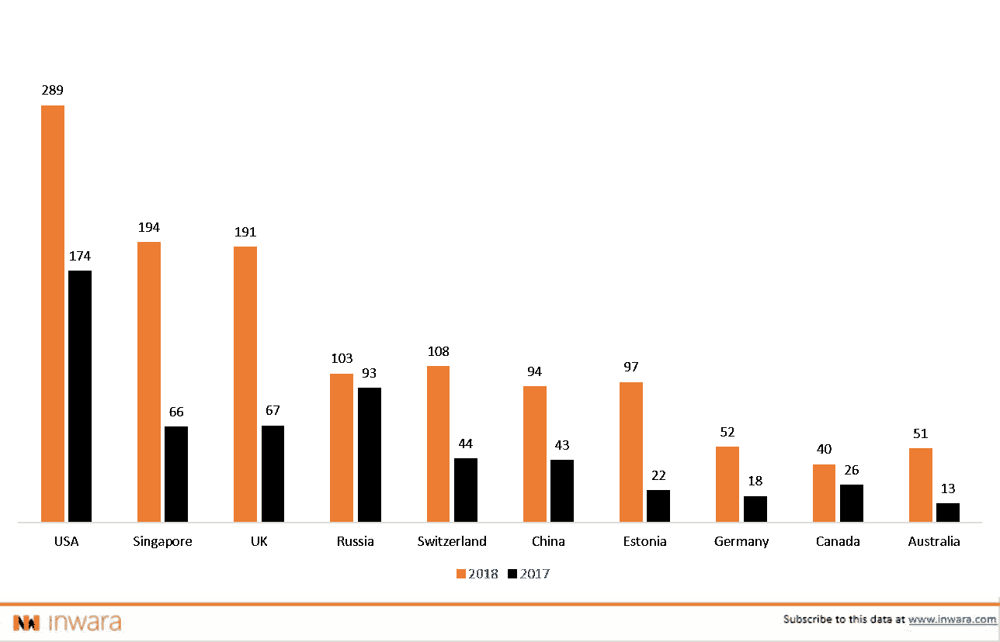
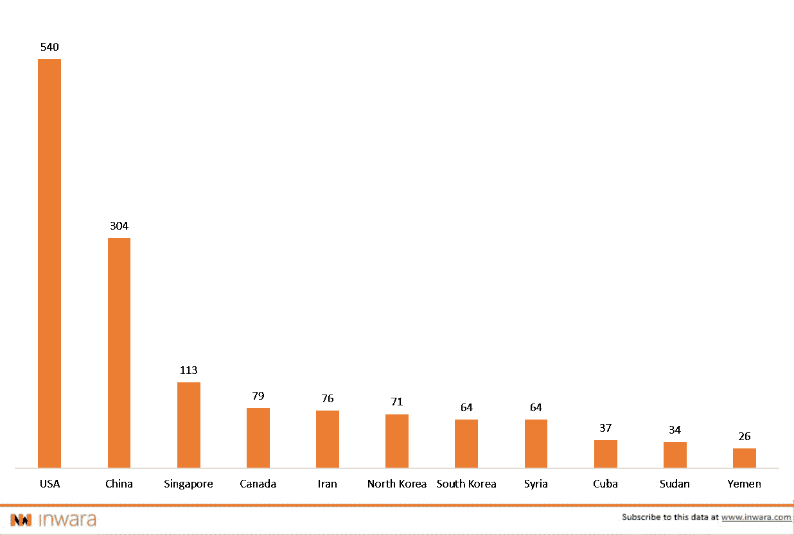
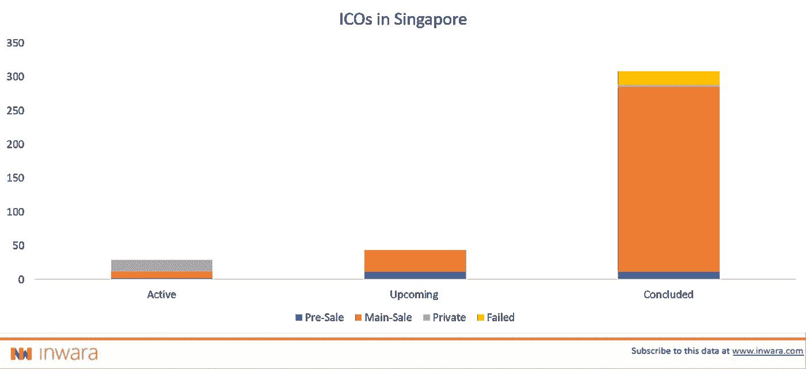

# 是什么让新加坡成为区块链和加密天堂？

> 原文：<https://medium.com/hackernoon/analysis-of-thriving-blockchain-and-cryptocurrency-market-in-singapore-data-driven-insights-80fb7818cae2>

## 新加坡现在被普遍认为是东南亚的区块链和加密中心。

免责声明:这不是财务建议。更多详情请访问 [*条款与条件。*](https://www.inwara.com/disclaimer)

小岛国新加坡一直被评为世界上最适合做生意的地方，使用区块链技术和加密货币的企业数量大幅增长。自由市场经济、有利于投资者的法律，加上高水平的教育和互联网普及率，是新加坡享有良好声誉的部分原因。

据 [InWara](http://www.inwara.com/?utm_source=sphacker&utm_medium=sphacker&utm_campaign=sphacker) 报道，就 2018 年公布的 ico 而言，新加坡仅次于美国。我们试着找出原因。

[Source: InWara’s ICO database](http://www.inwara.com/?utm_source=sphacker&utm_medium=sphacker&utm_campaign=sphacker)

有利的监管环境:监管者消息灵通、透明，并愿意试验该技术。

新加坡货币管理局(MAS)是负责管理金融部门相关法规的中央机构，已经在加密货币和区块链技术方面采取了一些积极措施。政府鼓励采用这些技术，并发布了数字代币发行指南。MAS 采用了一种开放的方法对数字令牌进行分类，即公用设施令牌、支付令牌和安全令牌。

MAS 的开放和务实从其董事总经理 Ravi Menon 先生在新加坡举行的全球区块链商业大会上的主题演讲中显而易见，他在演讲中提到“信任是所有经济交易的基础。在各方之间缺乏直接信任的情况下，替代方案是依赖可信的中心方。”“区块链技术的关键突破是它能够在一个分散的系统中建立信任。”

此外，新加坡当局鼓励创新，允许行业专家在新加坡共识 2018 等活动中就关键问题进行公开讨论。该国欢迎远见卓识者、专家和企业家讨论可能形成该行业未来框架的联系。与全球其他监管机构相比，新加坡见多识广，并愿意押注于这项新技术。

韩国等其他亚洲国家仍存在一些不确定性，因为针对加密货币交易实施的监管或税收法律很少。韩元是仅次于美元的最常用的法定货币。尽管在 2017 年 H2 期间，全球超过 10%的比特币交易是以韩元进行的，但韩国金融和司法当局在建立统一的监管框架方面仍然存在偏差。

另一方面，中国在 2017 年禁止所有 ico 和加密货币交易平台在国内运营。这一举动迫使许多玩家离开这个国家去更有利的地方。然而，中国鼓励发展和应用区块链技术来改善经济。

[Source: InWara’s ICO Database](http://www.inwara.com/?utm_source=sphacker&utm_medium=sphacker&utm_campaign=sphacker)

InWara 的数据显示，与美国相比，新加坡的 ICO 销售法规明显较少。这为企业家和投资者更好地追求他们的公司目标铺平了道路。

许多交易量很大的加密交易所都设立了新加坡分部，这主要是因为新加坡金融管理局采取了上述积极措施来监管加密货币。Upbit 新加坡和币安新加坡就是这方面的一些例子。币安甚至计划在 2018 年 9 月初整合菲亚特与新加坡元的配对。

# 新加坡是 ICO 的天堂？

新加坡凭借其自由市场经济、稳定的社会政治环境、有吸引力的税收框架也是亚洲发展最快的国家之一。这再加上做生意的便利性，使它成为创始人(包括发布 ico 的团队)的绝佳平台。

[Source: InWara’s ICO Database](http://www.inwara.com/?utm_source=sphacker&utm_medium=sphacker&utm_campaign=sphacker)

因此，区块链和来自不同国家的加密团队更容易在新加坡成立公司，并仍然具有全球竞争优势。

