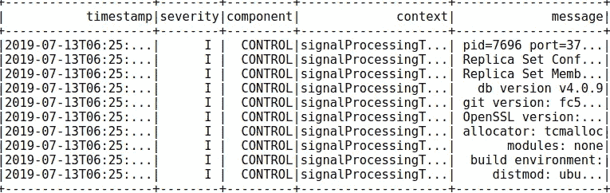
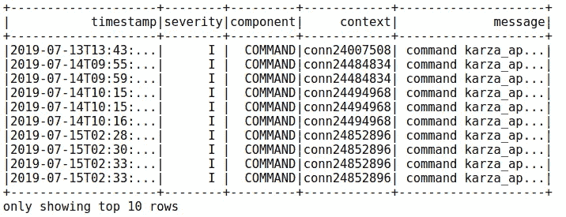

# 使用 PySpark 分析 MongoDB 日志

> 原文：<https://medium.com/hackernoon/analyze-mongodb-logs-using-pyspark-97a915547da0>


> “如果没有大数据，你会又瞎又聋，还在高速公路上。”—杰弗里·摩尔

如今，大数据已经成为计算机世界最重要的部分。一个重要的部分是读取和分析由我们使用的不同类型的数据库或其他服务或产品生成的大量日志。既然 MongoDB 已经进入了我们的生态系统，那么理解 mongo 日志并从中提取一些有用的信息就变得至关重要了。我阅读并研究了如何评价这些引导我走向 PySpark 的诗句。

在本文中，我假设已经安装了 PySpark(如果没有安装，我在文章末尾添加了 URL，它将帮助您安装 PySpark)。MongoDB 日志消息采用以下格式:

```
<timestamp> <severity> <component> [<context>] <message>ex: 2019-07-08T06:26:01.021+0000 I CONTROL  [signalProcessingThread] Replica Set Member State: PRIMARY
```

你可以在[这个链接](https://docs.mongodb.com/manual/reference/log-messages/)上阅读更多关于 MongoDB 日志消息的细节。你将会对我们将要构建的消息和正则表达式有更多的了解。
首先在程序中加载 MongoDB 日志文件

```
sc = SparkContext()
sqlContext = SQLContext(sc)
spark = SparkSession(sc)
base_df = spark.read.text("path_to_log_file")# base_df is now a spark data frame
print(base_df)                    # pyspark.sql.dataframe.DataFrame
base_df1.count()                  # count number of logs
base_df1.show(10, truncate=True)  # showing first 10 logs
```

我们将使用正则表达式来分隔消息中的不同部分。

```
timestamp_regex = "\d{4}-\d{2}-\d{2}T\d{2}:\d{2}:\d{2}.\d{3}[+]\d{4}"severity_levels_regex = "[F, E, W, I, D]\s"component_regex = "(ACCESS|COMMAND|CONTROL|FTDC|GEO|INDEX|NETWORK|QUERY|REPL|REPL_HB|ROLLBACK|SHARDING|STORAGE|RECOVERY|JOURNAL|TXN|WRITE)"context_regex = "\[(.*?)\]"message_regex = "\]([\s\S]*)"
```

在此之后，我们将构建一个表格数据框架，在此框架上可以应用不同的过滤器并执行查询。

```
logs_df = base_df1.select(
regexp_extract('value', timestamp_regex, 0).alias('timestamp'),
regexp_extract('value', severity_levels_regex, 0).alias('severity'),
regexp_extract('value', component_regex, 0).alias('component'),
regexp_extract('value', context_regex, 1).alias('context'),
regexp_extract('value', message_regex, 1).alias('message')
)print(logs_df)
logs_df.show(10, truncate=True)
```

下面是上面两条语句的输出:
DataFrame【时间戳:字符串，严重性:字符串，组件:字符串，上下文:字符串，消息:字符串】



Output: logs_df.show(10, truncate=True)

现在，我们在数据框中有了完整的文件，因此我们可以执行不同的操作，例如:

a.因为 MongoDB 记录了每个执行时间超过 100 毫秒的查询。我们可以过滤掉执行时间较长的查询。以下是一个查询的日志:

| 2019–07–15t 05:55:52.236+0000 | I | COMMAND | conn 24971548 | COMMAND<dbname>。<collection_name>命令:find { find: " <collection_name>"，filter:{ request id:" 0286 aedf-e042–4961–8 ffc-578847 fabf 15 " }，projection: { _id: 0 }，limit: 1，singleBatch: true，LSID:{ id:UUID(" 70382 CDE-19 a2 e2f 74 fbfd ")}，$ cluster time:{ cluster time:Timestamp(1563170121，8)，签名:{ keyId:66588</collection_name></collection_name></dbname>

正如您在日志中看到的，时间记录在语句的末尾，我们可以使用这个时间来过滤掉这样的查询。我们可以使用以下函数过滤掉耗时超过 3000 毫秒的查询(根据您的要求进行更改)。此外，这些类型的日志中的“组件”相当于“命令”或“写入”，因此，我们也需要过滤掉这两个组件。

```
# Function to filter queries taking longer than 3000ms
def eval_string(string):
    time_taken = string.split(' ')[-1]
    if time_taken[:-2].isdigit() and int(time_taken[:-2]) > 3000:
        return string
    return ""# Filtering out the COMMAND and WRITE components from data frame
components = logs_df[ ((logs_df['component'] == "COMMAND") | (logs_df['component'] == "WRITE")) ]# udf is used to create a user defined function
udf_myFunction = udf(eval_string) # if the function returns an intdf = components.withColumn("message", udf_myFunction("message"))# eval_string will return "" in case of time<3000ms, 
# filter out the queries in which message is not equal to ""
df.filter(df.message != "").show(10, truncate=True)
```



Showing 10 rows of filtered queries. Mention truncate=False to see complete queries

以下是完整的程序:

```
from pyspark.context import SparkContext
from pyspark.sql.context import SQLContext
from pyspark.sql.session import SparkSession
from pyspark.sql.functions import regexp_extract, lit, col, udf
from pyspark.sql import DataFrame
import re
from functools import reduce
import jsondef eval_string(string):
    time_taken = string.split(' ')[-1]
    if time_taken[:-2].isdigit() and int(time_taken[:-2]) > 3000:
        return string
    return ""sc = SparkContext()
sqlContext = SQLContext(sc)
spark = SparkSession(sc)base_df = spark.read.text("/home/himanshu/Downloads/mongolog/mongod.log.1")timestamp_regex = "\d{4}-\d{2}-\d{2}T\d{2}:\d{2}:\d{2}.\d{3}[+]\d{4}"severity_levels_regex = "[F, E, W, I, D]\s"component_regex = "(ACCESS|COMMAND|CONTROL|FTDC|GEO|INDEX|NETWORK|QUERY|REPL|REPL_HB|ROLLBACK|SHARDING|STORAGE|RECOVERY|JOURNAL|TXN|WRITE)"context_regex = "\[(.*?)\]"
message_regex = "\]([\s\S]*)"logs_df = base_df1.select(
regexp_extract('value', timestamp_regex, 0).alias('timestamp'),
regexp_extract('value', severity_levels_regex, 0).alias('severity'),
regexp_extract('value', component_regex, 0).alias('component'),
regexp_extract('value', context_regex, 1).alias('context'),
regexp_extract('value', message_regex, 1).alias('message'))# Show in desc order according to timestamp logs_df.sort(col("timestamp").desc()).show(10, truncate=True)
logs_df.show(10, truncate=True)components = logs_df[ ((logs_df['component'] == "COMMAND") | (logs_df['component'] == "WRITE")) ]udf_myFunction = udf(eval_string) # if the function returns an int
df = components.withColumn("message", udf_myFunction("message"))
df.filter(df.message != "").show(10, truncate=True)# Count the filtered logs
df.filter(df.message != "").count()
```

因为我们有完整的数据框架，所以我们可以根据我们的要求过滤掉日志。如果对过滤日志有任何疑问或任何其他问题，请务必让我知道。此外，评论我是否可以改善这一点，或者如果有一个程序中的问题。

**参考资料:** 我所用的一些资料来源:

[](https://spark.apache.org/docs/2.1.0/api/python/pyspark.sql.html) [## pyspark.sql 模块— PySpark 2.1.0 文档

### Spark SQL 和 DataFrames 的重要类别:使用 Dataset 和 DataFrame API 编程 Spark 的入口点…

spark.apache.org](https://spark.apache.org/docs/2.1.0/api/python/pyspark.sql.html) [](/@GalarnykMichael/install-spark-on-ubuntu-pyspark-231c45677de0) [## 在 Ubuntu 上安装 Spark(PySpark)

### 上面的视频演示了一种在 Ubuntu 上安装 Spark (PySpark)的方法。以下说明将指导您完成…

medium.com](/@GalarnykMichael/install-spark-on-ubuntu-pyspark-231c45677de0)