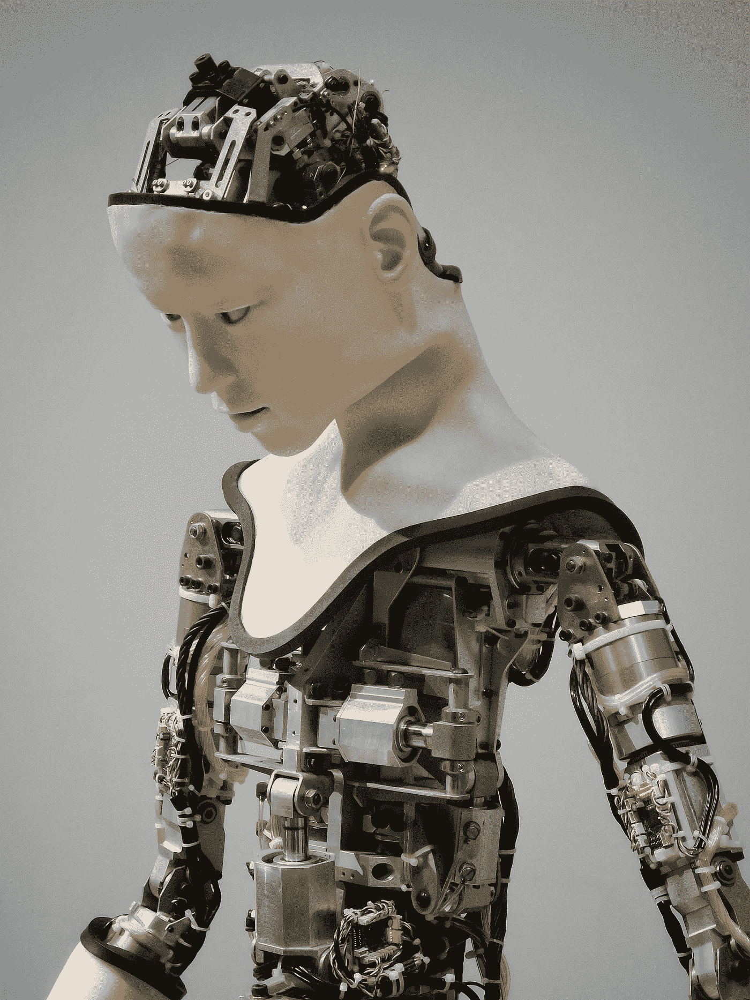
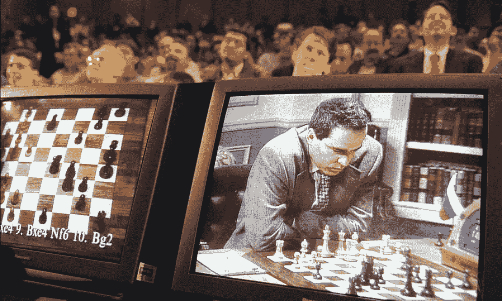
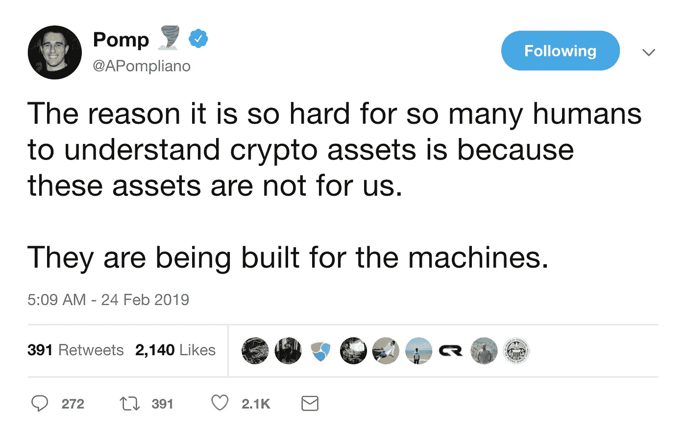
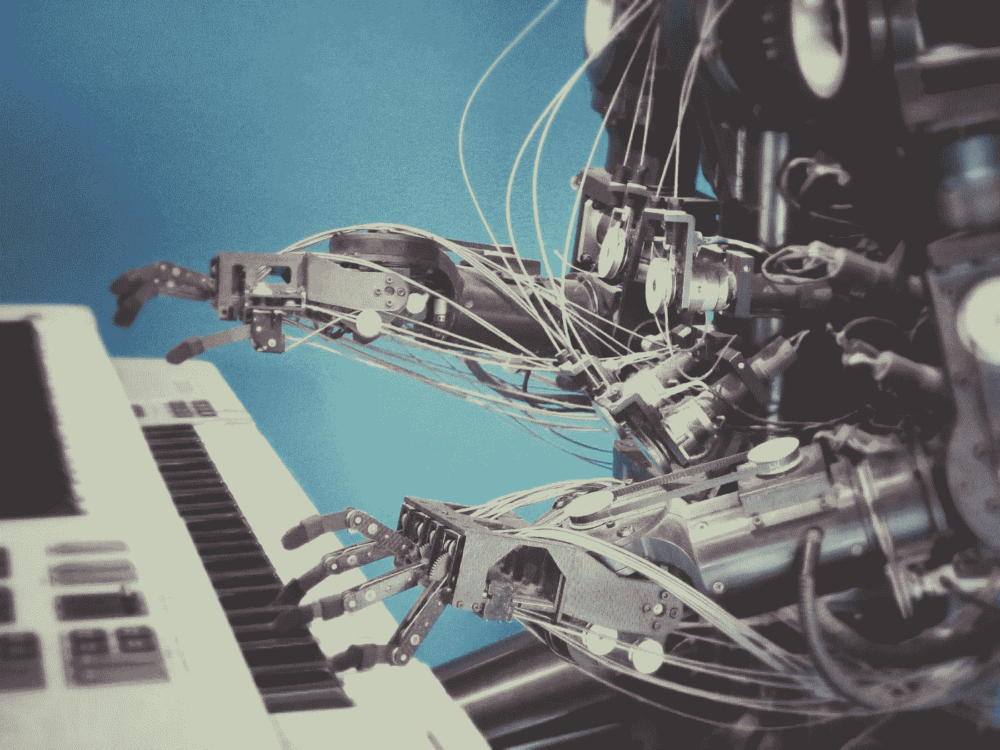
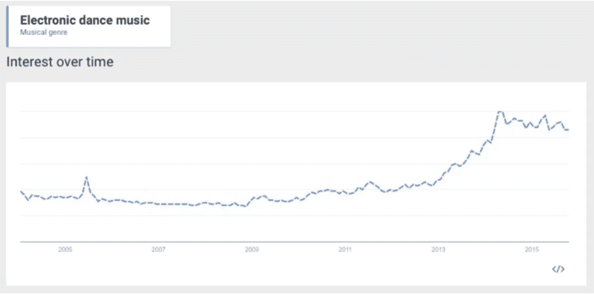

# 然后我们成了电子人

> 原文：<https://medium.com/hackernoon/and-then-we-were-cyborgs-d56abc61442d>

## 我们平均每天触摸手机 2617 次。这相当于每年 100 万次触摸。这对我们人类的未来意味着什么？

*“你是怎么破产的？”*

*“两种方式。逐渐，然后突然。”*

这篇来自*的轶事写于自动面包切片机上市之前。*

尽管如此，这也可能是我们每天都在经历的技术入侵的最佳类比。

*逐渐然后突然。*

1970 年，艾伦·托夫勒出版了一本名为《未来的冲击》的书，描述了“由快速技术变革引发的社会瘫痪”。

他们对这个术语的最短定义是个人对“在太短的时间内发生太多变化”的理解。

如果在历史上有任何时候这个概念被完美地应用，我会建议是现在，因为我们正处于技术普及的关键时刻，让我们诚实地面对它，我们中的一些人将会被抛在后面。

然而，这篇笔记并不是为了发出警告，或者给我们已经脆弱的心灵带来恐惧——而是一个认识到我们目前生活在有史以来最大的社会动荡中的机会，我们都应该有意识地意识到我们正在改变的景观，因为动物和机器的融合正在进行中。

技术进步的速度可能看起来在加速，那是因为它…有些人甚至建议指数级增长。

随着模拟世界和数字世界的融合，我们也变成了两种状态的混合体。

触觉和概念的结合，本能和程序的混合。

我们对技术的依赖意味着我们对小工具的依赖不再是一种便利的新奇事物，而是更准确地成为我们自身的延伸。

**想想这个**:我们平均每天触摸手机[2617 次](https://blog.dscout.com/mobile-touches)。

这相当于每年 100 万次触摸。

我们不再需要记住像公式或首都这样深奥的细节，因为我们的手机可以访问人类历史上最大的数据仓库。

我们大脑的一个矩形延伸，它可以完全回忆起信息(等待 wifi)，让我们变得更有教养、更聪明、更有意识。

但这种依赖值得担忧吗？或者这只是我们这个物种令人难以置信的适应性的最新例子，一种超现代的共生形式？

可惜没那么简单。

Terminator 2 (let’s be honest, the best film of all time).

# 电子人宣言

为了不太抽象，让我定义一下我所说的电子人是什么意思。

当这个术语被创造出来的时候，它是“控制论有机体”的缩写，指的是一种既有有机身体部分又有生物机械身体部分的生物。

我的定义更接近于一种共生关系，即很难确定我们在线和离线自我之间的界限在哪里。

我并不是作为一种新的思想提出这一点，二元性是一个和思想本身一样古老的主题，然而，在我们生活的数字世界的框架中，它从来没有这样一个**字面上的讨论**。

我们不是在和机器人战斗，它们正在变成我们。

最近几年，一些最大的科技权威发表了许多与这篇文章标题相似的文章。但是大多数都是前瞻性的，或者集中在我们技术依赖的一个特定方面。

我想探索动物和机器之间的蒸发线。

2017 年“*超级智能:科学还是虚构？”*埃隆·马斯克在会议上引用了一句玄学名言。

> "我们已经是半机械人了。"
> 
> 埃隆·马斯克

他继续说；

*“你有一个数字版的自己，一个网络版的自己，你的电子邮件，你的社交媒体，以及你所做的一切。*

你比 20 年前的美国总统拥有更大的权力。你可以回答任何问题，你可以在任何地方与任何人进行视频会议。你可以立即给数百万人发送信息。做不可思议的事情。”

那么，如果我们已经是电子人，那到底是什么时候发生的呢？我们应该担心吗？

# 雷·库兹韦尔:高度警觉的机器人

雷·库兹韦尔(Ray Kurzweil)长期以来一直关注机器学习的改进速度。

1990 年，在大多数人还没有家庭互联网连接之前，雷已经出版了一本名为《智能机器时代》的书，警告我们机器学习和人工智能的危险。

库兹韦尔认为，通过进化创造人类表明，人类应该能够建造比自己更聪明的东西。

尽管直到 2005 年他出版了《奇点临近》一书，他的信息才真正开始在大众的意识中深入人心。

> “第一批计算机是在纸上设计的，然后手工组装。今天，它们是在计算机工作站上设计的，由计算机自己完成下一代设计的许多细节，然后在全自动化的工厂里生产，只需要有限的人工干预。”
> 
> 雷·库兹韦尔，奇点就在附近

Deep blue and Gary Kasparov.

根据他的加速回报定律，技术进步的速度——尤其是信息技术——会随着时间的推移呈指数级加快，因为有一种共同的力量推动它前进。这种力量就是进化。

因此，客观地说，我们在 21 世纪不会经历 100 年的进步——它更像是 2 万年的进步(以今天的速度)。

正如库兹韦尔不祥地指出的那样，“技术变革如此迅速而深刻，代表着人类历史结构的断裂。”

这种快速发展的证据随处可见，最著名的案例之一就是深蓝。

1997 年，国际象棋世界冠军加里·卡斯帕罗夫与 IBM 公司专门设计的计算机“深蓝”进行了对决。

深蓝的胜利已经作为人工智能发展的一个重要里程碑进入了文化词汇。

当他输了的时候，卡斯帕罗夫声称深蓝的一些动作是如此聪明和有创造性，它们一定是人为干预的结果。

根据我们目前对机器学习和最相关的模式识别的理解，我们知道深蓝击败卡斯帕罗夫不是通过我们所知道的智能，而是通过蛮力计算能力。

“深蓝”每秒能够评估 2 亿个位置，在某些情况下，可以搜索到 6 到 8 步的深度，最多 20 步，甚至更多。卡斯帕罗夫不是思想落后，而是武器落后。

一个简单的谷歌搜索“象棋模拟器”将产生一项比深蓝强大得多的免费技术,这就是机器学习的进展。

这并不奇怪，在一个游戏中，有一个有限的设置和可用的移动限制，计算机在处理任何可能的移动组合方面比人类有无限的能力。

这是显而易见的，但这并不意味着我们已经到达了机器人霸主的黎明——**这意味着一个机会已经出现，我们可以从以前未探索的新方法和策略中学习**，以提高理解的新高度。

正如卡斯帕罗夫所说，“AI 将帮助我们释放人类的创造力。人类不会被多余或取代，他们会被提升。”

他继续说；

> “我输了(象棋)，但我活了下来，我想如果你不能打败他们，就加入他们。从现在开始，我们别无选择，只能和机器一起工作，做出最好的算法。”

当谷歌大脑驱动的 [AlphaGo](https://www.theguardian.com/technology/2016/mar/09/google-deepmind-alphago-ai-defeats-human-lee-sedol-first-game-go-contest) 软件在 2016 年与韩国职业围棋选手 Lee Sedol 对决时，格局再次发生了变化。

在五局的第二局中，AlphaGo 走了一步令 Sedol 震惊的棋，将它的一颗石子放在了棋盘的另一边。“这是一个非常奇怪的举动，”一位评论人士表示。“我认为这是一个错误，”另一个人说。

半年前第一个输给机器的职业棋手、经验丰富的围棋手范辉说:**“这不是人的举动。我从未见过人类玩这一招。”**

# 比特币、密码学和数字货币的兴起

几天前我看到了这条推文，它让我停顿了一下。

正是这条推文给了我写这篇文章的灵感。并不是说它在说我不知道的东西，而是它构建更广泛叙事的方式让我看到了像素化树木的森林。

> "他们(数字资产)是为机器制造的."

这是我很久以来读过的最令人毛骨悚然的句子之一。

让它更加尖锐的是，它不是夸张，而是完全准确的。

比特币正被创造成一种为数字世界提供动力的货币。互联网的原生货币。

这些交易的记录将同时保存在数千台电脑上，由解决复杂数学问题的定制电脑保护，用人类完全无法理解的加密方言书写。

难怪这么多人难以接受比特币是一种可行的货币。

加密、密码术、共识、协议、散列图和许多其他的词都是最近进入我的日常用语，因为它们对于理解网络设计是至关重要的，尤其是当它涉及到设计区块链时。

我基本上是在自学讲电脑。

学习理解网络协议或“管理一个网络的官方程序或规则系统”来与另一个网络交流和互动。

去中心化是比特币的核心特质之一，这意味着这些交易是在没有中央机构的情况下发生的，因此，大量的计算机正在解决复杂的数学问题，以验证交易并使用一种加密形式跨境转移财富，这种加密形式会模糊发送者和接收者的身份。

机器用自己的语言相互交流，并在此过程中绕过货币管制转移财富。

即使从历史高点暴跌，BTC 的市值仍与国际艺术品市场相当。

2009 年提出比特币，苏富比成立于 1744 年。

数字资产并不是全球金融市场的唯一实质性破坏者，毕竟全球金融市场是资本主义的顶点——传统之前的表现。

摩根大通(J.P. Morgan)估计，目前 90%的股票交易量来自“趋势跟踪”交易者(quant、指数、ETF、期货和期权相关策略)，他们的交易决策通常由算法或程序化交易系统驱动，而不是基本面原因。

> “在过去的几十年里，随着人们被自动交易的电脑银行所取代，世界各地的交易大厅变得寂静无声。”
> 
> 《卫报》的詹姆斯·布里德。

还是以国际象棋为例，当然，计算机在实时处理交易机会方面比人类更好。

然而，这并不意味着机器人甚至复杂的算法将很快运行银行，因为它们将在庞大的数据宝库中识别的模式将帮助我们以我们尚未发现的方式理解市场。就像国际象棋一样，开始吧。

我还没见过比巴克莱(Barclays)驻伦敦系统做市主管阿私陀车安说得更简洁的话。

> “这不是人类对机器；这是人类与被机器增强的人类之间的较量。”

# 电子音乐和 3D 肢体

令人痛苦的是，与量化交易、智力游戏和用数字资产扰乱金融市场相比，计算机正以更加明显和人性化的方式影响着我们。

音乐商业博客 extraordinaire Digital Music News 根据谷歌对主题的新分析发布了一些有趣的图表。

图表显示了从 2005 年到 2015 年对音乐流派的测量兴趣，除了电子音乐，所有分析的流派都在下降，电子音乐急剧上升，特别是自 2013 年以来。

自 2005 年以来，人们对摇滚、嘻哈、古典、爵士、蓝调、金属和迪斯科的兴趣都急剧下降。

与人类演奏的传统乐器相比，我们更喜欢听机器(合成器、鼓机、采样器、Roland TR 808)与人类合作创作的音乐。

在医疗领域也是如此，3D 打印使得假肢的设计和生产对那些失去肢体的人来说更加实惠。

事实上，澳大利亚一位名叫 Mat Bowtell 的工程师设计并制造了廉价的义肢，他把这些义肢免费送给人们。

他的设计已经被下载了 1000 多次，为人们节省了大约 650 万美元。

> “如果你给某人价值 100 美元的东西，那么它只值 100 美元，但如果你免费给他们，它就变得无价了。”

他能够通过被称为“众筹”的相对现代的项目融资形式为他的项目提供资金，通过从许多人那里筹集少量资金，**通常是通过互联网。**

# 摘要

技术和人不是竞争的，我们也不是彼此分离的。

动物和机器之间的界限越来越模糊，令人难以理解。

机器更擅长处理数据、记忆和回忆信息、识别模式、提起重物和精确移动。

人类更擅长涉及创造力、抽象思维和不确定性的任务。

然而，没有一种解决方案不是通过两个半球的结合而得到改善的。数字和模拟世界的共生。

通过与人工智能系统合作，我们可以增强和扩大工作和生活的许多方面。

这种合作将不会是一个有意识的决定，我们的机器人现实已经在这里。

我们开始有意识地拥抱它的时候就要到了。