# 十五分钟内从零开始建造一个秘密教堂。循序渐进的指导

> 原文：<https://medium.com/hackernoon/andrii-ryzhenko-building-a-crypto-church-from-scratch-in-fifteen-minutes-step-by-step-instruction-15578f41e57d>

我认为，教会、社会组织或基金应该有权利在全球网络中得到代表，而不像假的创业公司。

我的意思是从 ICO/SCO 那里要足够的钱，开始开发有用的 DApps！如果你了解商业模式并有一个专业团队，你可以在 1-2 周内创造出大部分的 MVP。

现在我要证明这一点，我们将一起开发一个真正的 DApp——隐教堂。

区块链是一种商品。如果你同意，我们就可以开始了。

首先，我们需要选择主要技术。

经过一年的深度分析，我选择以太坊作为核心架构。原因只有两个:

1.  这对于开发人员来说非常容易，因为工具已经开发出来了。
2.  许多崇拜者从他们的家用电脑上收集了向神秘神祈祷的免费以太坊。

# 简单智能联系人

隐教堂最重要的是什么？

….

….

….

我不能猜测你的想法，但是我可以说…

# 捐款！

我们将创建一个简单的智能合同的基本功能，以收集捐款。使用谷歌浏览器进入[http://remix.ethereum.org/](http://remix.ethereum.org/)

删除带有旧代码的草稿，并从示例中复制文本(您可以在文章末尾找到代码)

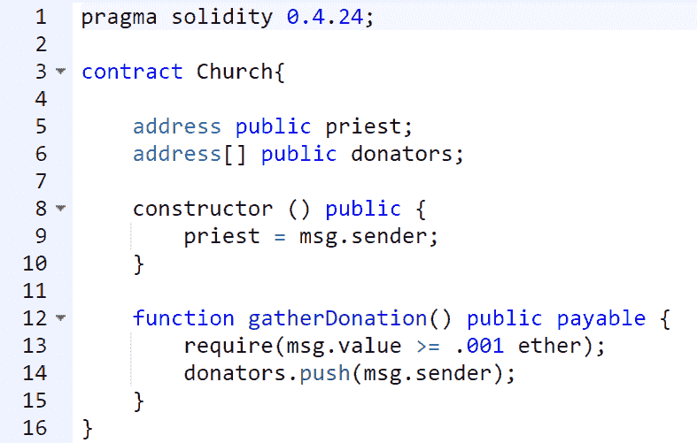

所以，第一行是编译器的版本。在互联网上，你通常可以找到 e ^0.4.24，但我们遵循 ConsenSys 我们应该锁定 pragma？：

此外，在第三行中，我们创建了一个教会的智能契约，其中实现了两个基本功能:

constructor() — *创建合同时自动执行的函数，它决定了管理合同的人。建造教堂的人，他统治着，我们称这个职位为“牧师”*

*gatherDonation —* 用于转移捐款的功能(关键字 payable 允许翻译)，捐款必须至少是给定的金额。

# 角色分配。使合同更加复杂

我们理解 CryptoChruch 隐含了不同的活动，限制权限是必要的。我们增加了特殊功能 *St()* 来标记只允许牧师使用的动作:

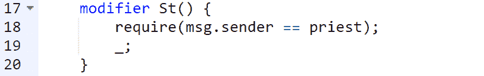

接下来，我们创建从 CryptoChruch 智能合约中直接提取资金到牧师帐户的函数:

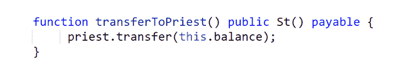

那么我们还遗漏了什么？我们来看看是谁捐的！这是另一个显示地址提供者列表的新功能:

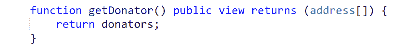

# 智能合同启动的准备工作

然后，我们需要在测试网络中推出智能合约。记住，我们使用的是谷歌 Chrome 浏览器。转到 [https://metamask.io](https://metamask.io/,) 安装 metamask 插件。

超能面具是以太坊世界的最佳联络人。它主动楔入网络浏览器，允许通过启动以太坊 DApps 与以太坊网络进行交互，而无需成熟的[区块链](https://hackernoon.com/tagged/blockchain)节点。该插件还激活密钥库，允许在不了解什么是私钥的情况下进行全面的事务处理。

下载、安装并登录您的帐户。保存助记符短语，以防您需要恢复访问权限和密钥。

在上层菜单中，选择您要使用的网络——“Rinkeby 测试网络”如果教区富裕，去主以太坊网络。"

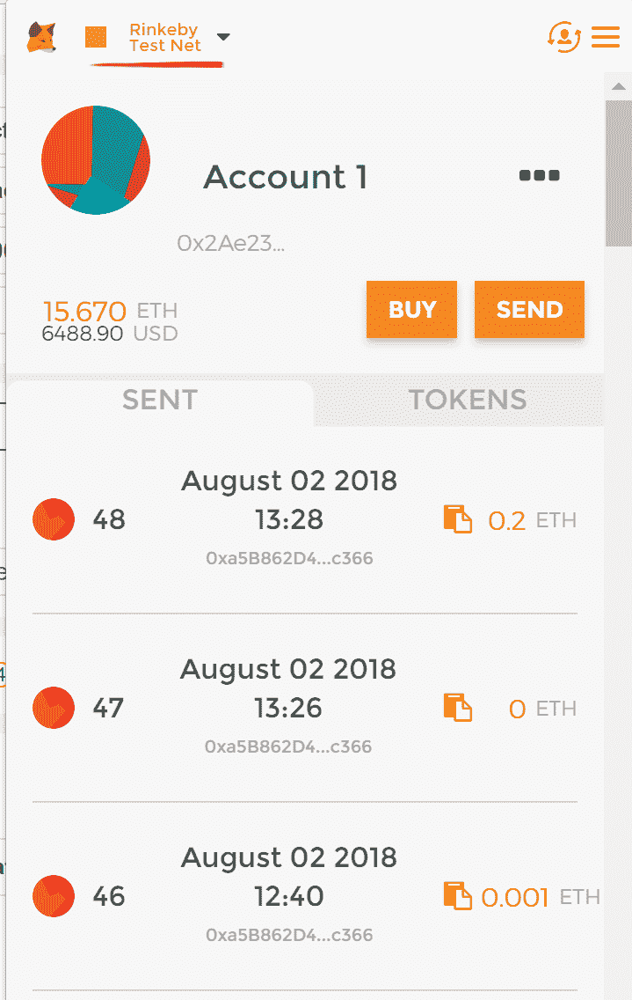

仔细看，账户上没有余额。那么该怎么办呢？

既然是测试网，可以免费续费。去 https://faucet.rinkeby.io/的。你可以看到你需要完成一个简单的任务。从 Metamask 插件中复制你的账号地址，粘贴到 post 字段，比如 Google+(【https://plus.google.com】)，幸好这个社交网络早就死了。复制水龙头表格的链接，选择——管他呢——3 天。

这是我看到的样子:

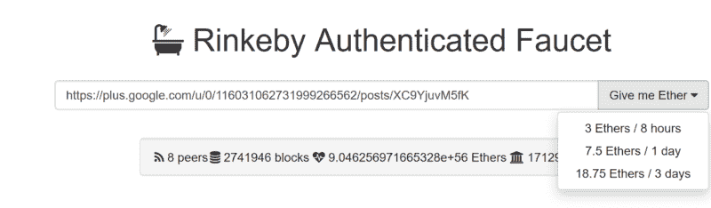

现在，等到虚拟货币打入你的账户，希望测试网络与真实的以太坊没有任何不同，这意味着 18.75 以太币几乎是… $$$$

看，我们的朋友谷歌最近在其引擎中添加了一个加密货币计算器。输入搜索字段— *18.75 瑞士法郎兑美元。*

**在网络中启动合同**

让我们回到编辑:[http://remix.ethereum.org。仔细检查合同，不要漏掉任何关键性的错误。](http://remix.ethereum.org.)

选择右边的书签—运行，环境选项，并使用鼠标选择“注入的 Web Rinkeby”—这是一个活动的元掩码帐户。

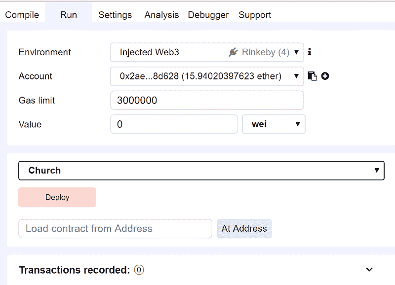

通过检查帐户字段，确保您的帐户已从元掩码中提取非零余额。

单击部署按钮，将弹出元掩码窗口，显示合同创建的交易详细信息。点击绿色提交按钮并确认交易。

在打开的元掩码中，选择“发送”部分的最后一个交易，并转到 etherscan.io 上的交易记录。以我链接到 [etherscan](https://rinkeby.etherscan.io/tx/0x76ad195fa934f4ca613d62ceb814eab90921e3d2bb70043fd5479854362b6ed1) 为例。如果你能在下面的截图中看到成功——恭喜你，你的秘密教堂刚刚上线！

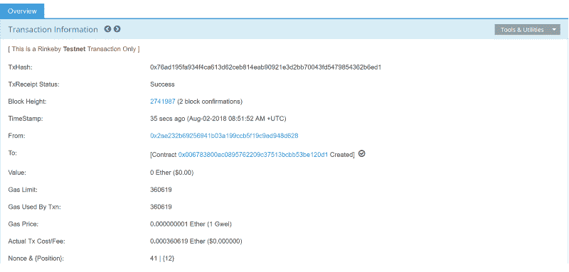

然后进入 [remix](https://remix.ethereum.org/) 编辑器，训练捐款，确保 gatherDonation()函数工作。

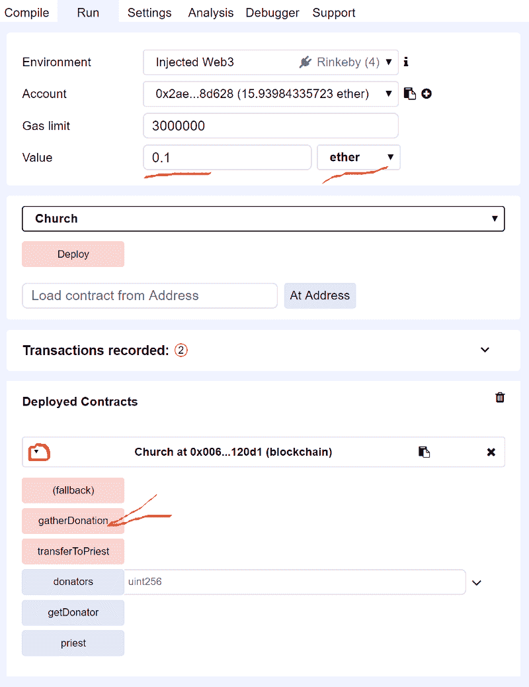

出于培训目的，您可以将 0.11 乙醚转给我的联系人，这样我就知道您已经阅读了我的文章。提醒—这是一个测试网络。

[0xa 5b 862d 4 beb 6924 E8 eeb 0 a6e 0676 D5 BF dec 7c 366](https://rinkeby.etherscan.io/address/0xa5b862d4beb6924e8eeb0a6e0676d5bfdec7c366)

不要忘记所有的交易都需要元掩码确认。现在，一切都准备好了，你可以启动隐教堂了。

# 伪匿名交易

现在透露还为时过早——还有一个非常重要的方面需要解决。

很可能，崇拜者会尝试直接将钱转移到智能合同地址，而不是捐赠(就像直接将钱带到教堂一样)。目前的配置不会让这种情况发生。作为例外，你可以使用*牧师*的称呼。

如果有人想匿名捐赠，但没有列出名单，该怎么办？或者是一个人想要转移一笔无法通过捐款收集限制的小额款项？然后，您需要添加一个特殊的功能，将允许一个直接转移到智能合同。

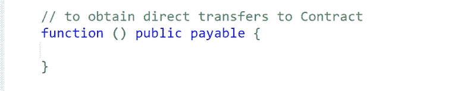

最终编辑，我们检查智能合同，点击部署并在弹出的元掩码窗口中确认操作。

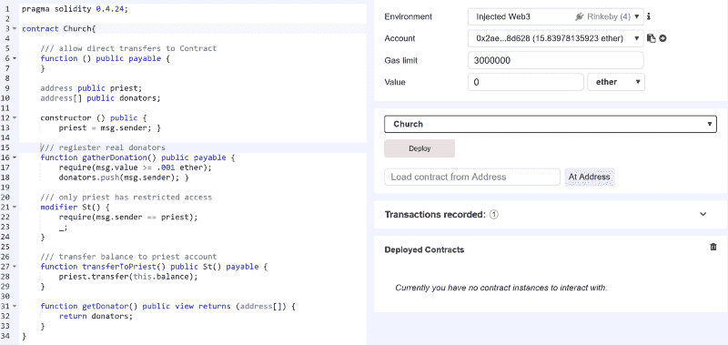

转到 MetaMask、发送部分、最后操作-在具有智能合同创建的最后交易日志的网站上。我看起来是这样的:

然后我们去看合同，寻找理想的“成功”字眼。

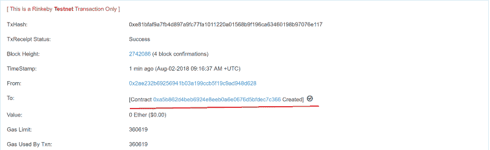

你可以看看我的例子。

你成功发射了吗？如果是这样，祝贺你打开了你的 ryptoChurch！

# 交易的透明度

我们说的是区块链吧？意思是一切都要透明！

将你的合同文本上传到 etherscan 的代码区，崇拜者可以看到合同是如何工作的，并检查源代码。我就不细说了，因为我相信你能做到。以我的源代码为例——您需要实现一个绿色标记代码和可公开访问的契约的源代码。

请记住，这是一个公共区块链，这意味着一个精明的崇拜者可以随时看到交易细节，查看 CryptoChurch 的余额。

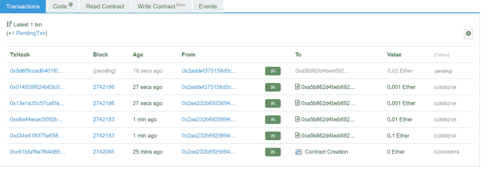

# 包扎

*   CryptoChurch 是一个简单的创建和维护工具。
*   资金将被转移到教会的账户，而不是牧师的账户。
*   交易是完全透明的，智能合约可用于监控。
*   崇拜者可以捐赠来自采矿或加密交易的钱。

祝大家好运，保持好心情！保持联系并访问[数字数据科学和分析机构](https://datarob.com/)网站。

如果你喜欢我的文章，请随意点赞、评论和分享。谢谢大家！