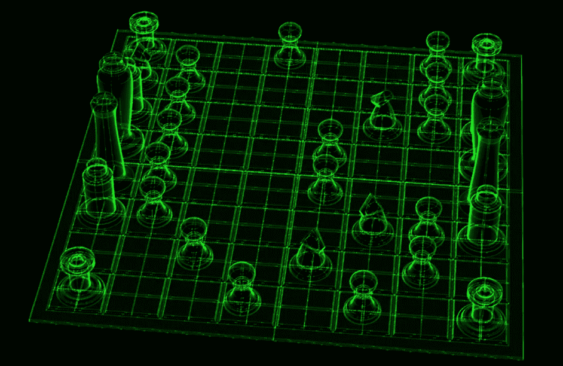

# 国际象棋和编程:打破所有程序员都是优秀棋手的神话

> 原文：<https://medium.com/hackernoon/andrii-ryzhenko-chess-and-programming-busting-the-myth-that-all-programmers-are-good-chess-players-5ad6c6b8bb57>

反驳任何神话都要从统计数据开始，所以我们在办公室里四处询问，发现我们客户在 NCube 的[软件工程师大多不擅长下棋或者根本不会下棋。](https://ncube.com/?utm_source=hn_medium)

但让我们震惊的是，下棋的人，原来是打电话的程序员。这些是完成任务的专家，更重要的是，他们热爱自己的工作。重要的是要明白，并非所有的 It 专业人士，尤其是外包行业的专业人士，都是编码的铁杆粉丝。他们这样做是因为这能支付他们的账单，支持他们的家庭或者一个昂贵的爱好，比如赛车或者去俱乐部。

虽然我们没有看到国际象棋的成就和[编程](https://hackernoon.com/tagged/programming)之间的直接联系，但仍然有可能比较并找到这些活动之间的共同点。

下棋能让你成为更好的程序员吗？

# 象棋有助于实现激光般的聚焦

在今天的短暂文化中，人们很容易被无数的微任务、社交媒体和与同事的聊天分散注意力。在分心之后，程序员需要 15-45 分钟才能回到工作模式。下棋可以训练一个人在一场比赛中所需的注意力，这场比赛可以持续几个小时，直到比赛结束。

# 适应单调乏味的工作

编程有什么乏味的？有人会说学习新的框架和库很令人兴奋。但是说实话，对于那些寻求冒险的人来说，有很多其他职业更令人兴奋。编程就是记住并应用数百个类似的任务。同时，下棋需要学习上百种典型的变奏和开局。

# 实现长期目标所需的技能

平均来说，在编程方面取得有意义的成果需要 5 年时间。为了成为象棋高手，许多棋手在很小的时候就开始练习。一个孩子习惯了这样一个事实:成为冠军需要多年的持续练习。拥有这种心态的专业人士在面对困难时不太可能轻易放弃。目标感有助于他们踏上通往成功的漫漫征途。

编程对于想要改变职业生涯的成功棋手来说是一个很好的选择。所有的国际象棋技能都可以在数据处理、高负载系统、机器学习或任何其他高准入门槛的 IT 领域得到很好的利用。像高薪工作和大量令人兴奋的项目这样的回报等待着那些敢于做出改变的人。

# 心理训练

像任何其他策略游戏一样，象棋训练大脑的执行功能——演绎和类比推理，包括记忆和注意力。除了这些技能，编程还需要逻辑、数学、抽象和语言技能，即可视化、语义和文本结构的句法分析。

在很小的时候开始下棋会带来更多切实的成果。其实我所在的学校在一年级就把象棋作为必修科目纳入了课程。

# 下棋的一个缺点是

# 下棋可能会浪费时间。最好是运动

象棋要花很多时间。典型的高级软件工程师的技能与日俱增。这是一场真正的军备竞赛，国际象棋可能会分散你提高编码技能的注意力。如果你有几个小时的空闲时间，最好在健身房度过。

# 缺乏社交和强大的社区

除了工作，还有很多有助于建立职业生涯和人际网络的活动。你可以去露营，休息时和同事玩电脑游戏，或者去公园骑自行车。国际象棋社区太小了——它甚至比不上[“战锤 4 万”](https://www.forbes.com/sites/jenniferbosier/2013/04/03/getting-to-know-warhammer-40000-beginners-guide/)宇宙。

# 第一名已经有人了

1996 年，国际象棋世界冠军加里·卡斯帕罗夫输给了深蓝，这是一台每秒能计算 200 米的 IBM 计算机。这意味着冠军已经被预先定义了——如果没有像大脑植入这样的重大技术升级，人类将无法在国际象棋中击败机器。问题是你是否愿意花费数年时间去掌握象棋，只为有机会争夺第二名？

# 不可能靠下棋谋生

著名的国际象棋选手确实过着不错的生活，但与硅谷或印度的程序员相比，他们的数量非常少。编程事实上已经改变了数百万人的生活。这是一部人人都可以进入的社交电梯。许多伟大的棋手改变了他们的职业，因为他们必须供养他们的家庭。另一方面，程序员倾向于在退休前保持活跃的职业生涯，成为顾问、分析师或经理。

# 最后的想法

如果你是一名优秀的棋手，你会更容易擅长编程。也就是说，不应该高估象棋技能——如果你不知道如何下象棋，不要浪费时间去学习如何下象棋，直接开始学习你的编码技能。这种方法被证明是最可靠和有效的。

作为一名软件开发人员，最好的开始方式是尝试开发自己的象棋游戏。