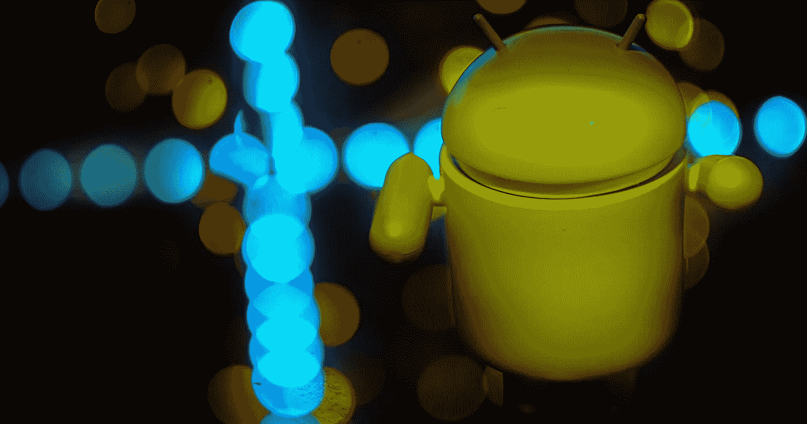
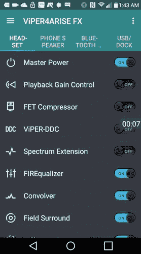
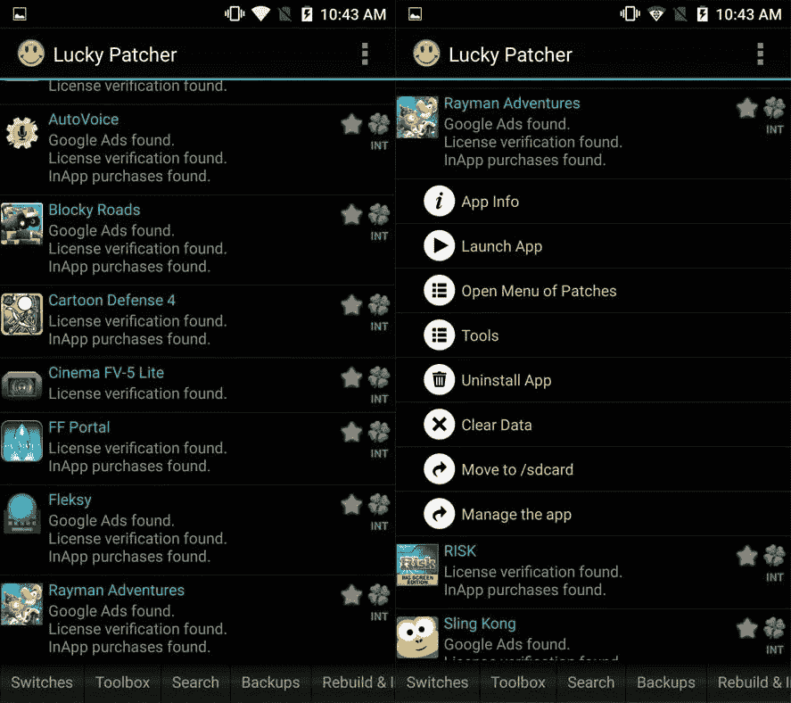
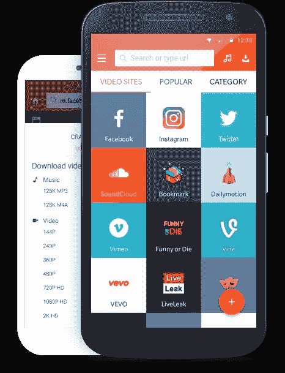
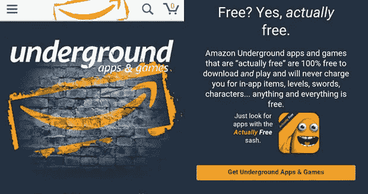
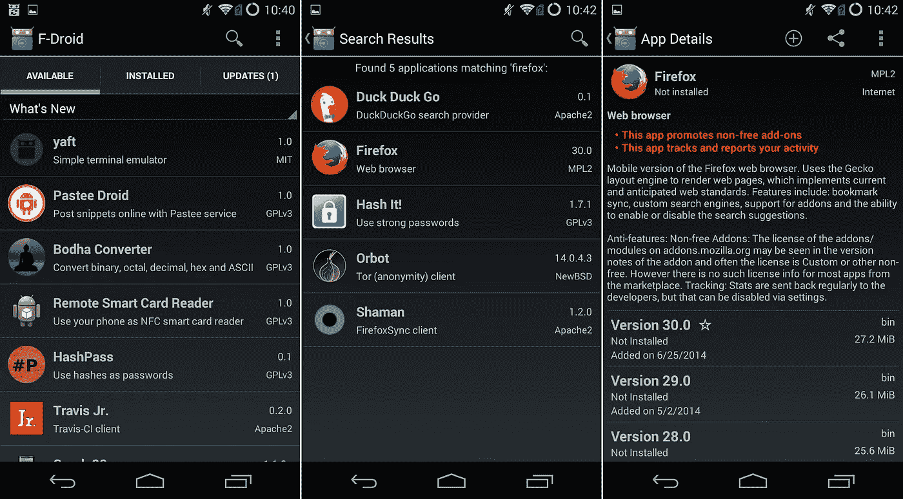
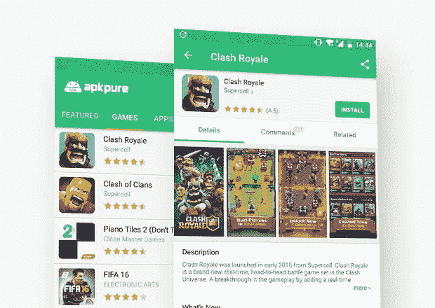
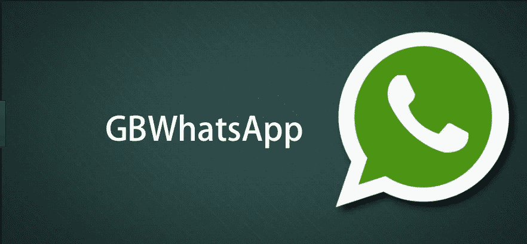
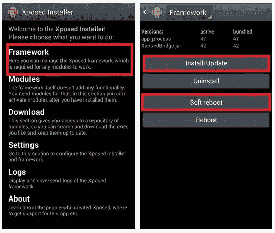
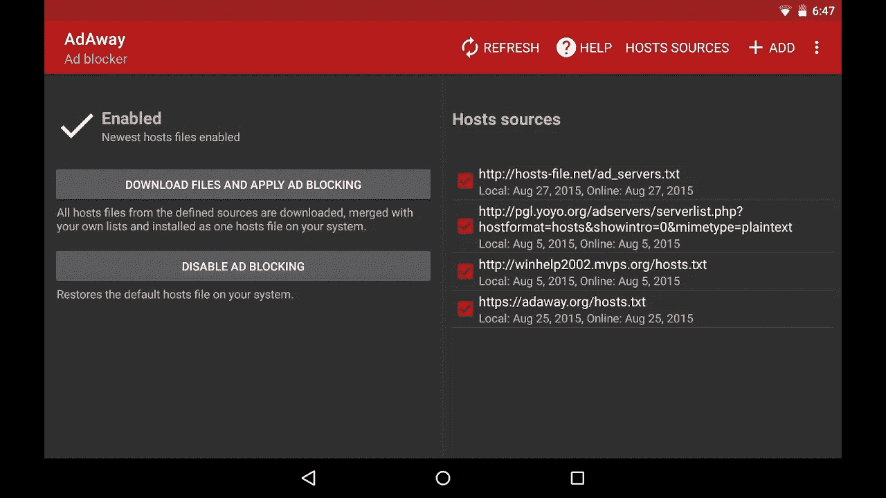

# 谷歌 Play 商店上没有的安卓应用

> 原文：<https://medium.com/hackernoon/android-applications-that-arent-available-on-google-play-store-3042335337ac>

根据 Statista 的数据，Google Play 商店上有超过 210 万个应用程序。你可以找到几乎所有东西的应用程序。然而，由于谷歌限制性的内部政策和条款，许多应用程序被禁止，许多人甚至懒得在 play store 上注册。但这并不意味着商店外的所有东西都是不好的，会损害你的智能手机。互联网有许多应用程序和网站，无论是 T2 的 Serp Api T3、seo 服务还是其他任务的工具。你甚至可以用这些应用找到虚拟女友。有很多[手机约会模拟人生](https://badboyapps.com/free-mobile-dating-simulator-for-android-and-ios/)可以让你得到一个迷人火辣的虚拟女友。也就是说，play store 之外的世界充满了许多游戏、编辑、黑客和娱乐工具。

在这篇文章中，我提供了一个应用列表，这些应用不在 play store 上，但可以让你的生活变得有趣和轻松:

**免责声明**:如果你从错误的地方下载或不正确使用，上面提到的一些应用程序可能会损害你的手机。

# 《堡垒之夜》

全世界有超过 1 . 25 亿人在玩《皇家堡垒之战》。这款游戏由 Epic 开发。2018 年 8 月，Epic 宣布推出安卓版堡垒之夜。Epic 决定绕过谷歌，不在 Play Store 上提供堡垒之夜。这一事件的潜在原因是——谷歌保留了全部销售额的 30%。这款游戏在 [Epicgames](https://www.epicgames.com/fortnite/en-US/mobile/android/get-started) 官网有售，扫描二维码即可下载。

# Viper4Android

由于未知原因，Google Play 商店已经禁止了这款应用。其中一个原因可能是—此应用程序需要太多的深层权限。这款应用由 XDA 实验室开发，可以让你调整设备的音频设置。如果你是一个音乐爱好者，这个应用程序是你的完美选择。部分功能有:
AnalogX
频谱扩展
保真度控制
扬声器优化
差分环绕/哈斯效果
x86 支持
听觉系统保护(Cure Tech+)
耳机环绕+ (VHS+)
你可以从 XDA 开发者官网下载这个应用。

# 幸运修补者

这个应用程序是一个宝石，允许你以各种方式修改其他 android 应用程序。使用这个你可以享受许多应用程序的高级版本，而不用花一分钱。但是要获得这个工具的所有功能，你需要 root 你的 android。它的一些功能是——删除谷歌广告，修改 apk，恢复和备份应用程序。可以从官网[下载这个 app](https://www.luckypatchers.com/download/) 。

# 快照管

SnapTube 是 YouTube 下载工具，可以轻松下载任何视频。请注意 Youtube 下载在美国和中国是被禁止的。 [SnapTube](https://appsaraby.com/download/snaptube) 也有子类别，包括 11 个子类别和热门和最受欢迎视频的不同部分。你也可以使用 [vidmate](https://appsaraby.com/download/vidmate) 作为替代。

# 亚马逊地下

亚马逊地下是亚马逊的官方应用商店。这款应用是 Google Play 的最大替代品。你经常可以在这里找到免费的应用程序，但你必须在 Play store 上支付一大笔费用。从网上[眼镜网店](https://www.glassesshop.com/)到交易应用，这家店应有尽有。亚马逊还根据应用程序上花费的总时间向应用程序开发者支付费用。虽然有一些地理和一些像 [Mobikora](https://appsaraby.com/download/mobikora) 这样的应用在这里不可用。手指交叉，让我们希望你足够幸运地使用这个。

# MiXPlorer

MiXplorer 是一个完整的文件管理应用程序，它非常简洁的用户界面和丰富的功能可以帮助你舒适地工作。选项卡支持和双面板模式等功能允许用户同时处理不同的文件夹。使用该应用程序，您还可以访问 MEGA、Google Drive、Dropbox 和 Onedrive 上的云文件。如果您的设备是 rooted 用户，您将获得额外的功能，如高级搜索、自定义用户界面。

# f-机器人

F-Droid 由所有开源和免费应用组成。这个应用程序有一个自由和开源软件的可安装目录。使用此功能，您还可以跟踪设备上的任何更新。如果你是一个开源爱好者，这个应用程序非常适合你。

# APKPure

APKPure App，更像是一个 Android OS 冰淇淋三明治 4.0.3 以上版本的工具集合。使用 [APKPure](https://appsaraby.com/download/apkpure) 工具，您可以免费下载不同的应用程序和游戏。这个 app 包括:XAPK 安装程序，App & APK 管理和 APK 下载器。

# GBhwhatsapp

GBhwhatsapp 是 whatsapp 的改装版。这个应用程序为用户提供了许多个性化选项。你可以自定义隐私设置，安排消息，更改 [WhatsApp group](https://socialclu.com/whatsapp-group-links/) 设置和许多其他事情。

# 暴露的框架安装程序

此应用程序允许您将附加组件(模块)应用到设备 ROM。你不必刷新你的只读存储器来获得一些特定的功能。使用 Xposed Framework Installer，您可以将特定的功能添加到您正在使用的任何设备中。最好的事情是——你甚至可以改变股票只读存储器。然而，你需要小心使用修改和调整。

# 阿达韦

以前 Adaway 可以在 playstore 上使用，但因为违反了谷歌开发者协议而被删除。Google Play store 的大部分应用都有广告。使用 Adaway，您可以从任何 android 应用程序中删除广告。请注意-这只适用于根设备。

伙计们，现在就到这里吧。这些应用程序将让您充分享受 Android 体验。只要确保你是从可靠的来源下载它们。同时，重要的是你要阅读那些吸引你的应用的详细评论。不过话说回来，在 app store 上看评论也不会有那么大帮助。在这种情况下，最好是寻找合适的、声誉好的[手机应用评测网站](https://www.mobileappdaily.com/app-review)，这些网站涵盖了所列应用的所有细节，包括正反两面。如果你有更多的建议，请在评论区告诉我。