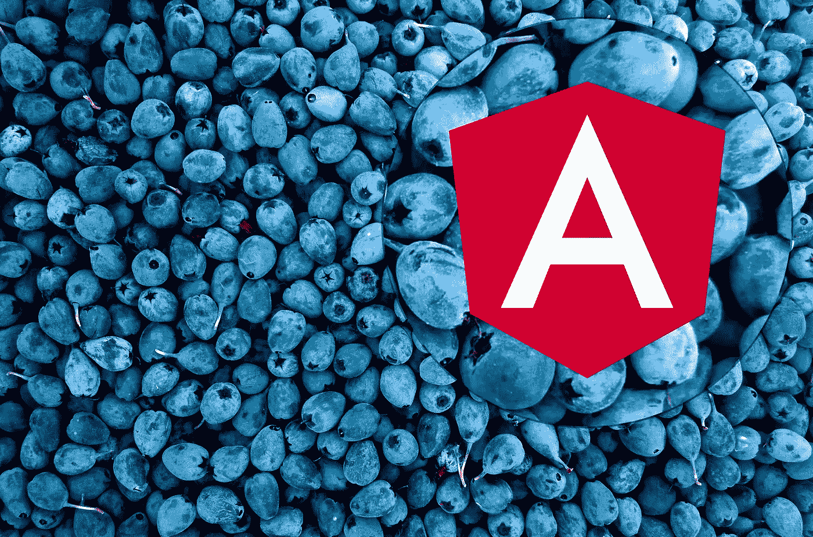
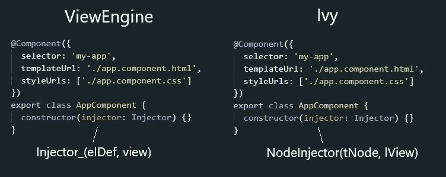

# 《角度文摘》(1 月 26 日至 3 月 7 日)

> 原文：<https://medium.com/hackernoon/angular-digest-26-january-7-march-bd973e55196f>



# 版本:

## 有角的

[Angular 7 . 2 . 4–7 . 2 . 7](https://github.com/angular/angular/blob/master/CHANGELOG.md#727-2019-02-27)—[Bazel](https://hackernoon.com/tagged/bazel)原理图和渲染器 Ivy 即将发布。

**Angular CLI** [Angular CLI 7 . 3 . 0–7 . 3 . 4](https://github.com/angular/angular-cli/releases/tag/v7.3.4)—新选项**es5 浏览器支持**，使得新的[浏览器](https://hackernoon.com/tagged/browsers)不加载未使用的 polyfills。

**离子型**
[离子型 4.1.0 氢型](https://github.com/ionic-team/ionic/releases/tag/v4.1.0)

**NGRX** [NGRX 7 . 2 . 0–7 . 3 . 0](https://github.com/ngrx/platform/blob/master/CHANGELOG.md#730-2019-02-27)—改进**原理图**。

**react vex** [RxJS 6 . 4 . 0](https://github.com/ReactiveX/rxjs/blob/master/CHANGELOG.md#640-2019-01-30)—fixed**share replay**

# 以打字打的文件

[打字稿 3 . 3 . 3](https://github.com/Microsoft/TypeScript/releases/tag/v3.3.3)
打字稿 3.3.3333 — lol。

# 工具

[MediumEditor](https://github.com/yabwe/medium-editor) —非常简单**所见即所得编辑器**，轻量级，跨浏览器支持。

[story book](https://storybook.js.org/)——是一个开源工具，用于开发独立于 React、Vue 和 Angular 的 UI 组件。它使构建令人惊叹的 ui 变得有条理和高效。

[Sourcegraph](https://chrome.google.com/webstore/detail/sourcegraph/dgjhfomjieaadpoljlnidmbgkdffpack/related?hl=en) —突出显示 GitHub 中的类型脚本代码的 chrome 扩展。

[类型覆盖](https://github.com/plantain-00/type-coverage) —检查类型脚本代码类型覆盖的 CLI 工具

[NGX 权限](https://github.com/AlexKhymenko/ngx-permissions) —基于权限和角色的访问控制，适用于您的 angular(angular 2，4，5，6，7+)应用程序(AOT，惰性模块兼容

# 角度的虚拟 DOM

非常新鲜的版本，但是你可以试试:

```
[@Component](http://twitter.com/Component)({ template: '' })
export class AppComponent extends Renderable {
  render() {
    return (<h1>Hello World!</h1>)
  }
}
```

[](https://github.com/trotyl/ng-vdom) [## trotyl/ng-vdom

### (开发者预览版)Angular 的虚拟 DOM 扩展，也可以作为 React bridge 使用。- trotyl/ng-vdom

github.com](https://github.com/trotyl/ng-vdom) 

# 你不知道的 5 个 Angular CLI 特性

[](https://blog.mgechev.com/2019/02/06/5-angular-cli-features/) [## 你不知道的 5 个 Angular CLI 特性

### 我使用 Angular 已经很多年了，不仅是框架本身，还有整个开发平台，包括…

blog.mgechev.com](https://blog.mgechev.com/2019/02/06/5-angular-cli-features/) 

# 让我们学习开源

Angular 如何处理 **foo + bar | baz？**

*   编译器的前端
*   递归下降分析
*   访问者模式

[](https://github.com/angular/angular/tree/master/packages/compiler/src/expression_parser) [## 角度/角度

### 一个框架。移动和桌面。在 GitHub 上创建一个帐户，为 angle/angle 开发做贡献。

github.com](https://github.com/angular/angular/tree/master/packages/compiler/src/expression_parser) 

# 带角度 CDK 的工具提示

**实际使用:@** [**角度**](https://habr.com/ru/users/angular/) **/cdk** :叠加+门户=工具提示。

[](https://blog.angularindepth.com/building-tooltips-for-angular-3cdaac16d138) [## 角度的建筑工具提示

### 不久前，我发表了一篇关于星云中整合角 CDK 的文章——角…

blog.angularindepth.com](https://blog.angularindepth.com/building-tooltips-for-angular-3cdaac16d138) 

# 角 8 和常春藤

艾薇什么时候能准备好？计划？

[](https://blog.angular.io/a-plan-for-version-8-0-and-ivy-b3318dfc19f7) [## 8.0 版和 Ivy 的计划

### "艾薇什么时候能准备好？"是我们每周都会被问到的问题。这里有一个关于版本进展的更新…

blog.angular.io](https://blog.angular.io/a-plan-for-version-8-0-and-ivy-b3318dfc19f7) 

# 角度 DI



*   **DI** 是如何在 **Angular Ivy** 中实现的
*   什么是**节点注入器**

[](https://blog.angularindepth.com/angular-di-getting-to-know-the-ivy-nodeinjector-33b815642a8e) [## Angular DI:了解 Ivy 节点注入器

### 在本文中，我们将研究一个新的角度节点注入器，它大量使用 bloom filter 来检索一个

blog.angularindepth.com](https://blog.angularindepth.com/angular-di-getting-to-know-the-ivy-nodeinjector-33b815642a8e) 

# 高级打字稿模式

让我们练习基本类型，成为一名打字高手

[](https://medium.freecodecamp.org/typescript-curry-ramda-types-f747e99744ab) [## 如何掌握高级打字稿模式

### 了解如何为 curry 和 Ramda 创建类型

medium.freecodecamp.org](https://medium.freecodecamp.org/typescript-curry-ramda-types-f747e99744ab) 

# 开发快速代码

*   什么是大 **O**
*   **O(N )** 和 **O(logN)** 有什么区别
*   什么是二分搜索法？

[](/@bretcameron/ace-your-coding-interview-by-understanding-big-o-notation-and-write-faster-code-6b60bd498040) [## 通过理解大 O 符号来赢得编码面试——并编写更快的代码

### 世界顶级科技公司测试候选人的算法知识以及这些算法的运行速度。这就是大…

medium.com](/@bretcameron/ace-your-coding-interview-by-understanding-big-o-notation-and-write-faster-code-6b60bd498040) 

# RxJS 节流


使用 RxJS 限制来自多个用户的通知，或者' **groupBy** '操作符如何在幕后工作。

[](https://blog.angularindepth.com/throttling-notifications-from-multiple-users-with-rxjs-4d90473f34aa) [## 使用 RxJS 限制来自多个用户的通知

### 或者“groupBy”操作符如何在幕后工作。

blog.angularindepth.com](https://blog.angularindepth.com/throttling-notifications-from-multiple-users-with-rxjs-4d90473f34aa) 

# 角反应形式

*   确认
*   更新于
*   防止无限循环

[](https://netbasal.com/angular-reactive-forms-tips-and-tricks-bb0c85400b58) [## 角反应形式:提示和技巧

### 角反应形式:提示和技巧

角反应形式:尖端和 Tricksnetbasal.com](https://netbasal.com/angular-reactive-forms-tips-and-tricks-bb0c85400b58) 

原帖:[https://habr.com/ru/post/442870/](https://habr.com/ru/post/442870/)