# angular vs React vs Vue:2020 最好选择哪个？(已更新)

> 原文：<https://medium.com/hackernoon/angular-vs-react-vs-vue-which-is-the-best-choice-for-2019-16ce0deb3847>

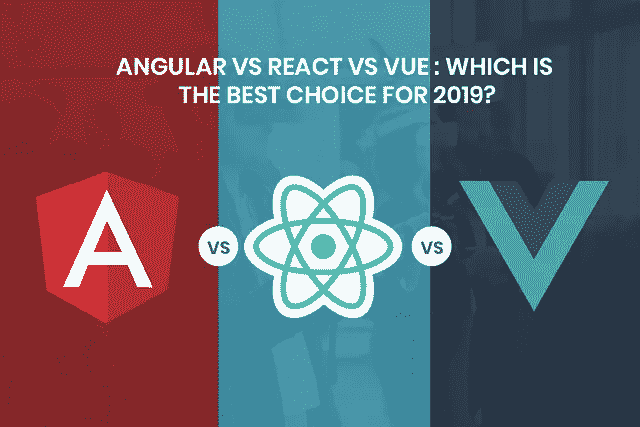

在 2020 年，想象没有 HTML、CSS 和 Javascript 的 web 开发是不切实际的。Javascript 是 web 应用前端开发的灵魂。如果您登陆了这个页面，我假设您对 Javascript 编程语言的不同框架和库感到困惑。

> 企业和软件开发人员最常见的一些问题是:

> Angular 或 React 或 Vue:哪个更适合我的下一个 web app 开发项目？
> 
> 哪个 Javascript 框架或库提供了最好的性能？
> 
> 哪个最适合我的小 web 应用？
> 
> 三个 Javascript 框架/库哪个最靠谱？
> 
> 哪个框架/库适合小尺寸或大尺寸应用？

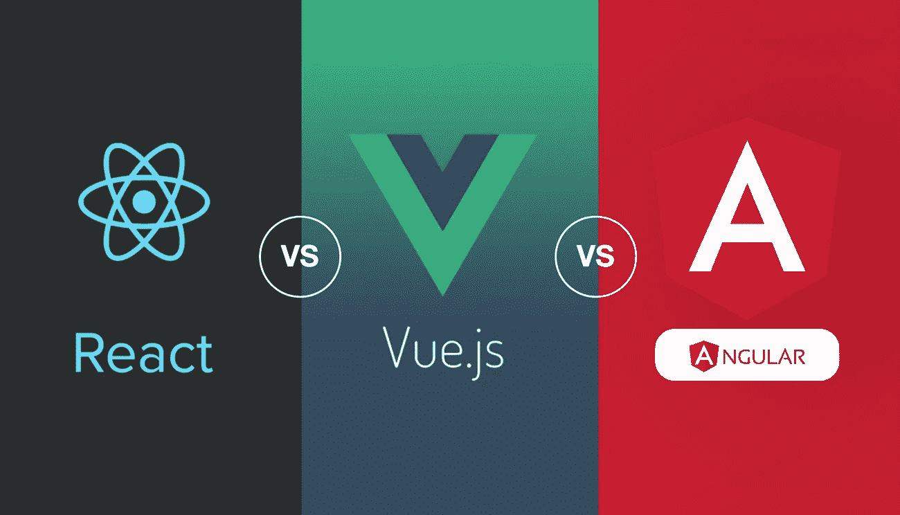

Image Source: HyperionDev

> 在博客的最后，你将能够决定 Angular vs React vs Vue 哪个是最适合你的项目的编程工具。所以让我们深入比较这三个 Javascript 框架&库，选出 2020 年最好的一个！

# **1。Angular vs React vs Vue:人气(根据栈溢出，npm 和 Google 趋势)**

## **概要:**

***根据栈溢出统计和谷歌趋势，React 更受欢迎。***

Javascript 编程语言的用户界面框架和库循环工作。每隔六个月，他们会换个位置，一个新的会出现。React 和 angular 是过去几年流行的框架。

## **#1 Stat** 根据[栈溢出调查](https://insights.stackoverflow.com/survey/2019)，React.js 是最受喜爱的框架，其次是 Vue.js。

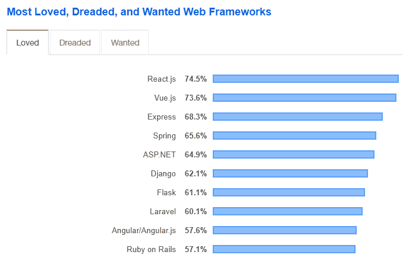

毫无疑问，Vue.js 自 2014 年上线以来，已经获得了显著的人气。这一转变发生在 2016 年年中，并在当代得到了完美的延续。仍预计这一框架将在未来几年上升更多。

## 如果你看看谷歌趋势过去 12 个月的搜索趋势，你会发现事情并非如此。

*看下图，Vue.js 远远落后 angular 和 react。React 是搜索中最受欢迎的。*

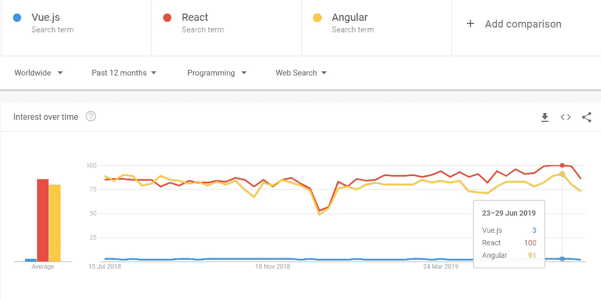

下面是 Angular vs react vs vue 的下载量和星级的 [npm 趋势](https://www.npmtrends.com/react-vs-vue-vs-@angular/core)的图形表示。它清楚地显示在顶部的反应，其次是角，然后是 vue。但是当我们看星星时，最低的是 angular，最高的是 vue，然后是 react。

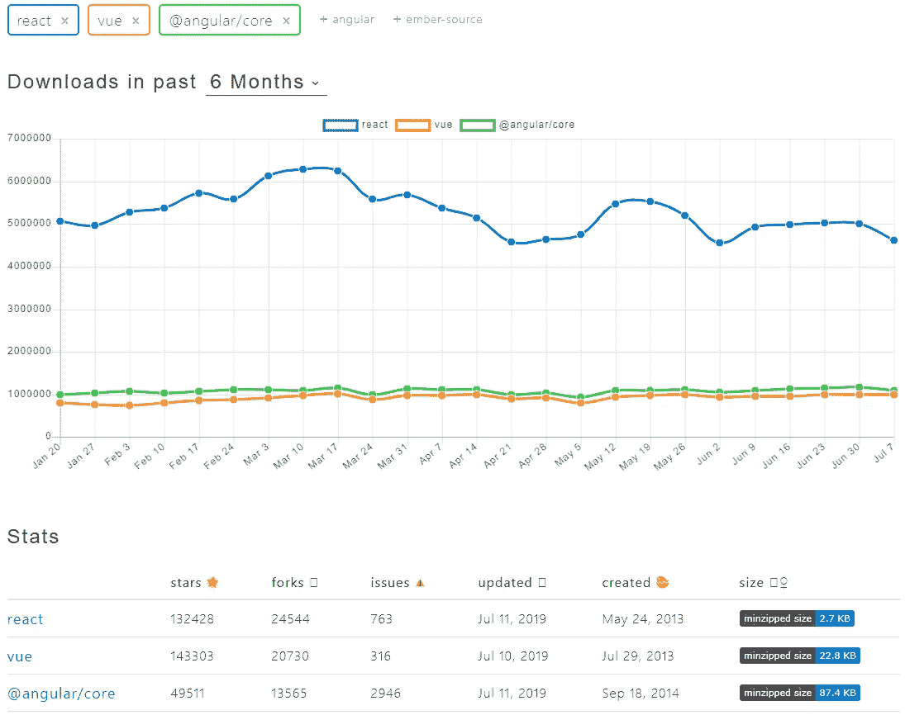

虽然很明显 React 是 2019 年最受喜爱和下载的框架，但这并不意味着它是最好的。有许多其他因素将决定哪一个框架最适合特定类型的 [**web 开发项目**](https://www.xicom.biz/cdn/web-development.html) 。

# **2。角度 vs 反应 vs Vue:背景介绍**

> 在我们进入关于这三个 Javascript 框架或库的更具体的细节之前，让我们简单介绍一下 Angular vs React vs Vue。

## **棱角分明:**

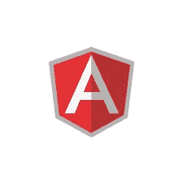

由谷歌于 2010 年发布。这是一个基于类型脚本的 javascript 框架。它先于我们在这篇博客中讨论的其他两个 Javascript 框架发布。今天它被称为 Angular，但在 2016 年之前，它的名字后面有一个后缀“JS”。

Angular 2+发布后 JS 就从名字里掉了。**2019 年 5 月 28 日，其最新版本 Angular 8.0.0 发布**。谷歌和 Wix 是使用 Angular 的最受欢迎的公司之一。

## **反应:**

由脸书于 2013 年发布。多用于高流量网站。它是在脸书广告开始获得流量并面临编码和维护问题时开发的，这些问题描述了某些问题。其最新版本 16.8.6 于 2019 年 5 月 6 日发布。

这个 Javascript 库的发布解决了这些问题。 ***Whatsapp、Instagram Paypal、Glassdoor、BBC 都是使用 React 的热门公司。它是高度动态的，为创建交互式用户界面提供了强大的支持。***

## **Vue:**

2014 年发布的渐进式 Javascript 框架，由 React 和 Angular 等知名公司开发。事实上，它是由谷歌的前工程师尤雨溪创建的。它越来越受欢迎。它的最新版本；版本 2.6.10 于 2019 年 3 月 20 日发布。

它是 Javascript 框架家族中最年轻的成员。它实际上消除了其他框架的缺点，为软件开发人员提供了更高层次的便利。像 GitLab，阿里巴巴这样的网站都在用 Vue。

# **3。角度对比反应对比 Vue:性能**

## **概要:**

有一种东西叫做 DOM，可以理解为 UI，那就是你的应用程序的用户界面。每当您更新用户界面时，DOM 都会发生变化。这表示应用程序中所做的更改。

> 它可以以两种方式使用，要么作为虚拟 DOM，要么作为真实 DOM。框架/库的性能受它们的影响很大。让我们看看 Angular vs React vs Vue 2020 使用什么来了解它们的性能水平:

## **棱角分明:**

Javascript 的这个框架使用真正的 DOM。这是非常难以处理的，因为如果您丢失了流程，您将不得不深入到代码中去找出问题所在。这既费时，又有吸引大量 bug 的风险。

Angular 使用真实 DOM 会影响它的性能和制作动态软件应用程序的能力。此外，它还会导致这个 Javascript 框架的性能降低。

## **反应:**

这个 Javascript 库正在使用虚拟 DOM。它不是特定于浏览器的轻量级产品。它在 react 包中免费提供，消除了 real DOM 性能缓慢的问题。

> 这极大地提高了 javascript 框架/库的性能，并使 React 大受欢迎。

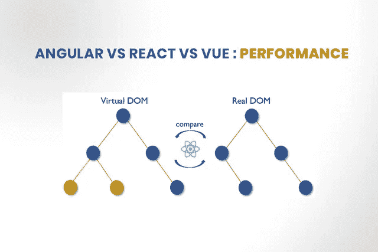

## **Vue:**

Vue 继承了之前框架的所有优点。基于同样的概念，Vue 使用虚拟 DOM 作为 React 的一个被采用的概念。这确保了更快和无错误的性能。

***P.S.*** *虽然很多开发者在使用 React 和 Vue 的虚拟 DOM 时发现问题。他们发现在真正的 DOM 上进行选择不够有效。*

# **4。角度对比反应对比 Vue:主要使用案例**

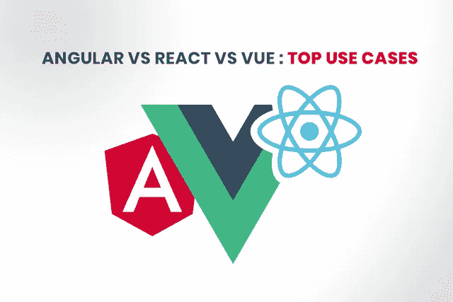

Javascript 被顶尖公司用来开发他们的产品。最好的[**软件开发服务**](https://www.xicom.biz/cdn/software-development.html) 主要围绕 Javascript 框架。这三个框架和库被不同的组织使用，比如谷歌和脸书。

> 让我们来看看一些知名的名字正在使用 Angular vs react vs vue:

## **棱角分明:**

*   它是由谷歌开发的，并在谷歌 AdWords 应用程序中使用
*   出版界的领先公司《卫报》
*   **Weather.com**，全球最常用的天气预报网站

## **做出反应:**

*   它是为脸书广告活动的维护和编码而开发的。以及其他一些脸书产品。
*   **Twitter，**一个全球流行的社交网站
*   高度流行和高流量的消息应用程序， **Whatsapp**
*   照片分享知名社交媒体平台 **Instagram**

## **Vue:**

*   **9Gag，**分享热门内容的社交网站
*   **GitLab** ，一个允许团队开发或复制代码的库管理器

# **5。Angular vs React vs Vue:社区支持**

## **概要:**

Angular 和 React 拥有强大的社区基础，有脸书和谷歌等顶级公司的支持。但是，vue 在开源社区仍然很受欢迎。

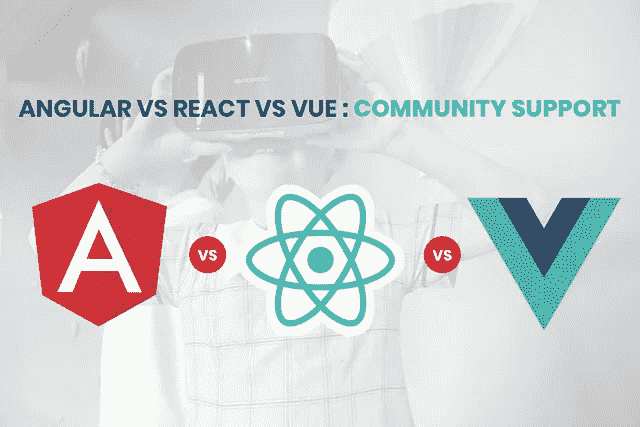

## **棱角分明**

它是由著名的市场领导者谷歌推出的。此外，该组织将这个 Javascript 框架用于其 Google Adwords 应用程序。这增加了 Angular 的真实性，自其推出以来，为其提供了强大的社区支持。

## **反应过来**

它是由脸书开发的，用于支持其广告活动的维护和编码。脸书大学的一组工程师仍在努力改进它。脸书已经对它的几种产品进行了编码，并对其进行了大量投资。这就是 React 在开发者世界中不断增长的可靠性背后的原因。

## **Vue**

与 Angular vs React 不同，Vue 没有任何顶级公司的支持。这应该会导致不太受欢迎，但事实上，这个 Javascript 框架在开源社区中获得了惊人的受欢迎程度。

# **6。角度 vs 反应 vs Vue:框架尺寸**

## 总结:

*Vue 是所有中最轻的。Vue 和 React 适用于轻型应用，而 Angular 适用于重型应用。*

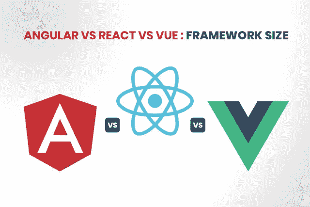

> 简单来说，Angular、Vue、React 框架和库按照大小降序排列分别是:

> 角度(大约 500 KB 大小)
> 
> 反应(大约 100 KB 大小)
> 
> Vue(大约 80 Kb 大小)

> 现在让我们来理解这些框架大小对您企业的软件开发项目的影响:

## **角度**

Angular 为其开发者提供了很多东西，从模板到测试工具。这显然需要空间，这使得它的尺寸很大。这使得它不适合轻型应用。

## **反应**

它适用于轻型应用，因为它不提供很像角。其实 React 并不是 Angular 那样的框架。这就是为什么它需要其他库的支持来完成路由等任务。

## **Vue**

它是我们在这个博客中讨论的其他框架和库中最小的一个。因此，非常适合轻量级应用程序的开发。如果您需要小于 Vue 的库，则必须选择 Preact。

# **7。角度对比反应对比 Vue:学习曲线**

## **概要:**

*React 最被开发者首选使用和学习，其次是 Vue，然后是 Angular。*

用户用特定编程语言编写代码的能力被称为学习曲线。 ***说到 Angular vs react vs Vue，那么 Angular 在与其他两者的比较中处于劣势。***

这是因为 Vue 和 React 不需要雇佣精通 typescript 的 web 开发人员。但在这两者中，Vue 占了上风，因为开发者认为它更友好。

根据 Stateofjs research 提供的统计数据，当被调查者被问及:“用过，还会再用吗”时，Vue 的得分高于 angular。有许多选项供开发者选择，这些选项被视为用于比较的参数。

> 以下是他们的参数，开发者的投票结果如下图所示:

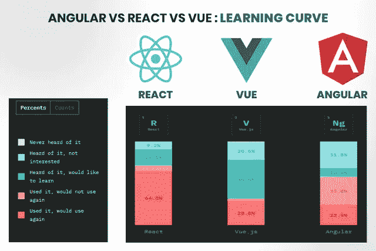

> 如您所见，Vue 获得了“听说过，想学习”选项的最高票数它清楚地显示了这个 JS 库未来的光明学习曲线。除此之外，该图还清晰地展示了 Angular 的流行程度逐渐下降。

# **8。角度 vs 反应 vs Vue:灵活性**

## 总结:

*棱角分明——提供你需要的一切但不太灵活，React——最灵活，Vue——不太固执己见或灵活。*

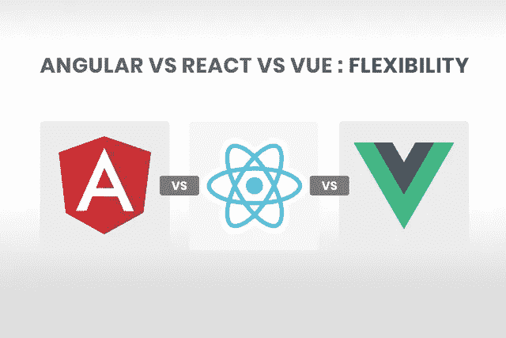

**有角度的**

它提供了从路由到模板的一切。您不必使用任何其他工具来开发您的应用程序。根据你的观点，这可能是好的也可能是坏的。

它对如何构建应用程序有自己的看法。您不需要选择工艺路线库。你可以用 Angular 包中提供的所有东西从编码过程开始。

**做出反应**

与 Angular 不同，它在官方 React 库中并没有提供很多。这为您提供了选择编程工具的自由。换句话说，它不像棱角分明那样固执己见。

像 react routing 这样的第三方解决方案可以与这个 javascript 框架集成。 ***除此之外你还可以使用 MobX 和 Redux 来支持办公管理任务。***

如果你雇佣经验丰富的最好的软件开发人员，那么他们会非常享受这种灵活性。此外，您将获得为您的业务开发的令人惊叹的动态应用程序。

**Vue**

Vue 框架和 react 框架一样简单。但是 Vue 生态系统在其官方网站上有很多东西可以提供给它的开发者。一些附加组件是用于路由的 Vue 路由器和用于状态管理的 Vuex。

它还有一个 vue 服务器端渲染来启动应用程序的服务器端开发。因此，它不像 Angular 那样固执己见，也不像 React 那样灵活。

# **结论:**

> 在对 Angular、react 和 Vue 进行了深入的阅读和研究之后，我们可以总结出这四点:

> Vue 和 React 提供了比 Angular 更好的性能和灵活性。
> 
> Vue 和 react 更适合轻量级应用，angular 最适合大型 UI 应用。
> 
> Angular 非常固执己见，与 Vue 和 React 不同，它在包中提供了从路由、模板到测试工具的一切。
> 
> Vue 是 Javascript 中最受欢迎、最受喜爱、最具成长性的框架。

希望看完这篇 Angular vs React vs Vue 的完整对比，你清楚最适合你下一个 [**软件 app 开发**](https://www.xicom.biz/cdn/software-development.html) 项目的 Javascript 框架/库。

请确保您选择的是符合您业务需求的产品。如果你有一个想法，但仍然不知道这三个选项中哪一个更好，那么请咨询印度最好的 [**网站开发公司**](https://www.xicom.biz/cdn/web-development.html) 。

> **你可以在下面的评论区分享更多信息。我们可以有一个健康的讨论来丰富我们关于这些蓬勃发展的编程工具的知识库。**