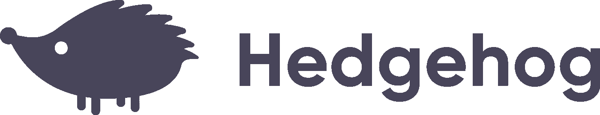
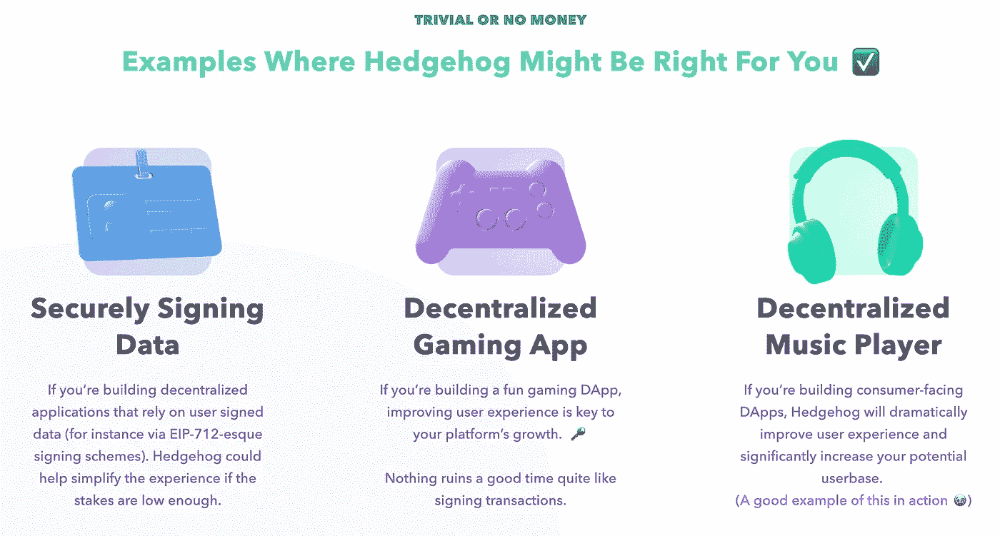
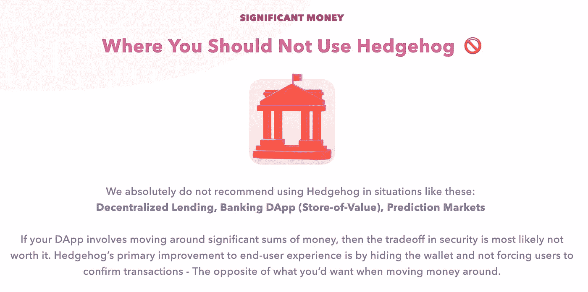

# 🦔奥迪斯宣布刺猬:建立你的 DApps 一样的应用程序

> 原文：<https://medium.com/hackernoon/announcing-audius-hedgehog-build-your-dapps-like-apps-f83001ab7e8a>

**去中心化不一定要以牺牲用户体验为代价**

> Hedgehog 是由 [Audius](http://audius.co) 开发的，这是一个分散的开源音乐流媒体服务，目前处于私人测试阶段。奥迪斯正在通过创建一个由艺术家、粉丝和开发者组成的分散社区来重塑音乐产业，这些人公开分享和捍卫世界音乐。

像 MetaMask 这样的消费者网络 3 提供商对待每一笔交易都像是在花掉你一生的积蓄。但是你会像使用银行账户一样小心翼翼地使用你口袋里的零钱吗？

## 今天，Audius 推出了 Hedgehog，以显著改善低财务价值用例中的用户体验。

Hedgehog 是一个开源的客户端以太坊钱包，使用用户名和密码，不提示用户确认交易。它允许用户与你的 DApp 互动，就像他们与任何其他网站互动一样，不需要扩展，*不需要*集中控制私钥。

MetaMask 在涉及大量资金的情况下仍然是最有意义的，但我们相信 Hedgehog 将为那些关注用户体验和采用的人提供一个重要的替代选择。

# 为什么是刺猬？

如今使用加密应用很难。真的很难。

对于刚接触加密的用户，以下是一组常见的步骤:

1.  安装元掩码
2.  设置元掩码，写下你的钱包种子并把它存放在保险箱里(有人这样做吗？)
3.  注册比特币基地，包括完整的 KYC /身份验证
4.  购买 ETH
5.  将 ETH 发送到您的 MetaMask 钱包
6.  现在回到 DApp 并报名…

并且*上帝保佑*你想在另一台设备上使用 DApp……用户必须再次安装扩展，并在新设备上重新输入第二步的钱包种子。

> 对于一些 DApps，在
> 
> 他们注册流程中的“安装元掩码”步骤超过了 90%。

通过将 Hedgehog 与 EIP-712 签名和一个交易中继服务结合起来，代表您的用户不可信地支付汽油费用，[正如我们在 Audius](https://www.youtube.com/watch?v=E50yrZKJn0Q) 所做的那样，这个**入职流程变成只有一个步骤:**

1.  用户用用户名(或电子邮件)和密码注册

用户永远不需要看到加密的参与，但仍然能够分享分散网络的好处。

# 什么时候不用刺猬

高财务价值的用例不太适合这种方法。对于正在阅读本文的密码学家和有安全意识的人来说，你会明白天下没有免费的午餐，为了提高可用性，Hedgehog 不会提示用户批准交易。作为一名 DApp 开发人员，在选择集成 Hedgehog 之前，您必须了解这些权衡。

使用 Hedgehog 的 DApps 也应该考虑支持第三方 web3 提供商，就像我们在 Audius 所做的那样，如果用户不愿意放弃交易签名控制，就为他们提供升级途径或替代方案。Hedgehog 旨在给用户另一种选择，而不是剥夺用户选择如何与 web3 产品交互的能力。

# 它是如何工作的？

刺猬活在你的前端 Javascript 代码里。用户输入用户名(或电子邮件)和密码，用于保护一组加密的 auth 工件，这些工件在客户端生成，并存储在浏览器的本地存储和应用程序开发人员的服务器上。通过这种方式，可以在辅助设备上检索和使用加密的 auth 工件，而无需集中保管和控制私钥。

有了 Hedgehog，我们很高兴向非加密领域的其他人开放去中心化的好处。我们的希望是，在未来，数百万人将使用 DApps，甚至不知道 crypto 在幕后运行。

更多详情请查看[刺猬网站](http://hedgehog.audius.co)和 [Github](https://github.com/AudiusProject/hedgehog) 。

