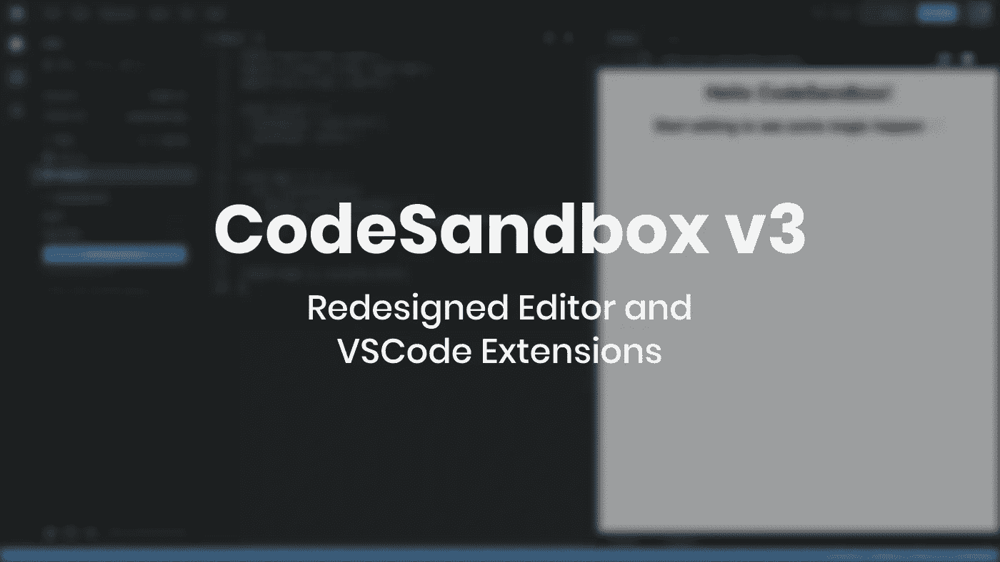
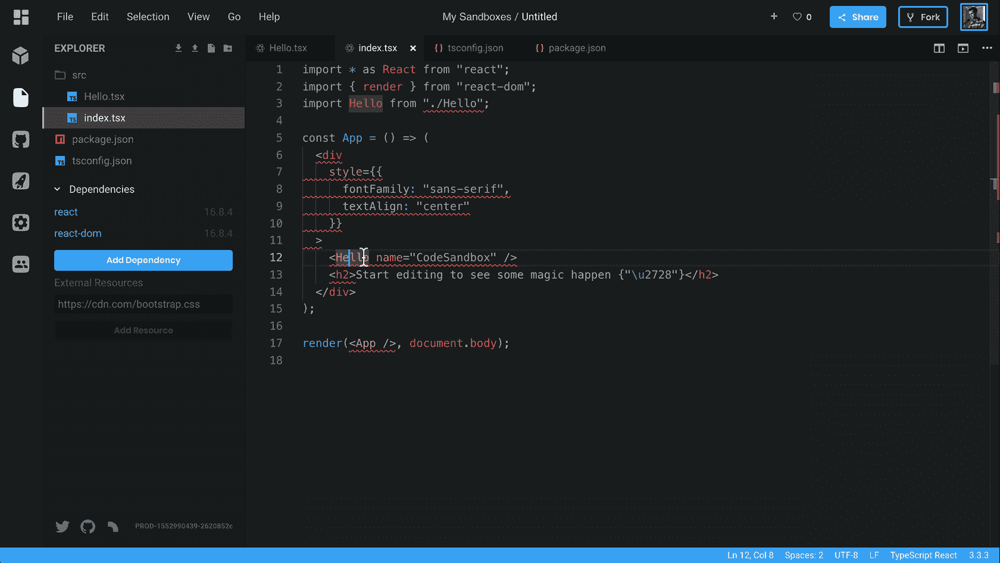
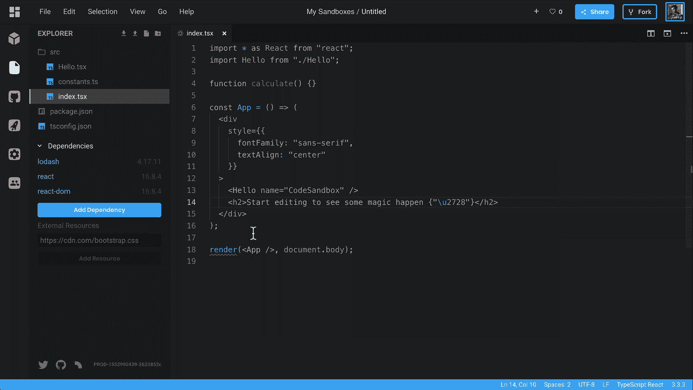
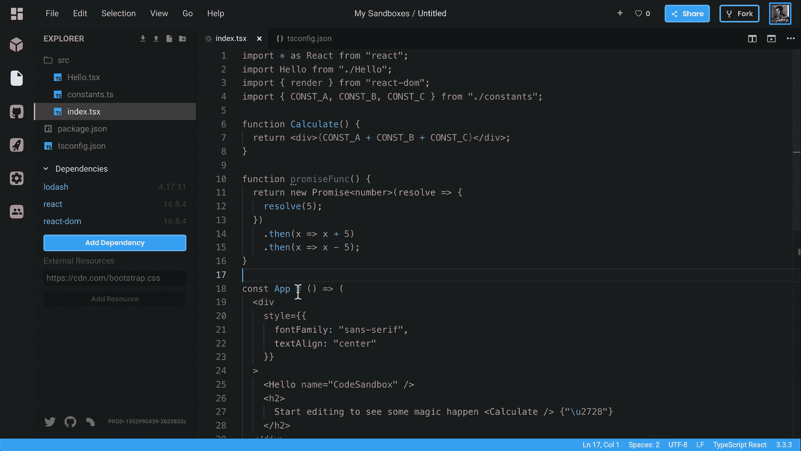
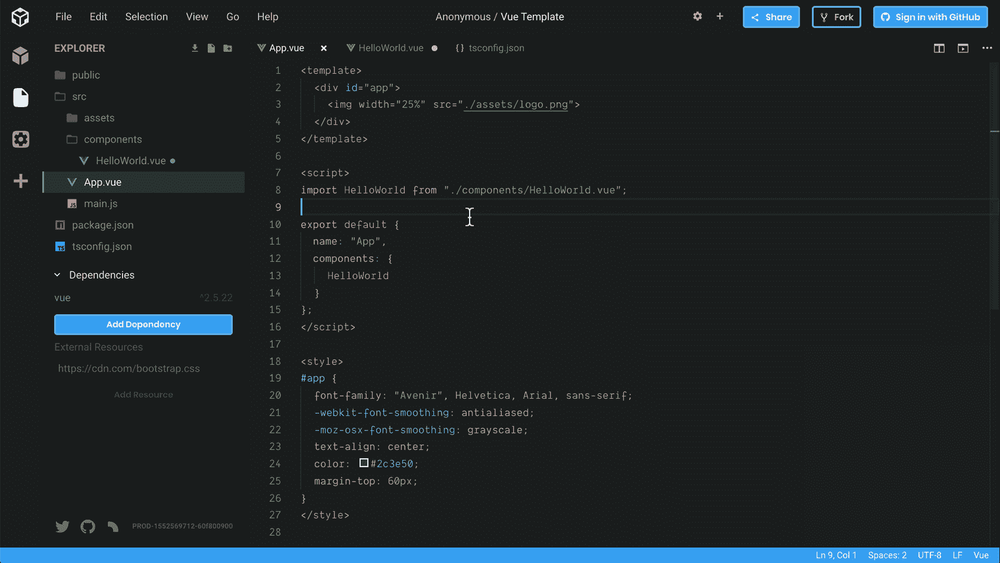
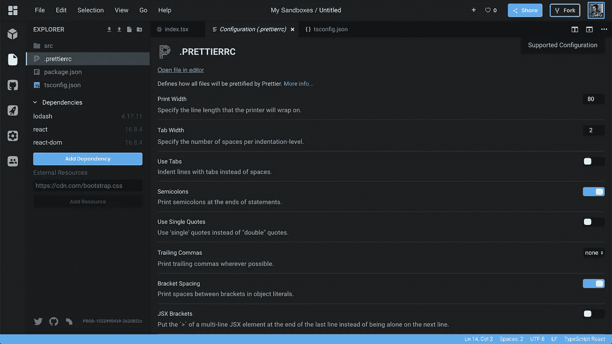
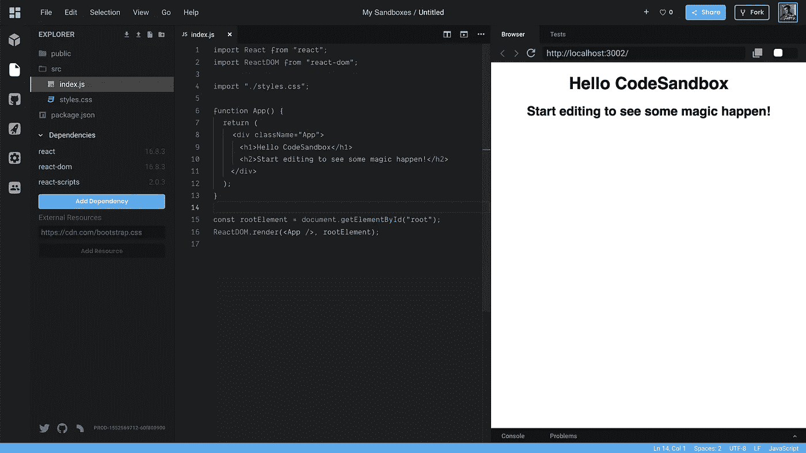
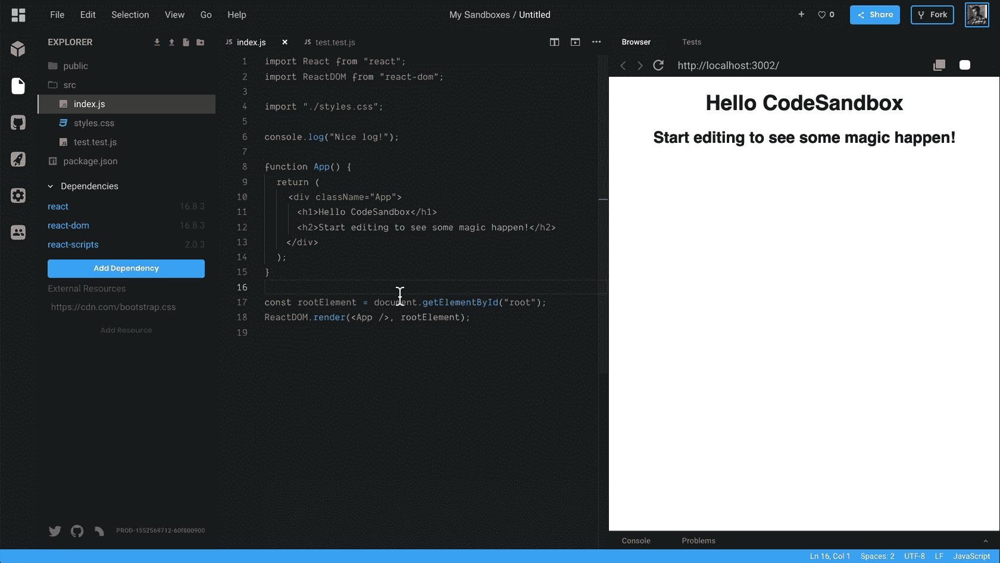
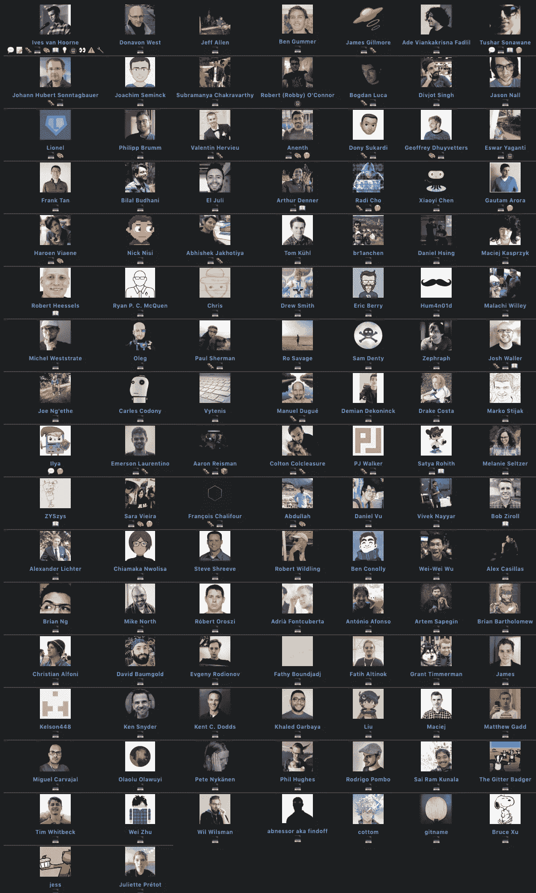

# 宣布 CodeSandbox v3

> 原文：<https://medium.com/hackernoon/announcing-codesandbox-v3-4febbaba1963>

我们回来了，带来了迄今为止最大的更新之一！这与一年前的 [CodeSandbox 2.5 更新非常相似。它包括 VSCode 扩展、许多设计调整和一个新的 devtool 面板。从现在开始，CodeSandbox](https://hackernoon.com/announcing-codesandbox-2-5-be767d15ffd) 会变得更加完美。我们开始吧！

# VSCode 集成

10 月，我们[发布了一个实验版本的 VSCode](https://mobile.twitter.com/CompuIves/status/1052594462768148480) ，你可以根据自己的喜好打开它。这用 VSCode 取代了 CodeSandbox 中的核心编辑器，为我们提供了按键绑定、用户代码片段、命令、编辑器网格视图以及来自 VSCode 的更多内容。

自 10 月以来，我们一直在修复一堆错误，并改善了总体集成。从现在开始，我们将把 VSCode 作为 CodeSandbox 中唯一的编辑器运行，因此，我们决定给编辑器一个新的外观！以下是新集成增加的内容:

## 扩展支持

我们现在支持 VSCode 扩展！这种集成很酷的一点是一切都在浏览器中运行。我们不是生成节点进程，而是用像`fs`、`net`和`module`这样的存根节点模块来生成 web workers。这意味着延迟更少，并且我们不需要为 VSCode 运行服务器。在所有剩余的版本发布之后，我会写一篇更好的文章来说明这是如何工作的。

最初，我们将支持一个预定义的扩展列表，我们将逐渐开放每个人添加和安装自己的扩展的可能性。

VSCode Extensions 附带了许多新功能，我想强调一些我觉得不错的地方:

**本机 TypeScript 类型检查** TypeScript 扩展的运行与本地 VSCode 安装完全相同，它现在读取`tsconfig.json`，将给出相同的自动完成，并且它运行最新的 TypeScript 版本。

**自动导入** 

**重构支持
工作原理完全一样！**

**VIM 扩展** 默认情况下，我们还包含了 [VSCodeVim](https://github.com/VSCodeVim/Vim) 扩展，你可以通过打开首选项并进入编辑器来启用它。

我们还从源代码中运行了 [Vetur](https://github.com/vuejs/vetur) 扩展，它提供了与 VSCode 相同的自动完成、林挺和美化功能。它真的很强大，这也包括最近在模板中添加的自动完成功能。

## 微小的改进

我们还使用新的扩展添加了 graphql、styled-components 和 yarn.lock 语法高亮/自动补全。生活质量的小改善！

## VSCode 中的现有功能

以前不起作用的功能，如配置 UI 和图像查看器，现在也可以在 VSCode 中工作。我们添加了一些在 React 中实际呈现的自定义编辑器类型，这相当有趣。我们现在在 React 应用程序中挂载 VSCode，并且在 VSCode 视图中挂载 React。

# 新设计

由于我们现在完全依赖于 VSCode，是时候调整设计以更好地适应这个代码编辑器了。我们在许多方面调整了设计，给人一种更连贯、更简洁的感觉。我将一个一个地看这些变化。

The new design!

## Devtool 视图

浏览器预览变得多功能了！我们在预览(devtool)视图中添加了选项卡，您可以使用这些选项卡在不同的 dev tool 之间切换。Browser 是默认的 devtool，但是如果你认为控制台更适合你的例子，你可以把标签拖到第一个地方，让它成为默认的！

Changing the tabs of the devtools!

我们认为这个新的 devtool 窗格将使人们更容易演示测试或控制台输出之类的东西。这也会影响嵌入。这是一个嵌入，控制台窗格作为第一个选项卡。期待在未来看到更多的 devtools 的加入！

## 菜单栏和状态栏

编辑器外观混乱的一个重要原因是标题。按钮太多了，很难找到你要找的按钮。我们决定改变这一点，去掉一堆按钮，把它们放在你们很多人都熟悉的菜单下:菜单栏！我们移除了所有与编辑体验无关的按钮(谁会从编辑器中“浏览”呢？)并将它们放在菜单栏中。

我们还添加了一个状态栏，例如，当我们添加了扩展和对图像视图的支持时，状态栏的功能变得更加有用。我们计划在未来的 CodeSandbox 集成中更多地使用这个状态栏。

状态栏和菜单栏都直接取自 VSCode！这是使用 VSCode 作为单一编辑器的优势之一。

## 颜色和主题

除了新的 UI 部件，我们还有一个新的颜色主题和新的图标。您可以期待在未来的 VSCode marketplace 中看到 CodeSandbox 颜色主题！

## 混乱的部分

以前，当你查看不属于你的沙盒时，我们会隐藏活动栏(最左边的栏)。我们已经恢复了这一点，当人们第一次看到 CodeSandbox 时，他们变得非常困惑。

# 结论

我希望你和我一样对这个更新感到兴奋！我们在这方面已经工作了很长时间，现在我们可以向每个人展示它，这太棒了。让我们知道你的想法！有没有发现什么没用的？请让我们知道我们的回购:[https://github.com/CompuIves/codesandbox-client](https://github.com/CompuIves/codesandbox-client)。

也非常感谢所有为 CodeSandbox 做出贡献的人，我们已经有 114 个了！列表几乎变得太大，无法在一张图片中显示！

此更新是我们本周发布的 4 个更新中的第一个。敬请期待！