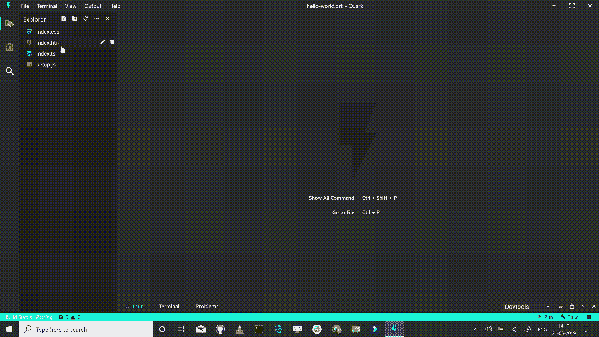
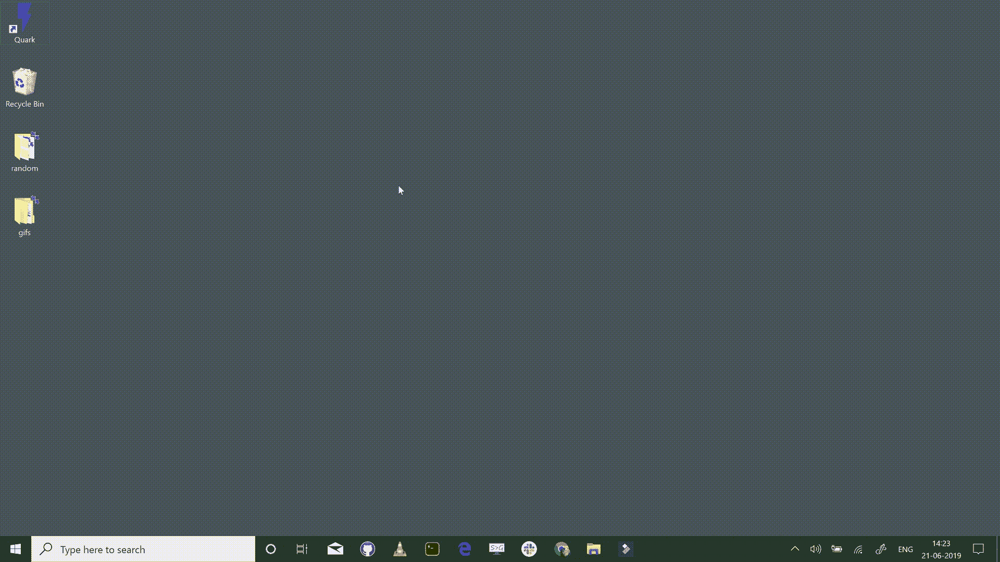
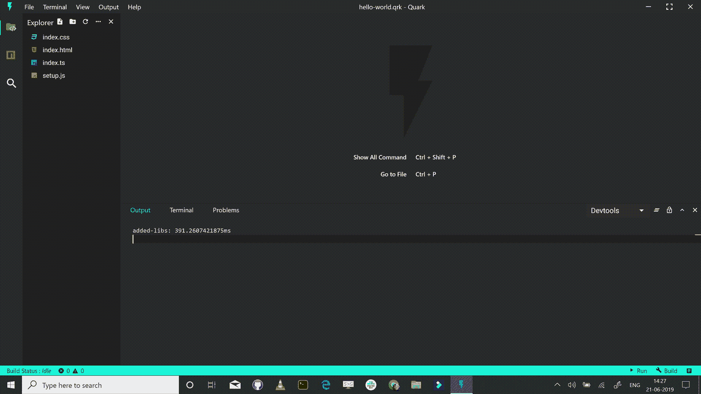
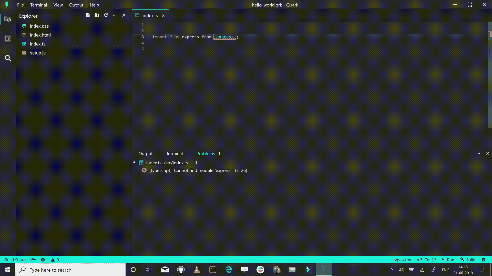
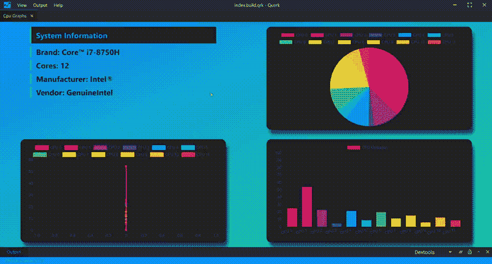
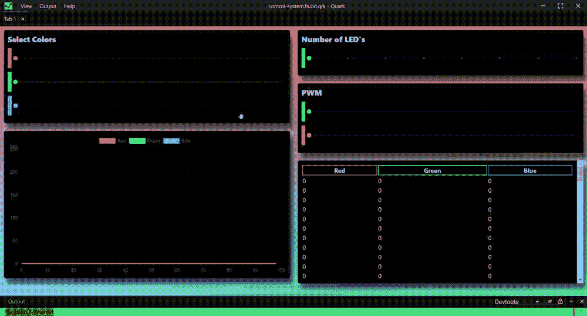
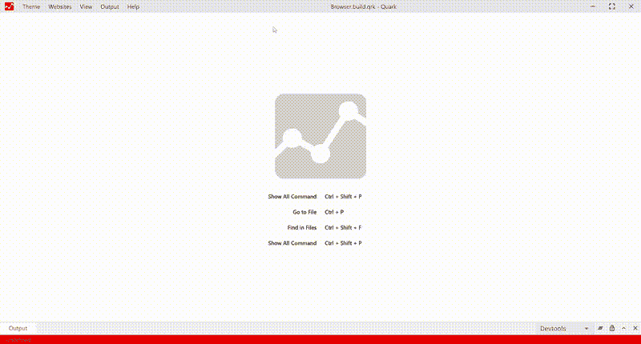
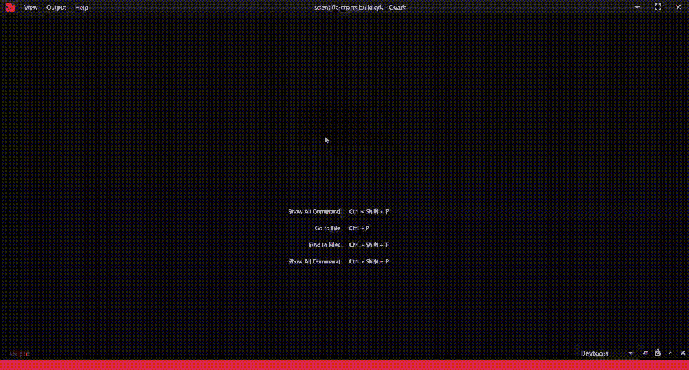
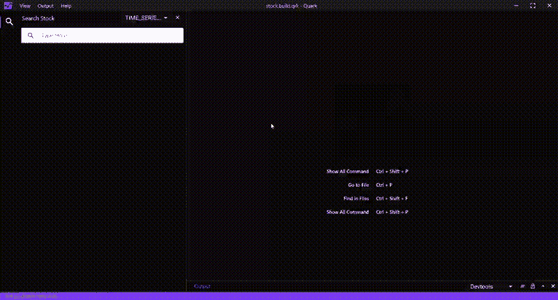

# 宣布“夸克”——你的 projects⚡的软件草图

> 原文：<https://medium.com/hackernoon/announcing-quark-a-software-sketchbook-for-your-projects-2f53553415b>

经过近一年的努力，我很兴奋终于宣布 [**夸克！**](https://quarkjs.io) 你现在可以在 [https://quarkjs.io](https://quarkjs.io) 查看🎉

Quark 是一款**通用软件**工具，专门用于帮助你创建用 HTML、CSS 和 JavaScript 编写的项目，并具有类似原生桌面应用的功能。

# 为什么？🤔

Quark 的想法始于我攻读工程学位的时候，当时我觉得需要一个软件工具来帮助我做一些事情，如绘制图表、应用程序原型、为我的个人项目创建仪表板/GUI 等。我只是需要“某个地方”来写代码、构建小项目或测试新想法。令我惊讶的是，我找不到一种简单的方法来做这件事。因此，我决定创建这个项目。

# 它是如何工作的？🤯

简单说:Quark 是一个**集成开发环境(IDE)** 和一个 **JavaScript 运行时**。您在 IDE 中编写代码，然后按一个按钮来构建您的项目。仅此而已！😮

IDE 会在后台自动处理项目的传输和打包，并发出一个输出文件，您可以“双击”该文件来打开并运行您的项目。我们称这些输出文件为“草图”。

*查看运行中的流程—*

In the demo above, we open the Quark app, create a new empty project, build and then run the project. All done in less than 15 seconds !!

# “草图”=节食中的电子应用。🍎

正如你可能已经猜到的，夸克是建立在[电子框架](https://electronjs.org)之上的。你的草图为你提供了**成熟的电子应用**的所有功能。唯一的区别是它们只有几千字节重，而不是几百兆字节。

我们通过为所有草图使用一个共享的 JavaScript 运行时来实现这个功能。在大多数情况下，这个运行时间几乎占一个电子应用程序重量的 99%。这给我们留下了实际的应用程序逻辑，它通常只有几千字节重。

这里唯一需要注意的是，由于这个共享的运行时，你的草图直接依赖于 Quark 软件本身来提供运行时。因此，我们称这些用夸克构建的项目为“草图”，而不是应用程序。

这对你来说意味着，你的机器上可能有数百张草图，提供成熟的电子应用程序的功能，而消耗的资源只相当于一个应用程序！

# 特色✨

## 代码编辑器📝

Quark 内置了一个强大的代码编辑器。为 VS 代码 *(* [*摩纳哥)提供动力的同一个代码编辑器——编辑器*](https://microsoft.github.io/monaco-editor/) *)* 。这意味着您可以获得对智能感知、代码完成、“转到定义”、参考搜索和快速导航 *(Cmd+P)的现成支持。*

此外，编辑器支持大约 80 种不同的设置，您可以配置这些设置来定制您的编辑体验。

## 模块捆绑器🗳️

Quark 预装了 [**webpack**](https://webpack.js.org/) **和**[**babel**](https://babeljs.io/)**支持、**以及它们的免费工具，如 web pack-loader(CSS-loader、html-loader、raw-loader 等。).这意味着您无需编写任何配置文件，即可获得对现代 JavaScript、React 和 TypeScript 的现成支持。您还可以选择编写一个配置文件，并定制构建系统以满足您自己的需要。

## 集成终端💻

## NPM 客户📦

我们有一个内置的 npm 客户端，因此您可以安装开发应用程序所需的依赖项和软件包。

## 内存文件系统📁

Quark 项目作为一个文件存在于你的机器上。这意味着您在 ide 中编写的所有代码和创建的所有文件都是虚拟文件，不会在您的实际文件系统中留下任何痕迹。这样做是为了让共享项目像共享单个文件一样简单。

## 应用打包程序🗳️

模块打包器很好，但它们不能总是打包您的应用程序资产(例如图像、视频)。在这种情况下，我们也支持存档格式。这意味着您仍然只共享一个文件，以共享您的整个项目。

## 电子功率💪

在幕后，我们使用[电子的渲染器进程](https://electronjs.org/docs/tutorial/application-architecture)作为你的草图的运行时间。这意味着，您可以访问草图中的所有 Node.js 和 Electron 的渲染器流程 API。

# 显示优点的东西👀

以下是一些用夸克制作的草图—

## 系统资源监视器

监控系统资源，如 CPU/内存使用情况。使用 [chart.js](https://www.chartjs.org/) 和 [systeminformation](https://www.npmjs.com/package/systeminformation) 库构建。

## 数字控制系统

Arduino 项目的控制系统。使用 [node-serialport](https://github.com/serialport/node-serialport#readme) 库构建。

## 网页浏览器

拆分视图和多选项卡的 web 浏览器。令我惊讶的是，这个草图只用了不到 200 行代码就完成了！！

## 绘制科学图表

使用 [plotly.js](https://plot.ly/javascript/) 库绘制高级图表。

## 股票分析应用

分析实时/历史股票数据。使用 [Alpha Vantage](https://www.alphavantage.co/) API。

## 更多使用案例

如果你仍然不明白，这里有更多的想法和用例，你可以使用夸克。

*   为所有现有的节点项目替换中间人“localhost”。直接在 DOM 中编写 Node.js 代码。
*   将现有命令行界面(CLI)转换为图形用户界面(GUI)。例如为 Angular，Vue.js CLI 构建 GUI 客户端。
*   使用现有的节点包，如 [imagemin](https://www.npmjs.com/package/imagemin) 、 [fluent-ffmpeg](https://www.npmjs.com/package/fluent-ffmpeg) 等，构建图像转换器、视频转换器等实用程序项目。
*   创建图形仪表板，以使用来自各种 API 的大量数字数据。例如，为 google-cloud 使用指标创建使用浏览器仪表板。

# 未来是光明的🌟

很快会有一大堆很棒的功能推出。我们想要完成的主要事情之一是创建一个用夸克构建的草图的**开放库。**

想象一个开放的实用程序库，如图像转换器、视频转换器、待办事项应用程序、便笺应用程序等。你只需按下一个按钮就可以下载到你的电脑上，所有这些都提供了成熟的电子应用程序的功能，而消耗的资源只有一个。这意味着在任何给定的时间，您都有可能在您的机器上下载数百个实用程序。这将极大地提高用户的工作效率。

我们也在迅速致力于开源夸克背后的核心技术。与此同时，您可以对我们的 [GitHub repo 上已经开源的文档和网站做出贡献。](https://github.com/Nishkalkashyap/Quark-docs)

**迫不及待地想看看你们这些互联网上的牛人对夸克有什么看法——请随时发推特给我**[**@ nishkalkashyap**](https://twitter.com/nishkalkashyap)**或在**[**insta gram**](https://www.instagram.com/nishkalkashyap/)**上给我发你们的问题、反馈和想法。**😄

我现在给你留下一些相关的链接。希望它能让你的生活轻松一点，就像它让我的生活轻松一点一样！🤞

*   **下载夸克:**【https://quarkjs.io/download/】T2
*   GitHub:[https://github.com/Nishkalkashyap/Quark-docs](https://github.com/Nishkalkashyap/Quark-docs)
*   **展柜:**[https://quarkjs.io/guide/showcase.html](https://quarkjs.io/guide/showcase.html)
*   **入门:**[https://quarkjs.io/guide/getting-started.html](https://quarkjs.io/guide/getting-started.html#steps)