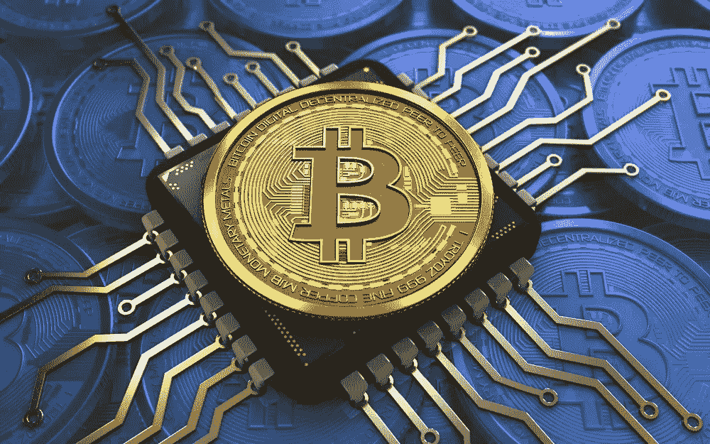

# 比特币与匿名:什么是比特币混合？为什么人们会使用它？

> 原文：<https://medium.com/hackernoon/anonymity-and-bitcoin-what-is-bitcoin-mixing-and-why-do-people-use-it-84c62ccb20c2>

比特币是一种点对点的分散式电子资产，不需要任何中央机构进行确认或记录。

这里有两个概念需要注意，它们对于统称为加密货币的新型数字资产至关重要。