# Redux 中调用 restFul API 的另一种方式

> 原文：<https://medium.com/hackernoon/another-way-to-call-restful-api-in-redux-d8dd991d0779>

## 宣布了一种通用方法，使开发人员在 React-Redux 中调用 API 变得更加容易。

Photo by [Randy Fath](https://unsplash.com/photos/ymf4_9Y9S_A?utm_source=unsplash&utm_medium=referral&utm_content=creditCopyText) on [Unsplash](https://unsplash.com/search/photos/hard-working?utm_source=unsplash&utm_medium=referral&utm_content=creditCopyText)

最近从后端开发转到前端了。乍一看，我发现 API 调用真的很难。

为什么我们需要一个类型+动作+采取动作(redux-saga)+处理函数😐对于每个 API 调用？？和一个 type + action + reducer 来存储结果。我一直在问自己。

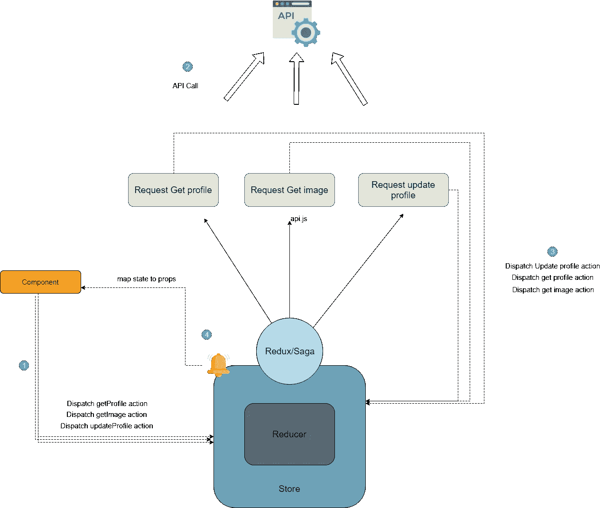

我做了很多研究，所有的样本和文件或多或少都是一样的。比如这个例子:

 [## 将 API 请求移动到 Redux-Saga

### 我想和你分享一下我们如何创建应用程序的故事。我们使用什么工具，我们从哪里转移…

hackernoon.com](https://hackernoon.com/moving-api-requests-to-redux-saga-21780f49cbc8) 

所以我想换一种方式，更实用的方式。

# API 客户端

API client 是一个在一个地方处理最多 API 调用而没有重复代码的结构( [DRY](https://en.wikipedia.org/wiki/Don%27t_repeat_yourself) )。我将使用 redux 中间件来解释这种结构，但是您可以用自己的方式来实现它。即使在另一个中间件库中，如 Tunk 或 Saga。如你所见，解释是如此简单明了。我试着让它容易理解

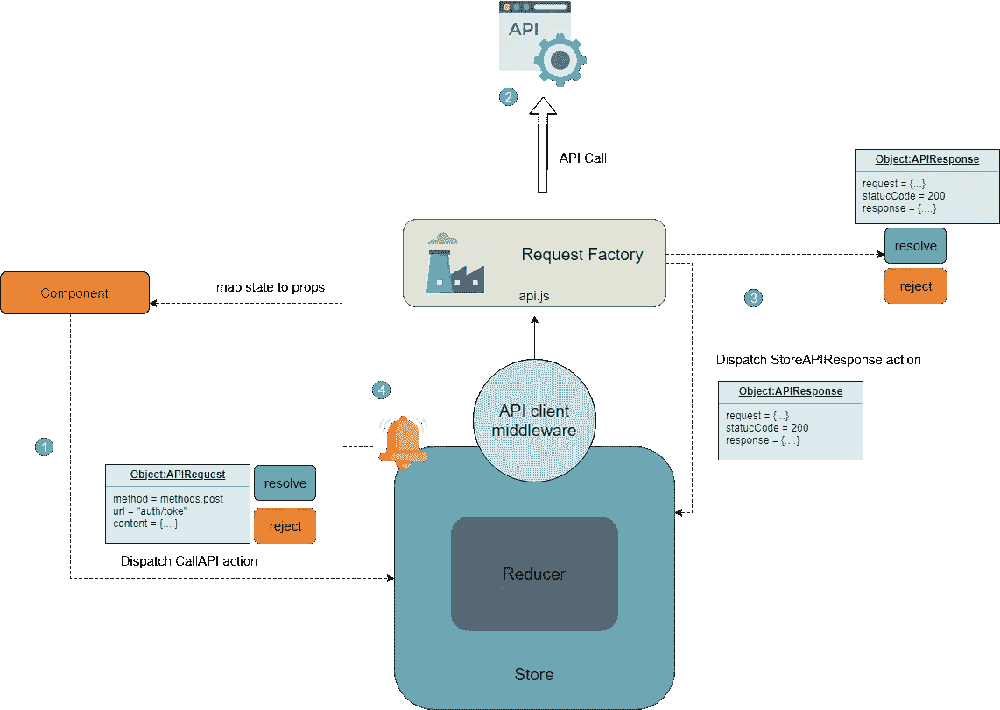

## 履行

API 请求是我们的基本 API 类。你可以这样定义它:

> 我使用[碳](https://carbon.now.sh)来生成代码片段的图像。你可以在我的 GitHub 中看到完整的实现。

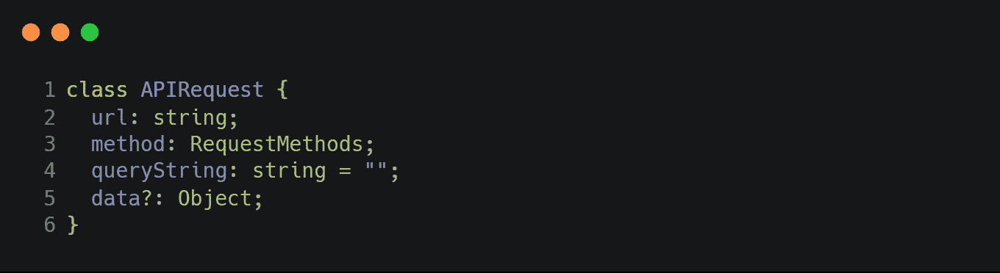

每当你想调用一个 API 时，你只需要创建这个类的一个实例，并将这个动作分派给 redux。

我们可以创建一个动作函数:

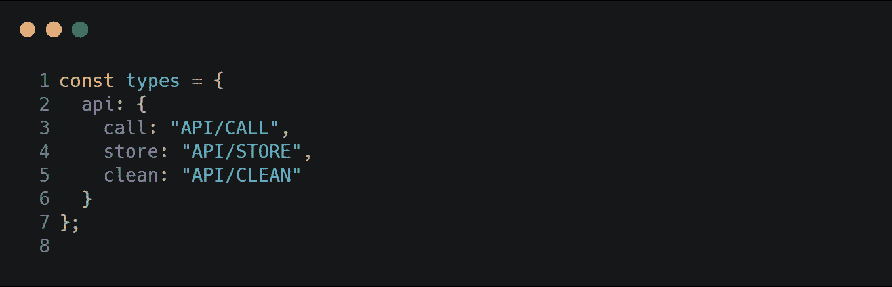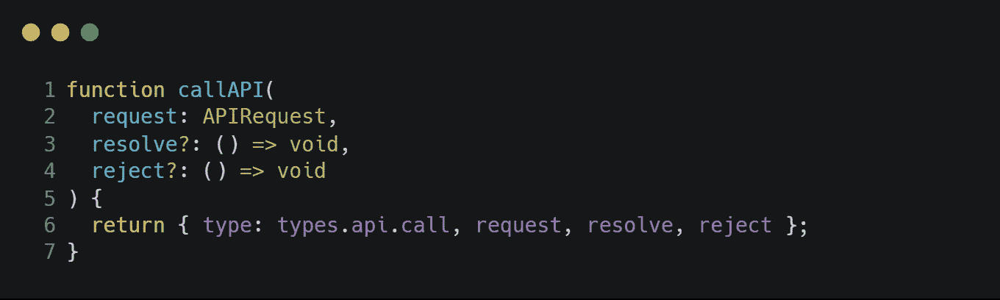

通过使用这个函数，我们也可以在一个承诺中直接使用调用 API(如果需要的话)。

对于响应，我们可以定义 APIResponse 类:

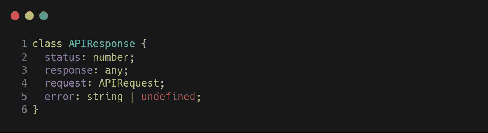

现在我们需要处理请求并完成拼图。**redux 中间件**(我使用 [Axios](https://github.com/axios) 发送请求):

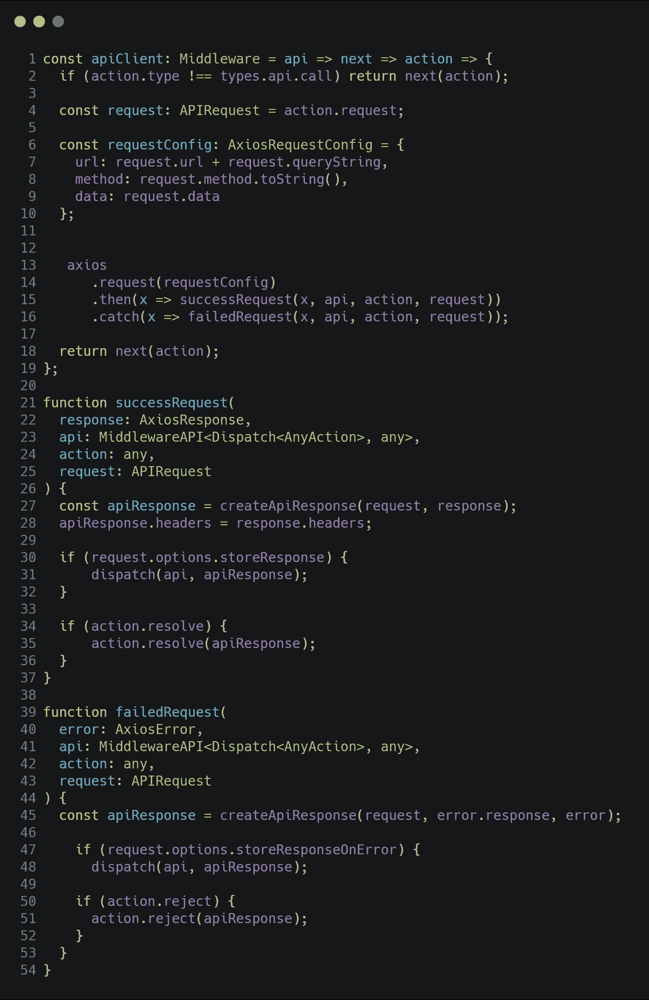

# 怎么用？

调用 API 不可能比它更简单😎像一般的方法一样，我们可以在组件中使用 redux connect 来发送请求和接收响应。

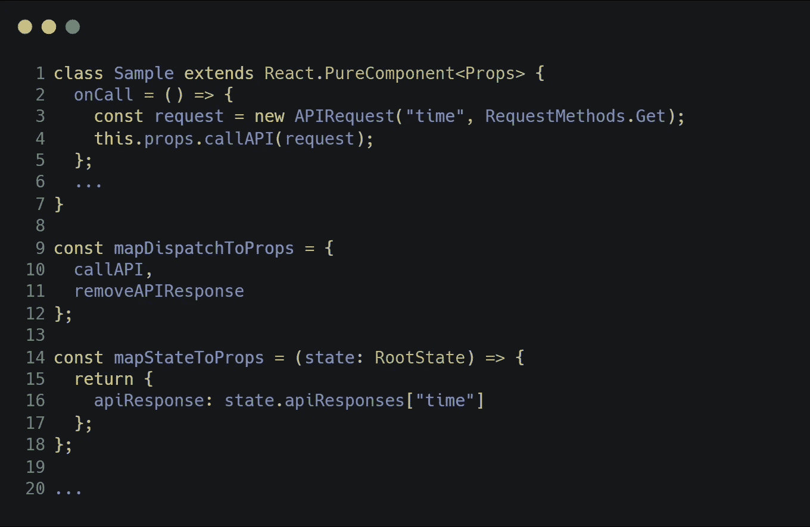

# 怎么定制？

你可能会想到一些具体的场景，以及如何用这种结构来处理。这个强大的选项解决了我的问题:

## [计]选项

带选项。您可以根据需要定义选项对象。类似这样的东西

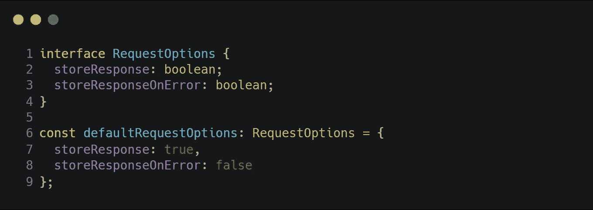

您可以定义一个选项，用于在存储中保存响应或在操作后显示消息，以及基于您需要的任何内容。

## 中间件

另一个可以给你更多控制的东西是中间件。如果选项不足以满足您的需求，您可以像这样定义中间件接口:

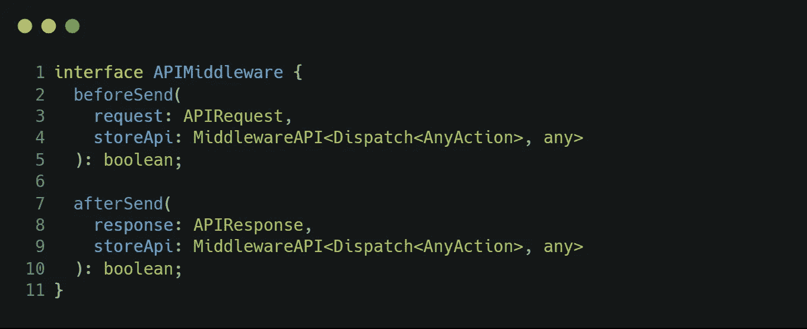

现在实现这个接口，并将其添加到请求对象中，以获得对请求流的完全控制。

我们需要更改 APIRequest 类来支持选项和中间件。

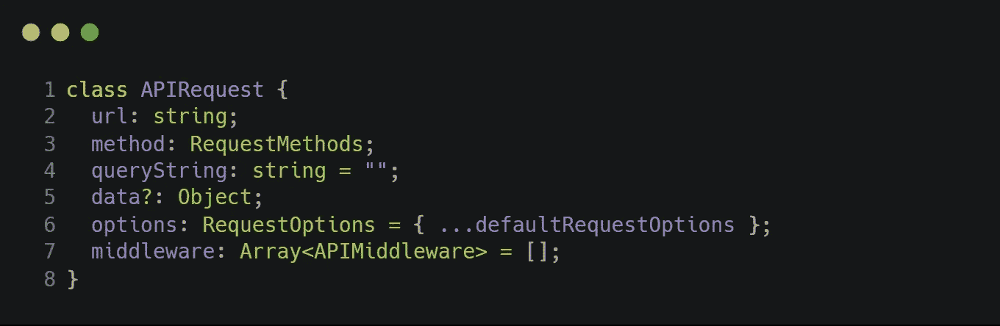

# 超出

你甚至可以做得更好。例如，使用这种结构，您可以轻松地处理本地存储中的所有更改，以避免重复。更具体地说，您可以实现一个流程，在发送删除请求后从本地存储中删除记录。

正如我之前提到的，我想给你们一个概念，我是什么意思。如果你感兴趣，你可以在 GitHub 上看到完整的演示:

 [## PejmanNik/redux-call-API-sample

### react/redux for my medium post 中调用 API 的示例项目…

github.com](https://github.com/PejmanNik/redux-call-api-sample) 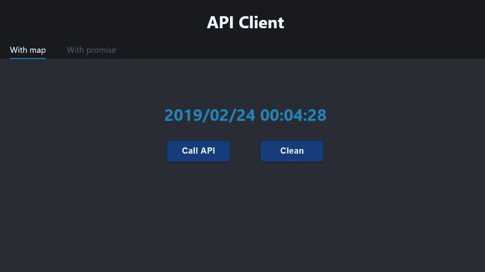