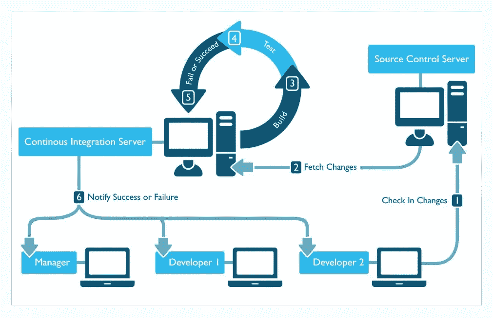
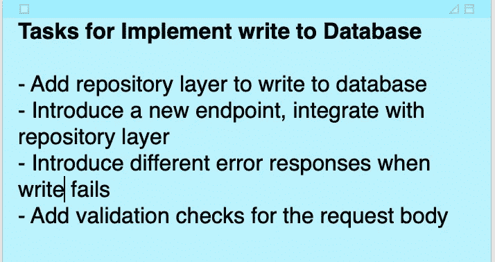
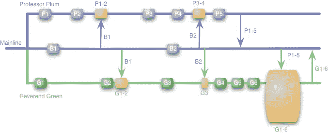
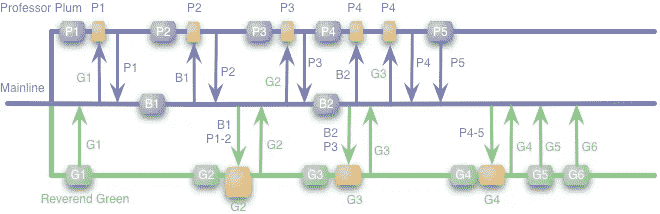
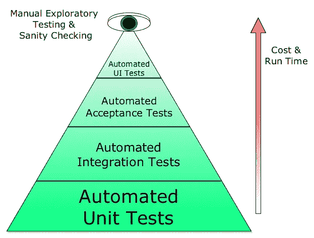
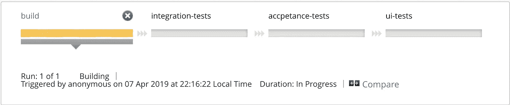
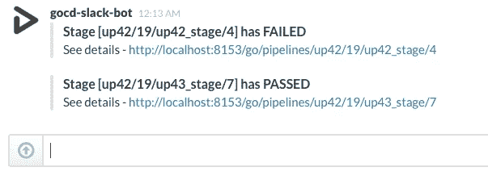

# 持续集成的反模式

> 原文：<https://medium.com/hackernoon/anti-patterns-of-continuous-integration-e1cafd47556d>

[**(CI)**](https://hackernoon.com/tagged/continuous-integration)**持续集成并不是软件开发中的新术语。众所周知，它通过提供快速反馈和减少集成问题来简化软件开发。**

## **根据定义:**

> **持续集成(CI)是一种开发实践，它要求开发人员每天数次将代码集成到共享存储库中。然后，每个签入都由一个自动构建来验证，允许团队尽早发现问题。**
> 
> **通过定期集成，您可以快速检测错误，并更容易地定位错误。https://www.thoughtworks.com/continuous-integration
> ——**

**然而，有时人们会说，由于团队规模/项目结构/复杂性，CI 在特定项目中不起作用。在这篇博客中，我将讨论常见的反模式可能会导致人们觉得 CI 没有为项目工作。**

****

**Image Source: [https://journal.missiondata.com/improving-delivery-with-continuous-integration-72a9ffea2117](https://journal.missiondata.com/improving-delivery-with-continuous-integration-72a9ffea2117)**

## **什么是反模式？**

> ***反模式就像模式一样，只是它给出的不是解决方案，而是表面上看起来像解决方案但实际上不是的东西。***
> 
> ***—https://martinfowler.com/bliki/AntiPattern.html[安德鲁·克尼格](https://martinfowler.com/bliki/AntiPattern.html))***

**根据*设计模式*的作者的观点，要正式区分实际的反模式和简单的坏习惯、坏实践或坏想法，至少要有两个关键要素:**

> ***一种常用的流程、结构或行动模式，尽管最初看起来是对某个问题的适当而有效的回应，但其不良后果多于良好后果。**
> 
> ***存在另一种解决方案，它是有记录的、可重复的，并且被证明是有效的**

**下面是持续集成的常见反模式。**

# ****不常签入****

**这违背了持续集成的基本原则。在这种情况下，代码会在本地笔记本电脑上保存很长时间，而不会被提交和签入。最普遍的原因是完成整个特性需要大量的修改。由于签入不频繁，集成被延迟。在开发特性的同时，其他开发人员签入他们的代码。这项功能花费的时间越长，其他人签入的代码就越多。这导致了大量的合并冲突，因为要进行大量的修改。**

**这导致巨大的集成工作，因为来自不同开发人员的巨大变化将导致许多合并冲突。这些冲突不容易解决，因为要做的更改太多了。**

**克服这一点的最简单的解决方案是，将特性分成更小的独立任务。在每个任务结束时，应该有一个提交和签入。它不仅有助于更快、更方便的集成，还有助于获得更具体的提交消息。如果需要恢复特定任务，这可能会很有用。**

**在下图中，您可以看到可能的任务列表:**

****

**Possible list of tasks for a feature**

# ****特征分支****

> **特性分支背后的核心思想是所有的特性开发都应该在一个专门的分支中进行。这种封装使得多个开发人员在不干扰主要代码库的情况下处理功能变得容易。**

**在一个项目中，如果特性分支在完成之前从来没有从主线(存储库的主要分支)得到变更，那么这个项目就离持续集成很远。事实上，这种方法可以称为**持续隔离**。**

> **术语[持续隔离](https://twitter.com/benjiweber/status/831193574502961154)来自一条推文，并被[保罗·哈曼特](https://paulhammant.com/2017/02/14/fake-news-via-continuous-isolation/)扩展。Thoughtworks 后来将这种做法确定为[“CI Theatre”](https://www.thoughtworks.com/radar/techniques/ci-theatre)。**

**一个孤立的特性分支会导致很多冲突，因为当特性完成时，主线会有大量的变化。在大量开发人员进行巨大变更的情况下，现在每个人都需要坐在一起进行合并，否则，合并时可能会错过一些重要的变更。**

****

**Image Source: [https://www.martinfowler.com/bliki/FeatureBranch.html](https://www.martinfowler.com/bliki/FeatureBranch.html)**

**上图显示了一个包含许多长期特性分支的存储库。
支乘 ***【梅子教授】*** 得到了 P1、P2 当地的首肯..P5，她在 P1-2 点和 P3-4 点从主线上换车。最后，在 P1 5 号，她将其并入主线。
分支由 ***【牧师绿】*** 同时启动的有本地犯 G1、G2..G6，并在 G1-2、G3(在 P1-5 之前)与主线换车。现在，他决定将其合并到主线中，为此，他需要将“ ***普拉姆*** 教授”所做的所有更改合并进来。因为有很多提交，所以很难将它们集成在一起。**

**解决上面问题的方法很简单，**避免长生命特征分支**。应该只有一个分支作为真理的单一来源。所有的开发工作都是从这个分支开始的，应该被推送到同一个分支。这个单独的分支通常被称为主干(在 Git 中通常是主分支)。这种开发实践被称为**基于主干的开发**，因为所有的开发都是针对主干进行的。**

**在项目中，在合并之前需要得到**拉请求**的批准，这个问题可以通过对每个任务使用**短期分支**来解决。一旦任务完成，这些分支就会合并，并且在整个特性完成之前不需要存在。**

****

**Image Source: [https://www.martinfowler.com/bliki/FeatureBranch.html](https://www.martinfowler.com/bliki/FeatureBranch.html)**

**上图显示了短命分支的使用。 ***格林牧师*** 进行本地提交 G1 并将其合并到主线。 ***梅子教授*** 做了一个本地提交 P1，在她能把它合并到主线之前，她需要接受提交 G1，把它和她的改变合并到本地，然后推。当牧师 Green 需要下一次提交时，他也会这样做。这是一系列多个小合并，不需要一个巨大的合并事件。**

# ****破建****

**好吧，破房子不是问题。这是构建管道的用例之一，在出错时给出早期反馈。当它长时间坏掉时，问题就出现了。**

**这导致了阻塞，因为在构建修复之前不应该有任何其他的签入。失败构建的检入将创建更多的文件、更多的变更和更多的依赖，这使得缺陷的检测和隔离变得困难。**

**如上所述，不完整的构建不是问题所在，因此没有解决方案。这只是一个让修复一个坏的构建成为首要任务的原则。如果修复构建需要大量时间，恢复提交是修复构建的有效选项。**

# ****构建时间****

**持续集成的全部意义在于拥有快速的反馈。长时间运行的构建增加了开发人员在签入后的等待时间，因为他们需要等待构建完成后才能继续。这可能导致不频繁的签入，以避免长时间的多次等待。**

**构建时间长的一个原因是作为构建的一部分运行各种检查和测试。为了克服这个问题，构建应该被配置为只编译代码和运行快速单元测试。其他耗时的检查/测试可以作为**流水线方式**的后续步骤进行，快速反馈不需要这些检查/测试，但需要进行测试。**

**这个想法是在测试/检查和构建时间之间找到一个平衡，这样一个构建足够稳定，可以转移到下一个任务。**

****

**Image Source: [https://i.stack.imgur.com/kXpHf.png](https://i.stack.imgur.com/kXpHf.png)**

**上图显示了一个[测试金字塔](https://martinfowler.com/bliki/TestPyramid.html)，它将测试分为 4 个部分。**单元测试**、**集成测试**、**验收测试**、 **UI 或 End2End 测试**。随着我们在金字塔中向上移动，测试的数量减少，运行时间增加。**

**下图显示了运行上述测试的管道。作为构建的一部分，只有**单元测试**会运行，花费的时间很少。其他一切都将稍后运行，但是一旦构建完成，开发人员就可以进入下一个任务。**

****

**A demo pipeline which runs different kind of tests in different stages**

# ****建立反馈****

**修复一个坏的构建的第一步是意识到这个构建是坏的。如果构建被破坏了，但是没有人意识到这一点，那么每个人都会很高兴并继续在这个被破坏的构建上工作。**

**对此可能有简单的解决方案:**

*   **可以有一个 CI 仪表板，显示构建的状态。**
*   **CI 服务器可以配置为通过邮件、slack 等方式通知团队。一旦有关于构建被破坏的通知，这应该成为优先事项，**

**下图显示了来自***gocd-slack-bot***的关于构建状态的通知。**

****

**Image Source: [http://blog.ashwanthkumar.in/2015/02/gocd-slack-build-notifier.html](http://blog.ashwanthkumar.in/2015/02/gocd-slack-build-notifier.html)**

# ****垃圾邮件通知的恐怖****

**如上所述，CI 服务器可以配置为通知构建状态。现在让我们想象一个大团队进行大量的签入。如果每 2 分钟就有一个关于构建通过的通知，这将导致[警报疲劳](https://en.wikipedia.org/wiki/Alarm_fatigue)。人们会被构建通知淹没，并开始忽略这些通知。这使得通知无效，因为人们可能会错过关于构建失败的通知。**

**要解决这个问题，CI 服务器应该配置为不在每次登记时通知。它应该被配置为只在新的签入失败时才发出通知，这是人们应该关注构建的时候，所以它会被修复。另一个有用的通知是当一个新的签入修复了一个损坏的构建时，因为它将允许其他人签入他们等待构建被修复的代码。**

# ****总结****

*   **频繁地对远程存储库进行小规模的独立提交是顺利持续集成的关键。**
*   **对 l̶o̶n̶g̶-̶l̶i̶v̶e̶d̶̶f̶e̶a̶t̶u̶r̶e̶̶b̶r̶a̶n̶c̶h̶e̶s̶说不。对于小型任务，遵循**基于主干的开发**或**短期分支**。**
*   **残破的构建应该是重中之重。在修复版本之前，没有其他签入。**
*   **减少构建时间。如果出现问题，它有助于获得快速反馈。**
*   **Setup dashboard 是一种通知机制，用于向团队成员通知构建状态。**
*   **仅从 CI 发送重要通知，以避免垃圾邮件。**

**以上是主要的反模式，我在我工作过的项目中见过。我也很想听听你的经历。**

**喜欢读它，让别人知道鼓掌，分享。感谢任何反馈。**