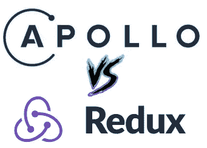
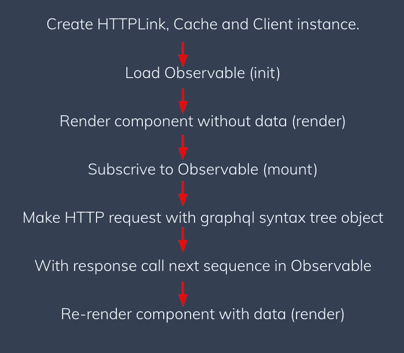

# 阿波罗 vs Redux——用数据渲染

> 原文：<https://medium.com/hackernoon/apollo-vs-redux-rendering-with-data-3a0da3b1ffab>



Apollo 和 Redux 是与 React 一起使用的两个流行的库。它们被收录的原因多种多样，但主要是为了:
1。管理一家商店
2。协助处理数据获取
3。用更新的道具触发任何重新渲染

但是他们在幕后使用什么机制来做到这一点，当涉及到处理道具和渲染时，他们有什么不同？

我决定进行调查，下面就是它的产物。

# TLDR；

*阿波罗*使用一个可观测值并手动强制重新渲染，在渲染点读取数据的当前可观测值。

Redux 也使用一个可观察对象，但是使用观察者通知为它的订阅者更新本地状态。

# 看得见的

首先要接触的重要事物是可观察的。它们是一个新的*异步原语*，具有一些强大的属性。下面是一个基本的例子。

1.  从订阅功能创建您的可观察对象

```
const subscriptionFunction = (observer) => {
   // do some stuff, could be async.
   observer.next("Call with some data");
   observer.complete();
   return () => console.log("Unsubscribing")
}
const ourObservable = new Observable(subscriptionFunction);
```

2.订阅你的观察。这将调用*预订功能*。

```
const  subscriber = ourObservable.subscribe({
   next(x) { console.log(x) }, // “Call with some data"
   error(err) { console.log("Received terminating error of the
   sequence.") },
   complete() { console.log("Stream has completed successfully.") }
});
subscriber.unsubscribe(); // "Unsubscribing"
```

基本上我们可以定义对象之间的一对多关系。当父可观察对象的状态改变时，它的从属对象(观察对象)被通知并更新。

他们有几个强大的属性，包括懒惰，可取消，可以在一个序列中运行多次。

今天就来看看 [zen-observable](https://github.com/zenparsing/zen-observable) 吧，以符合规范的方式使用它们。

# 让我们从阿波罗开始

Apollo 在 Observables 订阅函数中使用 fetch(在我最近的[演讲中可以找到关于 Apollo 内部的全部细节)。可观测数据也作为归一化数据的存储。](https://www.youtube.com/watch?v=zO_ZuWERUy8)

在收到来自 HTTP 请求的响应时，存储被更新，然后触发*" force render()"*(Reacts 方法手动触发给定组件内的重新呈现)。

最后使用“渲染道具模式”,用当前可观察的数据渲染孩子。值得注意的是，这里根本没有使用 React state。

下面是一个带有基本查询组件的页面加载事件的分类。



Full anatomy of a page-load with Apollo

# 现在回到 Redux

使用 Redux，我们将忽略实际的 HTTP 获取机制(假设为此使用了 [thunks](https://github.com/reduxjs/redux-thunk) 或 [sagas](https://github.com/redux-saga/redux-saga) ),并专注于存储更新和组件重新呈现。

当一个组件*“connects()”*被添加到可观察商店的订户列表中(更多关于 [Redux 可观察商店的信息，请点击](https://redux.js.org/api/store))。
当一个 reducer 在存储中改变状态时，所有的订阅者都会得到通知并运行一个*“setState()”*。

结果是连接的组件及其子组件用更新的道具重新呈现。

Redux 的 connect 的简化版如下:

```
class Connect extends Component {
     trySubscribe() {
        this.unsubscribe =
          this.store.subscribe(this.handleChange.bind(this))
        this.handleChange()
     } componentDidMount() {
       this.trySubscribe()
     } handleChange() { 
       const storeState = this.store.getState()
       const prevStoreState = this.state.storeState
       // logic using store and react state
       // if the Store state has changed, update Reacts state
       this.setState({ storeState })
     }
}
```

# 摘要

我发现这两个库都利用了 *Observables* 非常有趣，尽管它们使用不同的机制*。*

我认为，如果没有别的，它显示了 Observables 在 Javascript 的未来将扮演的角色。它们目前处于正式提案的第一阶段(全部细节请参见 [tc39，此处为](https://github.com/tc39/proposal-observable))，因此有望很快落地。考虑到他们带来的力量(解决承诺有时流不能解决的问题),似乎有很多场景非常适合他们。

阅读它们在野外的工作实例，比如 Redux 和 Apollo，是了解它们更多的好方法。

接下来，我将检查这些方法的优缺点，并尝试解释为什么这些库选择了它们所选择的方法。

如果你喜欢这个，请鼓掌。或者让我知道你是否有任何想法或反馈。谢谢:)