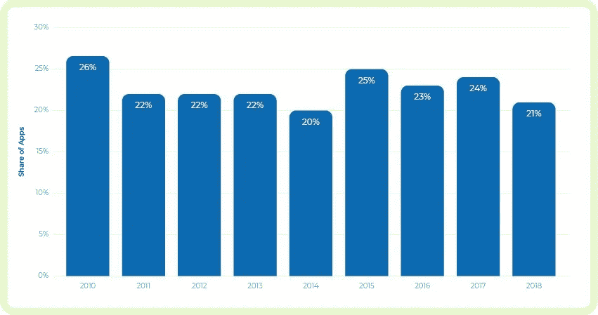
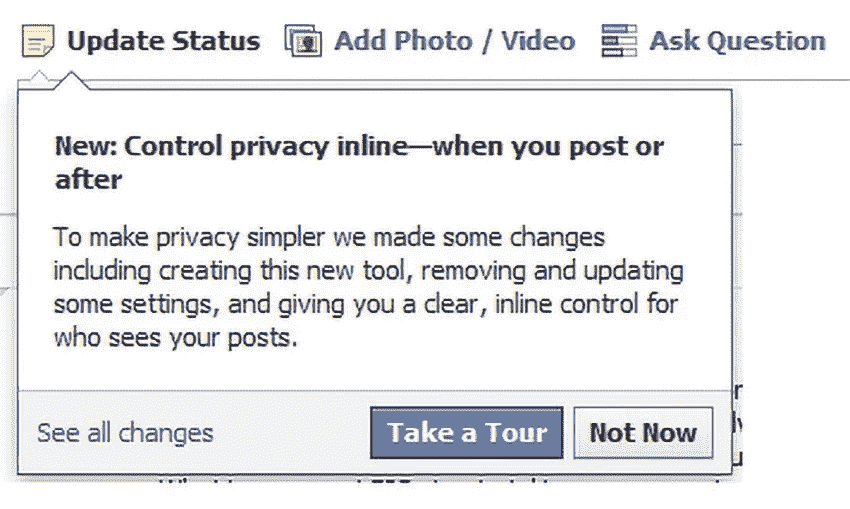
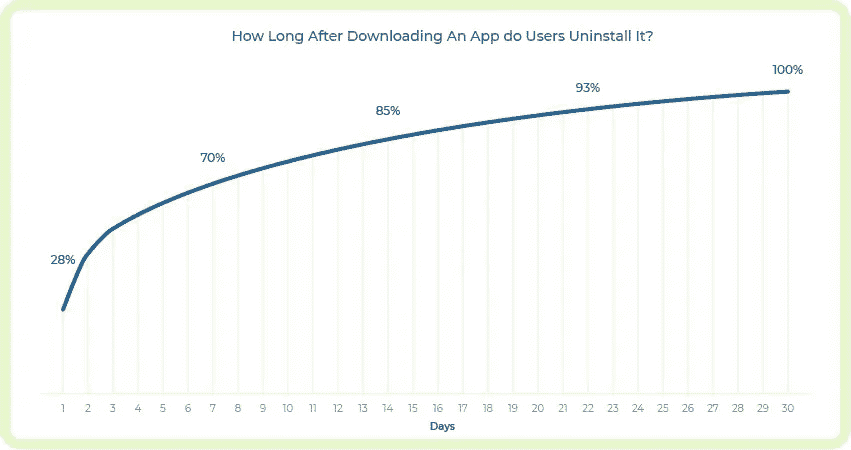
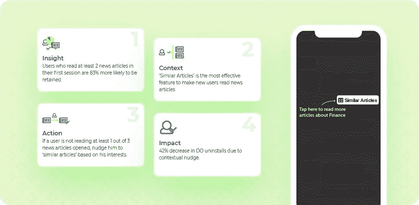

# 应用程序演练:通过交互式入职培训提高用户参与度和忠诚度

> 原文：<https://medium.com/hackernoon/app-walkthroughs-improve-user-engagement-and-retention-with-interactive-onboarding-8b3360cc0729>

你坐过过山车吗？如果是，那么你能回忆起座位边缘的起伏，整个过程中不同速度下的头部冲击吗？

嗯，营销你的手机应用也可以类似！

在营销你的移动应用时，像你这样的营销人员面临着几个挑战。

首先，你开发了一个应用程序，并在主要的应用程序商店上市。为了增加您的应用程序下载量并提高可见性，您微调了您的应用程序商店优化(ASO)策略。不幸的是，你的挑战还没有结束！

你如何让你的应用程序更有粘性，并提高用户参与度和留存率？

根据 Statista 的一项研究，几乎 21%的移动应用在应用下载的前 6 个月中只使用过一次。

随着每天大约有 6000 个移动应用程序被添加到应用程序商店，这个比例只会增加。

作为一名成长型营销人员，你肯定会经历一段艰难的时间来提高你的应用程序用户参与度和保留率。事实上，预测实际下载的问题可以很容易地解决，而不是从下载中获得重复的活跃使用。

如果您的应用具备以下条件，这一问题就可以解决:

1.  快速一致地解决实时问题的能力
2.  更少的 bug(理想世界里没有 bug！)
3.  卓越的用户界面设计
4.  无缝用户入职
5.  易用性

**首次用户体验(FTUE)的重要性**

大多数移动营销人员通常对首次用户体验知之甚少。它在用户采用方面发挥着关键作用，鼓励重复的应用重新启动和更高的平均会话持续时间。

事实上，21%的用户在首次使用后就退出了，这表明应用程序中有问题或损坏。

通过利用[强大的分析平台](https://www.netcoresmartech.com/)的功能，你可以理解为什么用户在第一次使用后就立即减少了。

如果应用程序有问题，如应用程序崩溃、糟糕的用户界面或任何设计/产品相关的缺陷，都可以轻松解决。

但是，在首次发布应用程序时，如何向用户简要强调应用程序的功能呢？

你如何让用户了解他/她通过使用某些应用程序功能可以获得的各种好处？

这正是用户入职变得至关重要的地方。

在一个注意力持续下降、未读推送通知和缺乏用户手册的世界里，你如何有效地教你的用户如何使用你的移动应用程序来获得最大可能的价值？

解决方案:应用程序演练！

**什么是交互式应用程序演练？**

交互式应用程序演练是辅助屏幕弹出窗口，允许用户浏览移动应用程序的关键功能。它们以下拉或弹出提示的形式出现，突出显示应用程序中的特定功能。

它让用户控制如何使用应用程序。例如，看看这个食品应用程序的演示:

你熟悉脸书的产品之旅吗？脸书的“游览”按钮让用户可以在向导的带领下游览它的应用程序。这里的重点是让用户熟悉它的每个关键特性的能力和可用性。

**交互式演练如何提高用户参与度和忠诚度？**

还记得移动营销的黄金法则——“激活永远比获取更关键”吗？

演练具有高度的情景意识。他们帮助用户更接近他们的第一次啊哈！通过将正确的产品浏览 UI 模式与特定用户的需求相结合。

当用户第一次启动应用程序时，你需要确保在一开始就突出易用性。有效的沟通意味着用户是选择保留你的应用，还是现在就卸载你的应用！

你的用户越快体验到他/她的第一次啊哈！时刻，用户留存的几率就越高。

演练可以作为应用参与的催化剂，不仅仅是在用户入职阶段，而是贯穿整个应用用户生命周期。

了解你的用户的[多样的应用内行为](https://www.netcoresmartech.com/features/single-step-actionable-analytics)并向他们发送微提示，引导他们使用你希望用户使用的功能。这不仅会让用户探索该功能，还会增强他们在应用程序中的参与度。

例如，如果你碰巧是一款以字谜为主题的游戏应用，那么走查就可以成为成功的不二法门。可能会有这样一种情况，即用户停留在某个特定的级别，尽管他/她尽了最大的努力，但还是无法完成。

他/她的挫折会导致完全的活动减少，尤其是在他/她用尽了所有可用的生活之后。但是，他/她仍然可以使用一个提示，但已经完全忘记了！

下一次当他启动应用程序时，使用漫游进行“使用提示”的细微推动可以增强应用程序内的参与度，同时还可以促进即时功能回忆。

演练在提高用户保持率方面也起着至关重要的作用。应用营销领域的竞争越来越激烈，留住用户仍然是一个永恒的挑战。对于像你这样的移动营销人员来说，第一天卸载仍然是个大问题。

根据 [Appsflyer](https://www.appsflyer.com/blog/new-data-shows-uninstalls-remain-significant-pain-apps/) 的一份报告，几乎 28%的用户会在第一天卸载他们的应用。

Source: Appsflyer

**应用程序演练如何减少第一天的应用程序卸载？**

卸载应用程序是一种极端的用户行为，表明您的应用程序出现了问题。虽然卸载应用程序的原因可能多种多样，但主要原因包括:

1.  令人困惑的注册过程
2.  应用程序中的错误
3.  应用崩溃
4.  使用困难
5.  在一段时间内表现不佳
6.  过度使用应用内广告
7.  隐私和数据捕获问题等。

用户在第一天卸载你的应用的两个主要原因还包括**缺乏对产品的了解**和**复杂的用户体验**。这就是演练派上用场的地方，它可以帮助像您这样的营销人员最大限度地降低卸载率。

例如，你是一个语言学习应用程序。当用户下载你的应用程序并第一次启动它时，你的入门必须是重点，强调你的关键特性。

走查必须是你的用户入职流程的一部分。您可以通过以下方式向用户介绍您的主要功能:

1.  **功能屏幕流程:**这本身就是一个很棒的入职功能，被大多数 app 开发者广泛使用。它专注于关键的应用程序功能，但不会让用户立即付诸行动。屏幕流更像是该应用拥有的关键特性的要点。
2.  **互动演练:**这包括教育用户如何使用应用程序——从切换菜单选项到选择要学习的语言，如何检查进度等。

这样做将有助于用户更好地理解应用程序，并毫无障碍地继续使用它。每当你的应用程序发布新的更新/版本时，演练也可以重新吸引你的休眠用户。它很快吸引了人们对最新应用程序版本中嵌入的新功能的注意。

**交互式演练:实现基于意图的用户参与的方法**

随着每天新的创新应用数量的增加，您的用户有太多的选择。应用发现和用户获取并不是你面临的唯一挑战。

*但是，不用担心！我们,*[*Smartech*](https://netcoresmartech.com)*全力支持您。是的，这篇博客最初发表在* [*Smartech 博客*](https://blog.netcoresmartech.com/app-walkthroughs) *上。*