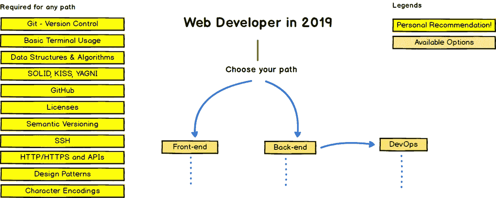
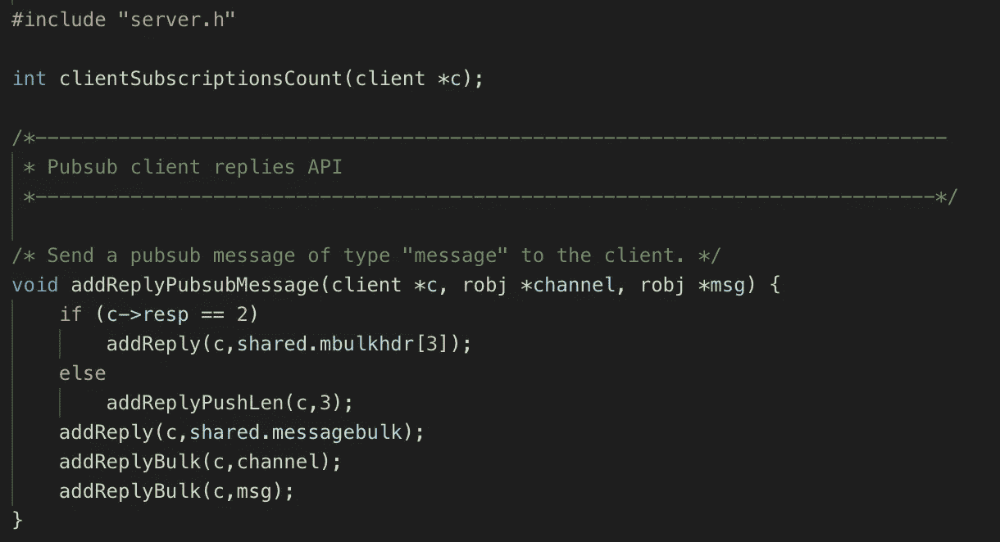
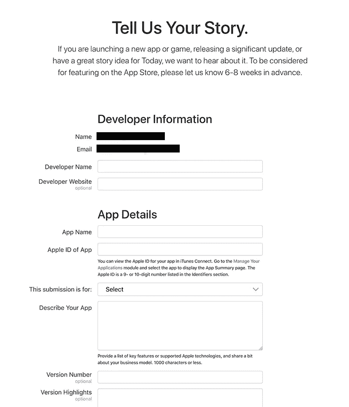
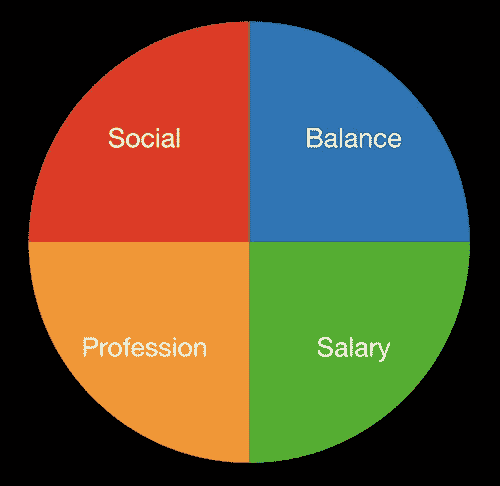
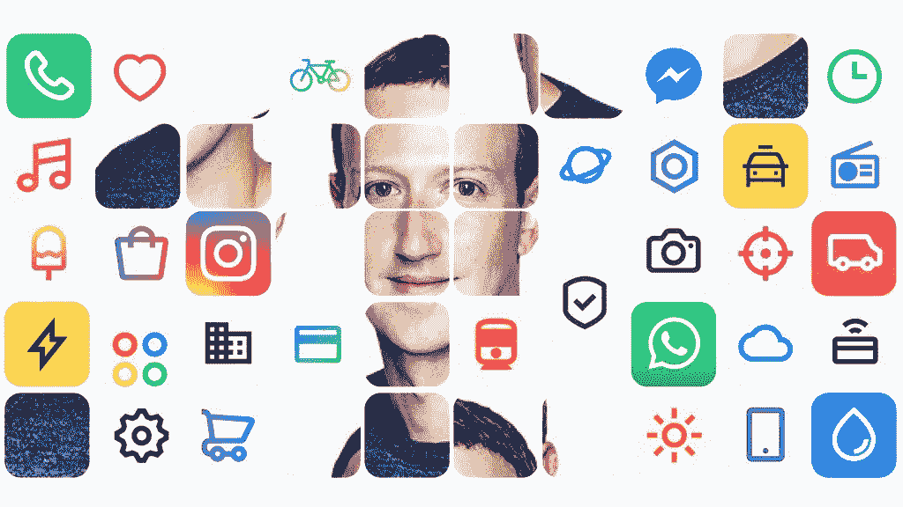
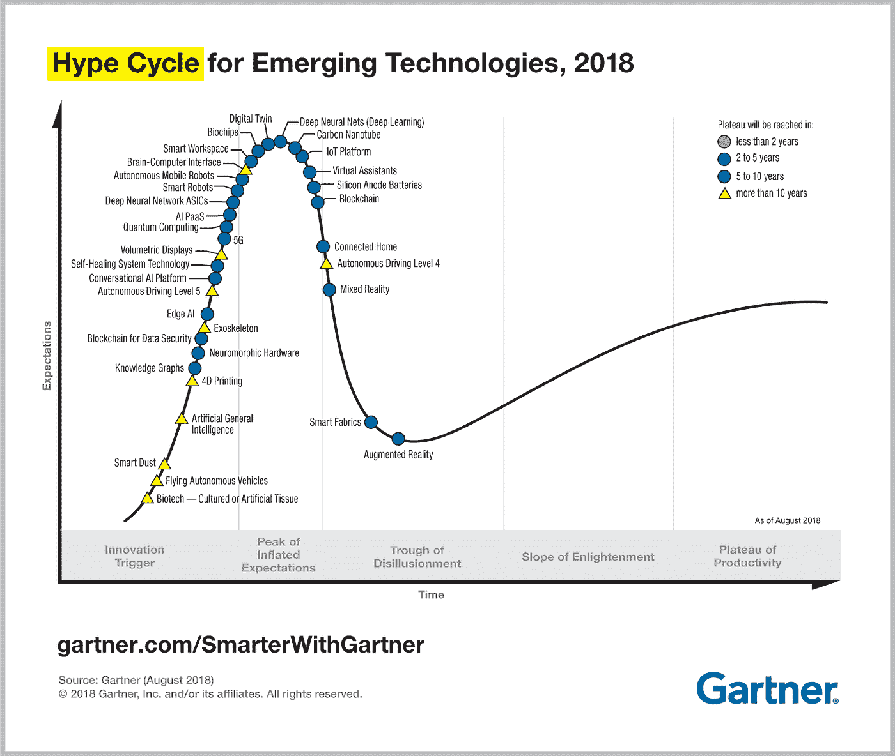

# 2019 年 4 月最受关注的科技故事

> 原文：<https://medium.com/hackernoon/aprils-most-read-tech-stories-2019-4aa61f0088d2>

## 以下是本月黑客正午的 65 个热门故事。我们将他们分成了这些顶级类别:[编程](https://hackernoon.com/tagged/programming)、[区块链](https://hackernoon.com/tagged/blockchain)、 [ux](https://hackernoon.com/tagged/ux) 、[职业](https://hackernoon.com/tagged/careers)、[软件开发](https://hackernoon.com/tagged/software-development)、[加密货币](https://hackernoon.com/tagged/cryptocurrency)、[移动应用开发](https://hackernoon.com/tagged/mobile-app-development)、[风险投资](https://hackernoon.com/tagged/venture-capital)和[科学](https://hackernoon.com/tagged/science)。

[Photo credit.](https://community.hackernoon.com/t/video-calls-with-people-wearing-glasses/2316/2)

## [今天得到发表](http://contribute.hackernoon.com)或[清谈店](http://community.hackernoon.com)。

*读一读这份四月精品的小样:-)*

## **标记/** [**编程**](https://hackernoon.com/tagged/programming)

# [2019 年网络开发者路线图](https://hackernoon.com/the-2019-web-developer-roadmap-ab89ac3c380e)

由 [javinpaul](https://hackernoon.com/@javinpaul)

第一部分是每个 web 开发人员都应该知道的常用技能，第二和第三部分是前端和后端开发。

# [2019 年 8 大顶级编程语言&框架](https://hackernoon.com/8-top-programming-languages-frameworks-of-2019-2f08d2d21a1)

由[阿伊莎·库斯伯特](https://hackernoon.com/@ayesha2)

# [如何雇佣最好的开发人员](https://hackernoon.com/how-to-hire-the-best-developers-3ac0fa4e3f39)

由[大卫·吉尔伯森](https://hackernoon.com/@david.gilbertson)

# [编程语言趋势(Q2 2019)](https://hackernoon.com/programming-language-trends-q2-2019-3b87860de0f8)

由[黑客正午开发](https://hackernoon.com/@hackernoondev)

# [20+网站为初学者学习编程(免费)](https://hackernoon.com/21-websites-to-learn-programming-for-free-5101c1ddf0c)

由 [javinpaul](https://hackernoon.com/@javinpaul)

# [Go 有望成为下一代企业编程语言](https://hackernoon.com/go-is-on-a-trajectory-to-become-the-next-enterprise-programming-language-3b75d70544e)

凯文·高斯拉

# [我如何为所有东西配置 vs code](https://hackernoon.com/how-i-configure-vscode-for-everything-7df65a316a52)

阿曼·米塔尔

## **tagged/** [**软件开发**](https://hackernoon.com/tagged/software-development)

# 成为优秀软件工程师的一个秘密是:阅读代码

想想琼·狄迪恩，她 16 岁就能打出海明威的句子，这样她就能学会句子是如何运作的。或者想想亚伯拉罕·林肯，他后来的抒情诗出自他心爱的詹姆斯国王的《圣经》。

# [基于主干的开发与 Git 流程](https://hackernoon.com/trunk-based-development-vs-git-flow-b1b23044dfb)

作者[康拉德·加兹诺夫斯基](https://hackernoon.com/@konradg)

# [我的无纸未来编码计划](https://hackernoon.com/my-plan-to-code-a-paperless-future-dea0571812e4)

作者:拉霍斯·德梅

# [如何不扼杀你的软件项目](https://hackernoon.com/how-not-to-kill-your-software-project-a42b8ca1ae86)

由[到](https://hackernoon.com/@dicturel)托默字典

# [Apache Spark 的高级概述](https://hackernoon.com/high-level-overview-of-apache-spark-c225a0a162e9)

由[埃里克·吉鲁阿德](https://hackernoon.com/@ericmgirouard)

# [黑客正午 2.0 Dev 更新 2:电动布加洛](https://hackernoon.com/hacker-noon-2-0-dev-update-2-electric-boogaloo-d72f3159bcb)

由[奥斯汀·波库斯](https://hackernoon.com/@austin.pocus)

# [软件开发的未来:自由职业者，人工智能辅助，摇摇欲坠](https://hackernoon.com/the-future-of-software-development-modular-intelligent-and-rickety-e24de6d5102f)

由[乔·科里](https://hackernoon.com/@joe_corey)

## **tagged/** [**移动应用开发**](https://hackernoon.com/tagged/mobile-app-development)

# [我们如何通过在 App Store 中展示而获得近 400 万次展示](https://hackernoon.com/how-we-gained-nearly-4-million-impressions-by-getting-featured-in-the-app-store-c7f6a161c5ae)。

瑞安·伯恩
*在无数次祝贺的击掌之后，我们的手开始疼痛，我们开始思考:这是否意味着我们终于成功了？我们能不能现在就退休，喝着鸡尾酒，懒洋洋地躺在沙滩上度过 30 多岁？糟糕，我们的服务器准备好应对这种流量了吗？*

# [颤振——不是另一个 x 平台框架](https://hackernoon.com/flutter-not-yet-another-x-platform-framework-c7edfaadee65)

由[张辛川阮](https://hackernoon.com/@i_2412)

# [**2019 年度顶级移动应用发展趋势**](https://hackernoon.com/top-mobile-application-development-trends-in-2019-5bc1ba19188)

由[希法马丁](https://hackernoon.com/@jaya.kumaran1717)

## **tagged/**[**UX**](https://hackernoon.com/tagged/ux)

# [**为什么 UX 的设计必须是你软件产品的基础**](https://hackernoon.com/why-ux-design-must-be-the-foundation-of-your-software-product-f66e431cc7b4)**by**[**Lina Danilchik**](https://hackernoon.com/@linachka)

> “用户界面就像一个笑话。如果非要解释，也没那么好。”—马丁·勒布朗，偶像发现者

# 这些 UX 趋势会持续下去还是逐渐消失？

作者[米克罗斯·飞利浦](https://hackernoon.com/@miklosphilips)

# [**App 归属之死**](https://hackernoon.com/the-death-of-app-attribution-abb6f370d0c7)

亚历克斯·鲍尔

# [**穿衣必杀:提升你的应用首次用户体验的方法(FTUE)**](https://hackernoon.com/dress-to-kill-methods-to-improve-your-apps-first-time-user-experience-ftue-4c0957ad7d7a)

由 [Akhila Nageswaram](https://hackernoon.com/@akhilarao)

## **标记/** [**职业**](https://hackernoon.com/tagged/careers)

# [领导力黑客:快乐高效团队的披萨模型](https://hackernoon.com/leadership-hack-the-pizza-model-for-happy-and-productive-teams-5708ca3e3ca7)作者 [Adi Oz](https://hackernoon.com/@ozadi3)

我在软件公司担任经理的第一年非常具有挑战性。那一年，我不仅直接管理六个人，而且其中三个人决定辞职。

# [工程管理哲学以及为什么即使你不是经理它们也很重要](https://hackernoon.com/engineering-management-philosophies-and-why-they-matter-even-if-you-are-not-a-manager-254561cbeea1)

由[安妮周](https://hackernoon.com/@anniezhou)

# [为什么求职者最好的平台不是 LinkedIn](https://hackernoon.com/why-the-best-platform-for-job-seekers-is-not-linkedin-608e07b2b69f)

由[大卫·欧·](https://hackernoon.com/@davidolarinoye)

# [6 种让你在未完成的 IT 工作中更快乐的方法](https://hackernoon.com/6-ways-to-be-happier-at-your-unfulfilling-it-job-1b3cdff7aabd)

由 [KaylaMatthews](https://hackernoon.com/@KaylaEMatthews)

# [玛丽莎·梅耶尔采访:收入保证如何差点害死谷歌](https://hackernoon.com/marissa-mayer-on-career-growth-and-how-a-revenue-guarantee-almost-killed-google-431f046551ca)

作者:查理·特莱希勒

# [我的演讲失败如何令人信服地阻碍了我的全球事业](https://hackernoon.com/how-my-failure-to-speak-persuasively-stalled-my-global-career-ca811df2b7c7)

由 [Cagatay Yazici](https://hackernoon.com/@cagatayyazici08)

# [8 家创业公司的 10 条人生经验](https://hackernoon.com/10-life-lessons-from-8-startups-4ab261b784d3)

由[张秀坤·瓦西卡](https://hackernoon.com/@chichikid)

# [如何组织学习以获得最大回报](https://hackernoon.com/how-to-structure-learning-for-maximum-return-1fff987759de)

瓦西娅·德罗布什科夫

# [你什么时候成为开发者的？](https://hackernoon.com/when-do-you-become-a-developer-80c40f5fc008)

斯蒂芬·史密斯

## **加标签/** [**区块链**](https://hackernoon.com/tagged/blockchain)

# [区块链和隐私能拯救脸书吗？](https://hackernoon.com/can-blockchain-and-privacy-save-facebook-cfbe768d1ffe)

到[Asheesh Birla](https://hackernoon.com/@ashgoblue)
*…要想在这种新的商业模式中取得真正的成功，该公司必须重新思考其整个平台的内容货币化方式。一个解决方案是围绕内容开发第三方应用生态系统——在这个生态系统中，金融服务和支付是关键。* [*区块链*](https://hackernoon.com/tagged/blockchain) *技术由该公司内部的区块链团队构建和维护，将成为推动这些新服务的理想引擎，从脸书的私人消息到跨平台发生的交易。*

# [更加分散的网络愿景](https://hackernoon.com/the-vision-for-a-more-decentralized-web-1f771e21c8ef)

由[陶特维拉斯·梅欣斯卡](https://hackernoon.com/@TautviIas)

# [证券代币二级市场流动性:第一部分](https://hackernoon.com/secondary-market-liquidity-for-security-tokens-part-1-aa98150cc617)

阿德里安·雅各布·布劳威尔

# [大师之首上区块链！](https://hackernoon.com/first-of-the-grand-masters-goes-on-the-blockchain-59829b93aa7e)

由[劳里·邓恩](https://hackernoon.com/@Senordunn)

# [DAOs 的状态](https://hackernoon.com/the-state-of-the-daos-b7cba318460b)

由 [Vu Gaba Vineb](https://hackernoon.com/@gabavineb)

# [什么是 q 道和 USDQ StableCoin？完整解释](https://hackernoon.com/what-is-q-dao-and-usdq-stablecoin-fully-explained-4435b2f53f54)

作者[阿莲娜·卡莉奥诺娃](https://hackernoon.com/@hellyellie)

# [TRON 的新 Sun 网络凸显了侧链技术的关键作用](https://hackernoon.com/trons-new-sun-network-highlights-the-pivotal-role-of-sidechain-technology-87a5ee00ab68)

由米歇尔·穆尔德斯

# [**Web 3.0 的乌托邦愿景如何与现实发生冲突**](https://hackernoon.com/how-the-utopian-vision-of-web-3-0-clashes-with-reality-60a8dfb2fb3b)

作者[玛琳·朗斯泰特](https://hackernoon.com/@ronstedt)

# [成长黑客攻击区块链初创公司——内容营销](https://hackernoon.com/growth-hacking-a-blockchain-startup-with-content-marketing-fc8711257c9a)

作者[马扬克·古拉提](https://hackernoon.com/@contentninja)

# [中国监管机构:“数字经济的新引擎是区块链，而不是采矿。”](https://hackernoon.com/china-regulators-new-engine-of-digital-economy-is-blockchain-not-mining-65b731ae049c)

由[艾米·康](https://hackernoon.com/@sincerelyblockchain)

# [ICO 向 STO 进化完成。那么，有什么区别呢？](https://hackernoon.com/ico-to-sto-evolution-is-complete-so-whats-the-difference-b45942408c03)

安德烈·瑟根科夫

# [区块链作为开源运动的下一步发展](https://hackernoon.com/blockchain-as-the-next-evolutionary-step-of-the-open-source-movement-12ea8d876578)

由[塔尔科尔](https://hackernoon.com/@talkol)

## **标记/** [**加密货币**](https://hackernoon.com/tagged/cryptocurrency)

# 如何从创业中赚钱

尽管我不是工程师，也没有开发我的任何一款应用，但我愿意认为我是开发这两款应用的关键因素。我是这两个平台的上瘾用户——尽管是糟糕的——我也让其他志同道合的人使用它们。

# [了解加密中的市值](https://hackernoon.com/understanding-market-capitalization-in-crypto-9e1d4145a445)

由[温弗雷德·k·曼德拉](https://hackernoon.com/@winfredkmandela)

# [ieo 代表着数字筹款的下一个变革性进展](https://hackernoon.com/ieos-represent-the-next-transformative-step-forward-in-digital-fundraising-37d0b2047650)

作者[赛迪·威廉森](https://hackernoon.com/@sadiewilliamson)

# [Lisk 的 Rachel Black 负责开发者关系和技术宣传](https://hackernoon.com/developer-relations-and-tech-evangelism-with-rachel-black-of-lisk-bc5f1417f1f9)

克里斯·钦奇利亚

# [权力的游戏](https://hackernoon.com/game-of-crypto-thrones-41d47b0a90e0)

由[阿莱娜·纳里尼亚尼](https://hackernoon.com/@taksataksovna)

# [预测 2021 年的秘密夏天](https://hackernoon.com/predicting-a-crypto-summer-in-2021-1b1266806d23)

由[泰德·沙贝科夫](https://hackernoon.com/@tedshabecoff)

# [比特币熊市日记第 19 卷 Max Keiser](https://hackernoon.com/bitcoin-bear-market-diaries-volume-19-max-keiser-79ee0006b095)

由[海盗海滩流浪汉](https://hackernoon.com/@piratebeachbum)

# [为什么你不应该开一家加密公司](https://hackernoon.com/why-you-shouldnt-start-a-crypto-company-9a294e3d7ccb)

山姆·特劳特魏因

# [并非所有的秘密做市都是平等的](https://hackernoon.com/not-all-crypto-market-making-is-made-equal-dda383721d5)

由[克里斯·曼](https://hackernoon.com/@productmann)

# [稳定的硬币和加密货币的大规模采用](https://hackernoon.com/stablecoin-cryptocurrency-tron-tether-ff5afe55dcda)

由[米娜放下](https://hackernoon.com/@minadown)

# [加密货币的采用已经开始。但是什么时候会走向全球呢？](https://hackernoon.com/cryptocurrency-adoption-is-already-happening-but-when-it-will-get-global-46e5283f0fee)

由谢尔盖·瓦西丘克

# [顶级绿色采矿加密项目](https://hackernoon.com/top-green-mining-projects-a3127a88f8b1)

由[埃里克·巴尔](https://hackernoon.com/@eric.baleine)

# [现在是 2019 年。哪里是我们的全球点对点电子现金系统？](https://hackernoon.com/where-the-f-ck-is-our-peer-to-peer-electronic-cash-system-c8f43f5ad8b0)

汤姆·霍华德

# [Crypto Investors:你是不是已经错过了区块链募资的下一次进化？迷因又回来了。](https://hackernoon.com/crypto-investors-did-you-already-miss-the-next-evolution-of-blockchain-fundraising-32339aa46daf)

由谢尔曼·李

# [加密是财务拆分](https://hackernoon.com/crypto-is-financial-unbundling-fedaa4f5f534)

作者[哈西卜·库雷希](https://hackernoon.com/@hosseeb)

## 标记的/ [科学](https://hackernoon.com/tagged/science)

# [量子计算机:当代区块链技术的歼灭者](https://hackernoon.com/the-quantum-computer-annihilator-of-contemporary-blockchain-technology-447daf5abda2)

詹姆斯·达根

量子计算机是新的曙光。就在最近，IBM Research 宣布它已经创造了 Q System One 量子计算机，并在其 YouTube 频道上声明:

> *‘首次使通用近似超导量子计算机能够在研究实验室之外运行。’*

# 伦理如何阻碍我们——科学一直是一场奔向终点的赛跑

杰西·史密斯

# [2019 年学习量子计算的 16 个最佳资源](https://hackernoon.com/16-best-resources-to-learn-quantum-computing-in-2019-e5d8b797aeb6)

由[基里尔·希洛夫](https://hackernoon.com/@kirillshilov)

# [量子计算解释——这是火箭科学](https://hackernoon.com/quantum-computing-explained-its-rocket-science-55d7766edac2) [风险投资有自我问题吗？](https://hackernoon.com/does-venture-capital-have-an-ego-problem-e1071bab214a)作者[克里斯蒂安·詹森](https://hackernoon.com/@chrjantzen)

由 [Jerry Qu](https://hackernoon.com/@JerryQu)

## 风险投资

# [风险投资有自我问题吗？](https://hackernoon.com/does-venture-capital-have-an-ego-problem-e1071bab214a)

作为一个刚刚进入这个行业的人，我亲身经历了自我陷阱。在推出自己的基金后不久，我开始体验感觉自己是宇宙主宰的日子。日子是这样过的……

# [道恩·迪克森如何克服风险投资的偏见](https://hackernoon.com/how-dawn-dickson-overcame-the-bias-of-venture-funding-37a58793b79b)

由霍华德·马克斯

# [你在优化什么？机器学习的一课](https://hackernoon.com/what-are-you-optimizing-for-a-lesson-from-machine-learning-2070cc33dca)

作者:泰勒·克劳森

# [为什么播客的王道是内容，而不是技术](https://hackernoon.com/why-content-not-tech-is-king-in-podcasting-d0ce3d177b72)

贾斯汀和奥利维亚·摩尔

自从人们发现[在那里发生的事情](https://hackernoon.com/pixelate-your-own-retro-poop-emoji-today-44f45b36f57b)后，社区就被炸了。**在[community.hackernoon.com](https://community.hackernoon.com/)加入话语**。

干杯，

黑客正午团队

## 附言[今天发表](http://contribute.hackernoon.com)或[脱口秀](http://community.hackernoon.com)。