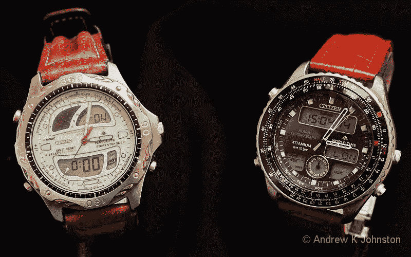
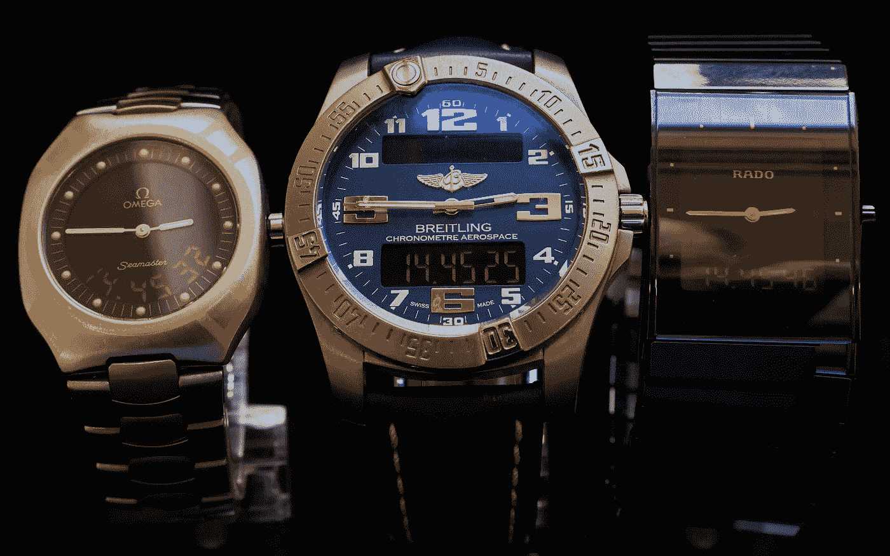
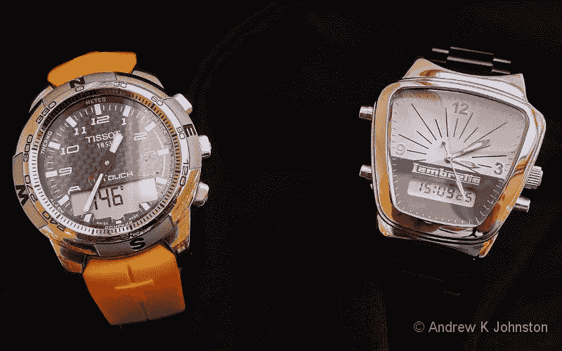
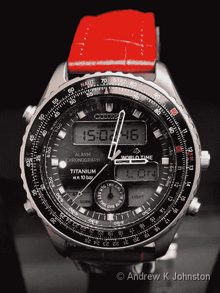

# 来自手表收藏的软件架构课程

> 原文：<https://medium.com/hackernoon/architecture-lessons-from-a-watch-collection-805977c19353>

Early 1990s Hybrid Watches

我最近[开始收藏手表](http://www.andrewj.com/blog/2017/collection-or-obsession/)。为了与众不同，为了控制成本，为了体现我一直喜欢的风格，我所有的手表都是模拟/数字混合型号。在这种限制下，它们在年龄、成本、制造商和风格上都有很大差异。

我想写一些关于我的观察的东西，但不仅仅是一篇关于我的收藏的吹捧文章。同时，我早就应该写一些关于软件架构和设计的东西了。这篇文章源于对我的收藏中是否有真正的软件架构师课程的疑惑。希望不要太做作，真的有。

## 混合架构为工作提供了合适的技术

手表和软件设计都有一个共同的趋势，那就是试图以同样的方式解决所有的需求。有时这是出于对某种技术的半宗教式的痴迷，而在其他情况下，这是由于工具的局限性和设计师的思维定势。像混合手表这样的设计表明，允许多种技术发挥各自的优势可能是一个更好的解决方案，甚至不一定会增加复杂性。

使用两个或三个旋转的指针来指示时间是一个优秀、优雅和经过验证的解决方案，可以说是比数字等效物更有效的“快速浏览”。然而，对于任何超出这一基本功能的东西，模拟钟表界早就有了一个非常贴切的名字:“复杂功能”。即使是最简单的附加功能，机械复杂性也会迅速增加。相反，即使是我最便宜的手表也有秒表、闹钟和万年历，而且大多数都支持多个时区，容易甚至自动调整行程和时钟。发光涂料的斑点使手表在黑暗中可读，但照亮小型数字显示器更有效。

这种混合方式也解决了审美挑战:虽然许多模拟手表是美的东西，但大多数数字手表却不是。混合动力手表(就像模拟手表一样)肯定会受到批评，但我还是收集了一些非常漂亮的例子。

给软件架构师的教训很简单:如果试图用单一技术做所有事情的妥协太大，不要害怕拥抱混合解决方案。混合架构是用在正确地方的强大工具，而不是被纯粹主义者的“思想警察”无情淘汰的东西。

## 一个强大的，分层的架构促进长寿

Sisters Under the Skin, or Brothers from Another Mother?

看看这三款腕表:1986 年的欧米茄 Seamaster、1999 年的拉多 Diastar 和最近的百年灵 Aerospace。很不一样，对吧？

视觉上，他们是。但是它们的操作几乎相同，以至于用户手册可以互换。显然，一些瑞士制表商只是在上世纪 80 年代末“做对了”，这种解决方案一直存在，在斯沃琪集团内外都存在，这种手表相当于鲨鱼或鳄鱼。虽然基本技术仅略有变化，但强大的层次感允许创建几个不同的基础模型，然后在尺寸、形状和外部材料方面有许多变化。

这是一个投资于强大的底层架构的长期价值的经典例子，但也确保了架构允许“步伐分层”，可见元素快速变化，而基础可能非常稳定。

值得注意的是，仅仅有基本的功能并不能保证长寿。这些手表没有一个是一成不变的，而是潜在设计的力量经久不衰。

哦，是的，欧米茄是一个全尺寸的男子手表(根据 1986 年)！稍后更多关于时尚的内容…

## 支持集成释放新价值

最早的双模手表只不过是一个简单的数字手表和一个石英模拟手表共用同一个外壳，但除了电池之外没有什么别的(有时甚至没有！).最便宜的仍然是这种型号，这可能是最仁慈的标签“独立”——我的 Lambretta 手表是一个很好的例子。这种模式实际上没有任何问题:提高数字部分的性能、模拟部分的质量以及表壳材料和设计，例如，我上世纪 90 年代初的西铁城手表就是我的最爱。然而，作为手表用户，你实际上只是在一种情况下运行两块手表。它们可能会也可能不会同时显示。

这三款顶级瑞士手表代表了整合的下一个阶段。时间由表冠移动指针设定，但数字时间同步设定。有一种简单的方法可以提前和延迟整小时，以简化旅行和时钟变化调整。秒显示是数字的，只是为了简化问题。让我们借用一个摄影术语，称之为“模拟优先”——仍然主要是手动的，但更加精简。

Seikos 在 21 世纪初实施的“数字优先”是又一个进步。您可以为您的当前位置和 DST 状态准确设置数字时间，并且您可以一键将数字和模拟时间更改为任何其他时区。秒针用作状态指示器，或者在时间模式下自动与数字时间同步。

然而，桂冠必须归属于天梭 T-Touch 手表。在这里，指针只是三个完全由数字功能驱动的指示器:它们在指南针模式下成为指南针，在气压计模式下显示压力趋势，在秒表模式下扫描，当手表处于省电睡眠模式时停在 12.00。他们还会报时！显然，完全集成释放了一整套以前无法获得的功能。

Extremes of analogue/digital integration

软件也是如此。将你的模块的控制点和集成点相互暴露，或者暴露给外部访问，当整体迅速变得比单独部分的总和大得多时，新的价值就出现了。

## 提供必要的调整…

虽然我喜欢一些手表手镯的外观(尤其是那些材料不同寻常的手镯，比如拉多的高科技黑色陶瓷)，但调整它们是一个复杂的过程，最终不可避免地要做出妥协:要么太松，要么太紧。即使手镯提供了某种形式的微调，并且你在某一点上“刚刚好”，它也会是错误的，因为随着时间的推移，手腕会自然地膨胀和收缩。皮革表带更容易调节，但通常以大约 1 厘米的增量进行调节，所以你又回到了折中的办法。

最理想的是带有弹性/弹簧元件或易于微调的手镯，但我的收藏中没有这样的例子。我听说苹果公司正在考虑为下一代 iWatch 设计一款电动自调节表带，但这听起来有些不靠谱。

另一方面，我为我的 Fitbit 准备了几条 10 英寸的硅胶带，可以以 2mm 的增量轻松调节。去想想…

我们都可以举出无数类似的软件例子，要么是“一刀切”的设置并不真正适合，要么是所谓的可控或自动设置错过了有用的价值。这里的教训是要了解哪里需要调整，并提供一些可行的方法来实现它。

## …但要避免在无用的事情上浪费精力

在天平的另一端，我的几款手表的“功能”价值可疑。最明显的是旋转表圈。在天梭中，它可以与指南针功能结合使用，以提供航向/方位信息。这真的很有用。公民僚机有一个功能的圆形计算尺。同样有效，但有点阻碍了进步:)。

At least the slide rule does something, if you can remember how!

“我的公民游艇”或百年灵航空公司的旋转表圈有什么功能吗？据我所知没有。

现在，我并不反对装饰或“有趣”的功能，尤其是在像手表这样的产品中，如今人们像佩戴珠宝一样频繁，而不是因为它的主要功能。但我确实认为它们需要是深思熟虑的结果，设计师需要仔细考虑哪些是值得努力的，哪些带来的复杂性超过了它们的价值。这个教训同样适用于软件和硬件。

## …不要过度设计用户界面

这里的另一个问题是，除非是纯珠宝，否则手表确实需要尊重其主要功能，并支持轻松显示时间，最理想的是适合视力不同和光线条件不同的用户。虽然我已经成为拉多的骄傲拥有者近 18 年了，但随着我 50 多岁的视力改变，它作为一个报时设备变得越来越令人讨厌，主要是因为它的“低对比度”设计。它并不孤单:例如，我非常漂亮的公民游艇驾驶员有金色和浅绿色的手和金色和浅绿色的脸，这几乎使它在某些光线下回到纯数字手表！

另一方面，百年灵 Aerospace 也非常优雅，但却是清晰的典范，具有高对比度显示屏和清晰的标记，包括实际数字。这是可以做到的，信息是清晰和简单胜过用户界面中的“设计”。

软件也是如此。我并不是唯一一个写文章哀叹现代设计中对比度和色彩丧失所带来的可用性问题的人。信息是“保持简单”，并确保你的内容是适当可见的，不要隐藏它。

## 时尚驱动科技。时尚与卓越的技术无关

我所有的手表都是很好的计时器，除了那些奇怪的用户界面小毛病，只要偶尔更换一下电池，就能准确可靠地运行很多年。然而，如果你拿起手表杂志，或浏览任何专门的博客，几乎没有提到这种设备，或者主要是石英/数字手表。

相反，就像世界上的许多其他东西一样，我们看到了两种更“极端”的选择:手动上弦和“自动”(即自动上弦)机械表，或者“每天充电”(每隔几年更换一次)智能手表。前者可能是非常优雅和令人印象深刻的工程作品，但会停止并需要重置，除非你至少每隔几天给它们上弦或佩戴它们——这对收藏家来说是一个挑战！后者提供高功能，但似乎很少能提供 30 年的耐用服务，因为我们知道它们会在那段时间内过时。

从本质上来说，时尚已经驱使市场用“挑战性”的替代方案来取代一项经过验证的可靠技术，这些替代方案对于核心需求来说可能是不太好的解决方案，至少在它们不成熟的时候是如此。

这并不新鲜，也不是手表市场独有的。在软件领域，我们看到了许多类似的趋势，这些趋势似乎也是由时尚而非技术因素驱动的。一个很好的例子，尽管可能有点争议，可能是以服务器为中心的网站技术的取代，这些技术非常容易开发、调试和维护，而基于脚本语言的以客户端为中心的解决方案更加复杂和棘手。可能存在真正的体系结构要求，该要求指示使用这种技术作为解决方案的一部分，例如“这种有效载荷易于保护并作为原始数据发送，但是传输完全渲染的数据很困难且昂贵”。好吧。但是“这是脸书做的”或“这是现代的解决方案”不是建筑，只是时尚的声明。

从更积极的角度来看，另一种力量可能会纠正事情。早些时候，我把欧米茄/拉多/百年灵的设计比作鲨鱼的进化位置。关于鲨鱼还有另一件事:进化一直使用相同的设计。鲨鱼、旗鱼、鱼龙和海豚本质上是升级了底层架构的成功设计的连续再利用。现在，Fossil 和其他公司开始发布混合智能手表，带有模拟指针和成熟的智能手表数字显示屏。

用时尚术语来说，有来有往。这适用于许多东西，包括手表和软件架构。

## 结论

试图理解一组相似人工制品的家族关系、相似性和差异性是很有趣的。对于软件架构师来说，尝试并理解它们背后的架构特征也是很有用的，特别是这如何帮助一些设计持续并逐步发展以交付长期价值，这是我们在软件中经常无法实现的。同时，认识到非架构性的考虑对架构的影响也是有益的。从架构的角度考虑其他对象的组件、关系和动态，我们自己的软件产品的架构将从中受益。

*最初发表于*[*【http://www.andrewj.com】*](http://www.andrewj.com/blog/2017/architecture-lessons-from-a-watch-collection/)*。*