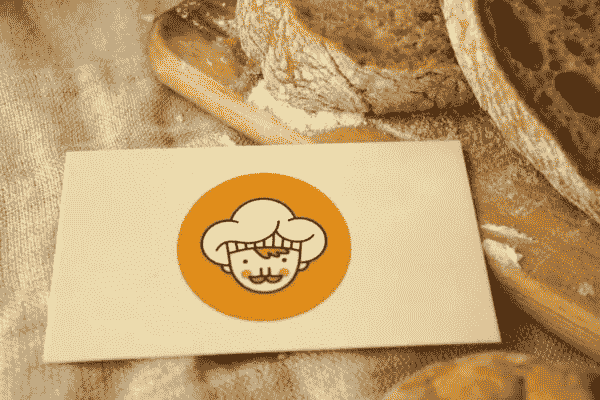

# 名片还有意义吗？

> 原文：<https://medium.com/hackernoon/are-business-cards-still-relevant-f35748d45a6c>

如今，一切都数字化了。商业是在网上进行的，我们通过数字平台进行会议，这意味着传统的商业工具，如纸张、传真机，甚至物理办公室都开始失去意义。

然而，在我们拥有的所有传统商务工具中，名片仍不失其重要性。

以下是几个原因:

# **它们是促销和营销的绝佳工具**

名片是推销自己最简单的方式之一，尤其是当你经营一家小企业的时候。你希望你给的那个人会用上面的信息联系你，甚至可能把你介绍给其他需要你服务的人。

但是，为什么要把东西放在那里呢？

你可以很容易地把你的名片变成一本小册子，告诉你的潜在客户你能为他们做些什么。或者，你也可以把它变成一个令人难忘的[促销工具](https://www.forbes.com/sites/briansutter/2018/06/23/free-marketing-tools-every-small-business-marketer-should-try/#5b7b0b55739a)，让人们想起你的企业。

# **记住，不是每个人都有智能手机**

是的，你可能很难理解这些人是如何度过他们的一天的，但实际上有很多人仍然没有自己的个人智能手机。有些人只是把电脑放在家里，然后在那里做他们想做的事情。

如果你遇到这些人，你需要他们联系你，名片确实是最好的方式。

# 名片给你合法性

你可能不知道这一点，但人们会非常喜欢与他们觉得可以信任的品牌和企业打交道。也就是说，大多数人在面对没有好名声或历史悠久的企业时，倾向于做一件事；他们根据他们的长相来判断他们。

你告诉人们你经营着一家值得信赖和可靠的企业的最好方式之一是拥有一张专业的、看起来可接受的名片。

# **名片让你更容易接近**

有了名片，你随时都可以联系到。

字面上。

互联网中断或停电等可能影响现代信息传递和交流方式的事情，不会影响古老的名片。如果你去度假或去森林里，你会遇到一些人，你可以塞给他们你的名片，让他们放心，他们有你的详细资料，可以在他们想联系你的时候联系你。

此外，如果你在飞机上，你需要关掉手机，名片是你与人见面和交流的合适方式。

# **他们在文化上是合适的**

交换名片是商业活动中由来已久的仪式。很多人在给你名片的时候都希望你能还给他们，而且有很大一部分人仍然认为名片是合适的商务工具。

当你遇到这些人时，你最好准备好给他们一些东西。

在某些地区，人们会根据你的名片来判断你如何开展业务。所以，除了拥有一张名片之外，你还需要一张看起来不错的名片。

# **轻松简单**

这些天，很多人认为他们可以简单地将他们的信息发送给其他人。唯一的问题是，这仍然需要获取您的电子邮件信息。

因此，需要一张名片。

在当今世界，共享信息非常容易，尤其是现在许多数字设备允许人们通过将信息从一个设备“传送”到另一个设备来共享信息。然而，即便如此，你也永远无法确定你未来遇到和接触的人使用的是和你一样的设备。

为了确保他们仍能得到你的详细信息，你还可以塞给他们一张名片，给自己减压

# **他们帮助联网**

如今，绝大多数商务网络活动都是在虚拟环境中进行的。然而，尽管我们都无法否认人们之间虚拟网络的扩展水平，但这一趋势无法超过面对面网络的水平，长期以来，面对面网络一直是与潜在客户和其他企业主发展关系的最有效手段。

面对面的交流是寻找商业机会的最好方式，它也有助于促进你的销售。

在这种情况下，名片扮演着重要的角色。