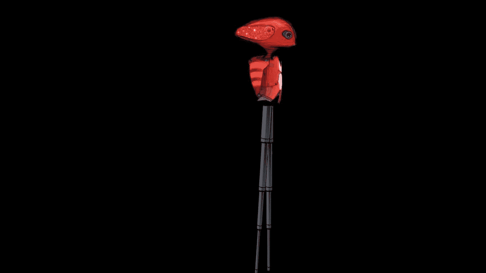
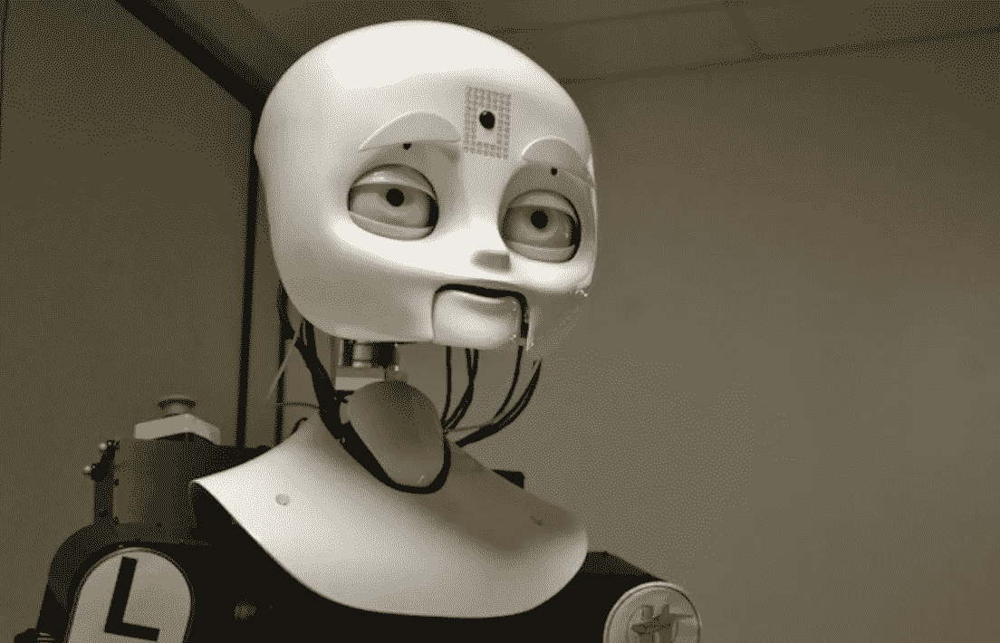
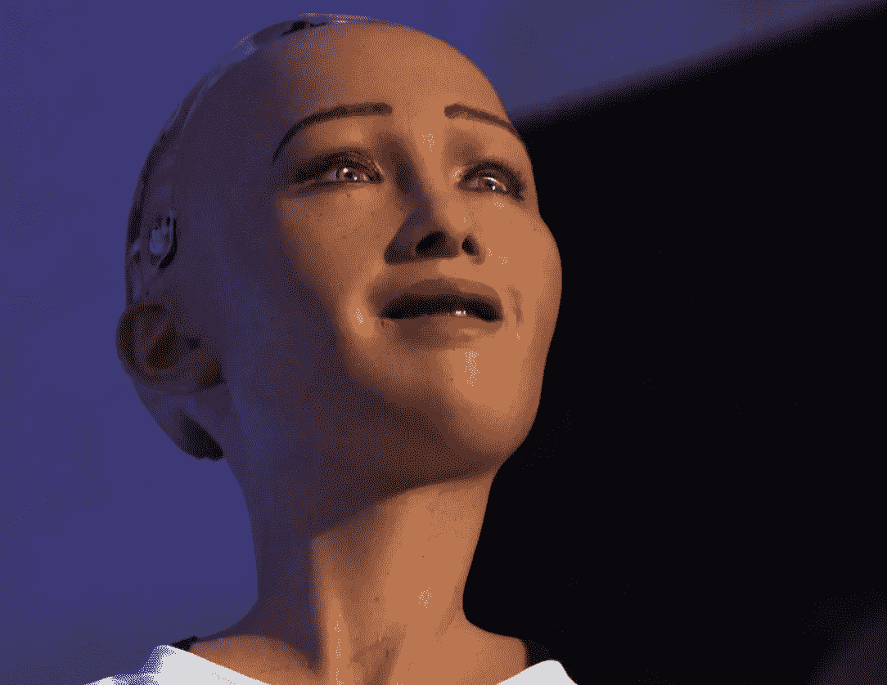
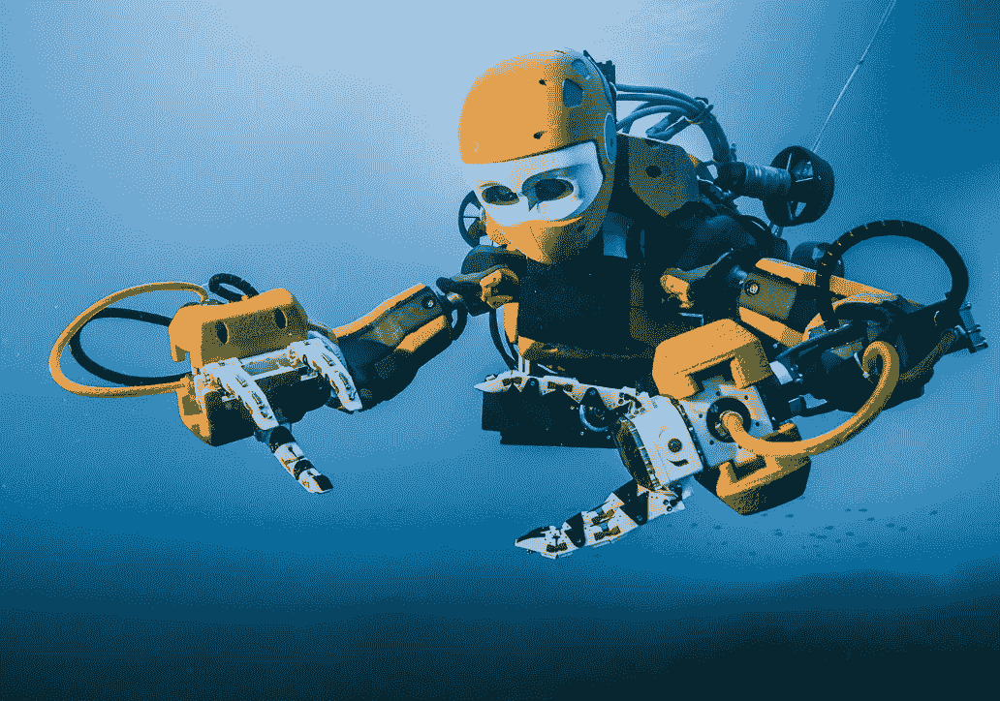

# 人们正在失去对机器人的控制吗？

> 原文：<https://medium.com/hackernoon/are-people-losing-control-over-robots-38b6af76a889>

人类长期以来一直对机器人的想法着迷——类似人类的机器人。50 年前，美国作家、波斯顿大学生物化学教授艾萨克·阿西莫夫发明了他著名的机器人三定律*——一套旨在确保机器人友好行为的规则。艾萨克·阿西莫夫想象了一个未来的世界，在这个世界里，人形机器人司空见惯，而且，众所周知，它们用机器人三定律编程来帮助——而不是伤害——它们的人类同类。

Octavia

我们习惯了机器像人一样行动的想法。我们甚至习惯于认为机器的思维方式会让我们想起人类。例如，**奥克塔维亚**，一个为海军舰艇灭火而设计的人形机器人，已经掌握了一系列令人印象深刻的面部表情。

Sophia

**由人工智能开发者**大卫·汉森**领导的汉森机器人公司的社交类人机器人索菲亚**，拥有“人类皮肤”的外观和 50 多种面部表情。是的，我们人类，希望我们的机器人有情感！

Ocean One

另一个神奇的机器人，名为 **OceanOne，**是由乌萨马·哈提卜教授领导的**斯坦福机器人实验室**团队创造的，它考虑到了人类的技能和能力。 **OceanOne，**一种双手水下人形机器人，不仅可以模拟人类潜水员的能力，还可以与海平面上的团队合作，提供认知能力和专业知识。

尽管事实上“触觉反馈”可能不是每个人都熟悉的一个术语，但你几乎可以保证你已经使用过它了。简单地说，“触觉反馈”或“haptics”是触摸反馈的使用。在最基本的形式中，触觉是通过智能手机的振动来感受的。将接触力反馈给操作员，使人类控制者能够分享触觉，这对敏感操作至关重要，如深海栖息地采样或从沉船中收集文物。

现在，当我们的机器人拥有情感或其他人类独有的特征时，这里就有了道德方面。这些问题在**奥克塔维亚**的案例中得到了很好的证明，它被派往令人恐惧、痛苦或潜在致命的情况下，代替不那么可有可无的人类队友，或者**海洋一号**，在人类无法生存的深水中旅行，承担对人类潜水员来说太危险的高技能水下任务，并开辟了一个全新的海洋探索领域。

到目前为止，我们所熟悉的第一代机器人是由人类编程的。

现在我们处于机器人学的新阶段，编程机器人被**机器学习机器人**取代。MLR 的核心思想是，机器(不是人)在使用一些过去的“学习”数据的同时，构建用于未来决策的算法。MLR 的目标是设计一个有效的算法，从统计上“几乎总是”给出正确的答案。但是这里我们面临一个问题…

1.  “几乎总是”并不意味着总是——MLR 决策并不总是正确的，在大多数情况下已经足够好了。现在想想你的厨房机器人，它每天早上给你做完美的炒鸡蛋，然而，“千分之一”会让你的房子着火……对此你会怎么说？
2.  人类无法理解 MLR 构建的算法的推理。
3.  人类无法干预 MLR 制造的机器人——你如何知道感知的“错误举动”是否不是唯一正确的举动？人类没有这样的速度和信息量

有很多值得思考的东西，有时当我们清楚地意识到机器人革命正在发生，世界正在失去控制时，我们会起鸡皮疙瘩。但我们不会因此而惊慌失措。只要有担忧，就有机会。

例如，正如麻省理工学院技术、经济和国家安全项目现任主任 R. David Edelman 在接受《连线》杂志采访时所说，增强人类工作的协作机器人可能是将制造业工作[带回美国](https://www.wired.com/story/the-tale-of-the-painting-robot-that-didnt-steal-anyones-job/)的绝佳机会。“我接触过的很多业内人士，尤其是高科技行业的人士，都希望将尽可能多的制造业带回美国。有几个原因。第一，随着越来越多的专有机器人系统的出现，知识产权保护越来越受到关注。第二，许多美国高管和其他人担心中国经济的安全性和可持续性。”

许多聪明人目前正在致力于制造将对我们未来生活产生影响的类人机器人。

以下是你需要了解的机器人领域的人员名单，你可以在[大会](http://svod.org/)上见到他们:

发明者:

乌萨马·哈提卜
大卫·汉森——负责创造索菲亚的人
乔·琼斯:Roomba 的发明者

投资者:

Dmitry Grishin，Grishin 机器人公司

乔希·沃尔夫[勒克斯资本](http://www.luxcapital.com/)，

海伦·泽尔曼·博尼斯克

马尼什·科塔里 [SRI Ventures](https://www.sri.com/engage/ventures)

朱利安·库尼汉，示意图风险投资公司。

谢文，凯鹏华盈

David Weiden——科斯拉风险投资公司普通合伙人

*机器人三定律是科幻作家艾萨克·阿西莫夫发明的一套规则。1942 年推出的规则是:

1.  第一定律——机器人不能伤害人类，也不能坐视人类受到伤害。
2.  第二定律——机器人必须服从人类给它的命令，除非这些命令与第一定律相冲突。
3.  第三定律——机器人必须保护自己的存在，只要这种保护不与第一或第二定律相冲突。

**Sophia 是由香港 Hanson Robotics 公司开发的一款社交人形机器人。索菲亚于 2016 年 2 月 14 日被激活，并于 2016 年 3 月中旬在美国得克萨斯州奥斯汀的 South by Southwest Festival 首次公开亮相。