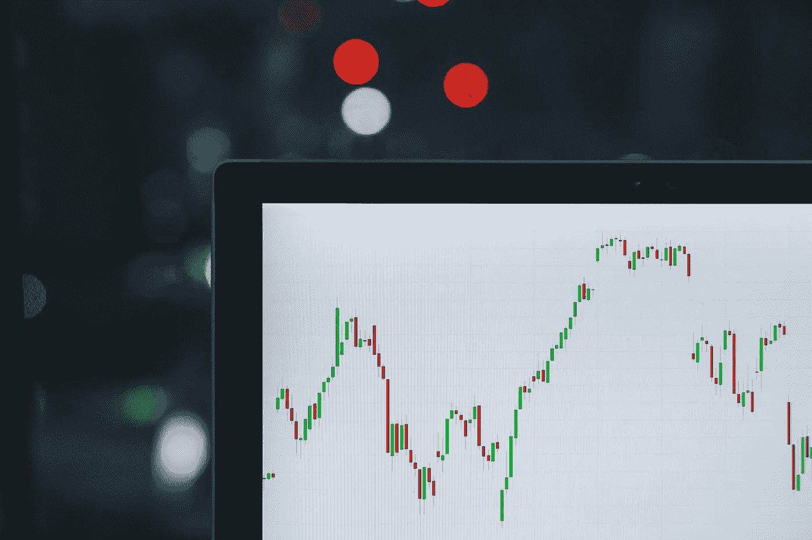
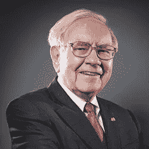
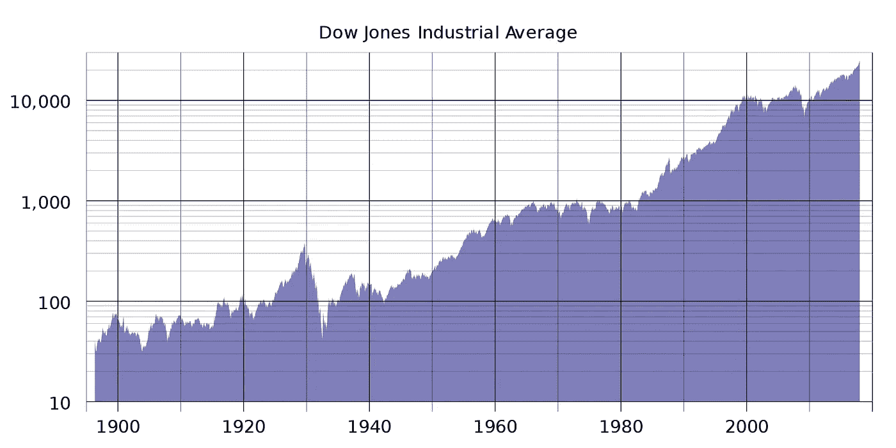
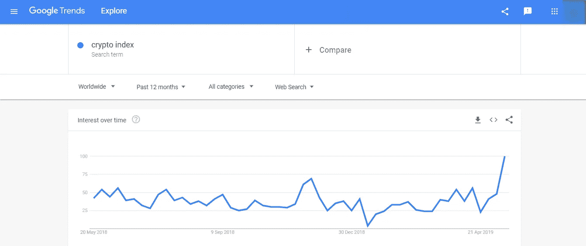
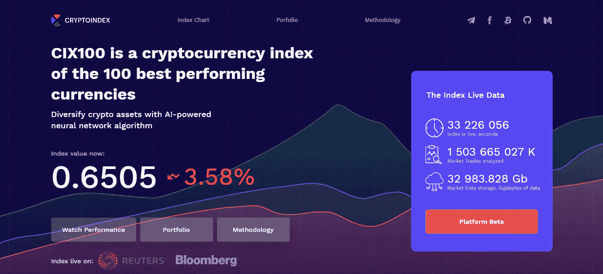
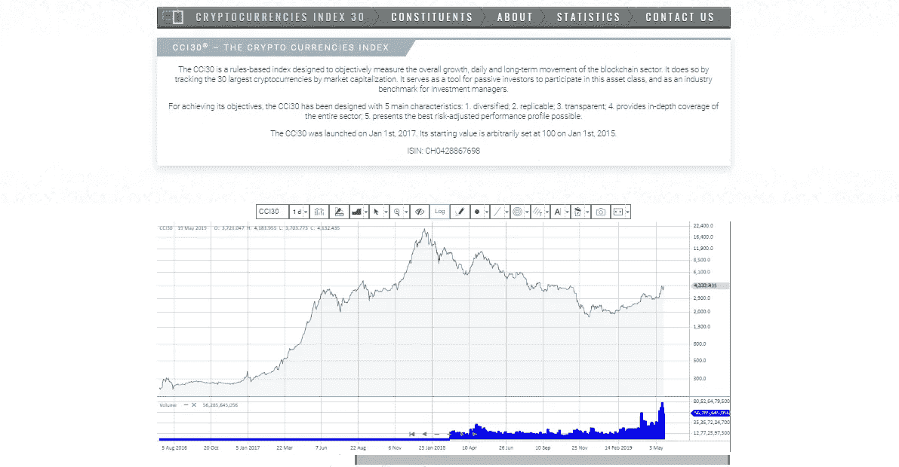
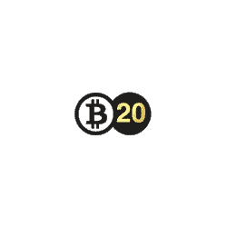
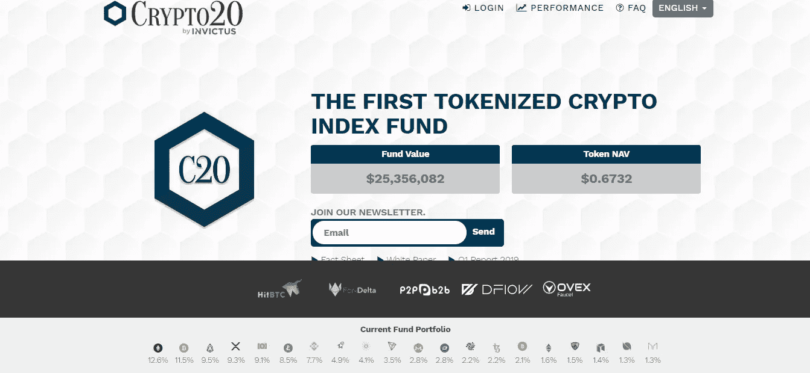
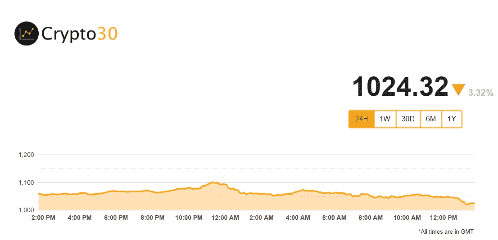
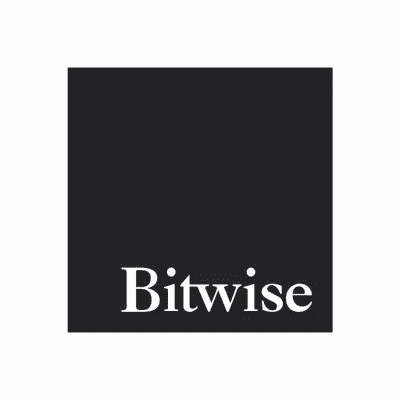

# 世界加密索引已经在这里了吗？

> 原文：<https://medium.com/hackernoon/are-world-crypto-indexes-already-here-3633b1d8c87>

Photo by [M. B. M.](https://unsplash.com/photos/ZzOa5G8hSPI?utm_source=unsplash&utm_medium=referral&utm_content=creditCopyText) on [Unsplash](https://unsplash.com/search/photos/index?utm_source=unsplash&utm_medium=referral&utm_content=creditCopyText)

> “有了指数，一无所知的投资者实际上可以跑赢大多数专业投资者”——沃伦·巴菲特。

One of the most
successful investors
of all time

# 为什么索引如此重要？

该指数的主要目标是创建一个指标，投资者可以通过它来描述某个行业的股票报价和硬币运动的一般方向和“速度”。

看着指数的动态，任何交易所交易的参与者都可以了解各种因素对报价的影响。他可以清醒地评估运动的整体趋势，而不必评估所有公司的立场。

索引是你的眼睛和耳朵。

# 来自历史

*Charles Henry Dow*

历史上第一个指数是查尔斯·道在 1884 年创建的指数。那时他是一名记者，对技术分析非常感兴趣。

他的计算是基于当时美国 11 家最大的运输公司的报价——该指数被称为道琼斯运输平均指数。

## **但是指数也有动荡的时候。**

该指数最显著的下跌是在 20 世纪 30 年代初的大萧条期间造成的，超过 7 家公司在该指数中被取代，稍后又有 8 家公司被取代。该指数经历了四次以上的熊市，损失了总价格的三分之一左右。

但该指数的最高百分比跌幅发生在 1987 年的黑色星期一，当时道琼斯指数下跌了近 22.6%。在 911 袭击后的第一个交易日，该指数下跌超过 7.1%。人们处于恐慌之中。许多人开始匆忙抛售股票。但这有道理吗？

*人们应该永远记住，市场主要是情绪，而不是数字。*

# 加密货币也一样吗？

事实上，是的，加密货币是数字形式的相同公司的股票。随着市场上许多机构投资者的到来，对指数的需求增加了。而 Cryptomarket 无法满足这种需求。

几家公司立即声明他们正在开发指数。但是它们之间有什么不同呢？

**让我们看看！**

## [Cryptoindex.com](https://cryptoindex.com/)

CryptoIndex 利用了当前金融界的知识和专业经验，以确保其成功的障碍最小化。虽然世界上加密货币的数量超过了 2000 种，但 Cryptoindex 推出了一个新的人工智能平台，该平台可以自动选择并重新平衡 100 种最佳硬币。它通过一套严格的规则、过滤器和标准来制作加密货币指数，然后将信息输入独特的人工智能神经网络 Zorax，从而实现这一目标。

利用所有这些信息，Zorax 然后应用他自己的一套计算方法，使用网络和社交媒体上的一系列因素和来源，不断重新平衡 100 枚硬币的重量，以给出当前市场的代表。Cryptoindex100 的定位是成为追踪、跟踪和交易加密货币市场的行业基准。正如官方网站上介绍的那样，该团队在过去几年中一直致力于该算法。

*此刻，进入* [***平台是免费的。***](https://platform.cryptoindex.ai/)

[**CCI30**](https://cci30.com/)

CCi30 指数(CryptoCoin Index)于 2017 年 10 月由 Igor Rivin(天普大学数学教授、圣安德鲁斯大学皇家数学教授)、Carlo Shevola(法律和金融咨询服务领域的专家)以及 Robert Davis(工程师、IT 专家和程序员)领导的专家团队推出。

该指数包括 30 种市值最大的加密货币，其中每种加密资产都有一个权重。CCi30 指数组合的各个组成部分每季度进行一次全面重新计算，而各个组成部分的权重则每月重新计算一次。CCI30 指数允许创建一个平衡的投资组合，使利润最大化，风险和波动性最小化。今天，CCi30 被 Cryptos 基金用于加密货币报价的被动跟踪。

[***自由出入。***](https://cci30.com/)

[**Bit20**](http://www.bittwenty.com/)

Bit20 是一种加密货币指数基金，包含在基于金融平台 BitShares 的智能币中。该指数包括除 Ripple 之外资本化程度最高的 20 种主要加密货币。每个月的 21 号，Bit20 启动一个算法来计算指数，包括新的头寸，并重新计算现有头寸的比率。迄今为止，其费率为 70 万美元。目前，一些用户认为该项目是一个骗局。bitcointalk 官方线程的用户活跃度相当低。

[**CRYPTO20**](https://crypto20.com/)

第一个项目是 Crypto20，这是第一个令牌化的加密货币指数基金。该项目为前 20 种加密货币提供多样化，现在只需持有一个代币即可。该项目已于 2017 年 11 月完成 ICO，C20 Token 已在交易所上市交易。

根据白皮书，CRYPTO20 不是一个平台，它是一个加密货币指数基金。与此同时，该公司已成立为开曼有限责任公司(LLC)，C20 是一个公用事业令牌，而不是证券，因为它应该是一个基金。

CRYPTO20 是首只令牌化混合指数基金，包含市值最高的 20 种加密货币，每周进行再平衡。这个指数基金有自己的令牌 C20，代表投资者在 CRYPTO20 中的份额。通过购买这种代币，投资者也在投资指数中呈现的加密货币。指数组合 CRYPTO20 的元素的最大权重为 10%。目前的界面不简单方便；它有英语，俄语，汉语和朝鲜语本地化。

[**CAMCrypto30**](https://www.crypto30.com/)

CAMCrypto30 指数由加密资产管理公司 Timothy Enneking 发行。该指数基于罗素 2000 和富时 100 股票指数。CAMCrypto30 是根据市值最大的 30 种加密货币计算出来的。指数的重新平衡每月进行一次，以考虑加密资产组合的价格波动，价格每 5 分钟重新计算一次。第三方网站在官方网页上提供了一个有趣的功能，允许在线跟踪索引数据。

[**保持 10 指数**](https://www.bitwiseinvestments.com/)

2017 年底，Bitwise Asset Management 推出了 HOLD 10，这是一只由 10 种加密货币组成的管理型指数基金，考虑到了它们的市值。指数中出现的每种加密货币都应该在几个交易所交易，其月度交易量应该超过过去三个月内报价的 30%，它必须具有自由浮动的汇率，并且不与另一种资产挂钩。

该基金监测 10 大加密货币的比率并进行加权，考虑到未来五年的发售时间表，对市值的通货膨胀进行了修正。不考虑加密市场新闻。硬币列表的修订每月进行一次。根据公布的信息，在工作的前两个月，HOLD 10 指数为投资者带来了 45%的利润。该网站很少更新，目前该平台只有英文版。

# 结论

总之，我可以补充一点，无论你是一个多么成功的投资者，使用专业工具，如加密指数，都会降低你的投资风险。耐心等待，为你成功投资！

Don’t put all your eggs in one basket!