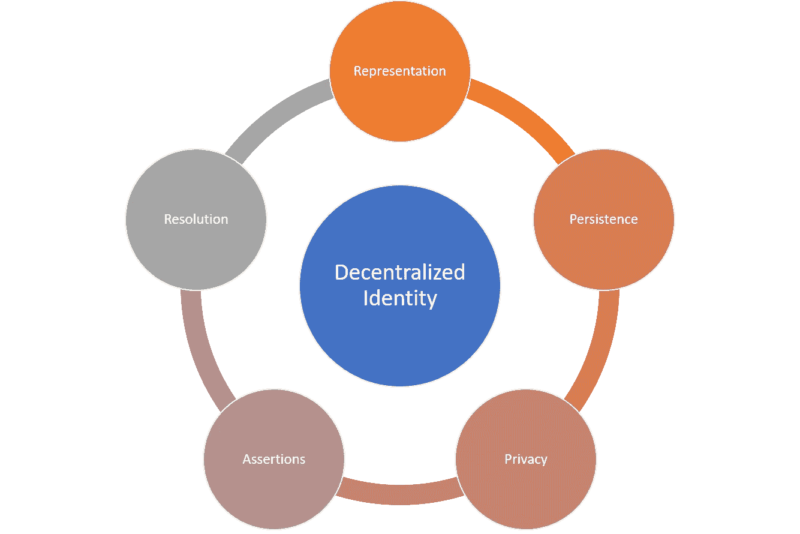
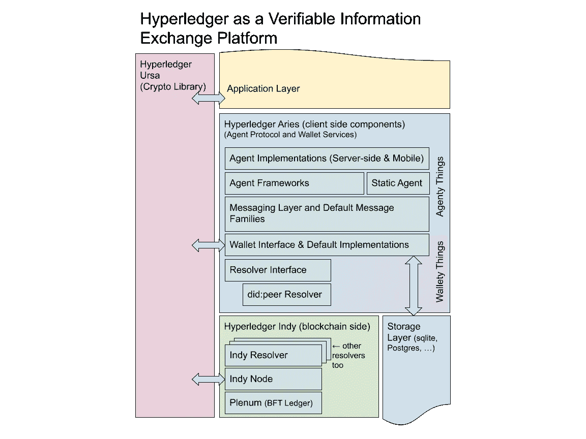
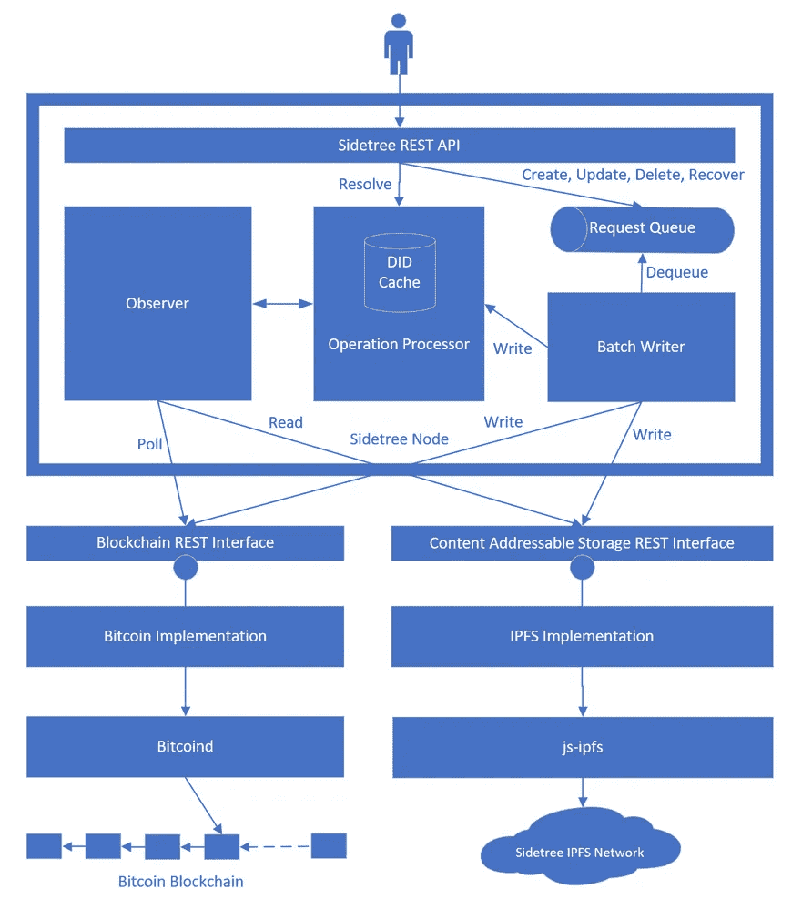

# Aries 和 ION:区块链应用中去中心化身份的两种不同视角

> 原文：<https://medium.com/hackernoon/aries-and-ion-two-different-perspectives-of-decentralized-identity-in-blockchain-applications-c80dbe0bb241>

身份是区块链应用程序的关键基础元素之一。在一个以不可信的匿名计算为基础的生态系统中，建立身份的概念绝非易事。此外，无论我们谈论的是私人的还是许可的区块链，身份的技术基础都是相对不同的。这个挑战只会让这个地区更加迷人。本周，IBM 和微软都发布了新技术，分别致力于解决许可和公开区块链的身份挑战。虽然方法不同，但它们让我们得以一瞥这一领域的创新是如何发展的。

身份的挑战不能局限于单一的技术构件。如果我们考虑分散式应用程序(DApp)中身份的生命周期，应该考虑几个关键因素:

**表示:**描述主体身份的断言的可移植表示。

**持久性:**存储和检索主体身份的机制，同时确保其隐私性。

**隐私:**保护分散分类账中主体身份的模型。

**断言:**构成关于主体身份的独特陈述的特定声明。

**解析:**解析和验证特定主体身份的机制。

这些元素是许可的和公开的区块链身份所共有的。然而，它具体实现是完全不同的。公共区块链享有更大网络的优势，可用于通过共识发布和声明身份，但在访问控制和隐私方面有一些限制。许可区块链在更安全的拓扑结构下运行，在这种拓扑结构中，诸如访问控制策略之类的功能实现起来相对简单，但有一个限制，即身份仍然由少数几个集中的发行者控制。

微软和 IBM 都在区块链领域拓展创新的边界。最近，两家科技巨头都推出了不同的举措，专注于在许可和公开的区块链实现身份的构建模块。

# 超级分类账白羊座

Aries 是 Hyperledger 项目家族的最新成员，专门关注身份。从概念上讲，Hyperledger Aries 支持受控数据交换的对等消息传递，并支持与不同区块链和其它分散分类帐的交互。这和身份有什么关系？虽然 Aries 提供了通用的安全消息传递功能，但核心实现关注的是身份断言的可移植性。更具体地说，Aries 基于以下目标:

*   为不同的分散系统提供对等交互、秘密管理、可验证的信息交换和安全消息传递的代码。
*   促进实际的互操作性，以支持正在进行的标准工作，并将 Indy 内部开发的技术的适用性从当前的社区组件扩展到单一、有效的业务解决方案。

在 Hyperledger 的环境中，Aries 建立在另外两个项目之上，这两个项目已经建立了分散身份的不同元素。

**[**Hyperledger Indy**](https://www.hyperledger.org/projects/hyperledger-indy)**:**一个专门构建的分布式分类帐框架，支持分散身份功能。**

****[**Hyperledger Ursa**](https://www.hyperledger.org/projects/ursa)**:**一个框架，包括使用不同机制保护信息的密码原语，如数字签名或零知识证明。****

****使用 Indy 和 Ursa 作为基础，Hyperledger Aries 构建了一个非常有趣的架构，如下图所示:****

********

****以前的体系结构包括分散式身份解决方案的一些关键构建块，包括:****

*   ****用于创建和签署区块链事务的区块链接口层(称为解析器)。****
*   ****一种加密钱包，用于安全存储加密机密和用于构建区块链客户端的其他信息。****
*   ****一种加密的消息传递系统，用于使用多种传输协议的客户端之间的帐外交互。****
*   ****使用 Ursa 中的 ZKP 原语实现支持 ZKP 的 W3C 可验证凭证。****
*   ****分散式密钥管理系统(DKMS)规范的实现目前正在 Hyperledger Indy 中酝酿。****
*   ****一种基于安全消息传递功能构建高级协议和类似 API 的用例的机制。****

****在某些内容中，Hyperledger Aries 可以被视为 Hyperledger Indy 的解析器，它将其功能扩展到其他区块链技术，但 Aries 远不止于此。该框架包括一整套组件，如分散式密钥管理标准(DKMS)，允许将不同的身份功能集成到平台中。****

# ****微软离子****

****在过去的几年里，微软一直在积极研究分散身份的领域。最初，这项研究仅仅体现为几篇研究论文，但现在，这家科技巨头公布了其雄心勃勃的愿景的第一部分。[身份覆盖网络(ION)](https://github.com/decentralized-identity/ion) 在比特币区块链中实现了完全分散的身份。从根本上说，ION 是一个公共的、无权限的、开放的网络，任何人都可以使用它来创建 did 并管理他们的公钥基础设施(PKI)状态。****

****ION 平台是在[侧树协议](https://github.com/decentralized-identity/sidetree/blob/master/docs/protocol.md)之上实现的。Sidetree 是一个区块链不可知的、用于 PKI 标识符和元数据的第 2 层协议。ION 是比特币区块链 Sidetree 的具体实现。ION 的架构包括分散式身份系统的几个关键构建块，如下图所示:****

********

****遵循侧树架构，ION 是核心侧树逻辑模块、特定于链的读/写适配器和在节点之间复制数据的内容可寻址存储协议(例如 IPFS)的组合。这些组件共同实现了第二层 DID 网络的创建，该网络以每秒数千甚至数万次 PKI 操作的速度运行在现有区块链之上。离子既不需要特定的令牌或激励机制，也不需要新形式的共识。ION 的最初发布伴随着网络中的第一组活动节点。****

****ION 和 Aries 都代表了去中心化身份愿景的显著里程碑。通过他们的云平台，微软和 IBM 有机会向数百万用户和客户介绍这种转换身份架构。同样令人鼓舞的是，两家公司都加入了开发者社区，并采用了开源发行版。去中心化身份的战斗将是一场持久战，但基础似乎很强大。****