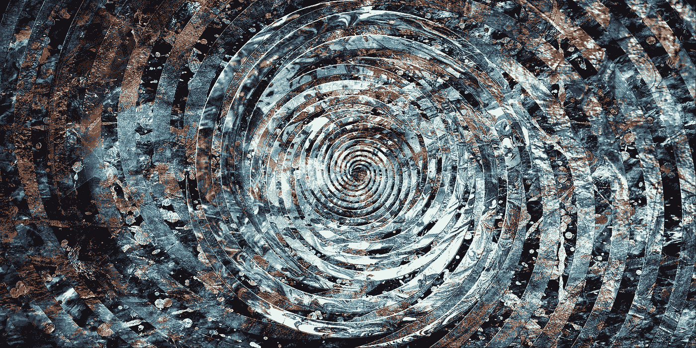
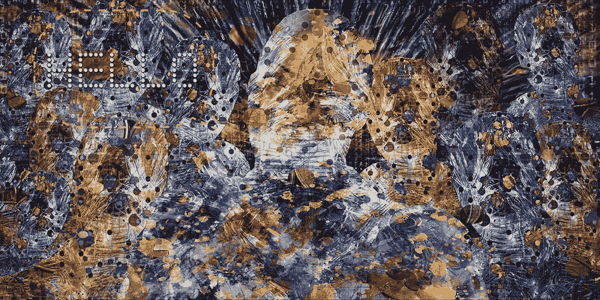
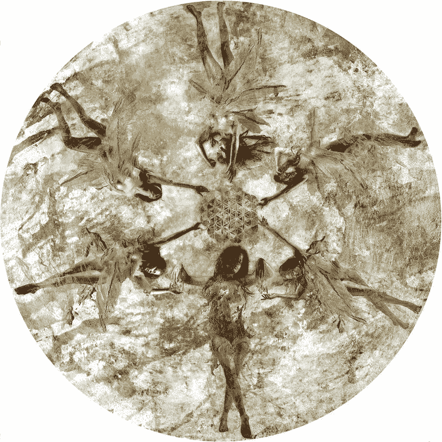
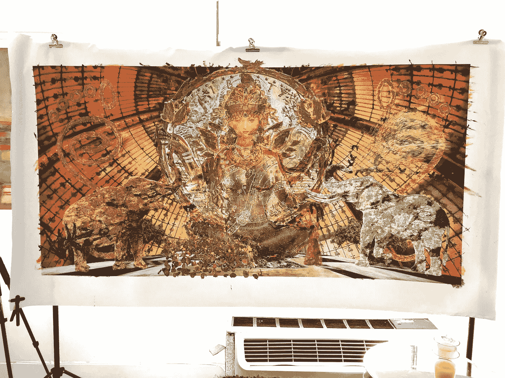
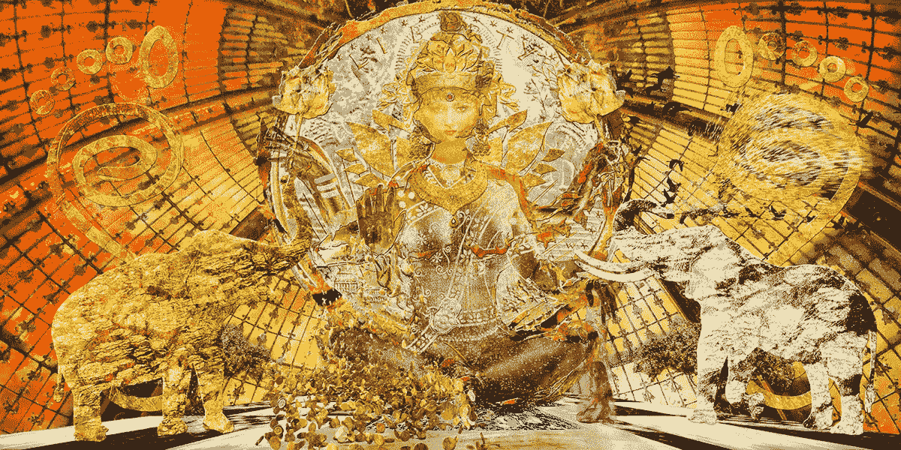
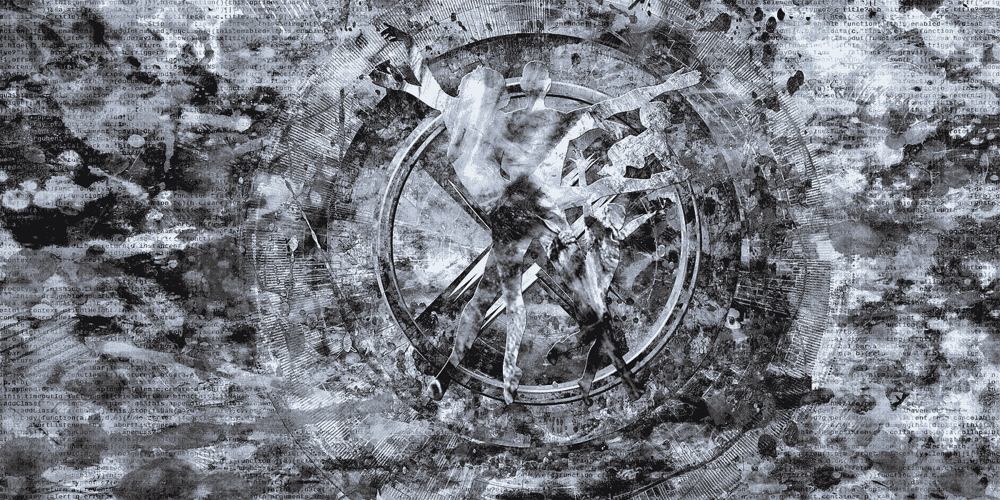
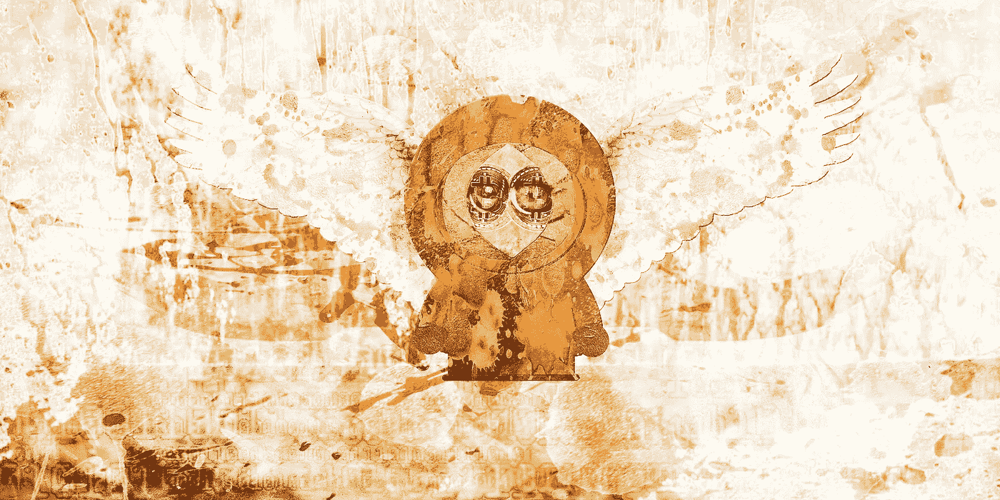
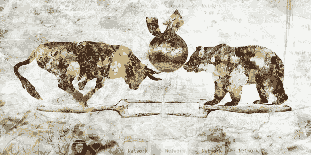
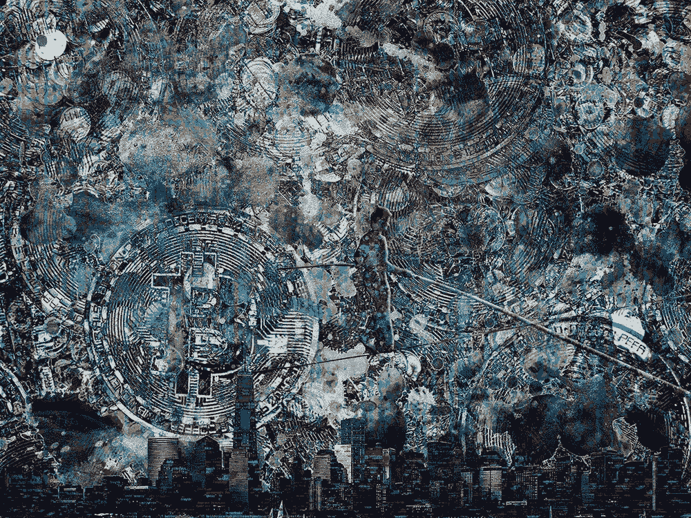

# 艺术家 VESA 解释了区块链技术如何激发他的加密主题艺术品

> 原文：<https://medium.com/hackernoon/artist-vesa-explains-how-blockchain-technology-inspires-his-crypto-themed-artwork-38e87422533b>

虽然区块链以分布式账本技术(DLT)而闻名，但它对价值数十亿美元的艺术市场的[影响在最近的巴塞尔艺术博览会迈阿密海滩活动中显而易见，该活动展示了近十几个不同的艺术和区块链面板。](https://www.forbes.com/sites/rachelwolfson/2018/12/12/blockchains-impact-on-the-billion-dollar-art-market-debated-during-miami-art-week/#43eb3b0d239a)

各种各样的艺术家也在巴塞尔艺术博览会上展出了他们的作品，表明区块链技术已经引发了一场以密码为主题的艺术运动。

我有幸采访了艺术家、表演者和演讲者 VESA，他在 2017 年创建了 ArtForCrypto.com 的[，现在正在区块链艺术领域迅速建立新的创作标准。](https://www.artforcrypto.com/)

**你是从什么时候开始创作灵感来自加密和区块链空间的艺术品的？是什么引发了这一切？**

也许最好先从我为什么创作艺术开始，因为这一切都联系在一起。我几乎所有的项目，甚至在电影、音乐和摄影的混合媒体艺术之前，都试图识别文化压力点和浮出水面的事物。10 年前，我参与了一部纪录片的制作，这部纪录片讲述了法定货币体系是如何运作的，同时我还就如何出售艺术品创新了一套新的定价体系。一旦我了解了全局，并看到它为数字时代提供了多少缺失的解决方案，跳转到区块链是很自然的。

不过，几年前，在和一位朋友喝咖啡的时候，他告诉我他是如何成为区块链投资者的。他告诉我他的进展，以及他如何花了四天时间试图找到一篇关于他的新世界的合适的文章与他的办公室分享。我很快意识到这是一个多么好的机会，以及这与我的加密价值观是如何契合的。接下来的四个月是完全沉浸的时间，几乎没有睡觉和狂热的研究，同时创造了第一批作品和 Crypto.Com 平台的艺术。这通常发生在那些意识到这项技术的影响力和我们的发展方向的人身上。

> 这一过程激发了其中一首名为《红眼》的作品。一旦聪下降，它真的是一个漩涡，把你吸进去。

“Red Eye” Digital by VESA

**是什么激发了你的秘密作品？**

在这种情况下，至少 6000 年来，国王和政府一直控制着本国人民的货币供应。比特币的推出，开启了货币与国家的分离。我们很快就会有各种各样的数字硬币。我们现在认为私人拥有的维珍航空公司是理所当然的，而不是像过去那样只有英国航空公司。事后看来，知道了教会和国家的分离对西方来说有多么重要，我很难想象这对我们人类的进化和未来意味着什么。

比特币不要求你是人类才能参与，所以当人工智能开始自主在线交易时，加密将是它的自然选择。这一切对交易市场意味着什么目前还无法说清，但看到 Alpha Go 和其他自编程军事人工智能创新的发展，它很可能是整个系统的基础。我们已经看到人工智能艺术品在佳士得以高价售出。当它开始收集艺术品时会发生什么？

> “你好”指的是我们当前和正在出现的现实。AI 已经在我们中间了，正在打招呼。

“HELLO” by VESA

意大利文艺复兴时期的艺术家们评论了他们那个时代的时代精神，并敢于想象明天会是什么样子。出于某种原因，这一传统已经被虚无主义的流行音乐所取代，但我是试图复兴它的艺术家之一。我以前的大部分项目，像范式转变的维娜·马里科项目或 LUX，都试图帮助文化转变。我最大的解决办法是简化模式转换和分层概念，并以一种创造性的方式将它们加工成大众传播的武器。对我来说，秘密艺术非常自然地符合这个主题，也有助于资助一些努力。通过我这样做，我可以帮助更广泛的采用。

“Flower Of Life” from the Veena Malik Project Project page

**解释你的一些作品意味着什么**

例如，拉克什米复活，一位印度教的财富和健康女神将许多相关的重要符号和价值指针结合在一起，向那些牺牲和祈祷她的帮助的人降下黄金和比特币。我发现令人着迷的是，几千年的传统可以如此容易地以一种对整个宗教有意义的方式消化比特币。加密与表现良好的国家并不相关，但真正的潜力取决于货币严重通胀的国家，因为这样或那样的原因，许多人无法进入传统的银行系统。这总共是人类人口的 39%。许多向拉克什米祈祷的人需要一个自我授权的信息。她象征性地接受了密码，这有可能改变和唤醒数百万人的现实。

Lakshmi (Resurrection) piece by VESA

Lakshmi (Resurrection, limited edition) piece by VESA

“解放价值”是我最近委托 Latium Coin 的作品。在与首席执行官戴维·约翰逊进行了几次交谈后，很明显，他不仅有一个帮助零工经济变得更可持续的解决方案，而且他认为家庭单位是有形利他主义的持续基础，而不是不断膨胀的国家项目。他们的标志也让我想起了 x 战警的故事，这是我最喜欢的漫威冲突。进化和权力利益之间正在进行的战斗希望事情保持停滞不前。思考了一些之后，主要的象征变成了达芬奇的《维特鲁威人》的更新版本，以家庭为基础，大胆地走出圈子的限制——我们都需要勇气去追随进化，而不是理想化过去。该项目还包括在 BTC 新闻上被报道，以及专门为该作品制作的视频，以帮助信息传播更广。

“Emancipation Of Value”
Latium Coin commission piece digital + limited edition re-paint canvas

从好的一面来看，“财富战士”是从一个播客中诞生的，主持人说:“比特币有点像南方公园的肯尼。不断死去又复活。”对于我们这些已经在这个领域呆了一段时间并做了研究的人来说，很明显，这是不断重复出现的点击诱饵文章。一旦价格从新高峰回落，它就按惯例宣告死亡。这篇文章取笑了这一点，并劫持了一个流行文化偶像，但也揭示了该系统的真正韧性。就连五角大楼和个人密码交易所都曾遭到黑客攻击，但十年来，尽管一直受到全天候攻击，没有人或任何事能够成功摧毁比特币系统。这在一定程度上解释了为什么说“比特币没有任何支持”是愚蠢的。

“Soldier Of Fortune” piece by VESA

熊市对你的工作有影响吗？

这无疑加大了项目融资的难度，甚至减缓了销售，但这种更大的视野让我不像“基础交易员”那样保守。在这种情况下，有一些深度和不太关心兰博基尼不仅仅是一种美德信号。这是生存和心理平静的策略，现在可能会遇到真实的，即使是那些刚刚赚了快钱的人。

> “叉和翻转”作品，除其他外，有助于看到冬天到夏天的自然部分。

“Fork And Flip” by VESA

**你认为加密艺术品会成为一种持续发展的类型吗？**

肯定会的。在这个领域已经有很多敬业的艺术家了。它让一些或多或少了解它的人真正受到金钱的启发，并教育那些传统上依赖复杂施舍和现代美第奇家族创造自己财富的人。它有助于艺术家超越贫困游戏，成为一个更大整体的自然组成部分。看到艺术界整体有多自恋，当然需要。如果你看看今天的大多数艺术，既然灵性仍然是禁忌，那么被认为是顶级艺术的就是批评或娱乐的东西。艺术和其他运动一起变得更有目的和更有力量。它为这一领域的人们提供了切实的帮助，他们都在为大规模采用而努力，这使得联盟变得很容易。

“It Used To Be Wired” Unique Digital piece by VESA

你认为这类艺术品未来会面临哪些挑战？

耐心一点，因为艺术和货币一样都处于起步阶段，我们很快就会看到它超越一般的商标抛光、技术噱头和简单的宣传。随着区块链变得更加稳定，监管方面的规则变得更加清晰，我们将看到更多的人受到这里可能发生的事情的鼓舞。对我个人来说，当前的挑战是为 2019 年和 2020 年的重大机遇筹集资金。它是关于让人们知道他们能从有深度和清晰的实质性艺术中获益多少。

在[数据仓库](https://databunker1.com/)的支持下，我最近还参加了在迈阿密举行的北美比特币大会。我们的计划是就如何在美国和欧洲开展两个 [Evolv Events](https://evolv.events/) 合作建立联系并制定进一步的计划。第一个是 Hodl 拉力赛和巴塞罗那区块链峰会 combo，目标非常远大。作为几天前刚刚确认的新成员，也是与 2019 年莱特币峰会有关的[莱特币基金会](https://litecoin-foundation.org/)的委托作品。本周，我将在 NSU 博物馆为劳德代尔堡的[艺术做一个关于密码和艺术的交叉的主题演讲，并在康拉德酒店做一个相关的表演。我喜欢创始人 Andrew 和 Evan 为这个节日所做的一切，他们特别希望我第二次来谈论加密和艺术。能够与那些已经熟悉 crypto 的人在一起，然后帮助艺术界更加习惯它，这很棒。令人惊讶的是，我的祖国芬兰在将这里作为一个热爱科技的地方方面进展缓慢，但我们与即将到来的赫尔辛基摄影节的合作将首次在我的家乡展示这项工作。](https://www.artftlauderdale.com/)

*你可以在我的* [*福布斯文章*](https://www.forbes.com/sites/rachelwolfson/2019/01/23/blockchain-technology-has-inspired-an-entire-crypto-themed-artwork-movement/#4be371b1eedd) *中阅读更多关于秘密主题艺术品运动的内容。*