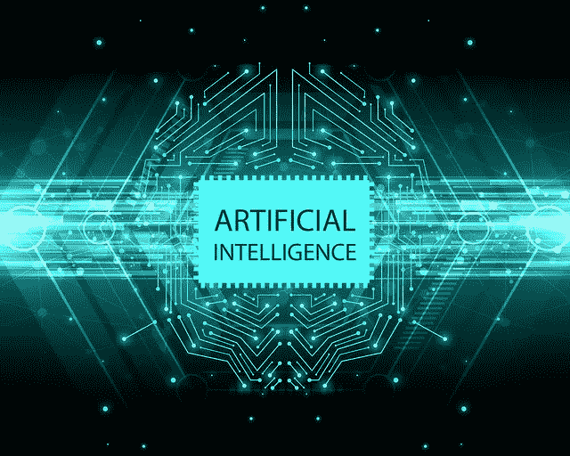

# 随着人工智能以极快的速度发展，硬件是否落后了？

> 原文：<https://medium.com/hackernoon/as-ai-moves-at-breakneck-speed-is-hardware-falling-behind-dbb11ae636a5>

## 巡回机器人在亚马逊巨大仓库的预定路径上纵横交错，转移包裹，减少了对人工的需求。

在 Re:Mars 大会上，[亚马逊](https://hackernoon.com/shaping-its-future-amazon-purchases-domains-related-to-cryptocurrency-8f05448e296)展示了其**新送货车“Scout”**，许多人认为，这将为其主要送货模式带来令人难以置信的效率，并使电子商务巨头实现其将送货时间从两天缩短到当天送货的承诺。

Scout Rover 正在郊区环境的 3D 模型上接受训练，包括 Rover 可能遇到的每个复杂细节。从每条人行道的不同纹理，甚至杂草植物，漫游者都被制作成能够尽可能容易地四处移动。

这些送货漫游车的测试已经在华盛顿州的 Snohomish 县开始，该项目背后的人说，该县的人们对这种蓝色的良性自主漫游机器人有着良好的看法。

亚马逊是最重要的公司之一，在提高所有运营层面的自动化方面处于领先地位。最引人注目的地方是他们的仓库。

> 小型巡回机器人在亚马逊的巨大仓库中纵横交错，在预定的路径上穿梭，转移包裹，节省体力劳动。

但是 Scout rover 的轮胎磨损速度比预期的要快。这只是关于轮胎，硬件限制可能是开发人员在引入自动化主导的第四次也是最后一次工业革命的意愿方面需要克服的最大障碍。

亚马逊的侦察兵[配备了最新的人工智能地图技术](https://venturebeat.com/2019/06/07/amazon-trains-scout-with-highly-accurate-recreations-of-real-world-neighborhoods/)，这将使它能够穿越大多数郊区的人行道和地形，但最终，无论某物看得多清楚或理解得多好，如果它在摔倒后没有办法站起来，它将需要人类干预。

随着自主手推车的出现，侦察兵的功能受到了限制。它可以行驶多长时间受到电池电量的限制，充电时间也取决于相同的内部硬件组件。

在需要充电之前，Scout 最多可以行驶一两英里，即使司机将用过的车开回去，然后将已经充电的 Scout Rovers 重新装载到货车上，这也意味着没有任何明显理由的额外燃料成本。

Scout Rover 将需要增加更多的里程，以便送货车可以在至少 3-4 个社区使用它，否则，如果您需要一路返回来更换 Scout，以便回到几乎相同的地点，那么送货 Rover 可能根本不适合主要的送货模式。

但是现在还没有电池或增压器可以在如此小的空间里提供如此大的能量。作为目前电动汽车的市场领导者，特斯拉自推出以来，一直在与类似的障碍作斗争。这些车辆在全国各地都有充电站，但谁愿意在中途浪费一两个小时等待汽车再次充电。

这导致了对这些电动汽车的缓慢接受和消费者兴趣，使得政府和制造商难以减缓基于化石燃料的汽车的使用，并以更清洁的电动汽车取代它们。

回到侦察兵身上，问题不仅仅在于电池，还在于除非它有手，否则它无法像人一样行动。引入自动化背后的主要想法是从等式中去除卑微的人类劳动，从而提高效率。

但是，如果侦察员不能从自己的仓库中取出包裹，并将其扔进邮箱，或者甚至把它留在顾客的门口，那么它就需要等到顾客亲自到那里取走包裹，或者它可以离开，稍后再回来。

这两种情况都很浪费，让所有让漫游者安全漫游的人工智能地图技术都浪费了。

目前，开发人员几乎没有机会在 Scout 上添加拟人化的手臂，这是因为，要做到这一点，你需要使用一个[滑环](https://www.moflon.com/slip-ring/)，这些滑环目前尺寸很大，可以适合工业规模的自动化机器，但不适合这种便携式的小型运输漫游车。

如果你在想，为什么漫游者不直接从下面打开它的储物箱，直接放下包裹呢？这是因为这样做会损坏包裹的内部组件，其中可能包含从手机到花瓶的任何东西。所以这种想法肯定是不可能的，如果火星车要做到这一点，我们肯定需要一只手臂。

除此之外，如果漫游者摔倒了怎么办？对于任何移动的东西来说，这都是一个非常真实的场景，没有人类的干预，漫游者不可能自我修正并继续前进。

亚马逊目前正在派遣被称为大使的侦察员，但移动漫游车难道不应该与遛狗不同吗？

## 如果我们想建立一个基于自动化的社会，过度依赖开发软件部分的同时，应该同样重视开发相关的硬件组件。

在那之前，人工智能的惊人进步只会在硬件部件的障碍不会在可实现的有效性中发挥重要作用的领域有效，如更有效地检测癌症或骨折，或在搜索引擎上带来更真实的排名。但至于现实世界的挑战，我们可能在开发更好的大脑的旅程中遥遥领先——但我们可能需要等待一段时间才能找到合适的身体来植入它们。