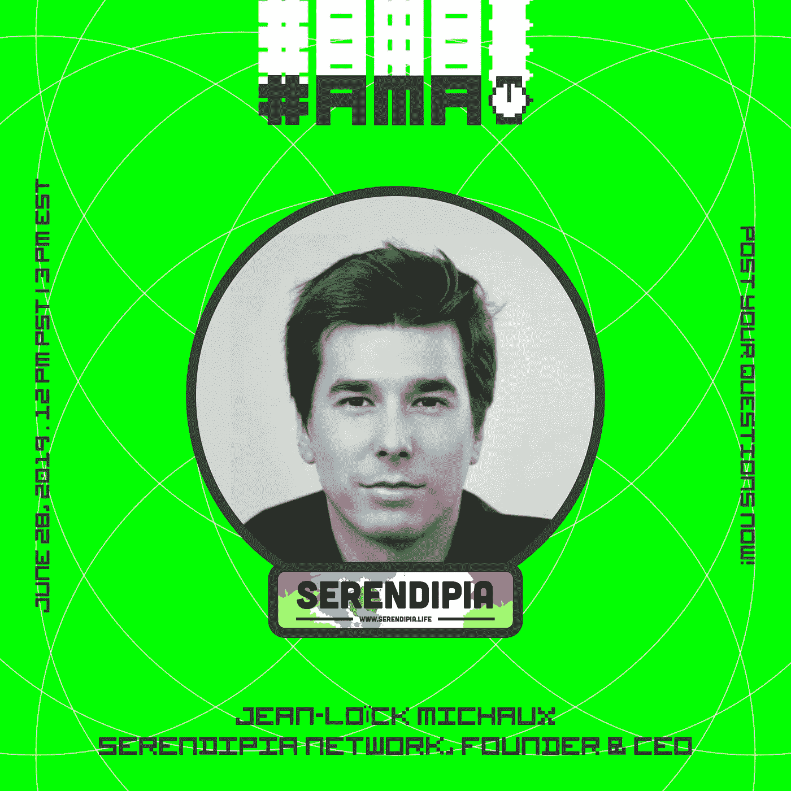

# 通过黑客正午社区，向 Serendipia Coliving 的创始人 Jean-Loic Michaux 询问任何事情

> 原文：<https://medium.com/hackernoon/ask-anything-to-serendipia-colivings-founder-jean-loic-michaux-via-the-hacker-noon-community-5ebb20aecdbe>

## 让·洛伊克·米修·阿卡·JLO 是旧金山最活跃的合住者之一 Serendipia 的创始人。Serendipia 接待了来自 50 多个国家的人，JLO 刚刚在德雷珀大学获得了第三名。现在问你的问题。

## [用让·洛伊克自己的话说:](https://community.hackernoon.com/t/im-muneeb-co-founder-of-blockstack-ask-me-anything-noon-pst-5-28-19/2808)

*我是让-洛克·米肖又名 JLO，*

我们创建了旧金山最大的居住和合作场所之一，接待了来自 50 多个国家的人们。[*The Serendipia global network 3*](http://www.serendipia.life/)*主要是主持创业者、变革者和加密游牧民。可以用比特币进行支付。我们举办了 300 多场聚会和派对，在 2017 年举办了最大的区块链聚会，并在 2018 年组织了区块链社会影响峰会。*

我们将于 7 月 1 日在旧金山举办第二场电影节，并将在圣保罗和布宜诺斯艾利斯举办。我们的目标是成为生活的网络。

*上个月，我们在由硅谷风投和天使评审的德雷珀大学 2019 春季队列演示日获得了第三名。*

这并不容易，因为我来自比利时，必须学习外国的规则。

问我任何关于全球社区建设、创造共同生活空间或 impact 的问题。

## [现在问一个问题](https://community.hackernoon.com/t/jean-loick-michaux-jlo-founder-of-serendipia-network-and-3rd-place-on-draper-university-demo-day-ask-me-anything-friday-6-28-noon-pst/3804)。

## 作为额外的参考，请查看 [Hacker Noon 过去的 AMAs](https://community.hackernoon.com/c/ama) :

*   [杰夫·阿特伍德(@codinghorror)，栈溢出和话语的联合创始人](https://community.hackernoon.com/t/i-am-jeff-atwood-codinghorror-co-founder-of-stack-overflow-and-discourse-ask-me-anything-4-8-noon-pst/1800)
*   [科特兰·艾伦(@csallen)，独立黑客的创造者](https://community.hackernoon.com/t/im-courtland-allen-creator-of-indie-hackers-ask-me-anything-thu-apr-18-noon-pst/1945)
*   [Alicia Ferratusco(@ realaliciafe)，海星网创始人](https://community.hackernoon.com/t/i-am-alicia-ferratusco-realaliciafe-founder-of-starfish-network-ask-me-anything-5-9-noon-pst/2417)
*   [泰勒·莫纳汉(@tayvano_)，MyCrypto 的首席执行官](https://community.hackernoon.com/t/im-taylor-monahan-ceo-of-mycrypto-ask-me-anything-5-16-12pm-pst/2597)
*   [迈克·卡洛梅尼(@卡洛梅尼)，elementus.io 的联合创始人，加州理工学院前火箭科学家](https://community.hackernoon.com/t/i-am-mike-kalomeni-kalomenim-cofounder-of-elementus-io-and-former-rocket-scientist-at-caltech-ask-me-anything-05-23-12pm-pst/2721)

## 加入AMA。