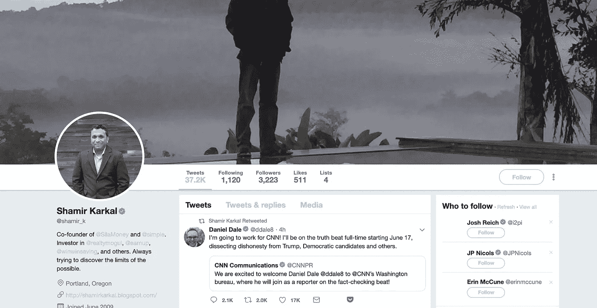

# 通过黑客正午社区，向 Sila 和 Simple Bank 的联合创始人沙米尔·卡尔卡尔询问任何事情

> 原文：<https://medium.com/hackernoon/ask-anything-to-shamir-karkal-co-founder-of-sila-and-simple-bank-via-the-hacker-noon-community-9be7e342b1bd>

## Shamir Karkal 是开发者付费平台 Sila 的联合创始人兼首席执行官。在此之前，沙米尔曾与人共同创立了简单银行，该银行被 BBVA 以 1.17 亿美元收购。

这是[黑客正午社区](https://community.hackernoon.com/)中的第十一个 [AMA](https://community.hackernoon.com/c/ama) 。现在问你的问题。

## [用沙米尔·卡尔卡斯自己的话说:](https://community.hackernoon.com/t/im-muneeb-co-founder-of-blockstack-ask-me-anything-noon-pst-5-28-19/2808)

*嘿黑客们，*

*我是* [*沙米尔·卡尔卡尔。*](https://www.linkedin.com/in/shamirkarkal)

*我联合创办了* [*简单银行*](https://en.wikipedia.org/wiki/Simple_(bank)) *，回到 2009 年数字银行还不是个东西的时候。它在 2017 年被 BBVA 以 1.17 亿美元收购，我后来在 BBVA 担任 API 负责人。*

作为一名企业家，我的追求一直是打破传统金融，让货币和金融工具更好地为人民服务，而不仅仅是为银行服务。我在 Simple 工作的早期阶段就了解区块链和比特币的潜力，但现在它已经具备了真正颠覆金融的基础设施。因此，我创造了[*Sila*](http://www.silamoney.com/)*，这是一个开发者 API 工具包，让今天和明天的企业家能够在几周内将金融科技应用推向市场。*

*我将在太平洋标准时间 6 月 11 日中午 12:00 在* [*现场回答您的问题。非常兴奋我们在 Hacker Noon 的社区里做这件事。我听说它非常棒。*](https://community.hackernoon.com/t/i-am-shamir-karkal-co-founder-of-simple-bank-and-current-ceo-at-sila-ask-me-anything-06-11-19-noon-pst/3158)