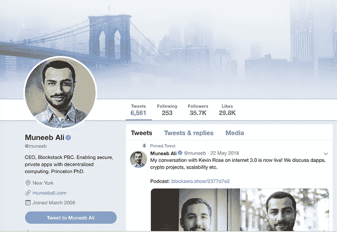

# 通过黑客正午社区向 Blockstack 首席执行官提问

> 原文：<https://medium.com/hackernoon/ask-anything-to-the-blockstack-ceo-via-the-hacker-noon-community-ab83f6a36b06>

## [穆尼布·阿里是 Blockstack](https://community.hackernoon.com/t/im-muneeb-co-founder-of-blockstack-ask-me-anything-noon-pst-5-28-19/2808) 的联合创始人兼首席执行官，Blockstack 是一个拥有 100 多个应用的去中心化计算网络。该公司已经筹集了 7000 多万美元。这是[黑客正午社区](https://community.hackernoon.com/)中的第五个 [AMA](https://community.hackernoon.com/c/ama) 。现在问你的问题。

## [用*阿里自己的话说:*](https://community.hackernoon.com/t/im-muneeb-co-founder-of-blockstack-ask-me-anything-noon-pst-5-28-19/2808)

*嘿黑客正午社区！*

*我是*[*mune EB Ali*](https://muneebali.com/)*，*[*block stack*](https://blockstack.org/)*的联合创始人兼 CEO PBC。Blockstack 是一个全栈去中心化的计算网络，是开始构建去中心化应用的最简单方式。查看今天在我们网络上构建的 100 多个独立应用。开发人员还可以参与我们的应用挖掘计划，在试点阶段，我们每 30 天向基于 Blockstack 的排名靠前的应用支付 10 万美元。Blockstack 的使命是促进开放、公平的互联网，保护所有互联网用户的隐私和自由。*

我在普林斯顿获得了分布式系统的博士学位。

*激动地来到这里参加*[*2019 年 5 月 28 日美国东部时间下午 3:15/12:15 PST 的这个 AMA。*](https://community.hackernoon.com/t/im-muneeb-co-founder-of-blockstack-ask-me-anything-noon-pst-5-28-19/2808)

*下面随便问个问题。很快聊！*

## [现在问个问题。](https://community.hackernoon.com/t/im-muneeb-co-founder-of-blockstack-ask-me-anything-noon-pst-5-28-19/2808)

## 作为参考，查看一下 [Blockstack 在《黑客正午》上提到的一些内容:](https://www.google.com/search?q=site%3Ahackernoon.com+blockstack)

*   [**什么是去中心化互联网，新的 iOS 和 Android 移动应用将如何工作？**](https://hackernoon.com/what-is-decentralized-internet-and-how-new-ios-and-android-mobile-apps-will-work-545938afe3ea) y [哈马德·塔里克](https://hackernoon.com/@hammadtariq)
*   [**幸存的加密冬天——第二部分:Blockstack 和历史的大摆锤**](https://hackernoon.com/surviving-crypto-winter-part-2-blockstack-and-the-great-pendulum-of-history-c56d30c0c236) 作者[丹尼尔·杰弗里斯](https://hackernoon.com/@dan.jeffries)
*   [**消费者区块链的状态从 Cryptokitties 到 Blockstack (+我们的市场地图！)**](https://hackernoon.com/the-state-of-consumer-blockchain-from-cryptokitties-to-blockstack-our-market-map-875cac6c172d?source=false---------1) 由[贾斯汀和奥利维亚·摩尔](https://hackernoon.com/@justinemoore_85088?source=false---------1)
*   [**去中心化 web 的艺术状态—第二部分**](https://hackernoon.com/a-state-of-the-art-of-decentralized-web-part-2-ea630917332a?source=user_profile---------2-----------------------) 作者 [Christophe Bougère](https://hackernoon.com/@christophe.bougere?source=user_profile---------2-----------------------)
*   [**7 区块链颠覆者观看**](https://hackernoon.com/7-blockchain-disruptors-to-watch-bb09192916a3) by [安德雷](https://hackernoon.com/@andreas212nyc)
*   [**DWeb 起飞了吗？Blockstack 成长一瞥。**](https://hackernoon.com/is-dweb-taking-off-a-glimpse-into-blockstacks-growth-88114b089818?source=false---------3)**&**[**如何构建一个可扩展的去中心化应用？少尝试区块链。**](https://hackernoon.com/how-to-build-a-decentralized-application-that-scales-try-less-blockchain-b3e61b1d7bd6?source=false---------6) 由 [Val Repsys](https://hackernoon.com/@vrepsys?source=false---------3)****
*   ****[**如何创建一个去中心化的网页**](https://hackernoon.com/how-to-create-your-first-decentralized-web-page-d53950418eb) 作者[Tautvilas mein skas](https://hackernoon.com/@TautviIas)****
*   ****[**如何在你的 iOS 应用中使用基于比特币的区块链授权**](https://hackernoon.com/how-to-use-bitcoin-based-blockstack-auth-in-your-ios-apps-a4f157230201) 作者 [Hammad Tariq](https://hackernoon.com/@hammadtariq)****
*   ****[**创新不规范:乔治·吉尔德在谷歌**](https://hackernoon.com/innovate-dont-regulate-the-message-of-george-gilder-s-life-after-google-fc5b2f25753a?source=false---------7) 后的人生寄语作者[拉尔夫·本科](https://hackernoon.com/@ralphbenko)****
*   ****[**区块链与迈向新互联网架构的旅程**](https://hackernoon.com/blockchain-and-the-journey-toward-a-new-internet-architecture-cc0e92a9d7aa) 作者[凯尔·王](https://hackernoon.com/@kyletwang)****

## ****作为额外的参考，请查看 [Hacker Noon 过去的 AMAs](https://community.hackernoon.com/c/ama) :****

*   ****[杰夫·阿特伍德(@codinghorror)，Stack Overflow 和 Discourse 的联合创始人](https://community.hackernoon.com/t/i-am-jeff-atwood-codinghorror-co-founder-of-stack-overflow-and-discourse-ask-me-anything-4-8-noon-pst/1800)****
*   ****[科特兰·艾伦(@csallen)，独立黑客的创造者](https://community.hackernoon.com/t/im-courtland-allen-creator-of-indie-hackers-ask-me-anything-thu-apr-18-noon-pst/1945)****
*   ****[Alicia Ferratusco(@ realaliciafe)，海星网创始人](https://community.hackernoon.com/t/i-am-alicia-ferratusco-realaliciafe-founder-of-starfish-network-ask-me-anything-5-9-noon-pst/2417)****
*   ****[泰勒·莫纳汉(@tayvano_)，MyCrypto 的首席执行官](https://community.hackernoon.com/t/im-taylor-monahan-ceo-of-mycrypto-ask-me-anything-5-16-12pm-pst/2597)****
*   ****Mike Kalomeni ( @KalomeniM)，elementus.io 的联合创始人，加州理工学院前火箭科学家****

## ****[加入 AMA。](https://community.hackernoon.com/t/im-muneeb-co-founder-of-blockstack-ask-me-anything-noon-pst-5-28-19/2808)****