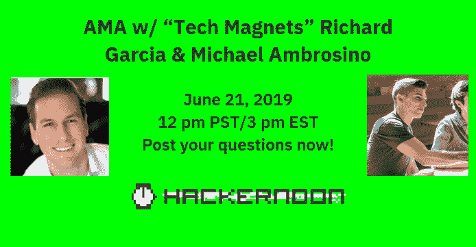

# 通过黑客正午社区，你可以向 Profile 公司的创始人询问任何问题

> 原文：<https://medium.com/hackernoon/ask-anything-to-the-founders-of-the-profile-firm-via-the-hacker-noon-community-3d709ece06da>

# “科技磁铁”Richard Garcia 和 [Michael Ambrosino](https://www.linkedin.com/in/michael-ambrosino/) 一直在与大型科技公司合作，帮助他们吸引合适的人才并发展业务。他们后来合并并创建了 Profile 公司。

## [用理查德和迈克尔自己的话说:](https://community.hackernoon.com/t/we-are-tech-magnets-richard-garcia-michael-ambrosino-co-founders-of-the-profile-firm-where-we-focus-on-finding-top-talent-for-seed-series-d-funded-companies-ask-us-anything-06-21-19-noon/3437)

*嘿黑客正午社区！*

*稍微介绍一下*[*Richard*](https://www.linkedin.com/in/richgarcia002/)*:“我是特斯拉的前首席技术招聘人员，我曾在那里从事软件/硬件和 DevOps 方面的工作。然后，我跳槽去了谷歌，担任首席技术招聘官，专门负责人工智能/人工智能的人员配置。之后，我加入了脸书，成为数据科学博士的首席技术招聘官。*

*最近，我是 Brex 的人才主管，帮助他们从 25-125 名成员成长为 SV 历史上最快的独角兽。”*

*以及关于* [*迈克尔*](https://www.linkedin.com/in/michael-ambrosino/) *:“我曾与 Salesforce、Square、微软、彭博、MongoDB、Mulesoft、Unity Technologies 等公司合作，研究他们的领导力培训和发展。”*

我们一起创建了 Profile 公司，专注于为种子 D 轮投资的公司寻找顶尖人才。特别是技术人才。

*激动地来到这里参加*[*2019 年 6 月 21 日下午 12 点太平洋标准时间*的 AMA。](https://community.hackernoon.com/t/we-are-tech-magnets-richard-garcia-michael-ambrosino-co-founders-of-the-profile-firm-where-we-focus-on-finding-top-talent-for-seed-series-d-funded-companies-ask-us-anything-06-21-19-noon/3437)

*下面随便问个问题。很快聊！*

## 作为额外的参考，请查看 [Hacker Noon 过去的 AMAs](https://community.hackernoon.com/c/ama) :

*   [Muneeb (@muneeb)，Blockstack 的联合创始人](https://community.hackernoon.com/t/im-muneeb-co-founder-of-blockstack-ask-me-anything-noon-pst-5-28-19/2808)
*   [Paul Foley (@paulnfoley)，科罗拉多州 SmartCapital 董事总经理](https://community.hackernoon.com/t/i-am-paul-foley-paulnfoley-managing-director-of-smartcapital-colorado-ask-me-anything-06-07-2-00-pm-mt/3161)
*   [卡洛斯·多明戈(@carlosdomingo)证券化的联合创始人](https://community.hackernoon.com/t/i-m-carlos-co-founder-of-securitize-ask-me-anything-noon-pst-5-31-19/2912)
*   [杰夫·阿特伍德(@codinghorror)，栈溢出和话语](https://community.hackernoon.com/t/i-am-jeff-atwood-codinghorror-co-founder-of-stack-overflow-and-discourse-ask-me-anything-4-8-noon-pst/1800)的联合创始人
*   [科特兰·艾伦(@csallen)，独立黑客的创造者](https://community.hackernoon.com/t/im-courtland-allen-creator-of-indie-hackers-ask-me-anything-thu-apr-18-noon-pst/1945)
*   [Alicia Ferratusco(@ realaliciafe)，海星网创始人](https://community.hackernoon.com/t/i-am-alicia-ferratusco-realaliciafe-founder-of-starfish-network-ask-me-anything-5-9-noon-pst/2417)
*   [泰勒·莫纳汉(@tayvano_)，MyCrypto 的首席执行官](https://community.hackernoon.com/t/im-taylor-monahan-ceo-of-mycrypto-ask-me-anything-5-16-12pm-pst/2597)
*   [Mike Kalomeni ( @KalomeniM)，)elementus.io 的联合创始人，加州理工学院前火箭科学家](https://community.hackernoon.com/t/i-am-mike-kalomeni-kalomenim-cofounder-of-elementus-io-and-former-rocket-scientist-at-caltech-ask-me-anything-05-23-12pm-pst/2721)

## [加入 AMA。](https://community.hackernoon.com/t/we-are-tech-magnets-richard-garcia-michael-ambrosino-co-founders-of-the-profile-firm-where-we-focus-on-finding-top-talent-for-seed-series-d-funded-companies-ask-us-anything-06-21-19-noon/3437)