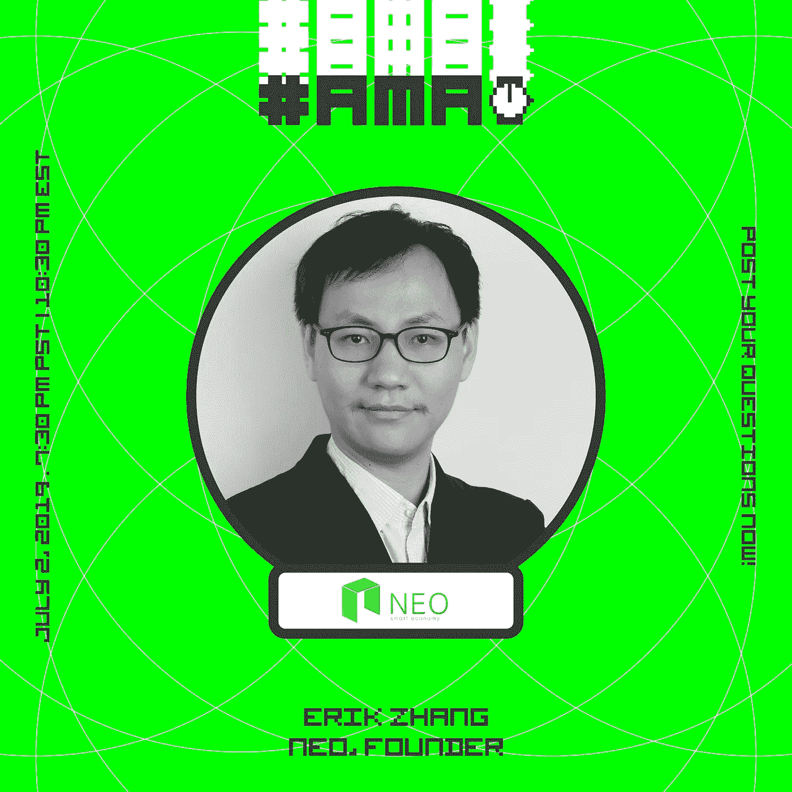

# 通过 Hacker Noon 社区向 NEO 创始人和核心开发人员提问

> 原文：<https://medium.com/hackernoon/ask-anything-to-the-neo-founder-core-developer-via-the-hacker-noon-community-f2d4b297674c>

[Erik Zhang 是 NEO](https://community.hackernoon.com/t/i-am-erik-zhang-neoerikzhang-founder-and-core-developer-of-neo-ask-me-anything-july-7-02-2019-7-30-pm-pst/3975) 的创始人和核心开发人员，NEO 是一个由社区推动的全球开源项目，该项目利用区块链致力于实现 21 世纪的“智能经济”。这是[黑客正午社区](https://community.hackernoon.com/)中的第十二个 [AMA](https://community.hackernoon.com/c/ama) 。**提问** [**现在**](https://community.hackernoon.com/t/i-am-erik-zhang-neoerikzhang-founder-and-core-developer-of-neo-ask-me-anything-july-7-02-2019-7-30-pm-pst/3975) **。**

[**用张自己的话说:**](https://community.hackernoon.com/t/i-am-erik-zhang-neoerikzhang-founder-and-core-developer-of-neo-ask-me-anything-july-7-02-2019-7-30-pm-pst/3975)

*我是 NEO 的创始人和核心开发人员，NEO 是一个由社区推动的全球开源项目，旨在利用区块链实现 21 世纪的“智能经济”。*

作为它的核心开发人员之一，我根据我在网络安全方面的经验，为 NEO 编写了一个独特的共识机制，称为委托拜占庭容错(dBFT)。除了区块链，我还在多个领域工作过，从游戏到信息安全。

*NEO 致力于通过支持我们的开发人员和培育区块链应用的分散生态系统来实现智能经济。作为一个开源平台，我们与世界各地的优秀社区合作。随着我们越来越接近实现 NEO3，我们希望很快能够实现一个区块链，为大规模商业用途做好准备。*

*迫不及待的回答你的问题直播*[*2019 年 7 月 2 日晚 7:30 PST*](https://community.hackernoon.com/t/i-am-erik-zhang-neoerikzhang-founder-and-core-developer-of-neo-ask-me-anything-july-7-02-2019-7-30-pm-pst/3975)*。我很高兴见到你们。*

请将此添加到您的日历中，或者问我下面的任何问题。回头再聊！

[**现在问一个问题。**](https://community.hackernoon.com/t/i-am-erik-zhang-neoerikzhang-founder-and-core-developer-of-neo-ask-me-anything-july-7-02-2019-7-30-pm-pst/3975)

**供参考，查看一下黑客中午** [**NEO 的一些提及**](https://hackernoon.com/tagged/neo) **:**

*   [**NEO 对以太坊:为什么 NEO 可能是 2018 年最强的加密货币**作者诺姆·勒文森](https://hackernoon.com/neo-versus-ethereum-why-neo-might-be-2018s-strongest-cryptocurrency-79956138bea3)
*   [**卡尔达诺:以太坊和新黑仔还是定价过高？**作者诺姆·莱文森](https://hackernoon.com/cardano-ethereum-and-neo-killer-or-overhyped-and-overpriced-8fcd5f8abcdf)
*   [**NEO 就是那个？丹尼尔·杰弗里斯**](https://hackernoon.com/is-neo-the-one-67799886b78f)
*   [**为什么未来可能已经在这里与尼奥一起**泰德·奥尼尔](https://hackernoon.com/why-the-future-may-already-be-here-with-neo-824ba801a51b)

## 作为额外的参考，请查看 [Hacker Noon 过去的 AMAs](https://community.hackernoon.com/c/ama) :

*   [杰夫·阿特伍德(@codinghorror)，栈溢出和话语的联合创始人](https://community.hackernoon.com/t/i-am-jeff-atwood-codinghorror-co-founder-of-stack-overflow-and-discourse-ask-me-anything-4-8-noon-pst/1800)
*   [科特兰·艾伦(@csallen)，独立黑客的创造者](https://community.hackernoon.com/t/im-courtland-allen-creator-of-indie-hackers-ask-me-anything-thu-apr-18-noon-pst/1945)
*   [Alicia Ferratusco(@ realaliciafe)，海星网创始人](https://community.hackernoon.com/t/i-am-alicia-ferratusco-realaliciafe-founder-of-starfish-network-ask-me-anything-5-9-noon-pst/2417)
*   [泰勒·莫纳汉(@tayvano_)，MyCrypto 的首席执行官](https://community.hackernoon.com/t/im-taylor-monahan-ceo-of-mycrypto-ask-me-anything-5-16-12pm-pst/2597)
*   [迈克·卡洛梅尼(@卡洛梅尼)，)elementus.io 的联合创始人，加州理工学院的前火箭科学家](https://community.hackernoon.com/t/i-am-mike-kalomeni-kalomenim-cofounder-of-elementus-io-and-former-rocket-scientist-at-caltech-ask-me-anything-05-23-12pm-pst/2721)

## [加入 AMA。](https://community.hackernoon.com/t/i-am-erik-zhang-neoerikzhang-founder-and-core-developer-of-neo-ask-me-anything-july-7-02-2019-7-30-pm-pst/3975)