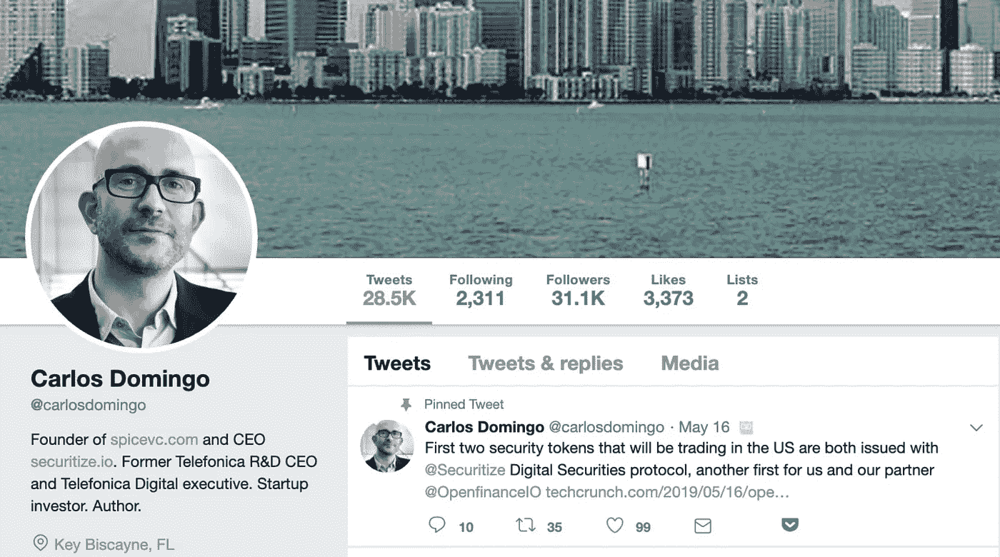

# 通过黑客正午社区，向证券化首席执行官询问任何问题

> 原文：<https://medium.com/hackernoon/ask-anything-to-the-securitize-ceo-via-the-hacker-noon-community-d705abf7881a>

## [卡洛斯·多明戈是数字证券发行和管理平台 Securitize 的联合创始人兼首席执行官](https://community.hackernoon.com/t/i-m-carlos-co-founder-of-securitize-ask-me-anything-noon-pst-5-31-19/2912)。这是[黑客正午社区](https://community.hackernoon.com/)中的第六个 [AMA](https://community.hackernoon.com/c/ama) 。现在问你的问题。

## 用卡洛斯·多明戈自己的话说:

我叫卡洛斯·多明戈，

*我是 Securitize 的联合创始人兼首席执行官，Securitize 是一个面向数字证券或安全令牌的主要发行和生命周期管理平台和协议。我们在 2017 年推出了 Securitize，愿景是通过使用区块链技术的令牌化，使世界上所有的证券数字化。我们已经在以太坊区块链上使用我们的平台发行了八种数字证券，其中四种使用我们的合规协议 DS 协议在公开市场交易，从而实现了我们的愿景。我们是唯一独立的安全令牌合规协议，在受监管的市场中有实际的安全令牌交易。我们还有几十个客户也将使用我们的平台发行他们的安全令牌。*

在创办 Securitize 之前，我是 Telefonica R & D 的首席执行官，也是 Telefonica Digital 的新业务和创新首席执行官。我也是 SPiCE VC 的联合创始人，这是世界上第一个完全令牌化的 VC 基金。我在东京工业大学获得了计算机科学硕士学位，在西班牙加泰罗尼亚理工大学获得了计算机科学博士学位，并在斯坦福商学院获得了商业研究生学位。

*我将于 2019 年 5 月 31 日中午 12:00 现场回答您的问题。我很高兴来到黑客正午的演讲现场。*

*此处有一个链接，可将 AMA 黑客月添加到您的日历中。请随时问我下面的任何问题。*

卡洛斯·多明戈

*激动地来到这里参加*[*2019 年 5 月 31 日太平洋时间 12:00 的 AMA。*](https://community.hackernoon.com/t/im-muneeb-co-founder-of-blockstack-ask-me-anything-noon-pst-5-28-19/2808)

*下面随便问个问题。很快聊！*

## 现在问一个问题。