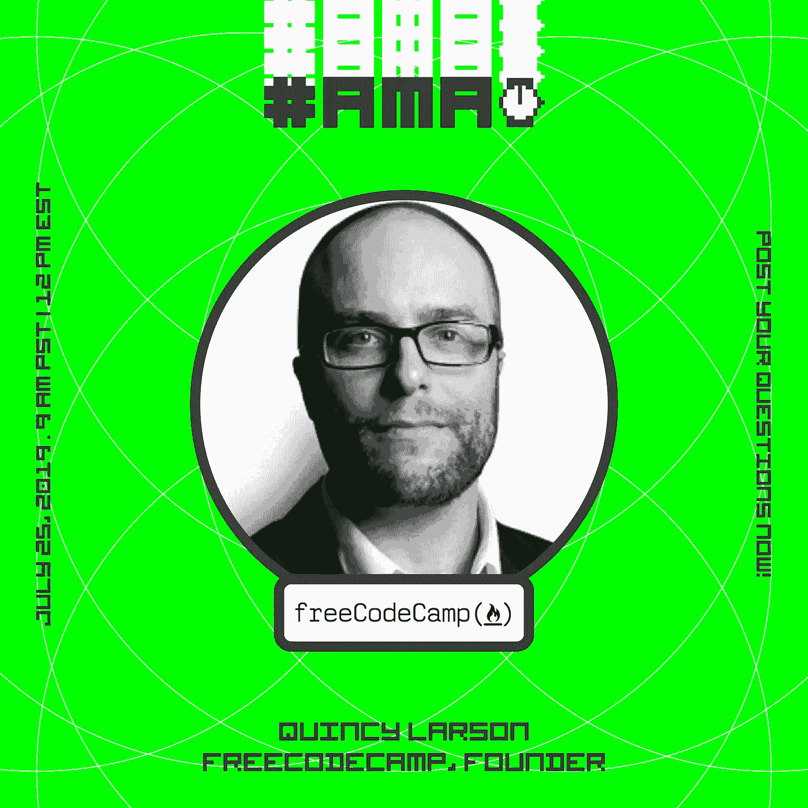

# 通过黑客正午社区，向创立 freeCodeCamp.org 的老师提问

> 原文：<https://medium.com/hackernoon/ask-anything-to-the-teacher-who-founded-freecodecamp-org-via-the-hacker-noon-community-69a3a18dba40>

## [现在就加入 AMA](https://community.hackernoon.com/t/im-quincy-larson-the-teacher-who-founded-freecodecamp-org-ask-me-anything-july-25-2019/5539)

# “文明的许多方面都可以通过更好的系统来改善——而软件只是告诉计算机如何实施这些系统的一种方式。”—昆西·拉森

## [关于昆西·拉森用他自己的话说:](https://community.hackernoon.com/t/im-quincy-larson-the-teacher-who-founded-freecodecamp-org-ask-me-anything-july-25-2019/5539)

*嘿黑客正午社区！*

> *我是一名 30 多岁的教师，学习编码，并最终在 2014 年创立了 freeCodeCamp。我现在全职在非营利组织工作，帮助扩展这些学习资源。*

我正在 Hacker Noon 的社区论坛上做 AMA。我将在美国东部时间 7 月 25 日周四中午现场回答问题。你可以在这个帖子里提前问我问题，关注别人的问题，以确保我能看到并回答他们。

*激动地来到这里参加*[*2019 年 7 月 25 日上午 9 点太平洋标准时间*的这个 AMA。](https://community.hackernoon.com/t/im-quincy-larson-the-teacher-who-founded-freecodecamp-org-ask-me-anything-july-25-2019/5539)

*随意提问。很快聊！*

## 作为额外的参考，请查看 [Hacker Noon 过去的 AMAs](https://community.hackernoon.com/c/ama) :

*   [Muneeb (@muneeb)，Blockstack](https://community.hackernoon.com/t/im-muneeb-co-founder-of-blockstack-ask-me-anything-noon-pst-5-28-19/2808) 的联合创始人
*   [科罗拉多州 SmartCapital 董事总经理保罗·福利(@ paulnfoley)](https://community.hackernoon.com/t/i-am-paul-foley-paulnfoley-managing-director-of-smartcapital-colorado-ask-me-anything-06-07-2-00-pm-mt/3161)
*   [卡洛斯·多明戈(@carlosdomingo)证券化的联合创始人](https://community.hackernoon.com/t/i-m-carlos-co-founder-of-securitize-ask-me-anything-noon-pst-5-31-19/2912)
*   [杰夫·阿特伍德(@codinghorror)，栈溢出和话语的联合创始人](https://community.hackernoon.com/t/i-am-jeff-atwood-codinghorror-co-founder-of-stack-overflow-and-discourse-ask-me-anything-4-8-noon-pst/1800)
*   [科特兰·艾伦(@csallen)，独立黑客的创造者](https://community.hackernoon.com/t/im-courtland-allen-creator-of-indie-hackers-ask-me-anything-thu-apr-18-noon-pst/1945)
*   [Alicia Ferratusco(@ realaliciafe)，海星网创始人](https://community.hackernoon.com/t/i-am-alicia-ferratusco-realaliciafe-founder-of-starfish-network-ask-me-anything-5-9-noon-pst/2417)
*   [泰勒·莫纳汉(@tayvano_)，MyCrypto 的首席执行官](https://community.hackernoon.com/t/im-taylor-monahan-ceo-of-mycrypto-ask-me-anything-5-16-12pm-pst/2597)
*   Mike Kalomeni ( @KalomeniM)，elementus.io 的联合创始人，加州理工学院前火箭科学家

## [加入 AMA。](https://community.hackernoon.com/t/im-quincy-larson-the-teacher-who-founded-freecodecamp-org-ask-me-anything-july-25-2019/5539)