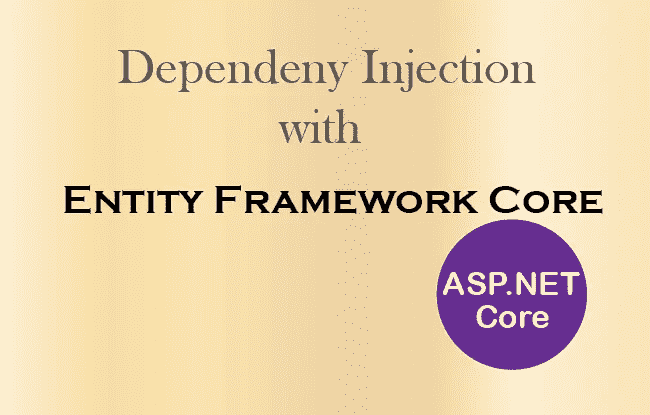

# ASP.NET 核心——如何在实体框架核心中使用依赖注入

> 原文：<https://medium.com/hackernoon/asp-net-core-how-to-use-dependency-injection-in-entity-framework-core-4388fc5c148b>



**Dependency Injection with Entity Framework Core**

**ASP.NET 核心**有一个优秀的**依赖注入**特性，通过它这个框架给你提供一个你想要的任何类的对象。因此您不必在代码中手动创建类对象。

在本教程中，我将教你如何在**实体框架核心**中使用依赖注入方法。这将为你提供可以获得的以下好处:

> 1.“DbContext”类的对象。
> 
> 2.从“appsettings.json”而不是从“DbContext”类的“OnConfiguring()”方法中获取连接字符串。

## **onconfiguration()方法内的连接字符串**

通常您在`DbContext`类的`OnConfiguring()`方法中提供您的数据库连接字符串，如下所示:

```
protected override void OnConfiguring(DbContextOptionsBuilder optionsBuilder)
{
    if (!optionsBuilder.IsConfigured)
    {
 optionsBuilder.UseSqlServer(@"Server=Smile;Database=Shop;Trusted_Connection=True;"); }
}
```

这种方法不好，因为将连接字符串存储在`appsettings.json`文件中更好。在 [**实体框架核心**](http://www.yogihosting.com/category/ef-core/) 中应用依赖注入后，您可以像这样简单地删除`OnConfiguring()`方法中的所有内容:

```
protected override void OnConfiguring(DbContextOptionsBuilder optionsBuilder)
{
    if (!optionsBuilder.IsConfigured)
    {
    }
}
```

您需要按照如下所述进行以下 3 项更改:

## **1。创建 appsettings.json 文件来存储数据库连接字符串**

存储*数据库连接字符串*值的`appsettings.json`文件的代码如下:

```
{
    "ConnectionStrings": {
        "DefaultConnection": "Server=Smile;Database=Shop;Trusted_Connection=True;"
    }
}
```

## **2。** `DbContext` 类的构造函数应该继承基类

在你的`DbContext` 类中，添加继承基类的构造函数。同时从`OnConfiguring()`方法中移除连接字符串。`DbContex` 类的代码应该是:

```
public class ShopContext : DbContext
{
    public ShopContext(DbContextOptions<ShopContext> options) : base(options) { }
    public DbSet<Products> Products { get; set; } protected override void OnConfiguring(DbContextOptionsBuilder optionsBuilder)
    {
    } protected override void OnModelCreating(ModelBuilder modelBuilder)
    {
    }
}
```

## **3。在 Startup.cs 类中添加 DbContext 类作为服务**

更改`Startup.cs`类以在其构造函数中获取`Microsoft.Extensions.Configuration`名称空间的`IConfiguration`对象。

在构造函数内部，用参数中给定的`IConfiguration`对象的值设置`IConfiguration`类型的公共属性的值。

这方面的代码是:

```
public Startup(IConfiguration configuration)
{
    Configuration = configuration;
}public IConfiguration Configuration { get; }
```

这一改变将帮助您读取`Startup.cs`类中的`appsettings.json`文件。

接下来，将`DbContext`类作为服务添加到`ConfigureService()`方法中。参见下面的代码:

```
services.AddDbContext<ShopContext>(options => options.UseSqlServer(Configuration["ConnectionStrings:DefaultConnection"]));
```

启动类的更新代码应该是:

```
public class Startup
{
    public Startup(IConfiguration configuration)
    {
        Configuration = configuration;
    } public IConfiguration Configuration { get; } public void ConfigureServices(IServiceCollection services)
    {
        services.AddDbContext<ShopContext>(options => options.UseSqlServer(Configuration["ConnectionStrings:DefaultConnection"]));
        services.AddMvc();
    } public void Configure(IApplicationBuilder app, IHostingEnvironment env)
    {
        app.UseStaticFiles();
        app.UseDeveloperExceptionPage();
        app.UseMvc(routes =>
        {
            routes.MapRoute(name: "default", template: "{controller=Home}/{action=Index}/{id?}");
        });
    }
}
```

> ***使用依赖注入*** 在控制器中获取 DbContext 对象

现在你已经准备好了，让我展示如何使用**依赖注入**在构造函数中获得`DbContext` 类对象。你所要做的就是在控制器的构造函数中添加`DbContext` 类对象，并为其设置一个公共属性值。

> 您可以从本教程中了解到所有关于依赖注入的特性——ASP.NET 内核中的 [**依赖注入**](http://www.yogihosting.com/aspnet-core-dependency-injection/)

将以下代码添加到构造函数中:

```
private ShopContext shopContext;public HomeController(ShopContext sc)
{
    shopContext = sc;
}
```

现在，您已经准备好使用实体框架核心与数据库进行通信了。

要从数据库中读取记录:

> 商店背景。老师；

要在数据库中创建记录:

> 商店背景。Products.Add(产品)；
> 商店上下文。save changes()；

查看控制器的更新代码，其中还列出了读取和插入记录的操作方法。

```
public class HomeController : Controller
{
    private ShopContext shopContext;
    public HomeController(ShopContext sc)
    {
        shopContext = sc;
    } public IActionResult Index()
    {
        return View(shopContext.Teacher);
    } public IActionResult Create()
    {
        return View();
    } [HttpPost]
    public IActionResult Create_Post(Products product)
    {
        if (ModelState.IsValid)
        {    
            shopContext.Products.Add(product);
            shopContext.SaveChanges();
            return RedirectToAction("Index");
        }
        else 
            return View();
    }
}
```

***结论***

希望你喜欢这个关于*实体框架核心带依赖注入*的教程。这只是改进代码的一个步骤。如果你喜欢这个教程，那么请给我**一些掌声**，并且每周跟随我学习一次关于 Web 开发的教程。

也可以看看我在 HACKERNOON 的另一篇文章— [**从初学者到专家的每个开发人员都应该知道的 7 个常见的 Web 开发问题【有多个解决方案】**](https://hackernoon.com/7-common-web-development-problems-which-every-developer-from-beginners-to-experts-should-know-with-47a7d2e9367f)