# ASP.NET 核心——从零到英雄学习 ADO.NET 的 CRUD 操作

> 原文：<https://medium.com/hackernoon/asp-net-core-learn-crud-operations-in-ado-net-from-zero-to-hero-a0109ed2f8a4>


**CRUD Operations in ADO.NET ASP.NET Core**

在这个 ASP.NET 核心教程中，你将从一开始就学习在 ADO.NET 做 CRUD 操作。本教程将帮助您学习 doing，以便您可以开始用 C#在 ASP.NET 核心中进行数据库编程。

[***从 GitHub***](https://github.com/yogyogi/CRUD-Operations-in-ADO.NET-with-ASP.NET-Core) ***【_ _ _ _ _ _ _ _ _ _ _ _ _ _ _ _ _ _ _ _ _ _ _ _ _ _ _ _ _ _ _ _ _ _ _ _ _ _ _ _ _ _ _ _ _ _ _ _ _ _ _ _ _ _***下载该应用程序的完整源代码

## **观众**

本教程是为每一个想快速学习 ASP.NET 核心 和 ADO.NET[*的人制作的。所有的事情都以简单的方式一步一步地解释。你可以下载完整的源代码并在你的电脑上运行。*](http://www.yogihosting.com/category/aspnet-core/)

在这里，我将对 SQL Server 数据库中的教师表执行 CRUD(创建、读取、更新和删除)操作。

> 我个人认为“学习任何编程语言的最好方法是首先构建 CRUD 操作”。

## **本教程分为以下几个部分:**

> 1.创建新的 ASP.NET 核心 Web 应用程序
> 
> 2.配置 ASP.NET 核心 Web 应用程序
> 
> 3.创建布局，查看导入，查看开始并添加引导
> 
> 4.创建数据库
> 
> 5.在应用程序中添加数据库的连接字符串
> 
> 6.为教师添加模型课
> 
> 7.添加客户端验证功能
> 
> 8.执行创建教师功能
> 
> 9.执行“读取教师”功能
> 
> 10.执行更新教师功能
> 
> 11.执行删除教师功能

## **1。创建新的 ASP.NET 核心网络应用程序**

在 Visual Studio 中，选择“文件>新建项目”。将会打开一个新窗口，在这里:

> a.在左侧，选择“`Installed > Visual C# > Web`”。
> 
> b.在中间部分，选择“`ASP.NET Core Web Application`”。
> 
> c.在下半部分，给你的项目命名为“`CRUDADO`”或任何你想要的名字，并选择项目文件在驱动器上的存储位置。同样选择选项—‘T3’，最后点击‘T4’按钮来创建你的项目。

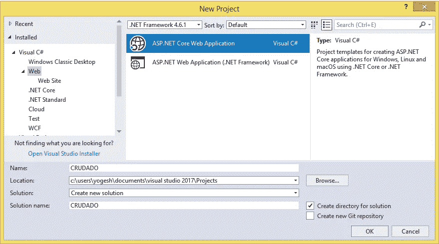

**Create ASP.NET Core Web Application**

接下来，将会打开一个新窗口，要求您选择项目模板、点网络框架和其他一些东西。在此窗口中，确保您选择了以下内容:

> a.在顶部的 2 个下拉菜单中，选择'`.NET Core`'和'`ASP.NET Core 2.0`'。您也可以选择高于 2.0 的 ASP.NET 核心版本。
> 
> b.选择'`Empty`'项目模板。
> 
> c.点击“`OK`”按钮创建您的 ASP.NET 核心网络应用程序

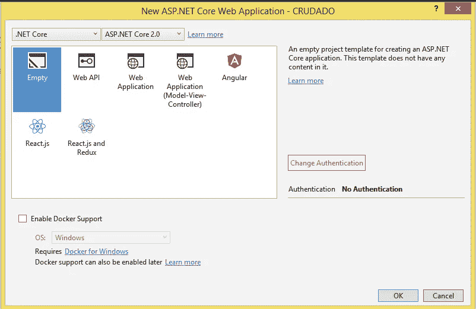

**Select Properties for ASP.NET Core Application**

## **2。配置 ASP.NET 核心网络应用**

你的应用程序应该支持 MVC 框架，路由和静态文件。所有这些都可以从位于应用程序根目录下的“Startup.cs”类中完成。

打开 Startup.cs 类，在`ConfigureServices()`和`Configure()`方法中添加这些支持，如下所示:

```
using Microsoft.AspNetCore.Builder;
using Microsoft.AspNetCore.Hosting;
using Microsoft.Extensions.DependencyInjection;namespace CRUDADO
{
    public class Startup
    {
        public void ConfigureServices(IServiceCollection services)
        {
            services.AddMvc();
        } public void Configure(IApplicationBuilder app, IHostingEnvironment env)
        {
            app.UseStaticFiles();
            app.UseDeveloperExceptionPage();
            app.UseMvc(routes =>
            {
                routes.MapRoute(
                name: "default",
                template: "{controller=Home}/{action=Index}/{id?}");
            });
        }
    }
}
```

## **3。创建布局、视图导入、视图启动并添加引导**

在你的项目根目录下创建一个“`Views`”文件夹，并在里面创建一个“`Shared`”文件夹。

接下来，右键单击“`Shared`”文件夹，并选择“`Add > New Item`”。您将获得一个显示项目列表的新窗口，从该列表中选择'`MVC View Layout Page`'并点击'`Add`'按钮。

这将在共享文件夹中添加`_Layout.cshtml`文件，并打开进行编辑。您需要向其中添加以下代码:

```
<!DOCTYPE html>
<html>
<head>
    <title>@ViewData["Title"]</title>
    <meta name="viewport" content="width=device-width" />
    <link href="/lib/bootstrap/dist/css/bootstrap.css" rel="stylesheet" />
</head>
<body class="m-1 p-1">
    @RenderBody()
</body>
</html>
```

接下来，下载 [**Bootstrap**](http://www.yogihosting.com/how-to-use-bootstrap/) 包，并解压项目的“`wwwroot > lib`”文件夹中的 Bootstrap zip 文件内容。

Bootstrap 用于创建移动友好的响应布局。它是世界上最流行的 CSS 框架。

接下来，右键单击“`Views`”文件夹并选择“`Add > New Item`”。在项目列表上，选择'`MVC View Imports Page`'并点击'`Add`'按钮。这将添加`_ViewImports.cshtml`文件。

通过向该文件添加以下代码，导入视图的内置标记 helpers & models 名称空间:

```
@using CRUDADO.Models
@addTagHelper *, Microsoft.AspNetCore.Mvc.TagHelpers
```

同样，右击“`Views`”文件夹，选择“`Add > New Item`”。在项目列表上，选择'`MVC View Start Page`'并点击'`Add`'按钮。

这将添加带有以下初始代码的`_ViewStart.cshtml`文件:

```
@{
    Layout = "_Layout";
}
```

它告诉所有的视图都将具有位于共享文件夹中的 _Layout.cshtml 文件中的布局。

## **4。创建数据库**

您必须在电脑上安装 SQL Server 2017(任何版本)。但是，任何其他版本的 SQL Server，如 2016，2008，2012，都可以。可以使用免费使用的 SQL Server 2017 的开发者版和速成版— [下载 SQL Server 2017](https://www.microsoft.com/en-us/sql-server/sql-server-downloads) 。

接下来，您需要连接到 SQL Server，这可以使用 Visual Studio 中的 *SQL Server Object Explorer 来完成。所以在 Visual Studio 中选择'`View > SQL Server Object Explorer in Visual Studio`'。*

当“`SQL Server Object Explorer`”窗口打开时，右击 SQL Server 节点，选择`Add SQL Server`。

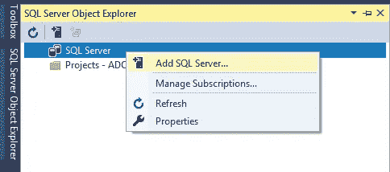

**Add SQL Server**

接下来，一个`Connect`窗口打开。在此窗口中，选择“`Browse`选项卡，然后点击“`Local`节点将其打开。

在这个节点中，选择第二个选项`(localdb)\MSSQLLocalDB`。选择它之后，您会注意到在同一个窗口中的'`Server Name:`'字段现在有了`(localdb)\MSSQLLocalDB`值。

现在您只需点击`Connect`按钮来连接到 SQL 服务器。请参见下图:

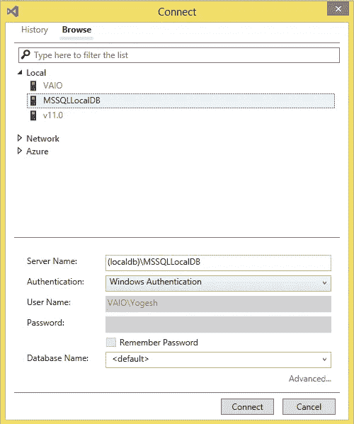

**Connecting SQL Server in SQL Server Object Explorer**

几秒钟后，SQL Server 将连接并准备就绪。

接下来，右击`Databases` 节点并选择`Add New Database.`

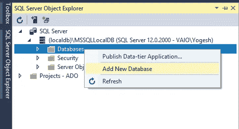

**Add New Database**

在对话框中，输入`School`作为数据库名称，点击`OK`创建数据库。

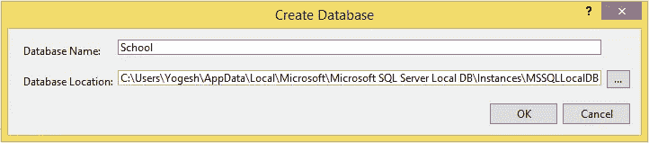

**Create School Database**

学校数据库已创建，但为空。所以现在首先创建“教师”表。

点击`School`数据库名称前的符号，打开其中的各个节点。

接下来，右击`Tables`节点并选择`Add New Table`。

Visual Studio 中将打开一个`Table Design Window`。您可以在这里为教师表添加字段。

在此窗口中，在`T-SQL`选项卡内，您可以输入以下脚本来创建“`Teacher`”表:

```
CREATE TABLE [dbo].[Teacher]
(
    [Id] INT NOT NULL IDENTITY(1,1) PRIMARY KEY,
    [Name] VARCHAR(50) NOT NULL,
    [Skills] VARCHAR(250) NOT NULL,
    [TotalStudents] INT NOT NULL,
    [Salary] MONEY NOT NULL,
    [AddedOn] DATE NOT NULL DEFAULT GETDATE()
)
```

接下来，点击`Update` 按钮开始创建该表，见下图:

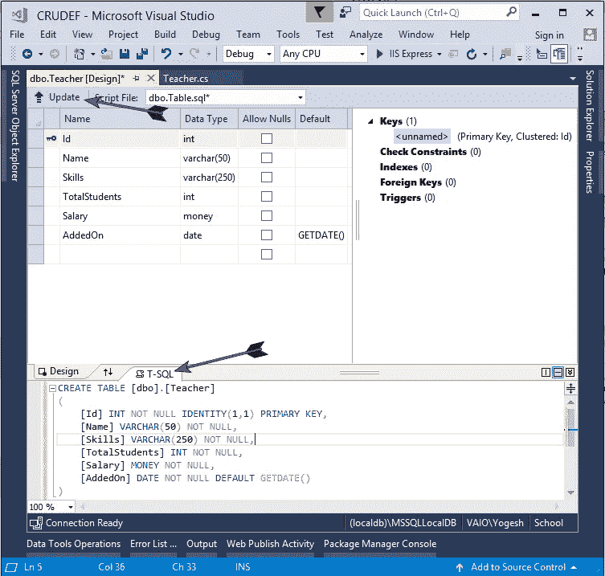

**Table Design Window**

你会得到一个新的对话框，名为“`Preview Database Updates`”。在这里点击“`Update Database`”按钮，几秒钟后将创建库存表。

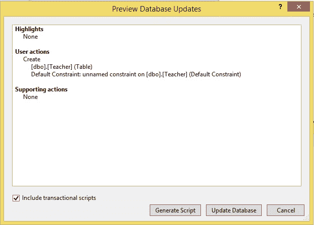

**Preview Database Updates window**

您可以在“Tables”节点中找到这个新创建的表。

“教师”表有 6 列，分别是:

> 1.id-将从 1 自动生成的主键列，因为它具有 Identity(1，1)属性。
> 
> 2.Name —一个 varchar(50)列，用于存储教师的姓名。
> 
> 3.技能—用于存储教师的技能。
> 
> 4.TotalStudents —一个 Int 列，用于存储给定教师所教学生的总数。
> 
> 5.薪水—用于存储教师的薪水。
> 
> 6.AddedOn —用于存储记录的创建时间。该列有一个日期类型，它使用 GETDATE() SQL 函数自动获取当前时间。

注意，这些列有`NOT NULL`属性，所以它们不能包含 NULL。

## **5。在应用程序中添加数据库的连接字符串**

连接字符串将参数存储到数据库，并用于将应用程序连接到数据库。这些参数是驱动程序名、服务器名和数据库名。它还包含数据库连接所需的安全信息，如用户名和密码。

连接字符串存储在应用程序根目录下的`appsettings.json`文件中。

在解决方案浏览器中右击项目名称，并选择`Add > New Item`。然后当“`Add New Item`窗口打开时，选择`ASP.NET Configuration file`文件，并将其命名为`appsettings.json`(见下图)。最后点击`Add`按钮。

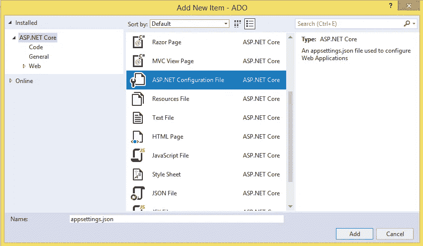

**Adding appsettings.json file**

该文件将被创建并在 Visual Studio 中打开进行编辑。向其中添加以下连接字符串:

```
{
    "ConnectionStrings": {
        "DefaultConnection": "Server=  (localdb)\\MSSQLLocalDB;Database=School;Trusted_Connection=True;MultipleActiveResultSets=true"
    }
}
```

我在连接字符串中将可信连接定义为 true，以便使用当前用户的 Windows 凭据对 SQL Server 进行身份验证。

## **6。为教师添加示范课**

右键单击解决方案资源管理器中的项目名称，并选择“`Add > New Folder`”。将此文件夹命名为“`Models`”。然后右击这个“`Models`”文件夹，选择“`Add > New Item`”。

在打开的窗口中，选择一个新班级，并将其命名为教师。将以下属性添加到该类中:

```
using CRUDADO.CustomValidation;
using System;
using System.Collections.Generic;
using System.ComponentModel.DataAnnotations;
using System.Linq;
using System.Threading.Tasks;namespace CRUDADO.Models
{
    public class Teacher
    {
        [Required]
        public int Id { get; set; } [Required]
        public string Name { get; set; } [Required]
        [SkillsValidate(Allowed = new string[] { "ASP.NET Core", "ASP.NET MVC", "ASP.NET Web Forms" }, ErrorMessage = "You skills are invalid")]
        public string Skills { get; set; } [Range(5, 50)]
        public int TotalStudents { get; set; } [Required]
        public decimal Salary { get; set; }

        [Required]
        public DateTime AddedOn { get; set; }
    }
}
```

对于数据库中教师表的 6 列，这个类有 6 个属性。我对 Id、Name、Skills、Salary 和 AddedOn 属性应用了`[Required]`属性，对 TotalStudent 属性应用了[Range]属性，因此它只允许从 5 到 50 的值。

还要注意应用于 Skills 属性的`[SkillsValidate]`属性。`[SkillsValidate]`属性是一个自定义验证属性，通过它我将强制 Skills 属性只接受 3 个值，它们是:

> 1.ASP.NET 核心
> 
> 2.ASP.NET MVC
> 
> 3.ASP.NET Web 窗体

接下来，我将创建`[SkillsValidate]`自定义验证属性。因此，在应用程序的根目录下创建一个新文件夹，并将其命名为“`CustomValidation`”。在这个文件夹中添加一个名为'【T4]'的新类，并添加以下代码:

```
using Microsoft.AspNetCore.Mvc.ModelBinding.Validation;
using System;
using System.Collections.Generic;
using System.Linq;
using System.Threading.Tasks;namespace CRUDADO.CustomValidation
{
    public class SkillsValidate : Attribute, IModelValidator
    {
        public string[] Allowed { get; set; }
        public string ErrorMessage { get; set; }

        public IEnumerable<ModelValidationResult> Validate(ModelValidationContext context)
        {
            if (Allowed.Contains(context.Model as string))
                return Enumerable.Empty<ModelValidationResult>();
            else
                return new List<ModelValidationResult> {
                    new ModelValidationResult("", ErrorMessage)
                };
        }
    }
}
```

## **7。添加客户端验证功能**

客户端验证功能由'`jQuery`'和两个验证插件执行，这两个插件是:

> 1. [**jQuery**](http://www.yogihosting.com/category/jquery/) 验证
> 
> 2.jQuery 验证不引人注目

要安装这 3 个，在'【T6]'窗口中运行以下命令:

```
PM> Install-Package jQuery -Version 3.3.1PM> Install-Package jQuery.Validation -Version 1.17.0PM> Install-Package jQuery.Validation.Unobtrusive -Version 2.0.20710
```

## 8。执行创建教师功能

在应用程序的根目录下创建“`Controllers`”文件夹。在这个文件夹中添加一个名为`HomeController.cs’`的新控制器。控制器的初始代码如下所示:

```
using System.Collections.Generic;
using System.Linq;
using Microsoft.AspNetCore.Mvc;namespace CRUDADO.Controllers
{
    public class HomeController : Controller
    {
        public IActionResult Index()
        {
            return View();
        }
    }
}
```

连接字符串保存在`appsettings.json`文件中。要访问这个文件，我必须通过依赖注入特性获得`IConfiguration`接口的对象。因此我必须在 HomeController 的构造函数中添加`IConfiguration`接口，MVC 框架会自动为我提供这个接口的对象。

因此，将家庭控制器的代码改为如下所示:

```
using System.Collections.Generic;
using System.Linq;
using Microsoft.AspNetCore.Mvc;
using Microsoft.Extensions.Configuration;namespace CRUDADO.Controllers
{
    public class HomeController : Controller
    {
        public IConfiguration Configuration { get; }
        public HomeController(IConfiguration configuration)
        {
            Configuration = configuration;
        }

        public IActionResult Index()
        {
            return View();
        }
    }
}
```

“创建教师”功能是通过一个名为“`CREATE`”的新操作方法实现的。因此，将 Create Action 方法添加到 Home 控制器中，如下所示:

```
using System;
using System.Collections.Generic;
using System.Data;
using System.Data.SqlClient;
using System.Linq;
using System.Threading.Tasks;
using CRUDADO.Models;
using Microsoft.AspNetCore.Mvc;
using Microsoft.Extensions.Configuration;namespace CRUDADO.Controllers
{ 
    public class HomeController : Controller
    {
        public IConfiguration Configuration { get; }
        public HomeController(IConfiguration configuration)
        {
            Configuration = configuration;
        } public IActionResult Index()
        {
            return View();
        } public IActionResult Create()
        {
            return View();
        } [HttpPost]
        public IActionResult Create_Post(Teacher teacher)
        {
            if (ModelState.IsValid)
            {
                string connectionString = Configuration["ConnectionStrings:DefaultConnection"];
                using (SqlConnection connection = new SqlConnection(connectionString))
                {
                    string sql = $"Insert Into Teacher (Name, Skills, TotalStudents, Salary) Values ('{teacher.Name}', '{teacher.Skills}','{teacher.TotalStudents}','{teacher.Salary}')"; using (SqlCommand command = new SqlCommand(sql, connection))
                    {
                        command.CommandType = CommandType.Text;
                        connection.Open();
                        command.ExecuteNonQuery();
                        connection.Close();
                    }
                    return RedirectToAction("Index");
                }
            }
            else
                return View();
        }
    }
}
```

在 Create Action 方法中，我在下面的代码行中获得了连接字符串:

```
string connectionString = Configuration["ConnectionStrings:DefaultConnection"];
```

然后，我使用'`SqlCommand`'对象通过运行 insert SQL 查询来插入教师的记录:

```
string sql = $"Insert Into Teacher (Name, Skills, TotalStudents, Salary) Values ('{teacher.Name}', '{teacher.Skills}','{teacher.TotalStudents}','{teacher.Salary}')";
```

接下来，在应用程序的根目录中添加“`Views`”文件夹。在这个文件夹中创建一个名为“Home”的新文件夹。

接下来，在这个“`Home`”文件夹(即“`Views>Home`”)中创建一个名为“`Create.cshtml`”的新视图。将以下代码添加到该视图中:

```
@model Teacher@{
    Layout = "_Layout";
    var title = "CREATE Teacher";
    ViewData["Title"] = title;
}<style>
.input-validation-error {
    border-color: red;
}
</style><h2>@title</h2><**div** **asp-validation-summary**="ModelOnly" class="text-danger"></**div**>
<**form** class="m-1 p-1" method="post">
    <div class="form-group">
        <**label** **asp-for**="Name"></**label**>
        <**input** **asp-for**="Name" class="form-control" />
        <**span** **asp-validation-for**="Name" class="text-danger"></**span**>
    </div> <div class="form-group">
        <**label** **asp-for**="Skills"></**label**>
        <**input** **asp-for**="Skills" **type**="text" class="form-control" />
        <**span** **asp-validation-for**="Skills" class="text-danger"></**span**>
    </div> <div class="form-group">
        <**label** **asp-for**="TotalStudents"></**label**>
        <**input** **asp-for**="TotalStudents" **type**="text" class="form-control" />
        <**span** **asp-validation-for**="TotalStudents" class="text-danger"></**span**>
    </div> <div class="form-group">
        <**label** **asp-for**="Salary"></**label**>
        <**input** **asp-for**="Salary" **type**="text" class="form-control" />
        <**span** **asp-validation-for**="Salary" class="text-danger"></**span**>
    </div>
    <button type="submit" class="btn btn-primary">Submit</button></**form**><script src="/lib/jquery/dist/jquery.min.js"></script>
<script src="/lib/jquery-validation/dist/jquery.validate.min.js"></script>
<script src="/lib/jquery-validation-unobtrusive/dist/jquery.validate.unobtrusive.min.js"></script>
```

该视图有一个类型为'`Teacher`'的模型，它为'`Name, Skills, TotalStudents and Salary`'创建输入字段，以便用户可以填写并提交它。

当点击提交按钮时，类型为`HttpPost`的创建动作被调用，新的教师记录被创建。

请注意对视图中的输入字段进行客户端验证的 3 个脚本文件:

```
<script src="/lib/jquery/dist/jquery.min.js"></script>
<script src="/lib/jquery-validation/dist/jquery.validate.min.js"></script>
<script src="/lib/jquery-validation-unobtrusive/dist/jquery.validate.unobtrusive.min.js"></script>
```

如果您正在通过 EF core 执行记录插入，那么您需要查看本教程— [**在实体框架核心**](http://www.yogihosting.com/insert-records-entity-framework-core/) 中插入记录。

**测试创建教师功能**

运行应用程序，在浏览器中转至“`Create`”视图的 URL，即— `http://localhost:52730/Home/Create`。您将在浏览器中看到“创建教师”表单。

无需填写任何字段，点击提交按钮，您将看到 jQuery 验证插件显示的验证错误。

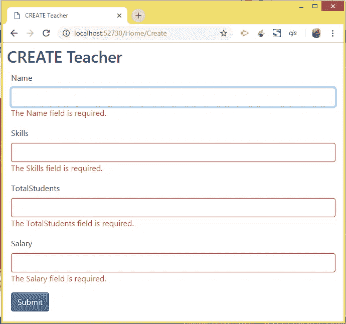

**jQuery Validations on Teacher Form**

现在填写所有的字段(如下图所示)并点击提交按钮。

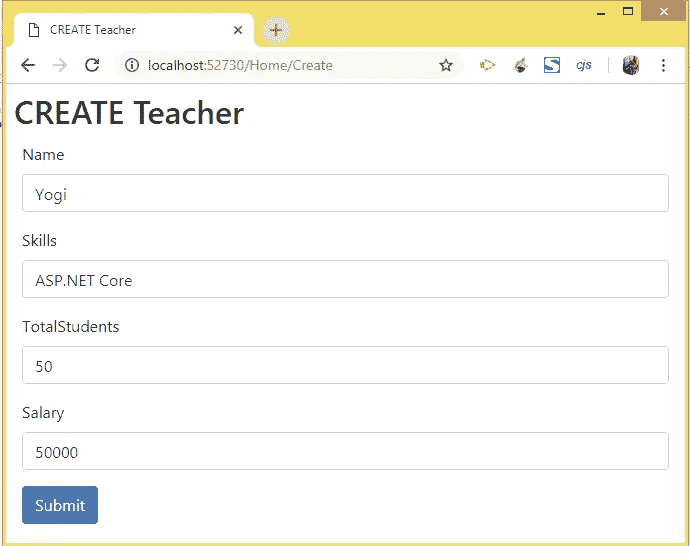

**Create Teacher**

将在数据库中创建教师记录，您将被重定向到当前为空的索引视图。

您可以确认记录已插入教师的表中。为此，转到'`SQL Server Object Explorer`'，然后右键单击'`Teacher`'表并选择'`View Data`'。

教师表将打开，您将在其中看到新的教师记录，见下图:

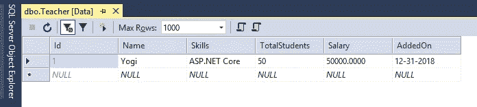

**Teacher Record Inserted in Database**

## 9。执行读取教师功能

现在，我们将创建阅读教师功能。因此，更改家庭控制器中的索引操作，使所有教师返回到视图，如下所示:

```
public IActionResult Index()
{
    List<Teacher> teacherList = new List<Teacher>();
    string connectionString = Configuration["ConnectionStrings:DefaultConnection"]; using (SqlConnection connection = new SqlConnection(connectionString))
    {
        //SqlDataReader
        connection.Open();

        string sql = "Select * From Teacher";SqlCommand command = new SqlCommand(sql, connection);
        using (SqlDataReader dataReader = command.ExecuteReader())
        {
            while (dataReader.Read())
            {
                Teacher teacher = new Teacher();
                teacher.Id = Convert.ToInt32(dataReader["Id"]);
                teacher.Name = Convert.ToString(dataReader["Name"]);
                teacher.Skills = Convert.ToString(dataReader["Skills"]); teacher.TotalStudents = Convert.ToInt32(dataReader["TotalStudents"]);
                teacher.Salary = Convert.ToDecimal(dataReader["Salary"]);
                teacher.AddedOn = Convert.ToDateTime(dataReader["AddedOn"]); teacherList.Add(teacher);
            }
        }
        connection.Close();
    }
    return View(teacherList);
}
```

在这个动作中，我用`SqlCommand’s ExecuteReader()`方法执行了“`Select * from Teacher`”查询，以获得一个`SqlDataReader`对象。

然后，我使用 SqlDataReader 的'`.Read()`'方法遍历所有记录，并创建一个包含所有教师记录的教师列表对象。这个对象在代码的最后作为模型返回给视图。

接下来，使用以下代码将'`Index`'视图添加到'`Views/Home/`'文件夹中:

```
@model IEnumerable<Teacher>@{
    Layout = "_Layout";
    var title = "READ Teacher";
    ViewData["Title"] = title;
}<h2>@title</h2>
<h3><**a** **asp-action**="Create" class="btn btn-sm btn-secondary">Create</**a**></h3><table class="table table-bordered table-sm table-striped">
    <thead>
        <tr>
            <th>Id</th>
            <th>Name</th>
            <th>Skills</th>
            <th>Total Students</th>
            <th>Salary</th>
            <th>Added On</th>
            <th>Update</th>
            <th>Delete</th>
        </tr>
    </thead>
    <tbody>
        @if (Model == null)
        {
            <tr>
                <td colspan="7" class="text-center">No Model Data</td>
            </tr>
        }
        else
        {
            @foreach (var p in Model)
            {
                <tr>
                    <td>@p.Id</td>
                    <td>@p.Name</td>
                    <td>@p.Skills</td>
                    <td>@p.TotalStudents</td>
                    <td>@string.Format(new System.Globalization.CultureInfo("en-US"), "{0:C2}", p.Salary)</td>
                    <td>@string.Format("{0:dddd, dd MMMM yyyy}", p.AddedOn)</td>
                    <td><**a** **asp-action**="Update" **asp-route-id**="@p.Id">Update</**a**></td>
                    <td>
                        <**form** **asp-action**="Delete" method="post" **asp-route-id**="@p.Id">
                            <button>Delete</button>
                        </**form**>
                    </td>
                </tr>
            }
        }
    </tbody>
</table>
```

注意，我还在表的 thead 和 tbody 元素中创建了用于更新和删除功能的列:

```
<table class="table table-bordered table-sm table-striped">
    <thead>
        <tr>
            <th>Id</th>
            <th>Name</th>
            <th>Skills</th>
            <th>Total Students</th>
            <th>Salary</th>
            <th>Added On</th>
            <th>Update</th>
            <th>Delete</th>
        </tr>
    </thead>
    <tbody> … else
    {
        @foreach (var p in Model)
        {
            <tr>
            … <td><**a** **asp-action**="Update" **asp-route-id**="@p.Id">Update</**a**></td>
                <td>
                    <**form** **asp-action**="Delete" method="post" **asp-route-id**="@p.Id">
                        <button>Delete</button>
                    </**form**>
                </td>
            </tr>
        }
    }
    </tbody>
</table>
```

我们将在接下来的小节中创建更新和删除功能。

不能错过的相关教程— [**读取实体框架核心**](http://www.yogihosting.com/read-records-entity-framework-core/) 中的记录。

**测试阅读教师功能**

运行您的应用程序，您将看到教师的表记录显示在索引视图中。下图显示了这一点:

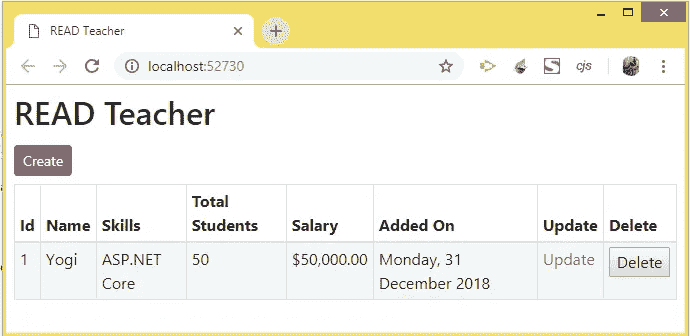

**Read Teacher View**

## **10。执行更新教师功能**

更新功能是通过向家庭控制器添加更新动作方法来完成的。添加到控制器的代码如下所示:

```
public IActionResult Update(int id)
{
    string connectionString = Configuration["ConnectionStrings:DefaultConnection"];
    Teacher teacher = new Teacher(); using (SqlConnection connection = new SqlConnection(connectionString))
    {
        string sql = $"Select * From Teacher Where Id='{id}'";
        SqlCommand command = new SqlCommand(sql, connection);
        connection.Open(); using (SqlDataReader dataReader = command.ExecuteReader())
        {
            while (dataReader.Read())
            {
                teacher.Id = Convert.ToInt32(dataReader["Id"]);
                teacher.Name = Convert.ToString(dataReader["Name"]);
                teacher.Skills = Convert.ToString(dataReader["Skills"]); teacher.TotalStudents = Convert.ToInt32(dataReader["TotalStudents"]); teacher.Salary = Convert.ToDecimal(dataReader["Salary"]); teacher.AddedOn = Convert.ToDateTime(dataReader["AddedOn"]);
            }
        }
        connection.Close();
    }
    return View(teacher);
}[HttpPost]
[ActionName("Update")]
public IActionResult Update_Post(Teacher teacher)
{
    string connectionString = Configuration["ConnectionStrings:DefaultConnection"];
    using (SqlConnection connection = new SqlConnection(connectionString))
    {
        string sql = $"Update Teacher SET Name='{teacher.Name}', Skills='{teacher.Skills}', TotalStudents='{teacher.TotalStudents}', Salary='{teacher.Salary}' Where Id='{teacher.Id}'"; using (SqlCommand command = new SqlCommand(sql, connection))
        {
            connection.Open();
            command.ExecuteNonQuery();
            connection.Close();
        }
    }
    return RedirectToAction("Index");
}
```

Update action 方法的`HttpGet` 版本在其参数中采用教师的“`id`”，然后使用 SqlCommand 对象运行名为`Select * From Teacher Where Id='{id}'`的 SQL 查询。它获取教师记录的值，并将其返回到更新视图。

HttpPost 版本的更新操作方法使用 ADO.NET '`SqlCommand`'对象来实际更新教师的记录。需要注意的重要事情是更新查询，它是:

```
string sql = $"Update Teacher SET Name='{teacher.Name}', Skills='{teacher.Skills}', TotalStudents='{teacher.TotalStudents}', Salary='{teacher.Salary}' Where Id='{teacher.Id}'";
```

接下来，使用以下代码在“Views/Home/”文件夹中创建更新视图:

```
@model Teacher
@{
    Layout = "_Layout";
    var title = "UPDATE Teacher";
    ViewData["Title"] = title;
}<style>
    .input-validation-error {
        border-color: red;
    }
</style><h2>@title</h2><**div** **asp-validation-summary**="ModelOnly" class="text-danger"></**div**>
<**form** class="m-1 p-1" method="post">
    <div class="form-group">
        <**label** **asp-for**="Id"></**label**>
        <**input** **asp-for**="Id" **type**="text" readonly class="form-control" />
    </div
    <div class="form-group">
        <**label** **asp-for**="Name"></**label**>
        <**input** **asp-for**="Name" **type**="text" class="form-control" />
        <**span** **asp-validation-for**="Name" class="text-danger"></**span**>
    </div>
    <div class="form-group">
        <**label** **asp-for**="Skills"></**label**>
        <**input** **asp-for**="Skills" **type**="text" class="form-control" />
        <**span** **asp-validation-for**="Skills" class="text-danger"></**span**>
    </div>
    <div class="form-group">
        <**label** **asp-for**="TotalStudents"></**label**>
        <**input** **asp-for**="TotalStudents" **type**="text" class="form-control" />
        <**span** **asp-validation-for**="TotalStudents" class="text-danger"></**span**>
    </div>
    <div class="form-group">
        <**label** **asp-for**="Salary"></**label**>
        <**input** **asp-for**="Salary" **type**="text" class="form-control"/>
        <**span** **asp-validation-for**="Salary" class="text-danger"></**span**>
    </div>
    <div class="form-group">
        <**label** **asp-for**="AddedOn"></**label**>
        <**input** **asp-for**="AddedOn" **type**="text" class="form-control" **asp-format**="{0:d}" />
    </div>
    <button type="submit" class="btn btn-primary">Submit</button>
</**form**><script src="/lib/jquery/dist/jquery.min.js"></script>
<script src="/lib/jquery-validation/dist/jquery.validate.min.js"></script><script src="/lib/jquery-validation-unobtrusive/dist/jquery.validate.unobtrusive.min.js"></script>
```

该视图类似于我们之前创建的索引视图。我将“Id”字段设为只读，这样用户就不能更改它。

**测试更新教师功能**

运行您的应用程序，并单击第一个教师记录的“更新”链接，请参见下图:

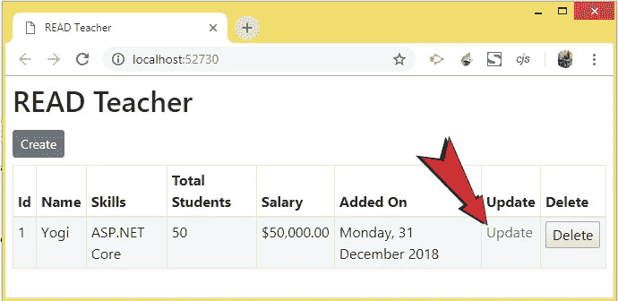

**Click Update Link**

该记录将打开进行更新。将姓名改为'`Bill Gates`'，工资改为'`100000000`'。最后，单击提交按钮，如下图所示:

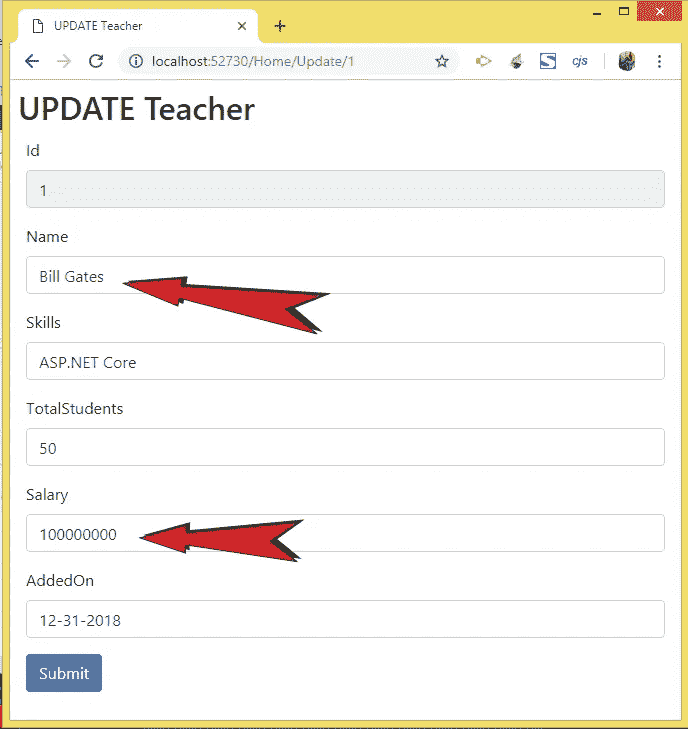

**Update Record**

记录将被更新，您将被重定向到索引视图，在该视图中您可以看到更新的记录字段，如下图所示:

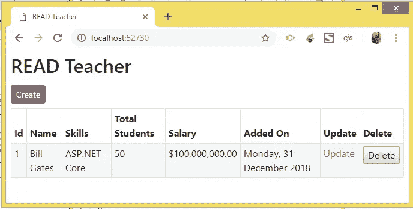

**Record Updated**

## **11。执行删除教师功能**

在主控制器中创建删除操作方法，其代码如下所示:

```
HttpPost]
public IActionResult Delete(int id)
{
    string connectionString = Configuration["ConnectionStrings:DefaultConnection"]
    using (SqlConnection connection = new SqlConnection(connectionString))
    {
        string sql = $"Delete From Teacher Where Id='{id}'";
        using (SqlCommand command = new SqlCommand(sql, connection))
        {
            connection.Open();
            try
            {
                command.ExecuteNonQuery();
            }
            catch (SqlException ex)
            {
                ViewBag.Result = "Operation got error:" + ex.Message;
            }
            connection.Close();
        }
    }
    return RedirectToAction("Index");
}
```

该方法在其参数中获取教师记录的 id，然后执行删除 SQL 查询:

```
string sql = $"Delete From Teacher Where Id='{id}'";
```

**测试删除教师功能**

运行您的应用程序，并单击针对任何记录给出的“删除”链接。查看显示记录删除过程的下图:

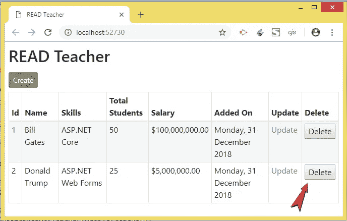

**Delete Link**

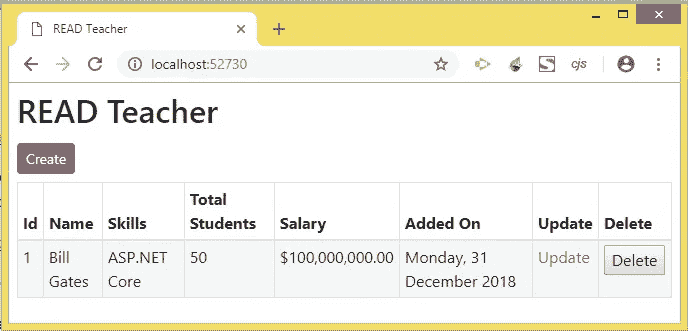

**Record Deleted**

[***从 GitHub***](https://github.com/yogyogi/CRUD-Operations-in-ADO.NET-with-ASP.NET-Core) ***【_ _ _ _ _ _ _ _ _ _ _ _ _ _ _ _ _ _ _ _ _ _ _ _ _ _ _ _ _ _ _ _ _ _ _ _ _ _ _ _ _ _ _ _ _ _ _ _ _ _ _ _ _ _ _ _ _ _ _ _***下载该应用的完整源代码

## **结论**

这就完成了 ASP.NET 堆芯使用 ADO.NET 的 CRUD 操作教程。我希望你喜欢阅读这篇文章，并理解代码是如何工作的。如果您有任何困惑，请仔细阅读您可以从这里下载的所有代码。


**Follow ME**

我希望你在这篇教程中发现了一些新的东西来增加你的 web 开发知识。

如果是这样，那么别忘了**拍几下**以示喜欢。它不仅会给我的坏脸带来微笑，还会激励我为网站开发者写更多更好的文章。

和往常一样，**关注我**，每当我在 Medium 上发表新文章时，就会收到通知。

> *我还发表了另一篇关于 HACKERNOON 的教程，你也会想看的——*[从初学者到专家的每个开发者都应该知道的 7 个常见的 Web 开发问题【多解】](https://hackernoon.com/7-common-web-development-problems-which-every-developer-from-beginners-to-experts-should-know-with-47a7d2e9367f)