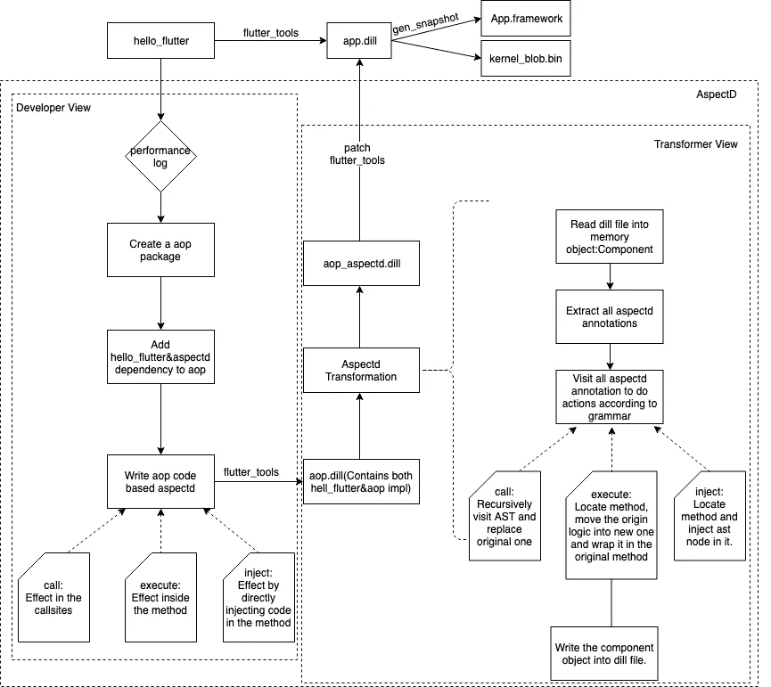
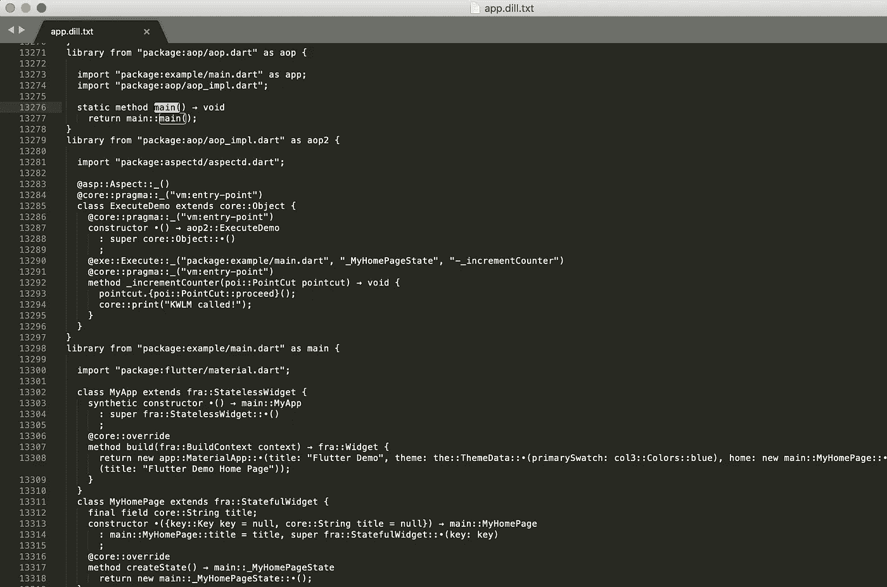
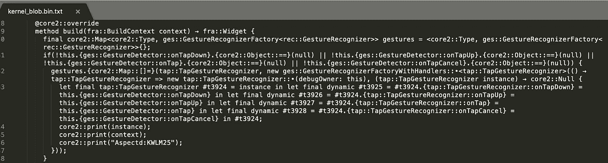

# AspectD:一种有效的颤振 AOP 解决方案

> 原文：<https://medium.com/hackernoon/aspectd-an-effective-aop-solution-for-flutter-306307647714>

## 由阿里巴巴先宇科技团队开源


*本文是阿里巴巴* [***利用旋舞***](/@alitech_2017/utilizing-flutter-best-practice-from-alibaba-236a53aa32c8) *系列的一部分。*

Github。[颤振方面](https://github.com/alibaba-flutter/aspectd)

# 背景

随着 Flutter 框架的快速发展，越来越多的企业开始使用 Flutter 来重构或构建新产品。然而，在实践中，我们发现，一方面，Flutter 具有很高的开发效率，优异的性能，以及良好的跨平台性能。另一方面，Flutter 也面临着插件缺失或不完善、基础能力和底层框架等问题。

例如，在实现自动记录和回放的过程中，我们发现需要修改 Flutter 框架(Dart 级别)的代码，以满足自动记录回放期间的需求。这导致了框架易受入侵的风险。为了解决这个问题，减少迭代过程中的维护成本，我们考虑的第一个解决方案是面向方面编程。

面向方面编程(AOP)可以在编译时(或运行时)动态地将代码插入到类的特定方法和位置，从而在不修改源代码的情况下，动态地、统一地向现有代码添加特性。

但问题是，如何才能实现颤振的 AOP？本文主要关注 AspectD，这是一个由 Xianyu tech 团队开发的面向 Dart 的 AOP 编程框架。

# AspectD:面向 Dart 的 AOP 框架

AOP 功能是在运行时支持还是在编译时支持，取决于语言本身的特性。比如在 iOS 中，Objective C 本身提供了强大的运行时和动态特性，使得运行时 AOP 易于使用。在 Android 中，Java 不仅可以实现基于字节码修改的编译时静态代理(如 AspectJ)，还可以实现基于运行时增强的运行时动态代理(如 Spring AOP)。

达特呢？首先，Dart 的反射支持差。只支持自检，不支持修改。其次，Flutter 禁用了对数据包大小和健壮性的反射。

因此，我们设计并实现了一个基于编译时修改的 AOP 解决方案 AspectD。

# 设计细则



# 典型的 AOP 场景

下面的 AspectD 代码演示了一个典型的 AOP 应用程序场景:

```
aop.dartimport 'package:example/main.dart' as app;
import 'aop_impl.dart';void main()=> app.main();aop_impl.dartimport 'package:aspectd/aspectd.dart';@Aspect()
@pragma("vm:entry-point")
class ExecuteDemo {
  @pragma("vm:entry-point")
  ExecuteDemo(); @Execute("package:example/main.dart", "_MyHomePageState", "-_incrementCounter")
  @pragma("vm:entry-point")
  void _incrementCounter(PointCut pointcut) {
    pointcut.proceed();
    print('KWLM called!') ;
  }
}
```

# 面向开发人员的 API 设计

# 切入点的设计

```
@Call("package:app/calculator.dart","Calculator","-getCurTime")
```

切入点需要完全描述如何添加 AOP 逻辑，例如以什么方式(调用/执行)，添加到哪个库，哪个类(在库方法的情况下此项为空)，以及哪个方法。
切入点的数据结构:

```
@pragma('vm:entry-point')
class PointCut {
  final Map<dynamic> sourceInfos;
  final Object target;
  final String function;
  final String stubId;
  final List<dynamic> positionalParams;
  final Map<dynamic, dynamic> namedParams; @pragma('vm:entry-point')
  PointCut(this.sourceInfos, this.target, this.function, this.stubId,this.positionalParams, this.namedParams); @pragma('vm:entry-point')
  Object proceed(){
    return null;
  }
}
```

它包含源代码信息(如库名、文件名和行号)、方法调用对象、函数名和参数信息。

请注意这里的`@pragma('vm:entry-point')`注释。其核心逻辑是摇树。在 AOT(提前)编译中，如果它不能被应用程序的主入口调用，它将作为无用代码被丢弃。AOP 代码的注入逻辑是非侵入性的，所以显然不会被主入口调用。因此，需要这个注释来告诉编译器不要丢弃这个逻辑。

这里的 proceed 方法类似于 AspectJ 中的 ProceedingJoinPoint.proceed()方法，通过调用 pointcut.proceed()方法可以调用原来的逻辑。原始定义中的 proceed 方法体为空，其内容将在运行时动态生成。

# 建议的设计

```
@pragma("vm:entry-point")
Future<String> getCurTime(PointCut pointcut) async{
  ...
  return result;
}
```

这里的`@pragma("vm:entry-point")`效果和上面描述的一样。切入点对象作为参数传入 AOP 方法，这样开发者就可以获得源代码调用的相关信息，实现自己的逻辑或者通过切入点. proceed()调用原来的逻辑。

# 外观设计

```
@Aspect()
@pragma("vm:entry-point")
class ExecuteDemo {
  @pragma("vm:entry-point")
  ExecuteDemo();
  ...
  }
```

方面注释可以使 AOP 实现类(如 ExecuteDemo)易于识别和提取，也可以用作开关。也就是说，如果我们想禁用这个 AOP 逻辑，只需删除@Aspect 注释。

# AOP 代码的编译

# 包含原始项目中的主条目

从上面我们可以看到，`import 'package:example/main.dart' as app;`是在 aop.dart 中引入的，它允许在编译 aop.dart 时包含整个示例项目的所有代码

# 调试模式下的编译

将`import 'aop_impl.dart';`引入 aop.dart 使得 aop_impl.dart 中的内容可以在调试模式下编译，即使它并不明确依赖于 aop.dart

# 发布模式下的编译

在 AOT 编译中(在发布模式下)，当 aop_impl.dart 中的内容没有被 aop 中的主条目调用时，树抖动逻辑使它们不会被编译到 Dill 中。添加`@pragma("vm:entry-point")`可以避免冲击。

当我们使用 AspectD 编写 aop 代码，通过编译 aop.dart 生成中间产品，使 Dill 既包含原始项目代码，又包含 AOP 代码时，那么我们就需要考虑如何对其进行修改。在 AspectJ 中，修改是通过对类文件的操作来实现的。在 AspectD 中，它是通过操作 Dill 文件实现的。

# 莳萝手术

Dill 文件，也称为 Dart 中间语言，是 Dart 语言编译中的一个概念。脚本快照或 AOT 编译都需要 Dill 作为中间媒介。

# 莳萝的结构

我们可以使用 Dart SDK 中 VM 包提供的 dump_kernel.dart 来打印 Dill 的内部结构。

```
dart bin/dump_kernel.dart /Users/kylewong/Codes/AOP/aspectd/example/aop/build/app.dill /Users/kylewong/Codes/AOP/aspectd/example/aop/build/app.dill.txt
```



# 莳萝的转化

Dart 提供了一种内核到内核的转换方法，可以通过递归 AST 遍历 Dill 文件来转换 Dill

基于开发人员编译的 AspectD 注释，可以从 AspectD 的转换部分提取出具体 AOP 代码需要添加的库、类和方法，然后在 AST 递归过程中通过对目标类的操作实现调用/执行等特性。

以下是典型转换逻辑的一部分:

```
@override
  MethodInvocation visitMethodInvocation(MethodInvocation methodInvocation) {
    methodInvocation.transformChildren(this);
    Node node = methodInvocation.interfaceTargetReference?.node;
    String uniqueKeyForMethod = null;
    if (node is Procedure) {
      Procedure procedure = node;
      Class cls = procedure.parent as Class;
      String procedureImportUri = cls.reference.canonicalName.parent.name;
      uniqueKeyForMethod = AspectdItemInfo.uniqueKeyForMethod(
          procedureImportUri, cls.name, methodInvocation.name.name, false, null);
    }
    else if(node == null) {
      String importUri = methodInvocation?.interfaceTargetReference?.canonicalName?.reference?.canonicalName?.nonRootTop?.name;
      String clsName = methodInvocation?.interfaceTargetReference?.canonicalName?.parent?.parent?.name;
      String methodName = methodInvocation?.interfaceTargetReference?.canonicalName?.name;
      uniqueKeyForMethod = AspectdItemInfo.uniqueKeyForMethod(
          importUri, clsName, methodName, false, null);
    }
    if(uniqueKeyForMethod ! = null) {
      AspectdItemInfo aspectdItemInfo = _aspectdInfoMap[uniqueKeyForMethod];
      if (aspectdItemInfo?.mode == AspectdMode.Call &&
          ! _transformedInvocationSet.contains(methodInvocation) && AspectdUtils.checkIfSkipAOP(aspectdItemInfo, _curLibrary) == false) {
        return transformInstanceMethodInvocation(
            methodInvocation, aspectdItemInfo);
      }
    }
    return methodInvocation;
  }
```

通过遍历 Dill 中的 AST 对象(此处为 visitMethodInvocation 函数)，结合开发者编写的 AspectD 注释(此处为 *aspectdInfoMap* 和 aspectdItemInfo)，我们可以转换原来的 AST 对象(此处为 MethodInvocation)来改变原来的代码逻辑，即转换过程。

# AspectD 支持的语法

与 AspectJ 中提供的 BeforeAroundAfter 改进不同，AspectD 中只有一个统一的抽象，那就是 Around。

就是否在内部修改原方法而言，有调用和执行两种类型。前者的切入点是调用点，后者的切入点是执行点。

# 打电话

```
import 'package:aspectd/aspectd.dart';@Aspect()
@pragma("vm:entry-point")
class CallDemo{
  @Call("package:app/calculator.dart","Calculator","-getCurTime")
  @pragma("vm:entry-point")
  Future<String> getCurTime(PointCut pointcut) async{
    print('Aspectd:KWLM02');
    print('${pointcut.sourceInfos.toString()}');
    Future<String> result = pointcut.proceed();
    String test = await result;
    print('Aspectd:KWLM03');
    print('${test}');
    return result;
  }
}
```

# 执行

```
import 'package:aspectd/aspectd.dart';@Aspect()
@pragma("vm:entry-point")
class ExecuteDemo{
  @Execute("package:app/calculator.dart","Calculator","-getCurTime")
  @pragma("vm:entry-point")
  Future<String> getCurTime(PointCut pointcut) async{
    print('Aspectd:KWLM12');
    print('${pointcut.sourceInfos.toString()}');
    Future<String> result = pointcut.proceed();
    String test = await result;
    print('Aspectd:KWLM13');
    print('${test}');
    return result;
  }
```

# 注射

只支持调用和执行，这对于 Flutter (Dart)来说显然是不够的。一方面，颤振不允许反射。退一步说，即使 Flutter 启用了反射，也还是不够，不能满足需求。

对于一个典型的场景，如果 x.dart 文件中的类“y”在要注入的 dart 代码中定义了一个私有方法“m”或者一个成员变量“p”，那么在 aop_impl.dart 中是无法访问的，更不用说获取多个连续的私有变量属性了。另一方面，仅仅操作整个方法可能还不够。我们可能需要在方法中间插入处理逻辑。

为了解决这个问题，在 AspectD 中设计了一个语法 Inject。请参见以下示例:

Flutter 库包含以下手势相关代码:

```
@override
  Widget build(BuildContext context) {
    final Map<TapGestureRecognizer> gestures = <Type, GestureRecognizerFactory>{}; if (onTapDown ! = null || onTapUp ! = null || onTap ! = null || onTapCancel ! = null) {
      gestures[TapGestureRecognizer] = GestureRecognizerFactoryWithHandlers<TapGestureRecognizer>(
        () => TapGestureRecognizer(debugOwner: this),
        (TapGestureRecognizer instance) {
          instance
            ..onTapDown = onTapDown
            ..onTapUp = onTapUp
            ..onTap = onTap
            ..onTapCancel = onTapCancel;
        },
      );
    }
```

如果我们想在 onTapCancel 之后为实例和上下文添加一个处理逻辑，Call 和 Execute 是不可行的。但是，使用 Inject，只需要几个简单的语句就可以解决问题:

```
import 'package:aspectd/aspectd.dart';@Aspect()
@pragma("vm:entry-point")
class InjectDemo{
  @Inject("package:flutter/src/widgets/gesture_detector.dart","GestureDetector","-build", lineNum:452)
  @pragma("vm:entry-point")
  static void onTapBuild() {
    Object instance; //Aspectd Ignore
    Object context; //Aspectd Ignore
    print(instance);
    print(context);
    print('Aspectd:KWLM25');
  }
}
```

通过以上处理逻辑，编译后的 Dill 中的 GestureDetector.build 方法如下:



另外，与 Call/Execute 相比，Inject 的输入参数多了一个 lineNum 命名参数，可以用来指定插入逻辑的具体行号。

# 构建流程支持

虽然我们可以通过编译 aop.dart 将原始工程代码和 AspectD 代码都编译到 dill 文件中，然后通过 Transform 实现 Dill 层次转换来实现 aop，但是标准的 Flutter build (flutter tools)并不支持这个过程，所以仍然需要对构建过程进行微小的改动。

在 AspectJ 中，这个过程是由非标准 Java 编译器的 Ajc 实现的。在 AspectD 中，可以通过将补丁附加到 flutter_tools 来实现对 AspectD 的支持。

```
kylewong@KyleWongdeMacBook-Pro fluttermaster % git apply --3way /Users/kylewong/Codes/AOP/aspectd/0001-aspectd.patch
kylewong@KyleWongdeMacBook-Pro fluttermaster % rm bin/cache/flutter_tools.stamp
kylewong@KyleWongdeMacBook-Pro fluttermaster % flutter doctor -v
Building flutter tool...
```

# 实践与思考

基于 AspectD，我们已经在实践中成功为 Flutter 框架移除了所有侵入性代码，实现了与侵入性代码未被移除时相同的特性，支持数百个脚本的录制和回放以及自动回归的稳定可靠运行。

从 AspectD 的角度来看，Call/Execute 可以帮助我们轻松实现一些特性，比如性能跟踪(关键方法的调用持续时间)、日志增强(获取具体调用某个方法的地方的详细信息)、Doom 记录和回放(比如随机数序列的构建记录和回放)。注入语法更加强大。它可以通过类似于源代码的手段实现逻辑的自由注入，支持复杂场景，比如 app 记录和自动回归(比如用户触摸事件的记录和回放)。

此外，AspectD 原理是基于 Dill 变换的。借助 Dill 的力量，开发者可以在 Dart 编译的产品上自由操作。此外，这种转换的目标是 AST 对象，它接近源代码级别，不仅功能强大，而且可靠。无论是逻辑替换还是 Json←>模型转换，都提供了新的视角和可能性。

# 结论

AspectD 作为鲜宇科技团队开发的一个新的面向颤振的 AOP 框架，支持主流 AOP 场景，在 Github 上开源。[颤振方面](https://github.com/alibaba-flutter/aspectd)

如果您在使用过程中有任何问题或建议，请随时提交[问题](https://github.com/alibaba-flutter/aspectd/issues)或[拉动请求](https://github.com/alibaba-flutter/aspectd/pulls)。

**(Original article by Wang Kang 王康)**

# 阿里巴巴科技

关于阿里巴巴最新技术的第一手深度资料→脸书: [**“阿里巴巴科技”**](http://www.facebook.com/AlibabaTechnology) 。Twitter:[**【AlibabaTech】**](https://twitter.com/AliTech2017)。