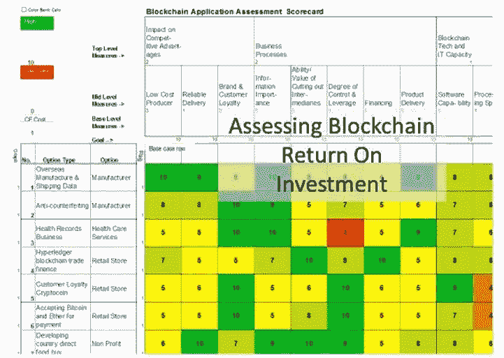
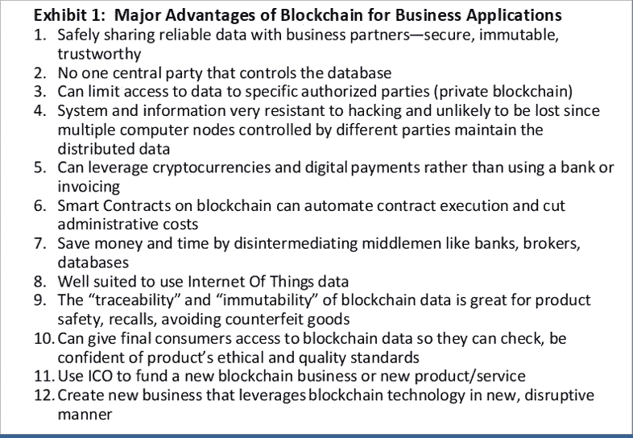
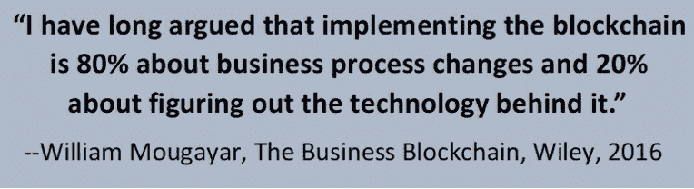
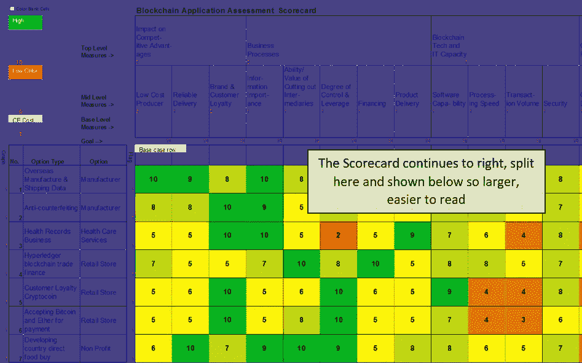
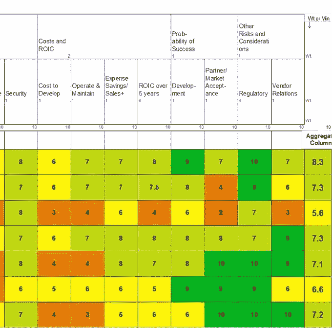

# 评估区块链应用的投资回报(ROI)

> 原文：<https://medium.com/hackernoon/assessing-the-return-on-investment-roi-of-blockchain-applications-29a3ec39af04>

## 行动纲要

大多数财富 500 强企业正在实施或试验区块链应用程序，成千上万的小公司已经开始寻求一些新的区块链商业应用程序，希望打破现有的大企业。

许多公司知道区块链，但很难估计区块链应用程序的可能投资回报(ROI)，这是获得公司资金批准的一项要求。在典型的 IT 项目中，系统及其使用的所有方面都在您的公司内部，相比之下，区块链应用程序用于与业务伙伴或客户共享信息，因此不完全在您的控制之下。区块链提供了巨大的潜在好处，但在 ROI 计算中带来了更多的复杂性和不确定性。在决定是否申请区块链时，你需要考虑几十个因素或标准，并选择哪些潜在的申请是最有前途的，提供最好的投资回报率。许多或大多数好处可能是无形的，比如更快地发现运输延误。

区块链商业顾问用来评估区块链应用程序是否值得追求的方法依赖于一种被称为多标准决策分析(MCDA)的成熟决策分析工具。我们考虑了一系列投资回报估计，但也权衡了可能不容易纳入投资回报估计的其他因素。MCDA 是为管理层强调无形资产和不确定性的理想工具，这些资产和不确定性不应该被埋没在 ROI 计算中，也不应该被忽略，因为它们太不确定或难以量化。

可以计算区块链应用程序的投资回报率，但考虑到巨大的不确定性和无形资产，应准备一系列值，并应辅以多标准决策分析，突出所有风险和潜在收益，而不是将区块链项目中的众多风险和问题隐藏在一个数字中。我们使用“评估”ROI 或“分析”一词，而不是“计算”的标准，来强调这些评估本身是不确定的，并强烈建议为“可能的 ROI”提供一个高/低范围，而不仅仅是一个点估计。

这篇文章概述了我们的方法，并研究了我们帮助客户评估的许多特殊问题，以估计区块链应用程序的可能 ROI。解释该方法的完整白皮书可在 www.bchainconsult.com[获得](http://www.bchainconsult.com)

## 为什么区块链在商业应用中有价值

区块链技术实现了一个包含所有信息的共享数据库，而不是必须连接或访问的孤岛数据库——如果由另一方控制，可能不值得信任，或者容易受到黑客和数据窃取或篡改的攻击。区块链允许更好的事务可追溯性，以及对数据正确性的信心，具有“不可变的”(不可更改的)条目，所有事务的完整历史。这对于避免假冒商品和银行甚至律师和法院的非中介化非常重要。区块链不仅允许在多个 IT 系统之间，而且允许在多个业务方之间集成和有限/可信/安全共享数据的能力，为业务运营带来了显著的优势。详细介绍这一点的文章很少提及，但区块链在商业应用中的主要优势可从以下网址获得:

 [## 区块链被低估的最大应用是集成:IT 系统和业务…

### 虽然大多数人都知道区块链是加密货币的基础，但即使是区块链的爱好者似乎也…

medium.com](/@collapsesurvivor/blockchains-underappreciated-greatest-application-is-integration-it-systems-and-business-partner-6b1392a9b7ba) 

“智能合约”锁定在区块链系统中，并在达成一致的条件时由计算机网络执行，这是区块链技术的另一个强大优势。如果出现运输延迟、付款问题、计划之外的任何事情，“智能合同”(编程指令)可以立即通知所有相关方这一变化，并执行商定的合同条款。智能合同对于自动发送信息、更新、授权或支付非常有价值。对于企业来说，智能合同可能比传统的区块链优势更有价值。使用加密货币(也可以是数字法定货币)的能力有助于自动化支付，并省去中间银行。总之，区块链非常适合在业务合作伙伴(以及适当的政府监管机构)之间共享信息，并通过智能合同实现许多管理和支付功能的自动化。

区块链的主要优势及其智能合约和加密货币的相关能力在下面的附件 1 中进行了总结。

有一种倾向认为区块链项目主要是 IT 事务，但对于业务应用程序，区块链项目更好地认为是流程再造。区块链工作在很大程度上是流程重新设计，将涉及运营的所有方面，而不仅仅是 IT 人员。《商业区块链》一书的作者 William Mougayar 说，区块链的商业项目 80%是关于商业过程的改变，技术只是其中的一小部分。这本书是一本关于区块链的伟大著作，虽然现在已经有点过时了。

如果区块链应用程序旨在改善与外部业务合作伙伴的运营，那么大量的关键分析和工作就是说服其他方使用您的区块链——这不是简单的内部 it 系统变更！

## D 利用无形的区块链优势

一些顾问认为“无形(或软或非财务)收益不应包括在 ROI 计算中”，因为“虽然它们通常与有形收益一样重要，但它们很难在财务上量化。”[【第二】](#_edn1)我们强烈反对，理由如下:

1.无形收益对公司的销售和利润有着同样大的影响

2.您通常可以合理地量化无形资产，至少在从好到坏的范围内，并将它们包括在多标准决策分析中，如本文后面所解释的。

3.忽视无形资产可能会导致非常糟糕的决策:例如，一台新区块链的所有成本都是有形的，相对容易量化——而获得新客户、减少错误、更快更可靠的信息、更少的黑客攻击风险(尽管这些风险是无形的，难以评估)的好处可能会让有形成本相形见绌。

许多企业现在使用区块链来验证并给消费者信心，他们订购的产品真的是有机食品，不是假冒的，真的是新鲜的，确实来自 Y 县的 X 工厂，对工人的人道待遇。提高客户满意度是一种无形的、不确定的影响，但如果能够检查产品来源的可靠信息，无论产品是否是在您希望的条件下生产的，都可能带来巨大的好处，并增加销售额和利润。在我们所做的一些区块链评估中，大部分收益是无形的和高度不确定的，但我们能够评估和合理估计非常合理和可能的影响。

遵循一个在 ROI 计算中忽略无形资产的荒谬建议可能会导致忽略区块链应用程序的大部分影响，实际上保证了不合理的评估和错误的决策。

## 区块链投资回报率评估的多标准决策分析

区块链商业顾问用来评估区块链应用程序是否值得追求的方法依赖于一种被称为多标准决策分析(MCDA)的成熟决策分析工具。它考虑了一系列投资回报估计，但也权衡了可能不容易纳入投资回报估计的其他因素。MCDA 也是突出管理的无形和不确定性的理想选择，这些不应该被埋没在 ROI 计算中或被忽略，因为它们太不确定或难以量化。

Exhibit 2: A Multi-Criteria Decision Analysis “scorecard” blockchain applications assessment (1 of 2)

Rest of Blockchain Assessment multi-criteria decision analysis scorecard (right half)

这种方法允许您考虑和权衡所有相关的标准，影响区块链申请成败的因素，包括无形的和难以量化的因素。它可以让你一次比较几十个应用程序，这样你就可以找出最好的。

应用适当的权重(一些因素比其他因素更重要)，并计算加权平均分数。不确定哪些因素最重要？—改变权重，看看这如何改变总加权分数。查看不同的区块链应用程序在所有相关因素中的表现。试图在头脑中，或者在电子表格或 PowerPoint 演示文稿中记录所有这些权衡和问题是不可能的。你需要这个软件，你需要做敏感性分析，输入不同的评级和可能性，看看区块链应用程序在不同情况下的表现。

在决定是否申请区块链时，你需要考虑几十个因素或标准，并选择哪些潜在的申请最有前途，提供最佳投资回报。

您对不同区块链应用程序及其变体的 ROI 评估需要考虑几十个，有时超过一百个问题。

使用多标准决策分析的这一过程的最大价值在于，你经常会想出改变所考虑的选项的想法，避免一些漏洞，克服缺点，对冲不利的发展。当对不同的区块链应用程序的评级和影响发表不同意见时，我们通常会讨论如何解决已知的问题。这通常会产生改变考虑中的选项的想法，避免一些漏洞，克服缺点，并对冲不利的发展。例如，一家公司中偏爱不同区块链应用程序的两方提出了一种混合方法，实现了两种应用程序的关键优势。

一旦构建了初始记分卡，您就可以召开会议来获取更多信息，并让人们质疑和讨论关于应用程序将如何执行、追求应用程序的风险和成本的不同观点。你会得到新的想法，通常最终会修改一些标准和调整一些分数。通常，您会想到如何更改区块链应用程序或业务流程的某些方面来解决问题。

www.bchainconsult.com[提供的关于评估区块链的完整论文涵盖了区块链投资回报评估中需要分析的特殊问题，如区块链处理速度、说服业务合作伙伴使用您的区块链，以及我们在区块链项目中看到的许多错误。](http://www.bchainconsult.com)

整篇论文还介绍了开发一个原型区块链应用程序，以帮助减少区块链可行性的不确定性、开发成本，以及最重要的，您的业务合作伙伴或客户愿意使用它的可能性。

这篇文章也解释了为什么 PowerPoint 对于决策制定来说是非常糟糕的，并且解释了为什么多标准决策分析对于区块链 ROI 评估来说是一个更好的方法。另一个伟大的工具，评估投资与许多重要的，高度不确定的条件或事件，将决定成功一样，区块链应用程序，决策树，也涵盖在整个文件。

事实上，大多数财富 500 强企业正在使用或探索区块链和数千家区块链初创企业，它们已经启动了颠覆现有企业的计划，这是另一个很好的线索，表明这项新技术有着巨大的潜力，尽管高度不确定。评估新技术的影响本质上是不确定的，需要估计大量的无形影响。在投资回报分析中忽略它们是非常糟糕的建议。

底线是，如果 ROI 分析作为对可能的成本和收益的评估正确执行，而不是对答案的可靠计算，那么它可能是非常有价值的。有一个多元化的人员团队，大多数不是 IT 专家，使用 MCDA 来考虑一个预期的区块链应用程序的所有影响，你至少会了解很多关于你的公司可能的回报。如果你建立了一个原型，你将会学到更多的东西，并得到一个更有效的、更精确的投资回报范围的评估。

如果你发现区块链的利益太不确定、太不可捉摸或太难评估，你至少应该考虑一下这些问题的答案，然后再决定去区块链太冒险:竞争对手在区块链的项目对你的业务有什么影响？例如，如果竞争对手实施的区块链极大地减少了假冒商品，减少了订购中的管理错误和成本，您会因此失去客户吗？区块链被吹捧为“第二次互联网革命”[【iii】](#_edn1)不无道理。受益于防黑客分布式账本，让你能够与业务合作伙伴和客户可靠、安全地共享信息，智能合同可以自动计费，并可能以加密货币支付来避免银行支出，区块链将颠覆许多行业，淘汰一些未能利用这一新技术的公司。

这篇文章概述了我们估算区块链应用程序可能的投资回报率的方法。解释该方法的完整白皮书可在 www.bchainconsult.com[获得](http://www.bchainconsult.com)

德鲁·米勒博士，文学硕士，CFP 文学硕士和文学硕士，发展经济学博士

区块链业务顾问董事总经理

【drmiller@blockchainhainconsult.com 

[【I】](#_ednref1)德勤，《打破区块链公开赛，德勤 2018 全球区块链调查》

[【二】](#_ednref1)[https://www . axia-consulting . co . uk/html/basic _ ROI _ calculation . html](https://www.axia-consulting.co.uk/html/basic_roi_calculation.html)

[【iii】](#_ednref1)《区块链革命:比特币背后的技术如何改变货币、商业和世界》，唐·塔斯考特和亚历克斯·泰普斯科特，2016 年