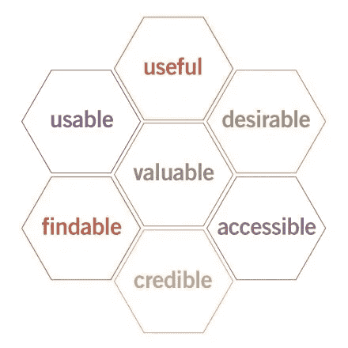
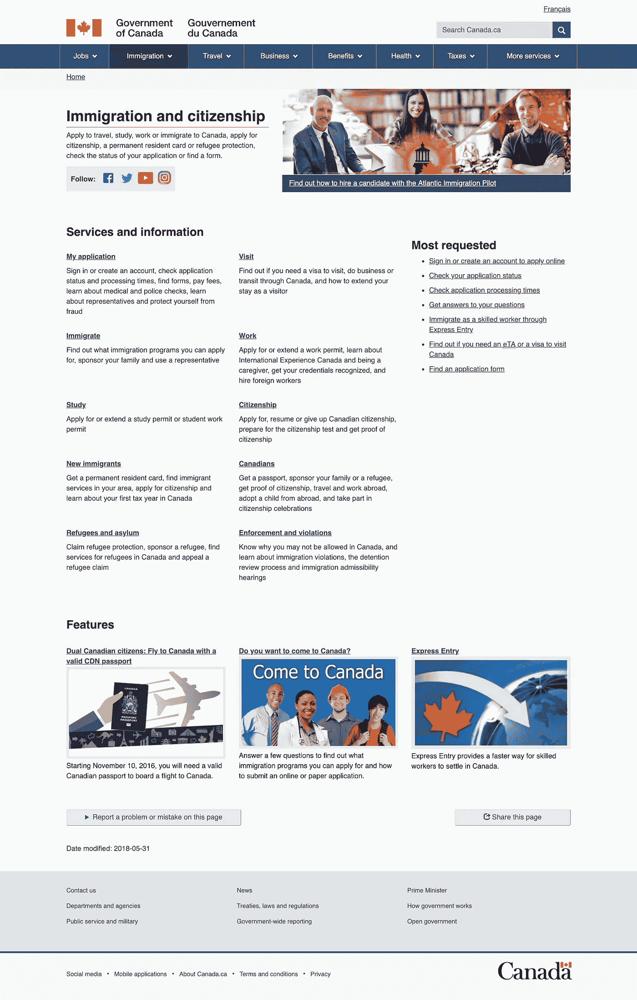
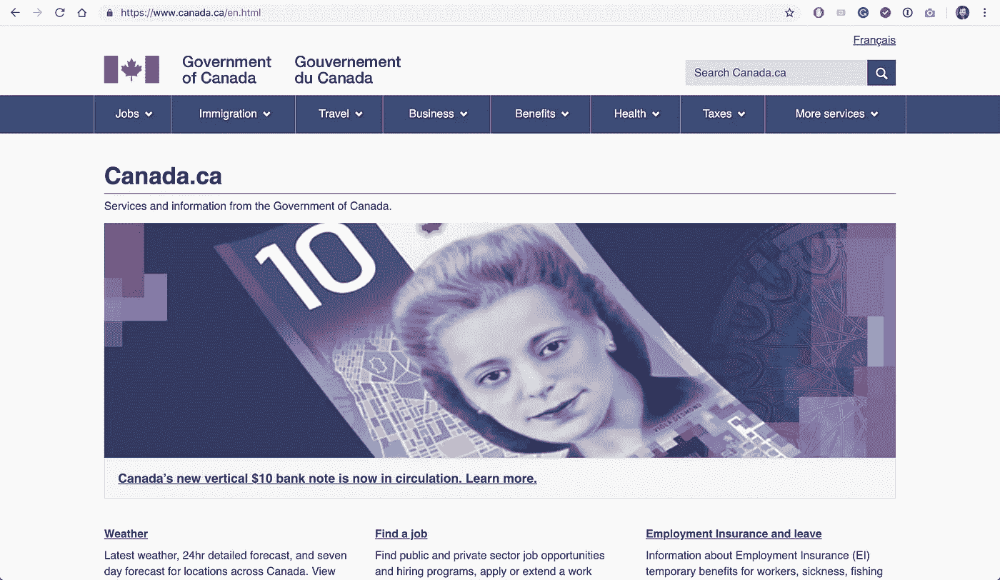
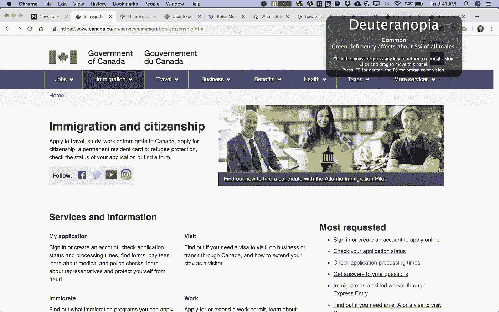
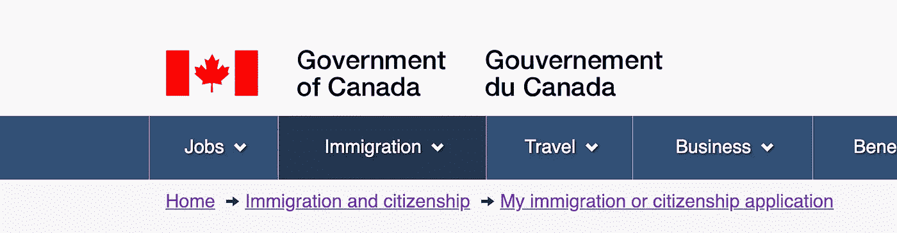

# 评估加拿大移民、难民和公民网站的用户体验

> 原文：<https://medium.com/hackernoon/assessing-the-ux-of-immigration-refugees-and-citizenship-canadas-website-96aead1eb358>

仅在过去五年里，加拿大就接纳了 120 多万移民。想象一下，当来自国外的人试图重新安置他们的生活时，由于不可避免的误解，需要多少丢失的文件、错过的截止日期和返工？

移民过程可能需要数年时间，并给所有相关人员带来巨大的焦虑。确保这一流程的 UX 得到简化将有助于政府机构及其服务对象。

虽然 UX 可以应用于移民过程的每一个阶段，但我将针对那些在互联网上获取移民信息的人。

## 我们如何简化想在加拿大生活的新移民的在线移民经历？

# UX 因素

根据美国卫生与公众服务部的[可用性中心](https://www.usability.gov/what-and-why/user-experience.html)，他们将 UX 的核心描述为:

> “…确保用户发现你提供给他们的东西的价值。”

资深 UX 专家[彼得·莫维尔](https://twitter.com/morville)借助他的[用户体验蜂巢](http://semanticstudios.com/publications/semantics/000029.php)展示了影响 UX 的因素。

Image Credit: Peter Morville @ Semantic Studios

**只有围绕它的用户体验的所有六个因素都实现了，价值才能实现。**

UX 的六个因素:

*   有用
*   愿望
*   可用性
*   易接近
*   可发现性
*   可靠性

无论是物理接触还是数字接触，最终用户的体验都必须从他们的角度来观察。

我将讨论加拿大移民和公民主页根据前面提到的**六个 UX 因素**提高其服务可用性的几种方法。

# 案例研究

当我谷歌“加拿大移民”时，呈现给我的第一个非广告链接将我带到了加拿大政府网站内的**移民和公民身份**网页(如下所示)。

[https://www.canada.ca/en/services/immigration-citizenship.html](https://www.canada.ca/en/services/immigration-citizenship.html) captured on Jan 3, 2019

基于 UX 的 **6 要素，该网页的用户体验如何？**

# 1.有用

> 你的内容应该是原创的，并满足需求

## 第一印象:

有用性将取决于谁在访问这个网站，因为有很多原因人们会到达。

首先突出的是右边的图片和下面讨论*大西洋移民飞行员的链接。*然后我的眼睛把我带到右边**最受欢迎的**区。在滚动之前，我还注意到了他们列出的**社交媒体**，在鼠标滚动两次之后，我看到他们列出了**服务和信息**，接着是**功能**。

## 运行良好:

*   只要链接指向用户期望的部分，请求最多的部分对大多数用户都是有用的。
*   所使用的语言相当简单和描述性。

## 需要工作:

*   为什么*大西洋移民*按钮最大？这对大多数人来说可能没什么用，但却是我的眼睛花了最多时间的地方。
*   标题**特征**不清楚。使用一个更具描述性的词会使这一部分对用户更有用吗？

# 2.愿望

> 形象、身份、品牌和其他设计元素被用来唤起情感和欣赏

## 第一印象:

这一页有很多空白。主图像看起来像典型的股票图像。外观很干净，但不是现代风格。它给人的感觉是乏味和政府化的。

The homepage of Canada.ca

## 运行良好:

*   品牌与加拿大政府网站的其他部分一致。
*   设计是干净的，不包括分散注意力的功能。

## 需要工作:

*   对加拿大的第一印象并不令人振奋。
*   图像与页面底部使用的其他图像不一致。

# 3.可用性

> 网站必须易于使用

## 第一印象:

顶部的大按钮表示我在加拿大政府网站的*移民*部分，很容易阅读，深色部分表示选择。每个**服务和信息**的标题都带有下划线，表示可以点击。所有链接都工作正常。最上面的社交媒体账户都很活跃。

## 运行良好:

*   清楚地表明我们在联邦政府网站上的位置。
*   最常见的问题可以让最常见的问题马上得到解答。
*   能够将网页翻译成法语(加拿大的第二官方语言)。

## 需要工作:

*   我花了一些时间阅读到底部，才明白我需要点击哪里。
*   微弱的迹象表明，我可以点击哪里，它会带我去哪里。
*   没有能力翻译网页，如果我不说英语或法语。

# 4.易接近

> 内容需要能够被残障人士访问

## 第一印象:

将一个色盲模拟器应用到主页上可以发现，颜色的选择使那些看颜色有困难的人也能看到它。

Screenshot with Deuteranopia colour-blindness simulation

## 运行良好:

*   按钮有足够的纹理和颜色差异，表明视力障碍者可以点击它们。
*   没有压倒性的图形来分散注意力。
*   加拿大政府的 [**网页无障碍标准**](https://www.tbs-sct.gc.ca/pol/doc-eng.aspx?id=23601) 相当严格，适用于所有政府运营的网站。
*   页面底部有一个**报告问题**按钮，如果有些东西不工作或不完整。

## 需要工作:

*   对于一些用户来说，有大量的文字会让人不知所措。他们可能会考虑用图标来表示某些主题，或者在内容之间留出更多的空间。

# 5.可发现性

> 内容需要可在现场和异地导航和定位

## 第一印象:

导航栏清楚地表明我们在网站的**移民和公民**部分。将鼠标悬停在导航上方会显示该主题的子级别。

## 运行良好:

*   一旦你选择一个链接并离开首页，就会出现一个[面包屑](https://www.uxbooth.com/articles/the-rules-for-modern-navigation/)导航，显示你如何到达你所在的位置。
*   能够轻松地导航回您之前所在的位置。

Breadcrumb navigation showing how you went from “home” to “My Immigration or citizenship application”

## 需要工作:

*   没有任何进展的迹象。除非我见过面包屑导航，否则我可能不知道自己在哪里。

# 6.可靠性

> 用户必须相信你告诉他们的东西

## 第一印象:

从安全域 **canada.ca 访问**政府的徽标出现在页面的顶部和底部。

## 运行良好:

*   信息完整，链接到的网页与主页一致。
*   条款和条件显示在底部菜单中。

## 需要工作:

*   除了徽标之外，很难证明这是加拿大政府的官方网站。
*   没有电话号码可以打电话确认信息是真实的。

# 摘要

总的来说，加拿大移民和公民身份主网站的 UX 是相当成熟的。他们始终保持一致，非常严格地遵循他们的**可访问性**要求。调色板使其色盲友好，导航易于理解。

页面上的所有内容都是主题性的、面向行动的。该页面值得信赖，并且与所有其他联邦网页配合良好。

话虽如此，**登上**并不是一个鼓舞人心或有趣的页面。我明白政府并不意味着性感，但需要给获得政府服务的人一定的灵感。这将是与加拿大政府沟通的第一印象。

也没有能力将网页翻译成英语和法语以外的语言。对于没有语言能力的新移民来说，这可能是一个问题。

政府有一个独特的机会来真正让他们的用户体验正确。在商业世界中，客户服务是企业之间的一个巨大的区分因素。政府也是如此。精心设计的面向公民的服务肯定符合政府的最大利益。

**感谢阅读！** *我是* [*GoDo*](http://godogood.ca) *的联合创始人，这是一家致力于创造令人惊叹的数据驱动体验的数据设计公司。随意在这里伸手，上*[*Twitter*](https://twitter.com/stew_hillhouse)*，或者* [*LinkedIn。*](https://www.linkedin.com/in/stewarthillhouse/)