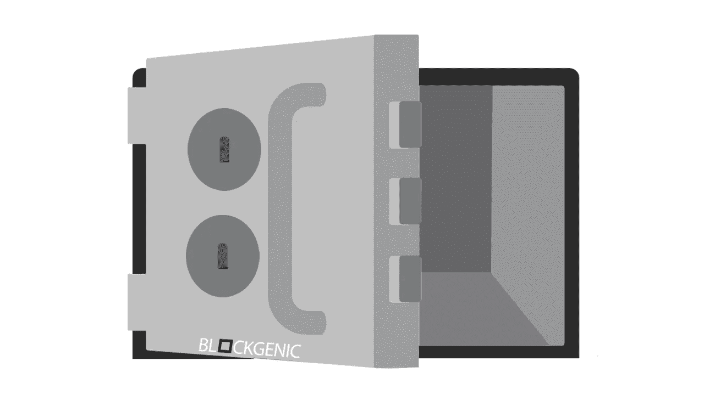
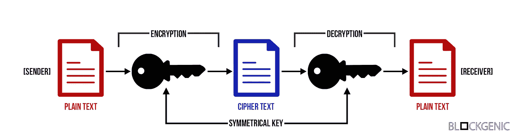
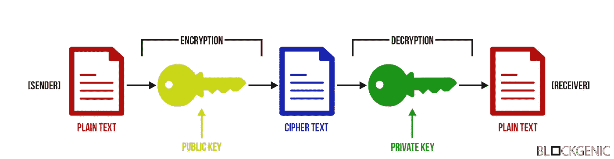
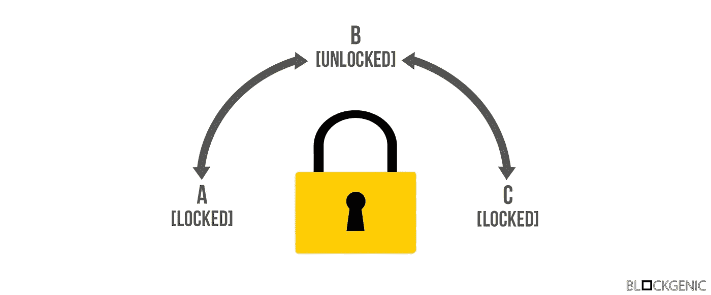

# 区块链的非对称加密技术

> 原文：<https://medium.com/hackernoon/asymmetric-cryptography-in-blockchains-d1a4c1654a71>

非对称加密，也称为公钥加密，是区块链技术的关键组成部分之一。这种加密形式允许每个人验证交易的完整性，保护资金免受黑客攻击等等。但是它是如何工作的呢？

# 什么是非对称加密？

为了理解非对称加密，首先理解加密的含义是很重要的。

> 密码术是一种使用高级数学原理以特定形式存储和传输数据的方法，以便只有预定的人可以读取和处理它。加密是密码学中的一个关键概念，它是一个以窃听者无法阅读或理解的格式对消息进行编码的过程。这种技术很古老，最早是凯撒用凯撒密码加密他的信息。来自用户的明文可以被加密成密文，然后通过通信信道发送，并且没有窃听者可以干扰该明文。当它到达接收端时，密文被解密成原始的明文。— [SSL2BUY](https://www.ssl2buy.com/wiki/symmetric-vs-asymmetric-encryption-what-are-differences)

非对称加密就是这些方法中的一种，是对称加密的更高级版本，我们将首先对此进行解释。

## 对称密码术

对称加密是一种“简单”的加密形式，它使用一个密钥来加密和解密数据。这个键几乎可以是任何东西，从一个数字、一个单词到一个随机的字符串。然后用这个密钥来加密数据，之后数据就可以安全地通过网络发送了。为了解密数据，接收方需要密钥(发送方用来加密数据的密钥)。

为了更好地了解这是如何工作的，我们在下面创建了一个可视化的过程。首先，发送者用共享密钥加密消息，然后发送者发送消息，而不必担心没有共享密钥的任何人能够阅读消息。然后，接收方接收加密的消息并解密(使用相同的共享密钥)。

Symmetric cryptography visualized

这种加密方法的主要缺点是，需要与需要访问数据的每个人共享密钥，这通常很难做到。

## 不对称密码术

现在您已经熟悉了对称加密，让我们深入研究一下非对称加密。非对称加密类似于对称加密，但是稍微复杂一些，并且也有对称加密的主要缺点的解决方案。

与对称加密的主要区别在于密钥对的使用。非对称加密使用密钥对而不是共享密钥来加密和解密数据。

密钥对由两部分组成，一个公钥和一个私钥。
公钥可以看做是用户名，每个人都可以使用，可以与每个人共享，每个人都可以用那个用户名查看账户的历史。用户名与密码(私钥)绑定在一起，但是绝对没有办法从用户名推导出密码(私钥)。也不可能仅用用户名来授权对帐户的任何操作。
私钥可以看作是某个用户名的账户的密码。它不公开，也不应与任何人分享。私钥用于授权对帐户的操作。与“普通帐户”不同，要访问帐户或授权对帐户的任何操作，只需要私钥。

在下图中，你可以看到当你安全地给某人发送信息时，这些按键是如何工作的。首先，发送者用接收者的公钥加密消息，然后发送者可以安全地发送(加密的)消息，因为查看消息的唯一方法是用只有接收者拥有的相应私钥解密它。然后，接收者接收消息，并能够使用私钥对其进行解密。

Asymmetric cryptography visualized

由于使用了密钥对，非对称加密是一种(更)安全的加密数据的方式，并确保只有那些应该接收数据的人才能够接收数据。这些密钥对还允许它们自己用于认证目的，我们将在下面详细讨论。

# 数字签名

数字签名本质上是使用非对称加密提供完整性的签名。它们在许多协议中被广泛用于认证目的，并且已经被证明非常有用和安全。

由于使用了非对称加密技术，数字签名不易被破坏且易于验证。由于数字签名使用非对称加密技术(私钥只与一个人相关联)，因此它们还具有不可否认性，这意味着它们可以像普通签名一样具有法律约束力。但是，您如何验证某些消息的完整性，或者您如何确保其他人能够验证您的消息的完整性？

Public and private key functionality visualized

这些问题的答案相当简单，可以用上图来解释。上图中的锁有两把钥匙，一把只能逆时针转动的公钥和一把只能顺时针转动的私钥。我们假设每个锁的公钥都可以广泛获得。

假设 Alice 想要发送一条未加密的消息给 Bob，但是 Bob 想要确保 Alice 已经发送了这条消息。爱丽丝把信息放在一个盒子里，然后给盒子上了锁。然后，她用自己的私钥(从 B 到 C)锁上锁。锁上箱子后，她把它送给鲍勃。然后 Bob 收到盒子，并可以使用 Alice 的公钥验证消息的完整性(和发送者)。如果 Alice 的公钥不能打开盒子，则消息和盒子的完整性应该被认为被破坏了。

> 如果你用你的私钥加密(“锁定”)某个东西，任何人都可以解密(“解锁”)，但这可以作为你加密它的证明:它是由你“数字签名”的。— Panayotis Vryonis

如果 Alice 想给 Bob 发送一条加密的消息，并且只有 Bob 能够解密该消息并验证发送者的身份，那么她必须采取一些额外的步骤。首先，爱丽丝把信息放在一个盒子里，并在盒子上加了一把锁，然后她用自己的私人钥匙(从 B 到 C)锁上盒子。然后，她将(上锁的)盒子放入一个新的盒子中，并在盒子上加了一把新锁。她使用 Bob 的公钥(从 B 到 A)锁上新锁。爱丽丝完成后，她把盒子送给鲍勃。一旦 Bob 收到盒子，他可以用他的私钥打开外盒，然后他可以用 Alice 的公钥打开内盒。如果内盒不能用 Alice 的公钥打开，那么消息和盒子的完整性将再次被认为受到破坏。

这些“锁”被称为数字签名。

请注意，在现实中，需要采用密钥和数据的签名生成算法和采用消息和签名的签名验证算法来完成上述工作。

# 在区块链的用法

虽然非对称加密和数字签名自发明以来一直很受欢迎，但它们最出名的可能是在区块链的实现。因为区块链本质上是广泛分布的分类帐，所以所使用的加密技术既可靠又实用是至关重要的。

大多数加密货币使用密钥对(以及不对称加密)来管理区块链上的“地址”。公钥是地址，它“持有”令牌，任何人都可以查看。私钥用于访问地址和授权对“地址”的操作。下面是以太坊区块链上任意地址的一个例子。

Arbitrary Ethereum address

数字签名也广泛应用于加密货币。它们可用于更安全地(离线)签署交易，也可用于多重签名合同和钱包。这些多重签名合同和钱包需要来自多个(不同)私钥的数字签名，然后才能执行任何操作。要获得更详细的解释，请阅读这篇文章。

这些例子只是冰山一角，因为非对称加密在区块链有更多的用途，从简单的智能合同到高级许可结构，还有更多令人兴奋的发展。

## 关于我们

我们是 Blockgenic，一个世界级技术企业家和投资者的网络，希望对区块链技术产生积极影响。你可以在这里找到我们:
EOS Block 制作人姓名:' blockgenicbp'
[网站](https://blockgenic.website/)
[推特](https://twitter.com/blockgenic)
[Youtube](https://www.youtube.com/channel/UCXTaehuAs3UWKnMVnT71MMQ)
[Reddit](https://www.reddit.com/user/blockgenic)

*作者为* [*亚尼克·斯兰特*](https://www.linkedin.com/in/yannick-slenter/) *作者为* [*作者为*](https://blockgenic.website/)