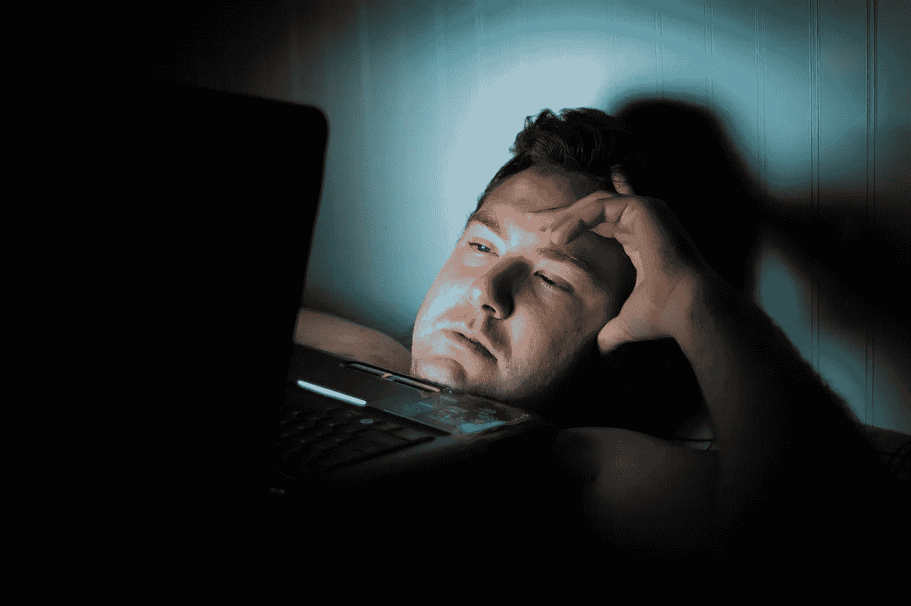

# 注意，经济，还有你

> 原文：<https://medium.com/hackernoon/attention-economy-and-you-82140a0842df>

## 我们的注意力和经济的汇合。

Photo by [@Matthew_T_Rader](https://unsplash.com/photos/bZbd02TN9t0?utm_source=unsplash&utm_medium=referral&utm_content=creditCopyText) on [Unsplash](https://unsplash.com/search/photos/mobile%20addiction?utm_source=unsplash&utm_medium=referral&utm_content=creditCopyText)

理解人类在过去的所作所为很容易，我们称之为历史。理解我们未来要做的事情也很容易，因为没有责任(除非你是医生，而你的病人想知道**真相*)。但是，搞清楚我们现在共同在做什么是很难的(我们不知道以后我们是否在正确的点上来连接这些点)。*

*当我们周围的技术、经济、政治和宗教(社会)都是第一次发生时，理解现在就变得特别困难。*

*在科技领域，现实正在向科幻慢慢靠近。在经济方面，权威人士预计会出现崩盘。在政治上，右翼势力正在全球范围内崛起。宗教大多存在于四肢。在这个看似悲观但却是总结性的观点中，我试图把一切都归结到我们人类身上。我们的注意力、我们的经济和我们，以及它们如何塑造我们周围的世界。*

# *注意，*

*目前市场上最昂贵的资产是我们的注意力，不是你开车时给路边广告牌的那种，而是你给你的孩子、伴侣和宠物的那种。*

*注意力是我们唯一能给予某人的东西。关注等于爱和关心。但是我们把宝贵的注意力放在了应用程序、活动、新闻、政治辩论和最新的电视节目上。我们不关心和我们住在同一屋檐下的人。但更关注通知、电子邮件和报价。*

*我们没有被要求关注全球危机和可能性。我们能活这么久，是因为我们有一种关注周围环境、家庭、自然的本领，我们用它照顾我们的方式来照顾它。但是现在，我们比以往任何时候都更加不注意我们的周围。不关注自然，不关注人类，不关注我们的伴侣，甚至不关注我们自己的身体和情感需求。*

*不知何故，注意力挖掘者已经找到了合适的方式，短期的满足。我们集体屈服于短期的满足感。我们对手机、优惠和认可是如此之深、如此之令人震惊、如此用心良苦。我们对品牌及其传达的信息充满了热爱、钦佩和忠诚。*

*对《网飞与寒意》《就这么做》《与众不同》《我爱它》《不要作恶》《成为下一个》的倾慕还可以。但事实上，事情是邪恶的，不同的，只有当你仔细观察它们。我知道，如果你从他们的角度、他们的动机和他们的长期意图来看这个世界，你肯定不会喜欢它，也不会期望他们创造未来。*

*总的来说，信号比物质本身更能驱动我们。我们这一代人，在 Instagram、抖音、Snapchat、网飞、亚马逊 Prime 以及点播娱乐、处方药和食物中长大，如此沉迷于这些信号，以至于我们几乎认不出其中的实质。*

*“假装直到你成功”是我们生活的信条。显然，假装已经成为一种新时尚。我们已经到了假装和制造是两个不同世界的时候了。讽刺的是，“作伪”比“制作”更吸引人。吸引更多的关注，更多的资本，以及更多我们现在所说的“新闻”。*

# *经济*

*目前经济的主要部分来自对人类精神的前所未有的开发。或者作为推论，为了经济利益，有一些因素在剥削我们。用资本主义的话说，让世界变得更美好(当然是对他们而言)。最糟糕的是，剥削看起来一点也不像剥削。其实一切都是潮流，流行，好玩。一个新的情景喜剧，纪录片，过滤器，应用程序，专题，新闻，它继续前进。*

*数据已经成为经济中的一个核心要素。新的强大的人工智能工具正在使公司比政府更强大。没有人预测到对个人数据和注意力的过度会形成我们现在看到的最大的公司。*

*巨型数据驱动力量的势头已经成为他们自己的拦路虎。即使他们声嘶力竭地喊着“未来是私人的”，也很难相信他们。出于遗忘，人们正在开发和经营科技公司。他们没有预见到传播自己想法的能力会影响民主、新闻和全球意识形态。*

## *数字幽闭恐惧症*

*经济为我们构建了完美的产品和服务，让我们生活在一个小泡沫中。他们称这种泡沫为“个性化体验”。这种个性化的体验现在是许多人幽闭恐惧症的一个原因。*

*假新闻、网上欺凌、病毒式趋势、极端意识形态、压力、零工经济太棒了等等。在这些数字化的个性化空间中茁壮成长。对全球变暖、水危机、发展中国家令人窒息的污染、右翼势力的崛起、零工经济工人低于最低工资、互联网上的隐私受到损害以及审查制度等物质的担忧，被经济领跑者极具前景的愿景和使命声明所掩盖。*

# *你们*

> *我们——我们——集体。*

*整整一代人被束缚在沙发上，一手拿着手机，腹部放着笔记本电脑，插着耳机(只是为了确保现实不会打击他们)——滚动屏幕、疯狂观看、发短信、玩游戏和做所有不能做的事情。*

*我们邀请了我们生活中最亲密的日常事务中最不自然的元素。比如起床，吃饭，说话，睡觉，甚至拉屎。手机是垃圾，但它们让我们离电子人科幻故事更近了一步。离社会更远了一步，社会的存在是为了发现、设定和遵循世俗的目标，并生活在部分依赖流言蜚语的现实中。相反，我们正在创造虚拟现实，换句话说，在探索之下。“发现”下面是“定义”。*

*当我们进入“定义”领域时。对与错，感知的真相和事实并不重要。这轻微地影响了每一个曾经被我们上面讨论的注意力危机和经济所影响的人。*

*经济和政治驱动的意图正在将我们的注意力从身体和精神上剥离开来[生活和情感只不过是故事和构造]。那些 10 年前就理解了这一点的人处于经济食物链的顶端。如果这些仅仅是构造，我们可以创造它们并摧毁它们。但我们现在能做的就是选择它们，接受一个实际上是泡沫的现实。*