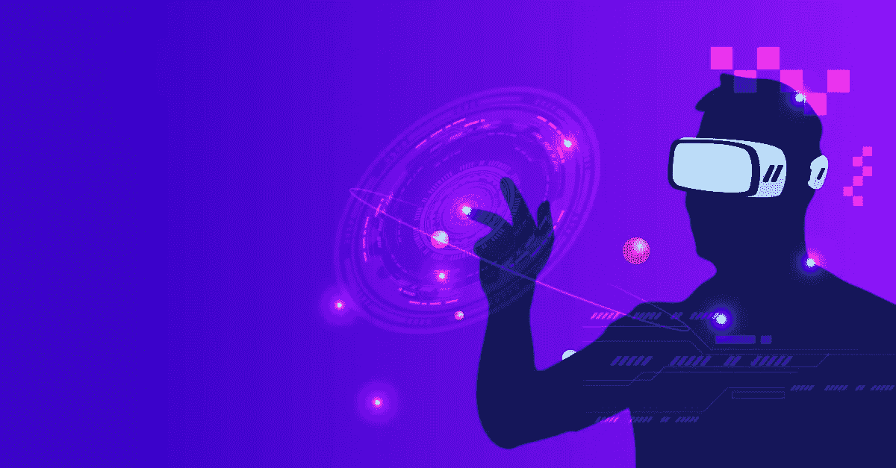
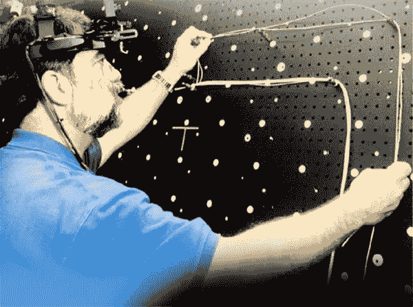
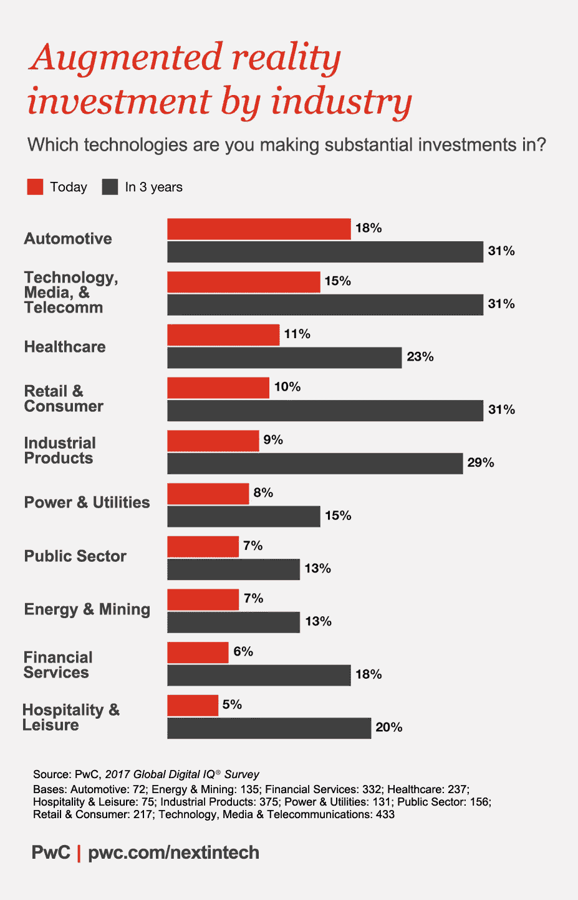
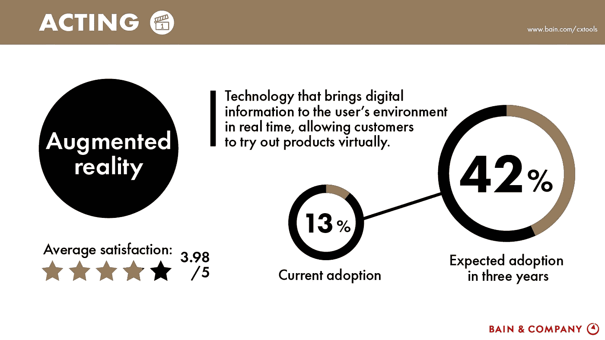
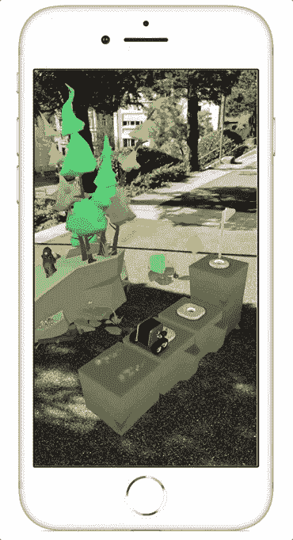
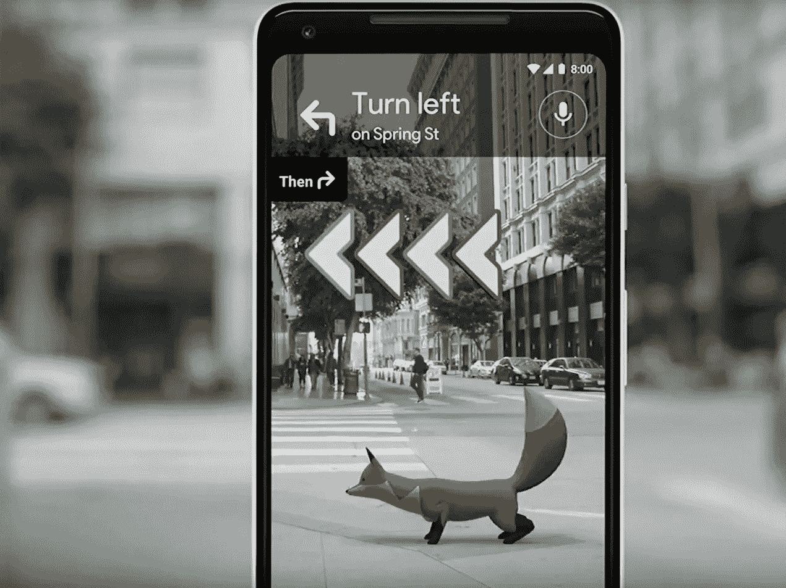

# 增强现实:市场潜力和实际应用

> 原文：<https://medium.com/hackernoon/augmented-reality-market-potential-and-practical-applications-71f0d8faef56>

当代智能手机和其他设备很好地让我们沉浸在数字体验中。增强现实走了一条不同的路，通过丰富数字数据片段来放大我们的物理环境。

*听起来很奇怪，不是吗？*嗯，[第一个增强现实系统](https://www.interaction-design.org/literature/article/augmented-reality-the-past-the-present-and-the-future)诞生于 1992 年。美国空军阿姆斯特朗研究实验室的路易斯·罗森堡开发了虚拟夹具*将信息放置在实体物体上。这个想法是通过随时提供信息来提高工人的效率。同样的概念在波音工厂得到了复制，飞机工程师使用 AR 通过计算机生成的图像来可视化物理电路板上的电线布局。*

*A Boeing employee using AR for creating wire layouts on physical boards.*

从那以后，增强现实的范围和能力有了突飞猛进的发展。今天，我们使用的几英寸智能手机能够运行繁重的增强现实应用程序。从扫描酒店菜单到在运行的引擎上投影车辆操作手册，增强现实可以在物理对象上显示大量的数字信息。

说增强现实将简化人类的日常生活是一种保守的说法。它将从根本上改变我们消费数字信息的方式。

事实上，每一个押注数字转型的行业领域都在他们的数字工具库中加入了增强现实。普华永道 [2017 年全球数字智商调查](https://usblogs.pwc.com/emerging-technology/2017-digital-iq-ar/)发现了未来三年 AR 相关投资有望回升的 10 个行业。

The investments are expected to grow significantly in the next 3 years

# 增强现实检查:目前的状况

所有与增强现实相关的研究和统计都引用了一个统一的主题: ***AR 正乘着高速增长的浪潮*** 。廉价传感器的可用性和消费者应用中极具想象力的用例是其增长动力。风靡全球的口袋妖怪 Go 游戏是其增长能力的引子。

贝恩&公司的研究还预测，增强现实的采用将比目前 13%的采用率增加 3 倍。

The AR trends will skyrocket in the near future

此外，随着[新兴的增强现实趋势](https://www.intelivita.co.uk/blog/top-augmented-reality-trends)，第一波增强现实将由创意产业主导。鉴于 AR 以身临其境的体验而闻名，视频游戏、娱乐、现场活动甚至远程关联的零售行业也会疯狂采用它也就不足为奇了。

由[麦肯锡](https://www.mckinsey.com/industries/media-and-entertainment/our-insights/augmented-and-virtual-reality-the-promise-and-peril-of-immersive-technologies.)、世界经济论坛和高盛联合进行的研究预测，AR 和 VR 将逐步增长，到 2025 年将高达 50%。AR 的创意市场潜力也被认为在 40 亿到 270 亿美元之间。

Source: mckinsey.com

# 金矿:增强现实的市场机会

**思想多如牛毛。俗话说，钱在执行中。现在，技术世界对增强现实的可能性感到兴奋和激动。你可以正确地想象它是一个刚刚发现的矿藏丰富的金矿。但是，矿井里有多少金子呢？增强现实能给经济现实带来哪些市场机会？**

**互动营销**

所有营销努力都是为了一个目的，即*促成销售*。或者，至少创造一个强大的品牌回忆价值，使客户在未来回到企业。使用广告牌和在线广告的传统营销努力在一定程度上具有影响力。

增强现实可以帮助推动信封，实现互动营销。交互式营销将为用户/顾客提供在其物理环境中的实时数字体验。

百事可乐在 2015 年推出的百事可乐 Max 伦敦公交站[广告仍然是营销中增强现实的经典例子之一。百事可乐用 AR 把一个公交候车亭变成了一个假窗口，在上面播放 AR 幻像。这一噱头不仅娱乐了等车的人们，也帮助百事巩固了其作为精明饮料品牌的地位。](https://www.youtube.com/watch?v=Go9rf9GmYpM)

**精彩教育**

学习并不总是令人兴奋的事情。尤其是通过笨重的印刷课本。此外，确保学生长时间的注意力也很难做到。增强现实可以通过令人兴奋的动画来帮助扭转那种平凡的学习感觉。

例如，生物课可以通过生物、动物、人体器官等的实时图形说明变得令人兴奋。

事实上，世界经济论坛报道了一个 AR 应用程序— [RosieReality](http://rosiereality.ch/) 正在帮助学生学习机器人编程的第一课

AR is adopted in robotic programming

**数据可视化**

饼图、趋势图或普通电子表格中描绘的业务数据可能很难传播。[开发增强现实应用](https://www.intelivita.co.uk/augmented-reality-app-development.php)可以帮助以更好的方式可视化数据，比如通过交互式手势进行数据驱动的决策。

事实证明，AR 不仅在会议室，甚至在工厂车间的数据可视化中也很有用。AR 可以为用户提供一种 X 射线视觉，帮助他们透过物体的外壳看到其隐藏的内部。

AccuVein 是一个基于 AR 的医学成像应用，它可以帮助医疗保健提供者将患者的静脉作为图像叠加在他们的皮肤上。这有助于更容易定位静脉以进行抽血和类似的血管手术。

**增强旅游**

第一次在一个陌生的城市航行会很紧张。从向陌生人问路到发现热点，甚至是更多地了解一个地标，一切都可能很麻烦。具有增强现实的移动应用程序可以为用户带来转机。它可以在地标建筑、餐馆等物理对象上嵌入数字信息。这可以帮助游客。

事实上，谷歌正在努力发布一个基于 AR 的谷歌地图导航系统，它将引导用户到达目的地。这个想法在 [2018 谷歌 I/O 主题演讲](https://www.youtube.com/watch?v=ogfYd705cRs)上展示过。

Get AR Direction Overlaid Right on top of the Real World

# 扩展的未来

增强现实将会模糊现实世界和数字世界之间的界限。一旦 AR 成熟，用户可能无法区分现实和虚拟世界。我们将生活在一个无缝的世界中，数字信息自然地融入物理世界，从而创造一个增强的世界。那些增强未来的日子离现在不远了。