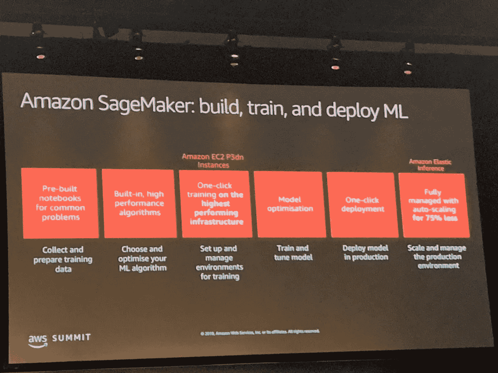
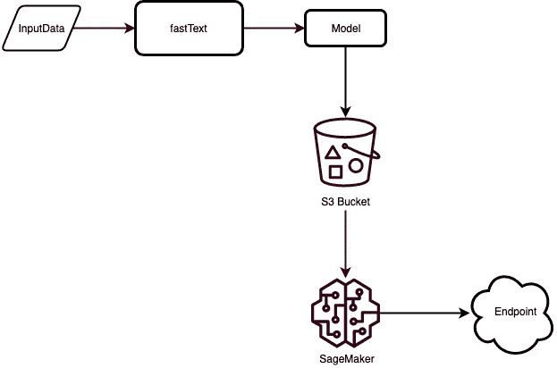
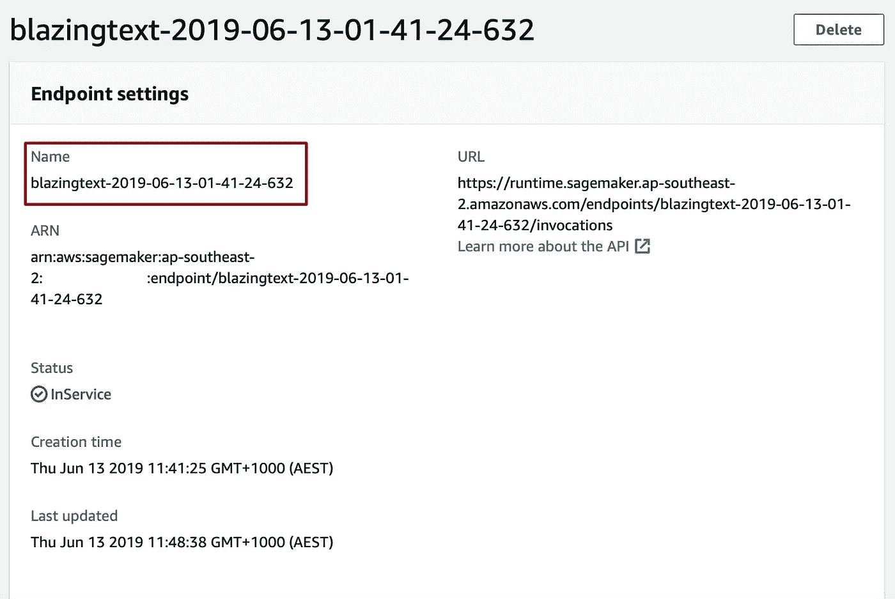
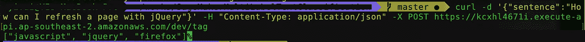

# 使用 Amazon SageMaker BlazingText 和 fastText 为内容自动生成标签

> 原文：<https://medium.com/hackernoon/auto-generating-tags-for-content-using-amazon-sagemaker-blazingtext-with-fasttext-335c38429de0>



多标签文本分类是自然语言处理应用的基本任务之一。在本文中，我们将构建一个 fastText 模型来预测文本内容的标签，然后在 SageMaker 托管服务上部署该模型。

# 亚马逊 SageMaker 笔记本实例

我们需要使用 notebook 实例来创建和管理 Jupyter notebook，这样我们就可以准备和处理数据，并训练和部署我们的模型。

[](https://docs.aws.amazon.com/sagemaker/latest/dg/gs-setup-working-env.html) [## 步骤 2:创建 Amazon SageMaker 笔记本实例——Amazon sage maker

### 亚马逊 SageMaker 笔记本实例是一个完全托管的机器学习(ML)亚马逊弹性计算云(亚马逊…

docs.aws.amazon.com](https://docs.aws.amazon.com/sagemaker/latest/dg/gs-setup-working-env.html) 

# 资料组

我们将使用堆栈溢出 Q 的 10%数据集。数据集包括:

*   **问题**包含 Id 为 10 的倍数的所有未删除堆栈溢出问题的标题、正文、创建日期、关闭日期(如果适用)、分数和所有者 ID。
*   **答案**包含这些问题的每个答案的正文、创建日期、分数和所有者 ID。ParentId 列链接回问题表。
*   **标签**包含每个问题的标签

在这个演示中，我们只需要问题和标签来训练我们的模型。

# BlazingText 或 fastText

亚马逊 SageMaker 内置 **BlazingText** 支持文本分类(监督模式)和 Word2Vec 矢量学习(Skip-gram、CBOW 和 batch_skipgram 模式)。但是 BlazingText 不支持多标签分类(说错了纠正我)。

在我们的演示中，多个标签可能应用于同一内容，因此，我们将使用 fastText 训练文本分类模型，并使用 BlazingText 托管预训练的模型，而不是使用 BlazingText 直接构建模型。

> *fastText 0.2.0 增加了针对多标签分类的“OneVsAll”损失函数，对应的是针对每个标签独立计算的二元交叉熵之和。*

下图是整个过程的概述:



# 快速文本和 SageMaker 入门

你可以在我的 [**GitHub repo**](https://github.com/yai333/SageMakerMultiLabelTextClassification) 中找到示例笔记本。

## 预处理和清理数据

输入文件的格式是每一行都包含一个句子和相应的前缀为“__label__”的标签，即

```
__label__database __label__oracle How to edit sessions parameters on Oracle 10g
```

我们的数据集基本上是由 19999 个问题和相关标签组成的`csv`文件。为了训练我们的模型，输入数据必须尽可能干净，下面的函数在删除 HTML 标签和不需要的标点符号后生成一个预处理的干净的训练数据。

## 安装 FastText

让我们下载[最新发布的](https://github.com/facebookresearch/fastText/releases):

```
!wget [https://github.com/facebookresearch/fastText/archive/v0.2.0.zip](https://github.com/facebookresearch/fastText/archive/v0.2.0.zip)
!unzip v0.2.0.zip
!cd fastText-0.2.0 && make
```

## 训练模型

在演示中，我们将使用 SageMaker 本地模式来训练模型 notebook ml.t2.medium 实例对于文本分类模型训练来说足够强大，因为 fastText 允许在不需要 GPU 的情况下训练模型。

以下命令用于为文本分类训练模型:

```
!cd fastText-0.2.0 && ./fasttext supervised -input "../stackoverflow.train" -output stackoverflow_model -lr 0.5 -epoch 25 -minCount 5 -wordNgrams 2 -loss ova
```

在训练结束时，在当前目录中创建一个包含已训练分类器的文件`stackoverflow_model.bin`。

让我们在验证数据上测试它。

```
!cd fastText-0.2.0 && ./fasttext test stack_model.bin "../stackoverflow.validation"N	531
P@1	0.566
R@1	0.215
```

请注意，fastText 有许多不同的训练输入参数，如果您曾经尝试调整您的模型精度，您会发现更改这些参数会显著改变模型的精度和召回率。欲了解更多详情，请点击这里查看官方文档。

## 部署模型

SageMaker 可以托管使用 BlazingText 训练的模型或 fastText 提供的预训练模型，用于实时推理。让我们部署我们的模型`stack_model.bin`:

## 推理

一旦部署了端点，它就支持`application/json`作为推断的内容类型。在传递到端点时，有效负载应该包含一个句子，其关键字为“ **instances** ”。

正如所料，我们得到了每个句子的概率标签，现在我们可以使用 Amazon API Gateway 调用 SageMaker 模型端点。

```
javascript, 0.8203935623168945 
jquery, 0.7201416492462158 
firefox, 0.01690844297409057
```

我们可以从 Amazon SageMaker 控制台查看这个端点。默认端点名称类似于“blazing text-2019–06–13–01–41–24–632”。



# 调用 SageMaker 端点

现在我们有了一个 SageMaker 模型端点。我们从 Lambda 和 API Gateway 来说吧。首先，安装无服务器框架。

```
$sls create --template aws-python3 --path text-classification
```

创建的目录包括两个文件——handler . py 是 Lambda 函数。

将以下代码粘贴到您的 serverless.yml 中

您的 handler.py 文件现在应该是这样的:

## 部署 API

要部署 API，请运行以下命令:

```
$ serverless deploy -v
```

# 测试 API

我们现在可以使用 CURL 调用无服务器 API 端点:

```
$ curl -d '{"sentence":"How can I refresh a page with jQuery"}' -H "Content-Type: application/json" -X POST [https://xxxxxx.execute-api.ap-southeast-2.amazonaws.com/dev/tag](https://kcxhl4671i.execute-api.ap-southeast-2.amazonaws.com/dev/tag)
```



差不多就是这样！希望你觉得这篇文章有用，你可以在我的 [**GitHub repo**](https://github.com/yai333/SageMakerMultiLabelTextClassification) 中找到完整的项目。