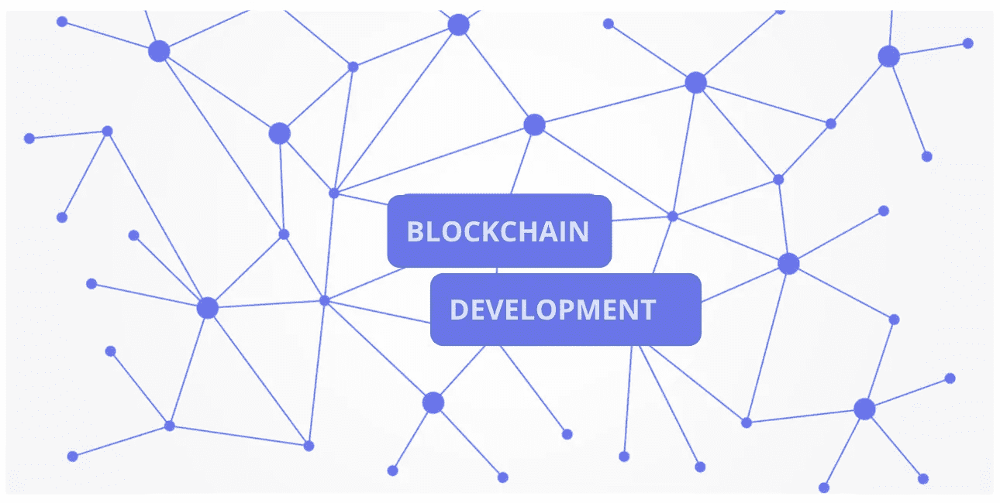

# 使安全的分散式应用程序(DApps)易于推动区块链的采用

> 原文：<https://medium.com/hackernoon/automated-development-for-entirely-decentralized-apps-for-blockchain-e70e33ccc7d6>

Adapted from Image by [mmi9](https://pixabay.com/users/mmi9-1424200/?utm_source=link-attribution&utm_medium=referral&utm_campaign=image&utm_content=3277335) from [Pixabay](https://pixabay.com/?utm_source=link-attribution&utm_medium=referral&utm_campaign=image&utm_content=3277335)

# **一个实用的 DApp 发展模式**

在区块链生产智能合同是*不那么容易，但是很好理解的部分。从一个平台上自动生产这种产品将是一个巨大的突破*，该平台也输出其余的分散应用(dapp)*。自动输出整个 DApp…*