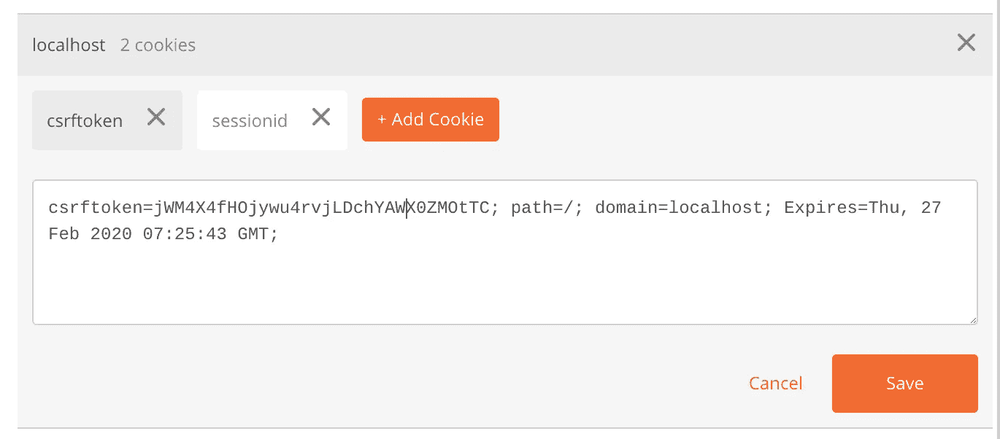
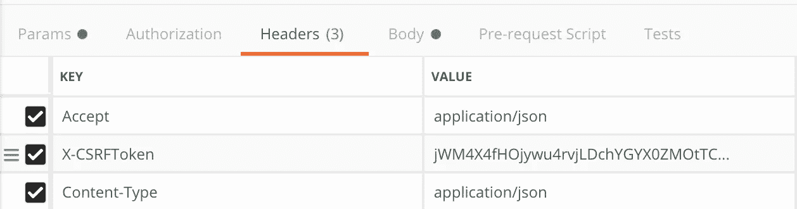
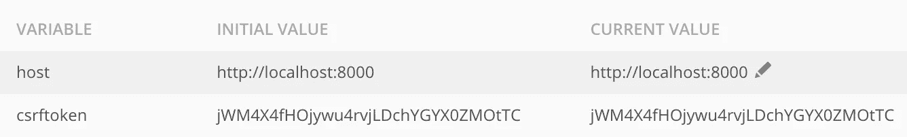
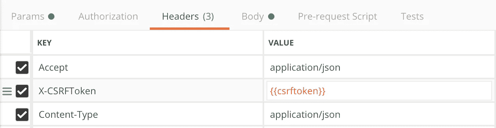

# 如何在邮递员中自动设置 CSRF 令牌？

> 原文：<https://medium.com/hackernoon/automatically-set-csrf-token-in-postman-django-tips-c9ec8eb9eb5b>

Django 为通过不安全方法的请求内置了 [CSRF 保护](https://docs.djangoproject.com/en/dev/ref/csrf/)机制，以防止[跨站点请求伪造](https://en.wikipedia.org/wiki/Cross-site_request_forgery)。当在 AJAX POST 方法上启用 CSRF 保护时，应该在请求中发送`X-CSRFToken`头。

Postman 是广泛使用的 API 测试工具之一。在这篇文章中，我们将看到如何设置 CSRF 令牌，并在邮递员自动更新。

## 邮递员的 CSRF 令牌

Django 在登录时设置`csrftoken` cookie。登录后，我们可以在邮差里看到来自 cookies 的 csrf 令牌。



我们可以手动获取这个令牌并将其设置在报头中。



但是该令牌在到期时必须手动更改。在过期的基础上做这个过程变得很乏味。

相反，我们可以使用 Postman 脚本特性从 cookie 中提取令牌，并将其设置为一个环境变量。在邮递员的`Test`区，添加这些线路。

```
var xsrfCookie = postman.getResponseCookie("csrftoken"); postman.setEnvironmentVariable('csrftoken', xsrfCookie.value);
```

这会提取 csrf 令牌，并将其设置为当前环境中一个名为`csrftoken`的环境变量。



现在在我们的请求中，我们可以使用这个变量来设置头部。



当令牌过期时，我们只需再次登录，csrf 令牌就会自动更新。

## 结论

在本文中，我们看到了如何在 Postman 中自动设置和更新 csrf 令牌。我们可以在 CURL 或 httpie 等其他 API 客户机上遵循类似的技术来设置 csrf 令牌。

*原载于 2019 年 2 月 28 日*[*avilpage.com*](https://avilpage.com/2019/02/django-tips-csrf-token-postman-curl.html)*。*