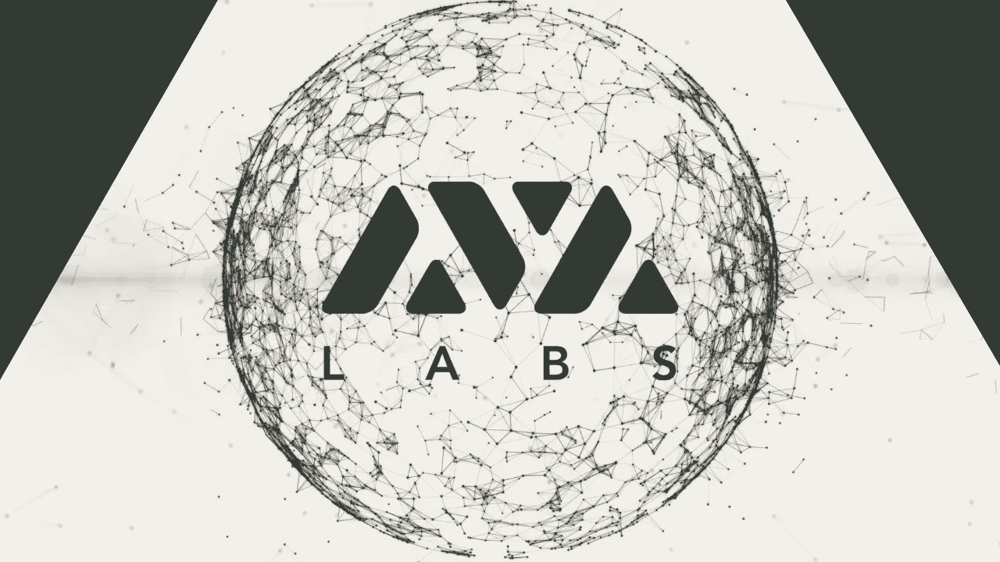
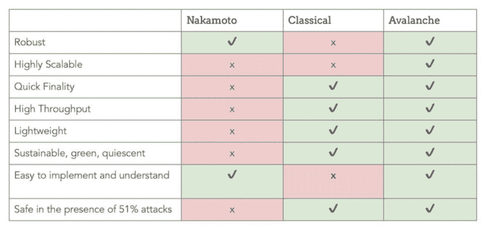
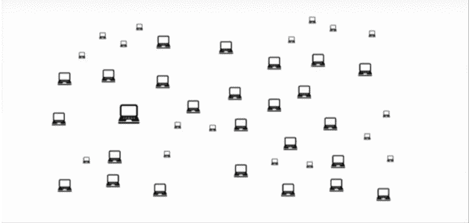
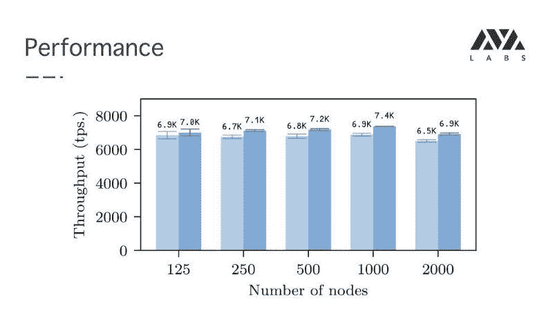
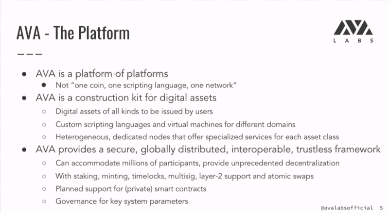
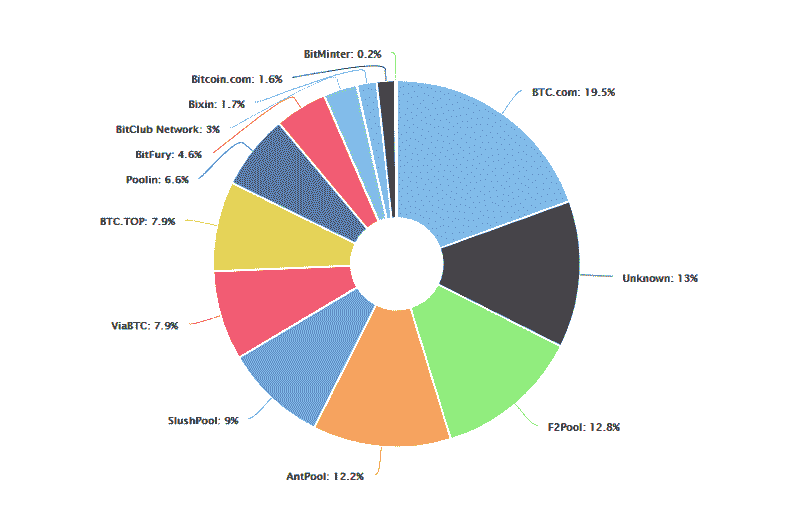
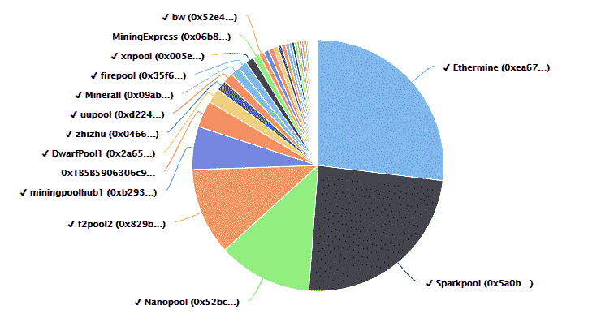

# 雪崩(AVA)——区块链 3.0:一种新的亚稳态共识协议

> 原文：<https://medium.com/hackernoon/avalanche-ava-blockchain-3-0-a-novel-metastable-consensus-protocol-28cdc4ee8984>

由康奈尔大学的 Emin Gün Sirer 教授(密码领域最受尊敬的批判思想家之一)和 AVA 实验室的联合创始人 Kevin Sekniqi(康奈尔大学计算机科学博士)和 Ted Yin(康奈尔大学计算机科学博士)领导的“AVA 实验室”团队最近揭示了“**阿尔卑斯山暴风雪**”背后的概念。

这采取了一种私人测试网的形式，用于下一代区块链平台，该平台基于一种称为 Snow- **Avalanche** 的新型亚稳态共识协议家族。

然而，这是否代表着区块链科技故事的下一个篇章？

很有可能，但是让我们试着理解为什么。

尽管在过去的两三年里出现了几个项目，但区块链领域还没有出现任何重大的颠覆性事件。尽管我们不断看到项目添加功能和在泥地上建造城堡，但这种进展受到很少成功解决的严重技术瓶颈的阻碍。

## 区块链进化至今！

*   **区块链 1.0(中本聪共识)数字存储和价值转移:**
    -比特币:一种点对点的电子现金系统。
    -莱特币:一种点对点的加密货币。Dogecoin:一种迷因币。
*   **区块链 2.0 (Nakamoto Consensus):平台和特定功能/特性导向链**:
    -以太坊:一个智能合约平台。
    -Monero:一种面向隐私的加密货币。
    -恒星:价值的跨资产转移。
    -Dash:一种用于支付的加密货币，利用 masternodes 实现附加功能和管理。

*除此之外，还有许多其他知名项目直接继承了区块链 1.0 固有的一些主要问题。为了解决这些问题，区块链 2.0 中引入了各种各样的工具，这些工具提高了可扩展性、性能和功能。这些包括附加层，如闪电网络和状态通道，它们都是侧面层，而不是第 1 层基本解决方案。这些往往涉及权衡取舍，在大多数情况下，权力下放成为牺牲品。*

# 雪崩共识:简单中的天才。

这里提出的是一个亚稳态共识协议，它是受流行病协议和流言网络的启发，并吸取了经典共识和 Nakamoto 共识的经验教训。这有助于结合两者的优点，从根本上改善第 1 层中的已知问题。

*   **快速终结和低延迟**:在全球范围内完成终结大约需要 1-2 秒。这是处理和验证您的付款所需的时间。
*   **更高的吞吐量**:每秒 1000–10000 个事务。*在纽约区块链周，AWS 上托管的 1000 多个节点的 6500 个 TPS 基准测试。*
*   **健壮**:网络不需要就参与者的身份达成一致，就能达成不可否认的共识。
*   **静态协议**:一种绿色协议，不需要能量或特定的硬件资源来保证安全。
*   **高可伸缩性:**该协议是轻量级的，因此允许可伸缩性和低延迟。
*   **平等主义生态系统:**雪崩协议产生了一个平等主义生态系统，即网络中的所有节点生来相同(没有领导者，也没有任何一个拥有特殊权利)。因为没有矿工，所以没有通过“池”的散列权力的集中。
*   **拜占庭式耐受性:**很大一部分拜占庭式参与者可以耐受，且不会对安全性产生影响。例如，在雪崩的某些配置下，高达 50%的节点可能是拜占庭式的，即试图欺骗网络并保持整个网络不平衡的节点。然而，它们无法做到这一点，因为它们会导致两个节点同时决定两种不同的颜色。

Snowflake to Avalanche

2018 年 5 月火箭队在 IPFS 发布的 [**白皮书**](https://avalabs.org/snow-avalanche.pdf)

> ***本文介绍了一系列无领导拜占庭容错协议，这些协议通过网络子采样围绕亚稳态机制构建。这些协议在拜占庭对手存在的情况下提供了强大的概率安全保证，同时它们的并发和无领导性质使它们能够实现高吞吐量和可扩展性***

***Snowflake to Avalanche consensus presented and compared to Classical and Nakamoto consensus protocols — by* ***Prof. Sirer*** *at* ***MONEYCONF*****

# **区块链 3.0:雪崩**

**而不是创建额外的协议层或牺牲 X 来换取 Y***

**Avalanche 在第 1 层引入了可伸缩性、快速终结、极高的性能和去中心化。此外，该团队将借此机会应用从区块链 1.0 和 2.0 中吸取的经验教训，以解决阻碍更广泛采用的主要问题。**

****放权换绩效；安全性的可扩展性；权力下放促进安全；性能的可扩展性*；**

## **雪崩式改进“数字现金——支付处理”**

**除了 AVA 的基准测试比 VISA 的 TPS 高出近 4 倍之外，没有太多可说的了。**

**比特币— **每秒 7 次**交易**

**以太坊— **每秒 15 笔**交易**

**每秒 1500 个事务**

**每秒 1700 笔交易**

**PayPal — **每秒 193 笔交易****

**AVA —每秒 6500 个事务**

****

## **雪崩式改进“DApps 平台”**

**除了没有被广泛采用之外，我们对 DApps 还了解多少？**

**尽管它们肯定比 Web2.0 应用程序有各种优势，但采用它们的成本很高。在一个免费增值的数字世界里，用户习惯于从技术中获益，只为高级功能付费，将饲养一只虚拟猫咪或发送加密信息的门槛设定为 3 美元是过分的。**

> **在创新的初始阶段，如此高的采用成本并不新鲜。历史上充满了创新产品的例子，包括移动电话、计算机和移动操作系统以及互联网，最初由于使用它们的复杂性和成本，大多数用户都无法获得这些产品。然而，随着技术的进步和成本的下降，采用率增加了。**
> 
> ***在他 1991 年的书*跨越鸿沟*中，杰弗里·摩尔认为实现高科技创新突破性采用的关键是克服“鸿沟”，以达到“早期大多数”(实用主义者)。他将这种鸿沟描述为早期采用者(技术爱好者和梦想家)和早期大多数人之间的巨大差距，当一个新产品具有高度颠覆性的潜力并因此需要行为改变时，这种差距就存在了——詹姆斯·基尔罗和谢默斯·轩尼诗***

****

**资料来源:(摩尔，1991 年；奈史密斯，2018 年)**

**除了采用的成本之外，由于事务进入一个块需要很长时间，DApp 性能也非常有限。**

****例如:**我有一个加密的聊天 DApp。利用区块链理工大学是非常有意义的，因为它是分散的、不可变的，并且没有单点故障。**

****使用以太坊:****

**按照目前的参数，每条消息将花费用户 0.125 美元，消息将在 4-29 秒(平均 13 秒)后被接收。如果网络处于非常高的负载下，这种情况并不难发生，用户可能需要为每条消息支付高达 3-4 美元的费用，并等待更长时间，因为数据块将满。虽然我很欣赏区块链理工大学给我的 DApp 带来的好处，但它又慢又贵。**

****使用雪崩:****

**加密的消息需要 1-2 秒才能到达收件人。**

**TX 成本低有两个原因:(I)控制其成本值的灵活性；以及(ii)网络不容易过载。现在我的 DApp 开始变得更有意义了。**

**从本质上讲，Avalanche 是一个群体预言，在这里可以对经济参数进行投票和动态调整，而不需要硬分叉。**

**这意味着，在任何给定的时刻，网络参与者都可以就平台的最佳利益进行投票，并改变某些交易类型的成本。**

## **雪崩改善“标记化”**

****

**AVA 是平台中的平台。它允许任何人发布各种数字资产。它的与众不同之处在于，AVA 将允许多种脚本语言和多种虚拟机。这意味着支持各种具有不同功能的节点，在此过程中开辟了一个新的数字资产、功能和能力范围。**

> **这是一个用于数字资产的构建工具包，或者你可以称之为乐高！——***艾敏教授*****

**At Token Summit May 2019**

## **雪崩改善“去中心化和不变性”**

**我们喜欢认为我们正在经历去中心化，当我们以大量能源和昂贵的硬件为代价使用基于中本聪共识的顶级加密货币时，链条是完全不可改变的，但现实是什么呢？**

****比特币**由许多人持有，其他几个人通过运营一个完整的节点来支持网络，然而一个可悲的事实是，比特币采矿以及比特币账本掌握在 13 个采矿池手中:**

****

**其中只有 4 项足以达成共识。**

****以太坊矿池的哈希表分布****

****

**事实也是如此。2-3 个矿池能够达成共识，并可能改变链条或基本上危及其不变性。**

****Avalanche** 引入了极端的去中心化，通过轻量级、易于实施/理解且没有专门的硬件要求，允许成千上万的网络参与者，从而在生态系统中实现了非常高的不变性。**

## **雪崩改善“商业区块链”**

*   **私有智能合同**
*   **延迟和块终结**
*   **私有侧链**
*   **侧链加速的可能性**

## **雪崩改善“治理”**

**AVA 通过投票引入经济治理，这一特征是《议定书》本身的核心。共识是通过二次抽样投票达成的，同样的投票机制可以用于完全分散的治理。这允许在协议级别进行更改，包括关键参数调整。**

***示例:***

*   **特定 TX 类型的成本太高，AVA 网络投票决定降低该特定 TX 类型的 TX 执行成本。**
*   **通货膨胀率越来越高，人们开始投票决定降低铸币率。**

**从本质上来说，甲骨文 AVA 公司是一个群体，它证明了在不冒总账不变性风险的情况下具有极大的灵活性。**

**换句话说，不再有硬叉子。**

## **雪崩式改善“用户体验”**

**如现阶段所料，关于 UX 的全部细节还不清楚。然而，AVA 实验室团队已经认识到用户体验的问题，以及它为进一步采用带来的障碍。**

**在 2019 年纽约 TokenSummit 上，推进 UI/UX 也是 Sirer 教授的议程之一。**

# **临终遗言**

**对于火箭队和 AVA 实验室的工作，我只能用“革命性”一词来形容。协议功能和通过过去几年的经验和研究获得的知识相结合，为团队提供了合适的工具，以打造最终的区块链平台。**

**— — — — — — — — — — — — — — — — — — — — — — — — — — — — — — —**

****有用链接:**
**网站:**[https://avalabs.org/](https://avalabs.org/)
**白皮书:**[https://avalabs.org/snow-avalanche.pdf](https://avalabs.org/snow-avalanche.pdf)
**官方电报:**[https://t.me/avacoin_official](https://t.me/avacoin_official)
**社区电报:**[https://t.me/avalanchecoin](https://t.me/avalanchecoin)
**公告电报:**[https://t.me/AVA_announcements](https://t.me/AVA_announcements)
**不和:**[https://discord.gg/99XZqMH【T31](https://discord.gg/99XZqMH)**

***参考文献:* 1/雪花到雪崩:一种新颖的亚稳态共识协议— Team Rocket 2018
2/通过亚稳态实现可扩展和概率性的无领导 BFT 共识—Team Rocket 2019
3/Emin gün Sirer-money conf 2018
4/Emin gün Sirer-token summit 2019
5/Kevin Sekniqi-Neutrino 2019
6/James killoe**