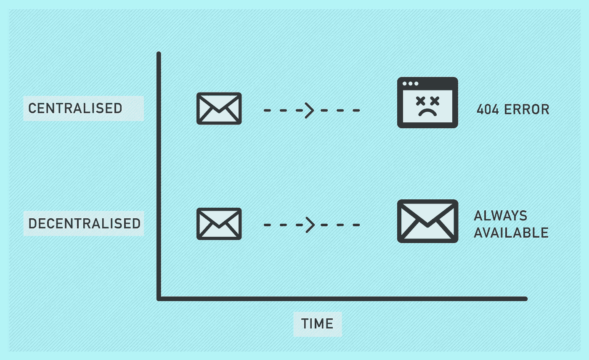

# 利用分散式网络避免消费者锁定

> 原文：<https://medium.com/hackernoon/avoiding-consumer-lock-in-with-the-decentralised-web-c618f28241ab>

*这是我们探索 Arweave 去中心化、* [*永久网络*](https://www.arweave.org/) *方面系列的第三篇博文。可以在这里**[*这里*](/arweave-updates/building-the-decentralised-web-part-two-the-components-97409d1fe545) *赶上其他部分* [。](/arweave-updates/building-the-decentralised-web-part-one-the-problem-9766f1987c91)*

*如果你和我一样，从十多年前“私人”测试的最初几个月开始，你就是谷歌 Gmail 服务的狂热用户。在这段时间里，谷歌为我们提供了一个奇妙的服务，不断发布新功能，快速可靠的服务(我只记得当我需要它时它离线过一次)，以及只有伟大的产品才能提供的简单性。*

*在此期间，我还向数百人提供了我的个人 Gmail 电子邮件地址——其中许多人只有这个联系我的机制。谷歌还出售了我的个人资料(化名)，挖掘了我和我的朋友们交换的信息，并(有时是无意中)将我的通信暴露给了世界各地的几十个政府。*

*当 Gmail 开始的时候，这些侵犯隐私的行为还没有被列举出来，甚至还没有被(我天真地)想象出来。然而，在 Gmail 推出后不久，我就开始把我的 Gmail 地址给我的朋友，作为联系的主要来源——永远把自己和一个我不确定、或许不应该信任的服务联系在一起。谷歌的广告和数据隐私政策就像 T21 对其搜索引擎结果的操纵一样频繁。一旦我开始把这个地址给我的联系人，我(消费者)就被“锁定”使用谷歌提供的服务，不管这可能需要什么，直到我通知我所有的联系人一个新的邮件地址来联系我。即使我换了提供商，让我所有的朋友都为联系人列表中一个人的多个地址感到困惑，我也无法确定这家新的邮件提供商是否会继续避免当初导致我放弃 Gmail 的做法。*

*这就是集中式网络的方式。*

# ***开发商和消费者诚信***

*Dani Grant 在她最近的博客文章中列举了“开发者诚信”对分散技术采用的潜在影响。Dani 的观点是，集中式产品和服务缺乏“开发者完整性”,因为它们可以在接到通知的瞬间对其协议进行彻底的修改。这些变化会给开发者带来巨大的问题，破坏建立在这些集中服务之上的产品，进而破坏他们围绕这些集成建立的任何业务。然而，去中心化的网络不能容易或快速地做出这样的改变，因此具有更多的“开发者完整性”,因为开发者可以对他们的产品给予更多的信任。因此，这种提高的完整性将加速分散技术的采用。*

*[Permaweb](https://www.arweave.org/) 应用不仅将这一概念应用于开发者，也应用于消费者。除了让开发人员相信他们的应用程序不会在没有警告的情况下被关闭或破坏，permaweb 应用程序的消费者也可以相信开发人员不会拒绝访问或降低最终用户的产品质量。有了 permaweb 应用地址，作为消费者，你所看到的就是你*一直*得到的。这并不是说开发者不能更新 permaweb 应用——他们可以——但是一旦发布，以前版本的应用不能收回或更改，新版本只能添加到 permaweb。*

**

*Centralised Vs Decentralised platforms*

*为了明确这一点，考虑一下 [Weavemail](https://weavemail.app/) ，这是一项我们很快一起开发的服务，目的是测试我们[最近发布的](/arweave-updates/welcome-to-the-permaweb-ce0e6c73ddfb)perma web 应用程序开发框架的局限性。任何有 Arweave 钱包的人都可以使用 Weavemail 发送和接收信息，这是一种(主要是[1])私密的、完全去中心化的方式。因为 Weavemail 位于 Arweave 的 permaweb 上，所以您可以确信，只要您知道这个事务的地址，并且有一个可用的 Arweave 节点为您提供服务，您对这个邮件客户端的访问就不会被拒绝或更改。*

> *这意味着在未来，无论我们开发者想要什么，我们都不能在页面上添加侵入性的广告，也不能把你的数据卖给任何感兴趣的人。*

*将这个永久网址安全地加入书签，您可以确保对该服务访问的完整性。虽然这种“消费者诚信”可能并不适用于所有的网络应用程序——也许我们并不关心我们对“[I have a bucket](http://ihasabucket.com/)”网站的访问是否被更改或拒绝——但这肯定会对我们长期委托核心在线存在的服务产生影响。我们的期望是，就像开发者诚信将推动开发者采用分散式网络一样，消费者诚信将推动消费者采用我们都依赖的核心 web 服务的分散式版本。*

***花式试出** [**织甲**](https://weavemail.app/) **？抢点代币** [**这里**](https://tokens.arweave.org/#/wallet) **给我发邮件 vlrhfqcw 1 uhu 75 xqb4 fcdw-qxpkpjbtfd 9g 4 qyubfw。我们将为发送第一封 Weavemail 的前 100 人提供 10 AR！***

*祝一切顺利，*

*-阿尔韦-山姆*

**[1]虽然 Weavemail 消息内容是私有的，但一些元数据是公开的:任何人、任何地方都可以跟踪哪些地址正在发送和接收 Weavemail，以及这些消息包含多少字符。我们不建议您现在将 Weavemail 用于重要的通信，因为它目前只是一个原型。通过实现稍微复杂一点的加密协议，可以轻松克服 Weavemail 当前的局限性。如果你有兴趣做一个 Weavemail 的改进版，为什么不* [*叉 Github repo*](https://github.com/ArweaveTeam/weavemail) *？**